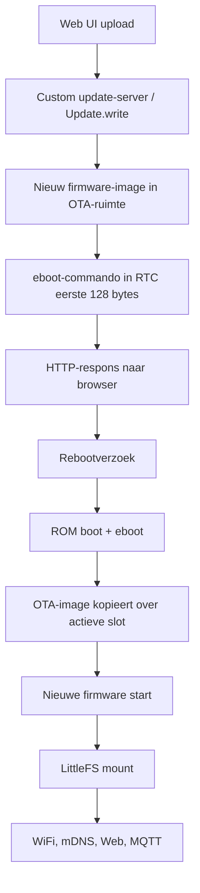

# Diepgaand onderzoek naar OTA-rebootfouten in OTGW-firmware na de overgang van ESP8266 Arduino Core 2.7.4 naar 3.1.2

## Bestuurlijke samenvatting

De sterkste, bron-onderbouwde verklaring voor het verschijnsel “OTA-opwaardering lijkt te slagen, maar de reboot gedraagt zich fout” in branch 1.4.x is niet een losse generieke resetbug, maar een combinatie van een gewijzigde flashindeling en een nieuw runtime-profiel. In v1.4.1 is de firmware overgezet naar ESP8266 Arduino Core 3.1.2, waarbij de LittleFS-partitie in deze firmwarelijn van 1 MB naar 2 MB is gegaan. De release-notes zijn hier uitzonderlijk expliciet over: alle versies vóór 1.4.x gebruikten core 2.7.4 met een 1 MB-filesystem; vanaf 1.4.x moet bij een upgrade eerst het filesystem-image en daarna pas het firmware-image worden geflasht. Doe je het omgekeerd, dan boot de nieuwe firmware tegen de oude filesystem-offset, kan het apparaat 5 tot 10 minuten volledig onbereikbaar lijken, en kunnen instellingen verloren gaan. De huidige builddefinitie bevestigt bovendien dat 1.4.x expliciet voor een 4M/2M-layout bouwt en dat core 3.x een foutief klein LittleFS-image actief afwijst met een mount failure. citeturn30view0turn28view1turn28view3turn39search0

Daarbovenop zijn er wel degelijk secundaire risico’s in de rebootketen zelf. De firmware houdt tijdens flashen expliciet meerdere netwerkdiensten in leven, slaat WiFi-reconnect tijdens flash over om de upload niet te verstoren, en gebruikt elders in de code `ESP.restart()` voor geplande herstarts. Intussen veranderde de core-upgrade van 2.7.4 naar 3.1.2 ook relevante eigenschappen: de 3.x-lijn bracht overgang naar NONOS SDK 3.0.5, wijzigingen in eboot en Updater, WiFi uit bij boot standaard, persistentie uit standaard, alleen nog lwIP v2, strengere runtime/toolchain-gedragingen, en een iets andere implementatie van `ESP.restart()` na de `system_restart()`-aanroep. Dat alles kan latente timing-, heap- of cleanup-problemen aan het eind van een OTA-pad zichtbaar maken, ook als de feitelijke upload zelf al goed is gegaan. citeturn16view0turn18view0turn18view4turn22view0turn24view3turn45search0turn45search7

Mijn hoofdadvies is daarom driedelig. Eerst moet de migratiehypothese hard worden bewezen of uitgesloten met een gecontroleerde 1.3.5 → 1.4.1 test, in de juiste én in de verkeerde flashvolgorde. Daarna moet de rebootstap technisch worden losgetrokken van de OTA-callback, zodat de HTTP-respons eerst volledig uitgeleverd en gelogd is voordat de reset wordt aangevraagd. Pas als dát nog steeds faalt, is een gecontroleerde A/B-test tussen `ESP.restart()`, een directe `system_restart()`-route en als laatste redmiddel `ESP.reset()` verdedigbaar. Een directe rollback naar 1.3.5 met het bijbehorende 1 MB-filesystem blijft de veiligste tijdelijke productiemaatregel als beschikbaarheid voorrang heeft boven verdere analyse. citeturn30view0turn18view0turn18view4turn18view1turn18view5turn40search0

## Bevindingen uit de repository en de firmware-architectuur

De repositorystructuur laat zien dat het project tegenwoordig een duidelijke firmware-root gebruikt onder `src/OTGW-firmware`, met aparte modules voor filesystem/webupdate, MQTT, netwerk, REST, WebSocket en een custom update-serverimplementatie. `config.py` wijst expliciet naar `src/OTGW-firmware` als firmware-root, en de directory bevat onder meer `FSexplorer.ino`, `MQTTstuff.ino`, `networkStuff.ino`, `restAPI.ino`, `webSocketStuff.ino`, `OTGW-ModUpdateServer-impl.h`, `OTGW-ModUpdateServer.h` en `updateServerHtml.h`. Dat is relevant omdat het aangeeft dat OTGW niet alleen op standaardvoorbeeldcode van de core leunt, maar een eigen OTA/webupdatepad heeft. De build zet bovendien `-DNO_GLOBAL_HTTPUPDATE`, wat er sterk op wijst dat men bewust een custom update-route gebruikt in plaats van blind de globale standaardimplementatie. citeturn10search0turn32view0turn28view1

De boot- en init-volgorde van de huidige 1.4.x-code is technisch gezien ambitieus. In `setup()` wordt eerst de watchdog uitgeschakeld, vervolgens LittleFS gemount, de configuratie gelezen, de hostname vroeg gezet, WiFi gestart, daarna NTP, telnet, mDNS, LLMNR, filesystem explorer, webserver, WebSocket en MQTT geïnitialiseerd; pas daarna gaat de watchdog weer aan, worden resetreden en rebootlog geregistreerd, en start de OTGW-stroomverwerking. Belangrijk detail: als `LittleFS.begin()` mislukt, gaat de firmware niet direct hard onderuit maar draait hij verder op compile-time defaults en publiceert hij later zelfs een foutmelding daarover. Dat betekent dat een mismatch in filesystemlayout zich voor de gebruiker makkelijk kan voordoen als “reboot stuk” of “node komt niet normaal terug”, terwijl het apparaat feitelijk wel boot maar met niet-gemounte of geherformatteerde storage. citeturn15view7

De resetlogica is uitgebreider dan een simpele `ESP.restart()`. De code gebruikt RTC user memory om een venster van externe resets bij te houden voor het forceren van een WiFi-configuratieportal, en controleert daarvoor expliciet `ESP.getResetInfoPtr()->reason == REASON_EXT_SYS_RST`. De gekozen RTC-slot is 96, dus byte-offset 384. Dat detail is cruciaal, want de OTA-documentatie zegt dat eboot zijn bootloadercommando’s in de eerste 128 bytes van RTC user memory opslaat. De door OTGW gebruikte RTC-ruimte zit daarbuiten en hoort dus niet door eboot overschreven te worden. Dit maakt RTC-corruptie als primaire rebootoorzaak minder waarschijnlijk dan vaak intuïtief wordt aangenomen. citeturn14view0turn39search3

De firmware toont ook al kennis van OTA-fragiliteit. Tijdens flashen schakelt `doBackgroundTasks()` de normale WiFi-reconnect-state-machine uit en motiveert dat in commentaar uiterst concreet: tijdens `Update.write()` kan flash transient onbeschikbaar zijn voor de WiFi-stack; een reconnect midden in de upload kan ertoe leiden dat WebSocket/MQTT opnieuw worden gestart en de HTTP-verbinding voor OTA kapot maken, waardoor een gedeeltelijk geschreven LittleFS-partitie overblijft. Tegelijkertijd houdt `handleEspFlashBackgroundTasks()` juist debugtelnet, de OTGW-stream, `httpServer.handleClient()`, `MDNS.update()` en WebSocket actief. Dat is een logische trade-off voor bruikbaarheid, maar het betekent ook dat de 1.4.x-firmware tijdens OTA geen minimalistische omgeving heeft; ze houdt veel sockets en protocoltoestand in leven. Daarmee wordt het einde van de OTA-cyclus, juist vlak voor de reboot, gevoeliger voor heapdruk en timing dan in eenvoudigere voorbeelden. citeturn16view0

De huidige build is niet neutraal ten opzichte van hardware en layout. `build.py` compileert voor `esp8266:esp8266:d1_mini:eesz=4M2M` en documenteert expliciet dat het LittleFS-image 2.072.576 bytes groot moet zijn. De commentaarregel zegt zelfs dat een kleinere waarde een afwijkende `block_count` in de superblock oplevert en dat core 3.x dit afkeurt met een mount failure. Historisch ondersteunt de repository zowel NodeMCU- als Wemos D1 mini-achtige hardware, maar de actuele buildtarget is dus concreet Wemos/D1-mini-achtig 4 MB flash met 2 MB filesystem. Als een veldapparaat in werkelijkheid ander flashgedrag, een andere chip of een afwijkende boardconfiguratie heeft, is dat niet meer een detail maar een kernrisico voor OTA-bootgedrag. citeturn28view1turn28view3turn35search0

## Relevante verschillen tussen core 2.7.4 en 3.1.2

De overstap van 2.7.4 naar 3.1.2 is geen één-op-één bugfixsprong maar een opstapeling van relevante wijzigingen uit 3.0.0, 3.0.1 en 3.1.x. Voor OTGW zijn vooral de onderstaande verschillen relevant.

| Aspect | 2.7.4 | 3.1.2 | Praktische impact op OTGW | Bron |
|---|---|---|---|---|
| SDK-basis | 2.7.4 zelf is een hotfixrelease; 2.x-documentatie en boardopties draaien nog rond NONOS SDK 2.2.x. | 3.1.x brengt NONOS SDK 3.0.5 mee, plus expliciete fixes voor flash-adresproblemen en heapaanpassingen voor SDK 3.0.x. | Reboot-, flash- en OTA-gedrag veranderen niet alleen door Arduino-API’s, maar ook door een andere SDK-laag. | citeturn21view2turn24view3turn20search0 |
| WiFi-bootgedrag | Oud gedrag: SDK startte WiFi automatisch bij boot; persistence werd gebruikt zoals vroeger in veel sketches impliciet werd aangenomen. | Vanaf core 3 staat WiFi standaard uit bij boot en is persistence standaard uit; `WiFi.begin()` zet alles weer aan, maar assumptions over vroege autoconnect zijn veranderd. | Code die leunt op vroege WiFi-state, DHCP-timing of persistent reconnect bij reset kan na OTA anders uitpakken. | citeturn45search7turn45search0turn15view7 |
| Netwerkstack | 2.x kon nog lwIP v1.4 of v2 gebruiken. | 3.x ondersteunt alleen lwIP v2; OTGW 1.4.1 noemt zelf lwIP 2.2.0 als onderdeel van de upgrade. | Andere RAM-profielen, MSS-keuzes en TCP-gedrag kunnen invloed hebben op OTA met veel gelijktijdige services. | citeturn25view0turn30view0 |
| Toolchain en runtime | Oudere toolchain/newlib. | 3.0.0 bracht GCC 10.2/10.3, newlib 4.0.0 met 64-bit `time_t`, OOM/allocatorwijzigingen en strengere runtimechecks. | Latente heap-, alignment- of PROGMEM-fouten kunnen pas in 3.x zichtbaar worden, vooral rond OTA en netwerkactiviteit. | citeturn22view0turn23view0turn25view0 |
| Bootloader en Updater | 2.7.0/2.7.3 voegden gzip OTA, CRC32/flashchecks en een hotfix voor “OTA of large files results in device hangs” toe; 2.7.4 bracht daarna nog PUYA write-buffer-alignment-fixes. | 3.0.0 wijzigde eboot en Updater verder, inclusief eboot-crashfixes, nieuwe flash-write alignment handling, “receiving no data in Updater is an error”, MD5 cleanup en gzip+signed OTA-fixes; 3.1.x voegde Updater lifetime callbacks toe. | De hele OTA-keten is inhoudelijk veranderd; bugs kunnen verschuiven van upload naar commit/reboot/bootloaderhandoff. | citeturn38search0turn21view2turn22view0turn23view0turn20search0 |
| Filesystem en flashlayout | 4 MB-configs met 1 MB of 2 MB FS zijn mogelijk; oudere OTGW-versions zaten op 1 MB FS met core 2.7.4. | OTGW 1.4.1 bouwt expliciet met `4M2M`; core 3.x accepteert geen foutief klein LittleFS-image meer voor die layout. | Dit is de meest waarschijnlijke migratiebreuk bij 1.3.x → 1.4.x. | citeturn30view0turn28view3turn39search0turn25view0 |
| `ESP.restart()` | Roept `system_restart()` aan en doet daarna `esp_yield()`. | Roept `system_restart()` aan en doet daarna `esp_suspend()`. | Beide paden gaan via `system_restart()`, maar de wrapper is niet bit-voor-bit gelijk; dat maakt gericht A/B-testen zinvol. | citeturn18view0turn18view4 |
| `ESP.reset()` | Roept direct `__real_system_restart_local()` aan. | Roept ook direct `__real_system_restart_local()` aan. | Er is in de publieke docs weinig expliciete behavior-uitleg, maar in broncode is dit een lagere-level resetroute dan `ESP.restart()`. | citeturn18view1turn18view5 |
| Resetreden `system_restart()` | `REASON_SOFT_RESTART` wordt gelabeld als “Software/System restart”. | Hetzelfde label wordt gebruikt. | Resetlogs kunnen dus gebruikt worden om te verifiëren of een rebootverzoek daadwerkelijk de software-restartroute heeft genomen. | citeturn18view2turn18view6 |
| Diepe slaap en WiFi-herstel | `WAKE_RF_DISABLED` vereist al een extra deep-sleep met `WAKE_RF_DEFAULT` om WiFi terug te krijgen. | Dezelfde waarschuwing geldt ook in latere docs. | Niet de hoofdverdachte voor OTGW, maar wel relevant als een verborgen of toekomstige sleepcodepad in resets wordt misbegrepen. | citeturn47search1turn47search2 |

De belangrijkste interpretatie voor deze casus is dat de migratie van 2.7.4 naar 3.1.2 vier risicovelden tegelijk opent: een andere filesystemlayout, andere WiFi-startsemantiek, andere OTA/eboot-internals en een strengere runtime/toolchain. Juist omdat OTGW 1.4.x ook zelf meerdere subsystemen tegelijk heeft aangescherpt en uitgebreid, is het niet verstandig de oorzaak te reduceren tot alleen “`ESP.restart()` is kapot”. citeturn30view0turn22view0turn45search7turn16view0

## Waarschijnlijkste oorzaken van het OTA-rebootprobleem

De onderstaande rangorde is analytisch, maar niet speculatief uit de lucht gegrepen. Ze volgt direct uit de repository, de releasenotes en de coredocumentatie.

| Scenario | Waarschijnlijkheid | Waarom dit goed past | Belangrijkste bronnen |
|---|---|---|---|
| Verkeerde migratievolgorde en/of 1 MB ↔ 2 MB LittleFS-layoutmismatch | Zeer hoog | OTGW 1.4.1 documenteert exact dit migratieverschil en noemt expliciet langdurige onbereikbaarheid na “firmware eerst”; build.py bevestigt een harde 4M2M-layout en core 3.x reject bij fout LittleFS-formaat. | citeturn30view0turn28view3turn39search0 |
| Premature reboot of onvolledige HTTP/OTA-afsluiting in custom updatepad | Middelgroot | OTGW gebruikt een custom update-serverpad, houdt tijdens flash veel services open en draait niet in een kale OTA-omgeving; rebooten vanuit een uploadcallback is dan fragieler. | citeturn32view0turn28view1turn16view0 |
| Heapfragmentatie, OOM of stack-/PROGMEM-corruptie, pas zichtbaar in 3.x | Middelgroot | 1.4.1 noemt een systematische PROGMEM-audit; 3.0.0 bracht strengere alignment- en OOM-gedragingen; OTA met live mDNS/WebSocket/Telnet/MQTT is heap-intensief. | citeturn30view0turn23view0turn44search5 |
| Flash-chip, flash-mode of boardconfig mismatch | Middelgroot tot laag | 2.7.4 had expliciete PUYA-alignment-hotfixes; esptool-documentatie maakt duidelijk dat verkeerde flash-mode/size bootproblemen veroorzaakt; actuele OTGW-build target is vrij specifiek. | citeturn21view2turn41search1turn42view2turn28view1 |
| Oud of inconsistent bootloader/eboot-pad na jaren van seriële en OTA-migraties | Laag tot middelgroot | De OTA-keten gebruikt eboot; 3.0.0 veranderde eboot aantoonbaar; als veldapparaten een onduidelijke historie hebben, is seriële baselineflash verstandig. | citeturn39search3turn22view0turn40search0 |
| Diepe slaap | Laag | Er is wel een bekende WiFi-herstelvalkuil bij `WAKE_RF_DISABLED`, maar die past minder goed bij dit lijngevoede OTGW-profiel dan filesystem- en OTA-eindfaseproblemen. | citeturn47search1turn47search2 |

De filesystemmigratiehypothese is het belangrijkst omdat zij het observatiepatroon bijna letterlijk verklaart. Als van 1.3.x naar 1.4.x alleen de firmware via OTA wordt vervangen, krijgt de nieuwe applicatie code en partitieverwachtingen die niet meer overeenkomen met de bestaande LittleFS-plaatsing. OTGW’s eigen release-notes beschrijven dan langdurige onbereikbaarheid en eventueel settingsverlies; de setupcode laat vervolgens zien dat LittleFS-fouten niet per se tot een crash leiden, maar wél tot defaults en ander netwerkgedrag. In een veldsituatie is dat nauwelijks te onderscheiden van een “slechte reboot”. citeturn30view0turn15view7turn28view3

De tweede hypothese is op architectuurniveau sterk. De firmware houdt tijdens ESP-flashen telnet, OTGW-stream, mDNS, WebSocket en de HTTP-server actief. Dat is slim voor uploadcontinuïteit, maar het vergroot de kans dat aan het einde van de OTA-cyclus nog buffers, TCP-state of logging actief zijn wanneer de reset wordt aangevraagd. De coredocumentatie voor HTTP-client-OTA zegt juist dat andere connecties standaard worden gesloten om OOM en bufferopstopping te vermijden. OTGW werkt weliswaar met een webserver-OTA-scenario en niet met de clientvariant, maar de onderliggende les blijft hetzelfde: een OTA-einde met veel gelijktijdige netwerktoestand is risicovoller dan een minimale shutdown. citeturn16view0turn39search3turn40search0

Een derde, subtielere hypothese is dat branch 1.4.x geheugen- en alignmentfouten blootlegt die branch 1.3.x niet liet zien. De 1.4.1 release-notes beschrijven expliciet dat `strncmp_P`/`strstr_P`-constructies uit 2.7.4 onder 3.1.2 niet meer veilig genoeg waren en dat daarvoor byte-safe helpers zijn ingevoerd. Verder veranderde de core naar nieuwere toolchain/runtime, en zijn exception- en watchdogdiagnostiek in 3.x sterker gemaakt. Als er dan nog één codepad in custom update-, web-, telnet- of discoverycode overblijft dat net na OTA een ongeldige pointer of krappe heap raakt, uit zich dat typisch pas na de update en reboot. citeturn30view0turn23view0turn44search4turn44search5

Er is ook een nuttige differentiator in de eigen code: 1.4.x bevat een geplande nachtelijke herstart die eveneens `ESP.restart()` gebruikt. Als die nachtelijke herstart op dezelfde hardware altijd goed werkt, maar reboot ná OTA niet, dan is `ESP.restart()` als primitief waarschijnlijk niet het kernprobleem; dan zit de fout in het OTA-succespad, het flushen van netwerk/HTTP, de eboot-markering of de boot daarna. Als de nachtelijke herstart óók onbetrouwbaar is, dan schuift het vermoeden juist op naar de resetprimitive, WiFi-bootsemantiek of algemene heapcorruptie buiten OTA om. citeturn15view0turn16view0

Onderstaand schema vat de relevante OTA- en rebootketen samen.



De documentatie van de core beschrijft precies dit eboot/RTC-model; de OTGW-code laat zien dat haar eigen RTC-resettracking daarbuiten zit en dat de firmware vroeg in `setup()` direct LittleFS mount en netwerkinitialisatie uitvoert. citeturn39search3turn14view0turn15view7

## Diagnostiek en reproduceerbaar testplan

De diagnose moet zo worden ingericht dat je drie vragen onafhankelijk kunt beantwoorden. Boot de nieuwe firmware überhaupt. Mount het nieuwe filesystem correct. En komt de reset uit een OTA-eindfasebug of uit de algemene resetketen. Zonder die splitsing blijven “reboot”, “boot” en “filesystem” door elkaar lopen. citeturn30view0turn15view7turn16view0

### Log- en meetmethoden

Voor seriële logging zijn er twee snelheden nodig. De interne bootloader van de ESP8266 logt bij boot op 74880 baud; voor eigen sketch- en coredebug is een hogere baudrate zoals 115200 praktisch en ook het patroon uit de coredocumentatie. Gebruik dus een capture die een power/reset op 74880 kan zien, en een aparte instrumentatiebuild die runtime-logs op 115200 of hoger uitstuurt. De core ondersteunt bovendien expliciete debugport- en debuglevelopties voor seriële runtime-logging. citeturn25view0turn44search2

Voor crash- en watchdogdiagnostiek is de klassieke ESP8266-stackdump nog steeds de hoofdbron. De documentatie adviseert expliciet gebruik van de ESP Exception Decoder en laat zien hoe `Exception (...)`, `Soft WDT reset` en de stacktrace naar bronregels terugvertaald worden. Sinds latere 3.x-releases zijn er daarnaast verbeteringen in stackdump- en hardware-WDT-diagnostiek doorgevoerd. Voor deze casus betekent dat: decodeer elke onverwachte reset vóórdat je aanneemt dat het alleen een OTA-migratieprobleem is. citeturn44search0turn44search4turn22view0

Voor runtime-instrumentatie zijn de volgende velden de moeite waard: coreversie, SDK-versie, flash-ID, echte en gemapte flashgrootte, flashsnelheid, sketchgrootte, vrije sketchruimte, sketch-MD5, vrije heap, grootste aaneengesloten heapblock, heapfragmentatie en resetreden. De coredocumentatie noemt deze API’s expliciet. Voeg daarnaast `ESP.getResetInfo()` en de ruwe `rst_info` toe, zodat software-restart, externe reset, WDT en exception van elkaar te onderscheiden zijn. citeturn19search3turn14view0turn18view2

Een bruikbare instrumentatiefunctie ziet er zo uit:

```cpp
static void logBootSignature() {
  Serial.printf(
    "core=%s sdk=%s cpu=%u flash_id=0x%08X flash_real=%u flash_map=%u "
    "flash_speed=%u sketch=%u freeSketch=%u md5=%s heap=%u maxblk=%u frag=%u reset=%s\n",
    ESP.getCoreVersion().c_str(),
    ESP.getSdkVersion(),
    ESP.getCpuFreqMHz(),
    ESP.getFlashChipId(),
    ESP.getFlashChipRealSize(),
    ESP.getFlashChipSize(),
    ESP.getFlashChipSpeed(),
    ESP.getSketchSize(),
    ESP.getFreeSketchSpace(),
    ESP.getSketchMD5().c_str(),
    ESP.getFreeHeap(),
    ESP.getMaxFreeBlockSize(),
    ESP.getHeapFragmentation(),
    ESP.getResetReason().c_str()
  );
}
```

Deze functie is vooral nuttig op vier momenten: direct na boot, vlak vóór OTA-begin, direct na `Update.end(true)` en vlak vóór het feitelijke rebootverzoek. De gebruikte velden zijn allemaal afkomstig uit de door de core gedocumenteerde ESP-API’s. citeturn19search3

Voor flash- en imagevalidatie hoort daar een host-side spoor naast. `esptool` kan de flashchip-ID en gedetecteerde grootte uitlezen, binaire images analyseren met `image-info`, en een volledige of partiële flashdump maken met `read-flash`. De basisdocumentatie noemt daarnaast expliciet MD5-verificatie in meerdere commandopaden. In de praktijk zijn voor deze casus vooral `flash-id`, `image-info`, `read-flash` en lokale SHA-256-checks op release-artifacts nuttig. citeturn41search0turn42view0turn42view2turn42view3turn43search0

Aanbevolen hostcommando’s:

```bash
esptool --chip esp8266 --port <poort> flash-id
esptool --chip esp8266 image-info OTGW-firmware-1.4.1.ino.bin
esptool --chip esp8266 read-flash 0 ALL fullflash.bin
sha256sum OTGW-firmware-1.4.1.ino.bin OTGW-firmware-1.4.1.littlefs.bin
```

Gebruik daarnaast een partiële dump van de bootregio als je bootloader/eboot-historie wilt vergelijken. In de praktijk is de bootloaderversie op een veldapparaat zonder dump zelden betrouwbaar vast te stellen; als die onzekerheid meespeelt, is een volledige seriële baselineflash meestal efficiënter dan blijven gissen. citeturn42view3turn22view0turn40search0

### Reproduceerbare testmatrix

| Test | Opzet | Verwachte uitkomst | Instrumentatie | Conclusie bij afwijking |
|---|---|---|---|---|
| Baseline 1.3.x | Seriële clean flash van 1.3.5 met bijpassend 1 MB FS; daarna handmatige software-restart via bestaand pad | Stabiele boot, normale WiFi/MQTT, resetreden “Software/System restart” | UART 74880 + runtime-log | Als dit al faalt, is het geen 1.4.x-specifiek probleem |
| Correcte migratie | Vanuit 1.3.5 eerst LittleFS 1.4.1 OTA, dan firmware 1.4.1 OTA | Settings blijven behouden, geen langdurige onbereikbaarheid | Browserlog + UART + runtime-log | Faalt dit, dan is er meer dan alleen verkeerde volgorde |
| Verkeerde migratie | Vanuit 1.3.5 expres eerst firmware 1.4.1 OTA, pas later FS | Tijdelijke onbereikbaarheid en mogelijk settingsverlies, conform release-notes | UART + netwerkbereikbaarheidstimer | Als dit exact reproduceert wat in het veld gebeurt, is de hoofdoorzaak praktisch bewezen |
| Nachtelijke restartpad | Activeer de ingebouwde geplande restart op kort testvenster | Zelfde resetreden, snelle terugkeer | UART + runtime-log | Als dit werkt en OTA niet, zit de bug in OTA-eindfase |
| OTA met deferred reboot | Instrumentatiebuild die reboot na OTA niet in callback doet, maar via pending-flag in `loop()` | Browser krijgt nette successrespons; daarna nette reboot | Browser + UART + heaplog | Als dit oplost, was de callback/flush-fase de foutbron |
| OTA met `ESP.reset()`-fallback | Alleen als vorige test nog faalt; compile-time switch voor hardere resetroute | Alleen verbeterd als probleem in graceful software-restartpad zit | UART + resetreden + bereikbaarheid | Geen verbetering betekent zoeken in boot/filesystem/heap |
| Heapdruktest | OTA uitvoeren terwijl WebSocket, telnet en mDNS actief zijn; heap vóór/na loggen | Geen exception/WDT; heap mag dalen maar moet herstellen | `getFreeHeap`, `getMaxFreeBlockSize`, `getHeapFragmentation` | Onverklaarde instabiliteit wijst op geheugenprobleem |
| Flash-identificatietest | Uitlezen `flash-id`, runtime `FlashChipId/RealSize`, vergelijking met buildtarget | Werkelijke flashgrootte en chiptype passen bij 4M2M-aanname | esptool + runtime-log | Afwijking maakt elk OTA-resultaat verdacht |

De twee belangrijkste tests zijn niet toevallig de twee simpelste. Eerst moet je het verschil tussen de correcte en onjuiste migratievolgorde objectiveren. Daarna moet je dezelfde 1.4.x-binary zowel via het nachtelijke restartpad als via een OTA-succespad laten rebooten. Dat splitst de probleemruimte in één middag in twee stukken: “algemene reboot/fundamentele corekwestie” versus “OTA-eindfase/flashlayoutkwestie”. citeturn30view0turn15view0turn16view0

### Suggestieve seriële logs

Een gezonde reboot na een software-restart hoort in deze firmware ongeveer het volgende patroon te geven:

```text
ets Jan  8 2013,rst cause:<n>, boot mode:(3,<m>)
[OTGW firmware - Nodoshop version]

Booting....[v1.4.1]
Last reset reason: [Software/System restart]
Setup finished!
```

De ROM-bootregel op 74880 komt van de ESP8266-bootloader; de daaropvolgende OTGW-regels komen rechtstreeks uit `setup()` en de resetredenlogica. citeturn25view0turn15view7turn18view2

Een filesystem/layoutprobleem zal eerder richting dit patroon neigen:

```text
[OTGW firmware - Nodoshop version]
Booting....[v1.4.1]
*** ERROR: LittleFS mount FAILED - running on compile-time defaults ***
Last reset reason: [Software/System restart]
```

Dat is geen bewijs van de precieze oorzaak, maar wel een sterke indicatie dat je niet in een pure resetbug zit maar in een flashlayout-, image- of mountprobleem. citeturn15view7turn28view3

Een echte crash- of watchdogsituatie herken je juist aan exception- of WDT-tekst met stackdump:

```text
Soft WDT reset

Exception (3):
ctx: cont
>>>stack>>>
...
<<<stack<<<
```

Zo’n patroon moet altijd worden gedecodeerd voordat je conclusies trekt over OTA of reboot. citeturn44search0turn44search4turn44search5

## Mitigaties, oplossingsscenario’s en codepatches

De onderstaande scenario’s zijn geordend van “operationeel bewezen en weinig invasief” naar “experimenteel maar soms nuttig”.

| Scenario | Verwachte werking | Voordelen | Nadelen | Advies |
|---|---|---|---|---|
| Altijd filesystem eerst, firmware tweede bij 1.3.x → 1.4.x | Voorkomt layoutmismatch | Expliciet door release-notes ondersteund; behoudt settings | Lost geen andere bug op | Verplicht voor migraties |
| Seriële clean flash van 1.4.1 als nieuwe baseline | Vernieuwt image, FS en bootpad in één keer | Snelste manier om OTA-historieruis uit te sluiten | Fysieke toegang nodig | Eerste herstelmaatregel bij onbekende staat |
| Deferred reboot na OTA-successresponse | Reboot pas nadat HTTP-paadje klaar is | Vermindert kans op half-afgesloten upload/sockets | Kleine codewijziging nodig | Sterk aanbevolen |
| `LittleFS.end()` vóór filesystem-OTA | Ontkoppelt actieve mount van overschrijven | Rechtstreeks door docs aangeraden | Alleen relevant voor FS-updates | Sterk aanbevolen |
| Services quiescen vóór reboot | Minder open sockets en minder heapdruk | Verlaagt timing- en OOM-risico | Meer coördinatie in code | Aanbevolen |
| `ESP.restart()` behouden als standaard | Volgt officiële software-restartroute | Minder abrupt, bestaande code gebruikt het al | Mogelijk gevoelig in eindfase-OTA | Blijf dit als eerste keus gebruiken |
| Direct `system_restart()` testen | Bypasst C++ wrapper | Nuttige isolatietest omdat `ESP.restart()` dit toch al gebruikt | Waarschijnlijk beperkte winst | Alleen als A/B-experiment |
| `ESP.reset()` als fallback | Hardere, lagere-level resetroute | Soms nuttig als graceful path blokkeert | Publieke docs zijn karig; groter risico op ruwe reset | Alleen als gecontroleerde herstelvariant |
| `ATOMIC_FS_UPDATE` | Maakt FS-update minder corruptiegevoelig bij stroomuitval | Conceptueel netter | Vereist extra vrije flash; op 4M2M praktisch meestal onhaalbaar | Voor OTGW 4M2M niet kansrijk |
| Core pinnen op 2.7.4 of 3.1.2 tijdens diagnose | Houdt experimenten vergelijkbaar | Sluit regressieruis uit | Geen structurele fix | Verplicht tijdens onderzoek |

De sterkst bewezen operationele oplossing is onmiskenbaar de correcte migratievolgorde. Die is niet alleen een workaround maar de door de maintainer voorgeschreven upgradeprocedure voor 1.4.x. De tweede sterk bewezen maatregel is `LittleFS.end()` vóór een OTA-filesystemupdate; dat is letterlijk hoe de coredocumentatie het voorschrijft. De derde praktisch zeer effectieve maatregel, ook al is zij meer ontwerpdiscipline dan expliciete doctekst, is de reboot niet meer laten plaatsvinden in dezelfde callback-context waarin de upload succesvol wordt afgerond, maar pas nadat de HTTP-respons en logflush klaar zijn. citeturn30view0turn39search0turn40search0

### Patchvoorstel voor deferred reboot

Voor het nu bekende codepad in `OTGW-firmware.ino` is een deferred-rebootpatroon verdedigbaar en concreet. De nachtelijke restart gebruikt nu nog direct `ESP.restart()`. Maak daar een herbruikbare pending-rebootroute van, zodat zowel geplande herstarts als OTA-success hetzelfde gecontroleerde rebootmechanisme gebruiken.

```diff
--- a/src/OTGW-firmware/OTGW-firmware.ino
+++ b/src/OTGW-firmware/OTGW-firmware.ino
@@
+static volatile bool g_rebootPending = false;
+static bool g_rebootHard = false;
+
+static void requestDeferredReboot(bool hard = false) {
+  g_rebootPending = true;
+  g_rebootHard = hard;
+}
+
+[[noreturn]] static void performDeferredReboot() {
+  Debugln(F("Perform deferred reboot"));
+  DebugFlush();
+  OTGWSerial.flush();
+  delay(250);
+
+  if (g_rebootHard) {
+    ESP.reset();
+  } else {
+    ESP.restart();
+  }
+
+  while (true) {
+    delay(1000);
+  }
+}
@@
 static void runNightlyRestartCheck() {
@@
-  delay(200); // brief delay for any pending I/O to flush
-  ESP.restart();
+  delay(200); // brief delay for any pending I/O to flush
+  requestDeferredReboot(false);
 }
@@
 void loop()
 {
@@
   doBackgroundTasks(); // run background tasks
+
+  if (g_rebootPending && !isFlashing()) {
+    performDeferredReboot();
+  }
 }
```

Dit voorstel sluit aan op de bestaande architectuur: OTGW heeft al stateful flashinglogica, draait al een rijke background-tasklus en gebruikt `ESP.restart()` nu al in een gecentraliseerd bekannt pad. De kernwinst is dat het rebootverzoek uit de directe eventcontext wordt gehaald. Voor het OTA-pad hoort dezelfde helper te worden aangeroepen ná het uitsturen van een successrespons, niet ervoor. De keuze `hard=false` houdt `ESP.restart()` als standaard; `hard=true` is puur een gecontroleerde A/B-variant. citeturn15view0turn16view0turn18view0turn18view1

### Patchvoorstel voor filesystem-OTA

Voor elke OTA-route die het filesystem overschrijft, hoort de mount eerst expliciet te worden losgelaten. Dat is geen smaakvoorkeur maar documentatiegedrag van de core.

```cpp
// In het custom filesysteem-OTA-pad, vóórdat het schrijven begint:
LittleFS.end();

// ... daarna pas Update.begin(...) / writeStream(...) / end(...)
```

Omdat OTGW 1.4.x op een 4M2M-layout draait, is `ATOMIC_FS_UPDATE` hier waarschijnlijk geen praktische hoofdroute: de documentatie zegt dat daarvoor extra vrije flashruimte nodig is, en die is bij 1 MB sketch + ~1 MB OTA + 2 MB FS in de praktijk vrijwel volledig geconsumeerd. Voor OTGW is dus “correcte volgorde + correcte imagegrootte + unmount vóór FS-update” veel realistischer dan proberen een atomische twin-buffer-FS-update op deze layout af te dwingen. citeturn39search0turn39search3turn28view1turn28view3turn25view0

### `ESP.restart()`, `system_restart()` en `ESP.reset()`

Voor routinepad en productiegedrag verdient `ESP.restart()` de voorkeur, omdat dat in beide cores de reguliere software-restartroute is en in resetredenen ook als “Software/System restart” terugkomt. `system_restart()` is alleen nog nuttig als experiment: omdat `ESP.restart()` die functie in beide cores toch al aanroept, test je hiermee vooral of de wrapper/post-call-context verschil maakt. `ESP.reset()` is een apart pad dat in beide cores rechtstreeks `__real_system_restart_local()` aanroept. Omdat de publieke documentatie daar veel minder duidelijk over is dan over `ESP.restart()`, zou ik dit niet als standaardfix verkopen maar als gecontroleerde fallbackvariant achter een compile-time switch. citeturn18view0turn18view4turn18view1turn18view5turn18view2

Een klein experimenteel pad daarvoor is:

```cpp
extern "C" void system_restart(void);

[[noreturn]] static void rebootViaSdk() {
  DebugFlush();
  delay(250);
  system_restart();
  while (true) {
    delay(1000);
  }
}
```

Als `rebootViaSdk()` zich identiek gedraagt aan `ESP.restart()`, is de wrapper niet de boosdoener. Als `ESP.reset()` als enige werkt, dan is dat een sterk signaal dat het graceful software-restartpad of de context daaromheen vastloopt. Dat is diagnostisch waardevol, maar geen vrijbrief om blind overal hard reset in te voeren. citeturn18view0turn18view4turn18view1turn18view5

## Geprioriteerd actieplan, rollback en overdracht voor een coding agent

### Geprioriteerd actieplan

De eerste stap is een seriële 1.4.1-baselineflash op één testboard met volledige logcapture. Daarmee elimineer je in één keer onduidelijkheid over de actuele bootloader/eboot-toestand, imagevolgorde en foutieve OTA-geschiedenis. Pas daarna is het zinvol om opnieuw van 1.3.5 naar 1.4.1 te migreren via OTA, eerst in de juiste volgorde en daarna één keer bewust in de verkeerde volgorde om het waargenomen veldsymptoom te valideren. citeturn30view0turn42view3turn40search0

De tweede stap is het inbouwen van de runtime-signature logging en van een compile-time schakelbare deferred reboothelper. Dat moet vóór verdere bugjacht gebeuren, anders blijft elk experiment anekdotisch. De derde stap is dan een A/B-test tussen twee paden: de ingebouwde nachtelijke restart en de OTA-successreboot. Als alleen de tweede faalt, moet alle aandacht naar de custom update-server en diens callback/handoff. Als beide paden falen, moet je juist naar WiFi-bootsemantiek, algemene heapcorruptie of resetprimitive kijken. citeturn15view0turn16view0turn45search7

De vierde stap is het minimaliseren van risicovolle toestand rond reboot. Dat betekent: filesystem-OTA alleen na `LittleFS.end()`, reboot niet in de callback zelf, en waar praktisch haalbaar netwerkdiensten laten uitlopen vóór het rebootverzoek. Pas als al die testen nog steeds negatief zijn, is een gecontroleerde `ESP.reset()`-variant als herstelpad technisch verdedigbaar. citeturn39search0turn39search3turn18view1turn18view5

### Rollbackstrategie

Als de omgeving beschikbaar moet blijven terwijl 1.4.x nog onderzocht wordt, is rollback eenvoudig in principe maar streng in discipline. Gebruik een bekende 1.3.5-firmware met het bijbehorende 1 MB-filesystem; meng geen 1.3.x-firmware met een 1.4.x-filesystem of andersom. Voer rollback bij voorkeur seriëel uit, omdat de coredocumentatie expliciet stelt dat je een apparaat dat door OTA-wijzigingen niet meer gezond terugkomt altijd via de seriële lijn kunt herstellen. Beschouw “alleen sketch terugzetten” zonder passend filesystem als onveilig zolang de huidige flashstaat niet volledig is gedumpt of gewist. citeturn30view0turn40search0

### Overdrachtsdocument voor een coding agent

#### Doel

Stabiliseer de reboot na OTA in OTGW 1.4.x zonder eerst terug te vallen op core-downgrade, en bewijs of de hoofdoorzaak in filesystemmigratie, OTA-eindfase of resetprimitive zit.

#### Concrete taken

| Taak | Bestandsgebied | Verwacht resultaat |
|---|---|---|
| Voeg boot-/flash-/heap-signature logging toe | `src/OTGW-firmware/OTGW-firmware.ino` of helpermodule | Elke boot logt core, SDK, flash-ID, MD5, heap en resetreden |
| Introduceer deferred reboothelper met compile-time keuze tussen soft/hard | `src/OTGW-firmware/OTGW-firmware.ino` | Reboots gaan niet meer direct vanuit callback-context |
| Gebruik dezelfde helper voor nachtelijke restart én OTA-success | bestaand OTA-pad in custom update-server + `runNightlyRestartCheck()` | Vergelijkbare rebootketen, eenvoudiger A/B-analyse |
| Voeg `LittleFS.end()` toe vóór filesystem-OTA | custom OTA/filesystempad | Geen actieve filesystemmount tijdens overschrijven |
| Leg bij OTA-success eerst HTTP 200 vast, daarna pas pending reboot | custom update-server | Browser krijgt nette succesafhandeling; minder half-open sessies |
| Voeg board/flash-detectie toe in runtime log | bootpad | Onmiddellijk zichtbaar of hardware afwijkt van 4M2M-aanname |
| Maak een testscript of werkinstructie voor `esptool flash-id`, `image-info`, `read-flash` | tooling/documentatie | Reproduceerbare forensische capture per device |
| Documenteer migratieprocedure 1.3.x → 1.4.x prominent in update-UI en releaseproces | web-UI/release doc | Verkeerde upgradevolgorde wordt minder waarschijnlijk |

#### Aanbevolen testcases

| Testcase | Beschrijving | Pass-criterium |
|---|---|---|
| OTA migratie correct | 1.3.5 → 1.4.1, eerst FS, dan firmware | Node binnen normale bootduur terug online, settings behouden |
| OTA migratie foutvolgorde | 1.3.5 → 1.4.1, eerst firmware | Symptoom reproduceert conform release-notes en wordt goed gelogd |
| OTA herhaalupdate binnen 1.4.x | 1.4.1 → instrumentatiebuild 1.4.x | 20 opeenvolgende OTA’s zonder hang, WDT of exception |
| Nachtelijke restart | Geplande restart in testvenster | Zelfde resetreden en bootduur als OTA-successreboot |
| Hard-reset fallback | Alleen testvariant | Alleen gebruiken om te bepalen of soft restartpad de onderscheidende factor is |
| Power-cycle na OTA | Fysieke power-reset direct na succesvolle update | Geen bootloop, correcte LittleFS-mount, correcte settings |

#### Vereiste hardware

Minimaal één board dat overeenkomt met de actuele buildtarget, dus een Wemos/D1 mini-achtig 4 MB-apparaat, plus bij voorkeur één NodeMCU-achtig board om resetcircuit- en flashchipverschillen uit te sluiten. Verder: stabiele USB-voeding, seriële capturemogelijkheid, een test-AP, en liefst een tweede host voor continue ping/MQTT-observatie tijdens reboot. Als beschikbaar is een board met een bekende PUYA-flashchip nuttig, gezien de expliciete alignmenthotfixes in 2.7.4. citeturn28view1turn21view2turn42view2

#### Acceptatiecriteria

De wijziging mag pas als geslaagd gelden als aan alle onderstaande criteria tegelijk wordt voldaan:

- Een correcte 1.3.x → 1.4.x-migratie bewaart instellingen en levert geen langdurige onbereikbaarheid meer op buiten de door release-notes beschreven foutvolgorde. citeturn30view0
- Een 1.4.x → 1.4.x OTA-update reboot 20 keer achtereen succesvol via hetzelfde mechanisme, met resetreden “Software/System restart” of met een vooraf gedefinieerde alternatieve resetreden in de fallbackvariant. citeturn18view2turn18view6
- Er treden tijdens die cycli geen `Soft WDT reset`, `Exception (...)` of LittleFS-mountfouten op. citeturn44search0turn15view7
- Runtime-logs tonen consistent dezelfde core-, SDK- en flashparameters op alle testboards die voor productie relevant zijn. citeturn19search3turn42view2
- Voor filesystem-OTA is geborgd dat vóór de update de filesystemmount wordt losgelaten en dat de imagegrootte overeenkomt met de 4M2M-layout. citeturn39search0turn28view3

De harde eindconclusie is dus deze: in OTGW 1.4.x moet je eerst de bewezen migratiebreuk rond filesystemlayout uitsluiten, daarna de rebootcontext rondom de custom OTA-server structureren, en pas daarna lagere-level resetvarianten onderzoeken. Alles in de bronnen wijst erop dat dát de snelste route naar een robuuste oplossing is. citeturn30view0turn28view3turn16view0turn18view0turn18view1