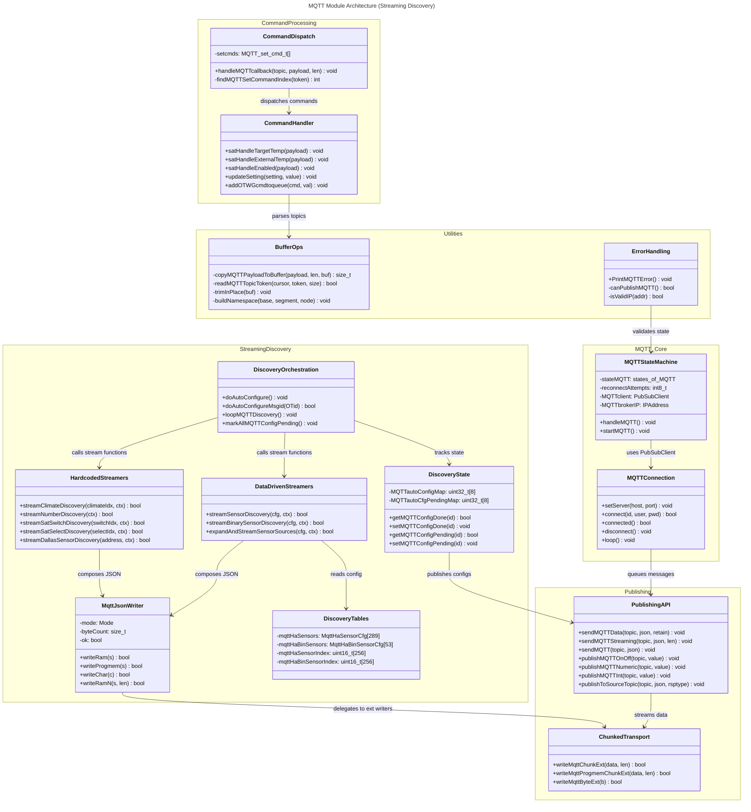

# C4 Code Level: MQTT Module

## Overview

- **Name**: MQTT Client and Home Assistant Auto-Discovery Module
- **Description**: Complete MQTT client implementation for the OTGW-firmware ESP8266/ESP32 gateway. Provides MQTT publish/subscribe functionality, streaming Home Assistant auto-discovery configuration, command handling, and OpenTherm message-to-MQTT mapping. Discovery architecture shifted from file-based PROGMEM table generation to data-driven streaming functions with two-pass JSON writing.
- **Location**: `/src/OTGW-firmware/MQTTstuff.ino`, `/src/OTGW-firmware/MQTTstuff.h`, `/src/OTGW-firmware/mqtt_configuratie.cpp`
- **Language**: Arduino C/C++ (with PubSubClient library integration)
- **Purpose**: Enables MQTT-based integration with home automation systems (Home Assistant), publishes OpenTherm data to configurable topics, handles MQTT commands for controlling the OTGW gateway, and manages streaming auto-discovery of sensors, binary sensors, climate entities, and SAT controls in Home Assistant.

## Code Elements

### Core State Management

#### Enumerations

- `enum states_of_MQTT { MQTT_STATE_INIT, MQTT_STATE_TRY_TO_CONNECT, MQTT_STATE_IS_CONNECTED, MQTT_STATE_WAIT_CONNECTION_ATTEMPT, MQTT_STATE_WAIT_FOR_RECONNECT, MQTT_STATE_ERROR }`
  - Description: State machine states for MQTT connection lifecycle
  - Location: MQTTstuff.ino:108
  - Usage: Controls the MQTT connection state transitions in `handleMQTT()`

#### Data Structures

- `struct MqttHaSensorCfg` (MQTTstuff.h)
  - Description: Sensor discovery config for a single OpenTherm message ID
  - Fields:
    - `uint8_t id`: OT message ID (0-255), or 245/246 for S0/Dallas
    - `uint8_t flags`: MQTT_HA_FLAG_* bit flags for source expansion
    - `PGM_P label`: Sensor label for MQTT topic (e.g., "TSet")
    - `PGM_P friendlyName`: Display name for Home Assistant
    - `HaDeviceClass deviceClass`: HA device class enum
    - `HaUnit unit`: HA unit of measurement enum
    - `HaStateClass stateClass`: HA state class enum
    - `HaIcon icon`: MDI icon enum
    - `HaEntityCat entityCat`: HA entity category enum (diagnostic, config)
    - `bool enabledByDefault`: Whether entity is enabled in HA by default
  - Location: MQTTstuff.h:177-188
  - Source: hand-written table in `mqtt_configuratie.cpp` (see ADR-077; `docs/archive/mqttha.cfg` is historical reference only)
  - Array: `mqttHaSensors[289]` (118 unique OT IDs)

- `struct MqttHaBinSensorCfg` (MQTTstuff.h)
  - Description: Binary sensor discovery config
  - Fields: Similar to MqttHaSensorCfg, but without unit and stateClass
  - Location: MQTTstuff.h:191-199
  - Array: `mqttHaBinSensors[53]` (10 unique OT IDs)

- `struct HaDiscoveryContext` (MQTTstuff.h)
  - Description: Runtime context passed to streaming discovery functions
  - Fields:
    - `const char *nodeId`: Unique gateway ID
    - `const char *hostname`: Gateway hostname
    - `const char *version`: Firmware version
    - `const char *mqttPubTopic`: Publication namespace
    - `const char *mqttSubTopic`: Subscription namespace
    - `const char *haPrefix`: Home Assistant prefix (default "homeassistant")
    - `const char *manufacturer`: Hardware manufacturer
    - `const char *model`: Hardware model
    - `bool isFirstEntity`: First entity flag (for JSON array handling)
    - `const char *sourceSuffix`: Source suffix for per-source expansion (_thermostat, _boiler, _gateway)
    - `const char *sourceName`: Source friendly name (Thermostat, Boiler, Gateway)
    - `const char *sourceTopicSegment`: Source key (thermostat, boiler, gateway)
  - Location: MQTTstuff.h:244-258

- `struct MqttJsonWriter` (MQTTstuff.h)
  - Description: Two-mode JSON writer for streaming discovery payloads
  - Modes: MEASURE (size calculation only), WRITE (actual chunk output)
  - Methods:
    - `writeRam(const char *s)`: Write RAM data
    - `writeProgmem(PGM_P s)`: Write PROGMEM data via pgm_read_byte helpers
    - `writeChar(char c)`: Write single byte
    - `writeRamN(const char *s, size_t len)`: Write N bytes from RAM
  - Purpose: Avoid buffer reallocation; measure first, then write exactly that many bytes in chunks
  - Location: MQTTstuff.h:280-323

- `struct MQTT_set_cmd_t`
  - Description: Mapping of MQTT command topics to OTGW command codes
  - Fields:
    - `PGM_P setcmd`: MQTT command name (e.g., "setpoint")
    - `PGM_P otgwcmd`: OTGW command code (e.g., "TT" for setpoint)
    - `PGM_P ottype`: Value type (temperature, on/off, level, raw, etc.)
  - Location: MQTTstuff.ino
  - Array: `setcmds[]` PROGMEM dispatch table for standard OTGW commands

### Initialization & Connection

- `void startMQTT()`
  - Description: Initialize MQTT client and kick off connection state machine
  - Location: MQTTstuff.ino:587-604
  - Actions:
    - Returns if MQTT not enabled
    - Sets PubSubClient buffer size to `MQTT_CLIENT_BUFFER_SIZE` (384 bytes) for inbound messages
    - Initializes state to `MQTT_STATE_INIT`
    - Clears auto-discovery completion bitmap
    - Builds publish/subscribe topic namespaces
    - Calls `handleMQTT()` to begin connection attempt
  - Dependencies: PubSubClient, settings, WiFi

- `void handleMQTT()`
  - Description: Main MQTT state machine; call regularly from main loop
  - Location: MQTTstuff.ino:973-1145
  - State transitions:
    - `MQTT_STATE_INIT`: Resolve broker hostname to IP, configure PubSubClient
    - `MQTT_STATE_TRY_TO_CONNECT`: Attempt connection with credentials (if available)
    - `MQTT_STATE_IS_CONNECTED`: Maintain connection, call PubSubClient.loop()
    - `MQTT_STATE_WAIT_CONNECTION_ATTEMPT`: 3-second delay between retry attempts (after failed connection)
    - `MQTT_STATE_WAIT_FOR_RECONNECT`: 10-minute delay before retrying (after 5 failed attempts)
    - `MQTT_STATE_ERROR`: Invalid broker URL; wait before retry
  - Socket configuration:
    - Socket timeout: 15 seconds (increased from 4 for stability)
    - Keep-alive: 60 seconds (increased from 15 to reduce reconnections)
  - Parameters: None (uses global state)
  - Key timers: `timerMQTTwaitforconnect` (42s), `timerMQTTwaitforretry` (3s)
  - Dependencies: WiFi, PubSubClient, settings

### Callback & Message Handling

- `void handleMQTTcallback(char* topic, byte* payload, unsigned int length)`
  - Description: Incoming MQTT message handler; invoked by PubSubClient for subscribed topics
  - Location: MQTTstuff.ino:609-967
  - Parameters:
    - `char* topic`: Incoming topic string
    - `byte* payload`: Raw payload bytes (not null-terminated)
    - `unsigned int length`: Payload byte count
  - Topic structure: `{topTopic}/set/{nodeId}/{command}` or special topics:
    - `homeassistant/status`: Detects Home Assistant going offline/online for discovery re-sync
  - Command families:
    - Standard MQTT commands: mapped via `findMQTTSetCommandIndex()` (setpoint, constant, outside temp, etc.)
    - SAT (Simple Auto Temp) commands: `sat/target`, `sat/indoor_temp`, `sat/outdoor_temp`, `sat/enabled`, `sat/control_mode`, etc.
    - Settings updates: forwarded to `updateSetting()`
  - Actions:
    - Validates payload fits in 128-byte msgPayload buffer
    - Parses topic hierarchically: `topTopic → set → nodeId → command`
    - Dispatches to command handler or SAT function
    - Queues OTGW command via `addOTWGcmdtoqueue()`
  - Dependencies: strcasecmp_P, satHandle* functions, updateSetting, addOTWGcmdtoqueue
  - Re-entrance: Yes (called asynchronously by PubSubClient.loop())

- `int findMQTTSetCommandIndex(const char *topicToken)`
  - Description: Look up MQTT set command in command dispatch table
  - Location: MQTTstuff.ino:567-584
  - Parameters:
    - `const char *topicToken`: Command name to look up
  - Returns: Index into `setcmds[]` array if found, -1 if not found
  - Algorithm: Linear search through PROGMEM `setcmds` table, matching against both `setcmd` and `otgwcmd` names
  - Dependencies: setcmds (global PROGMEM table), strcasecmp_P

### Publishing & Data Transmission

- `void sendMQTTData(const char* topic, const char *json, const bool retain)`
  - Description: Send JSON payload to MQTT topic (RAM-based topic/payload)
  - Location: MQTTstuff.ino:1170-1199
  - Parameters:
    - `const char* topic`: Topic suffix (will be prefixed with `MQTTPubNamespace/`)
    - `const char *json`: JSON payload string (RAM)
    - `const bool retain`: Whether to retain message on broker
  - Implementation:
    - Validates MQTT enabled, broker connected, broker IP valid
    - Checks heap health via `canPublishMQTT()`
    - Builds full topic: `{MQTTPubNamespace}/{topic}`
    - Streams payload in 128-byte chunks via `beginPublish()`, `writeMqttChunk()`, `endPublish()`
    - Confirms publish slot allocation on success
    - Calls `feedWatchDog()` after completion
  - Return: void (failures logged internally)
  - Dependencies: MQTTclient, canPublishMQTT, feedWatchDog, PrintMQTTError
  - Re-entrance guard: None (but calling code may yield via feedWatchDog)

- `void sendMQTTData(const __FlashStringHelper *topic, const char *json, const bool retain)`
  - Description: Overload for PROGMEM topic with RAM payload
  - Location: MQTTstuff.ino:1201-1207
  - Wrapper: Converts topic from PROGMEM to RAM buffer, calls main `sendMQTTData()`

- `void sendMQTTData(const __FlashStringHelper *topic, const __FlashStringHelper *json, const bool retain)`
  - Description: Overload for PROGMEM topic and PROGMEM payload
  - Location: MQTTstuff.ino:1209-1243
  - Implementation:
    - Builds full topic in RAM buffer
    - Streams PROGMEM payload in 63-byte chunks via `writeMqttProgmemChunk()`
    - Calls `feedWatchDog()` between chunks
  - Dependencies: writeMqttProgmemChunk, pgm_read_byte, strlen_P

- `void sendMQTT(const char* topic, const char *json)`
  - Description: High-level publish with automatic retention (typically true)
  - Location: MQTTstuff.ino:1364-1366
  - Wrapper: Calls `sendMQTTStreaming()` with strlen(json)

- `void sendMQTTStreaming(const char* topic, const char *json, const size_t len)`
  - Description: Stream large JSON payloads in 128-byte chunks to avoid buffer reallocation
  - Location: MQTTstuff.ino:1368-1412
  - Parameters:
    - `const char* topic`: Topic (used as-is, no namespace prefix)
    - `const char *json`: Payload data pointer
    - `const size_t len`: Exact byte count of payload
  - Algorithm:
    - Begins publish with `beginMqttPublish(topic, len, retain=true)`
    - Writes `CHUNK_SIZE` (128) byte chunks via `MQTTclient.write()`
    - Feeds watchdog between chunks
    - Ends publish with `endPublish()`
  - Dependencies: MQTTclient, feedWatchDog, PrintMQTTError
  - Note: Different from `sendMQTTData()` — this publishes to topic as-is without namespace prefix

### Helper Publish Functions

- `void publishMQTTOnOff(const char* topic, bool value)`
- `void publishMQTTOnOff(const __FlashStringHelper* topic, bool value)`
  - Description: Publish boolean as "ON"/"OFF" string
  - Location: MQTTstuff.ino:1422-1428
  - Parameters: topic, boolean value
  - Implementation: Calls `sendMQTTData()` with conditional string

- `void publishMQTTNumeric(const char* topic, float value, uint8_t decimals = 2)`
- `void publishMQTTNumeric(const __FlashStringHelper* topic, float value, uint8_t decimals = 2)`
  - Description: Publish float as formatted string with configurable decimal places
  - Location: MQTTstuff.ino:1434-1444
  - Parameters: topic, float value, decimal precision
  - Implementation: Uses static RAM buffer (16 bytes), `dtostrf()` for conversion
  - Warning: Static buffer — not re-entrant

- `void publishMQTTInt(const char* topic, int value)`
- `void publishMQTTInt(const __FlashStringHelper* topic, int value)`
  - Description: Publish integer as string
  - Location: MQTTstuff.ino:1449-1459
  - Parameters: topic, integer value
  - Implementation: Uses static RAM buffer (12 bytes), `snprintf()` for conversion
  - Warning: Static buffer — not re-entrant

- `void publishToSourceTopic(const char* topic, const char* json, byte rsptype)`
  - Description: Publish to source-separated topic (e.g., topic/thermostat, topic/boiler, topic/gateway)
  - Location: MQTTstuff.ino:1483-1499
  - Parameters:
    - `const char* topic`: Base topic path
    - `const char* json`: Payload
    - `byte rsptype`: OpenTherm response type (OTGW_THERMOSTAT, OTGW_BOILER, OTGW_ANSWER_THERMOSTAT, OTGW_REQUEST_BOILER)
  - Re-entrance guard: Static `inUse` flag prevents nested calls from corrupting `sourceTopic` buffer
  - Algorithm:
    - Resolves source type from rsptype
    - Copies source key (thermostat/boiler/gateway) from `mqttSourceKeys` table
    - Appends source key to topic: `{topic}/{sourceKey}`
    - Calls `sendMQTTData()`
  - Dependencies: resolveSourceIndex, copySourceTableEntry, sendMQTTData, mqttSourceKeys

### State Information Publishing

- `void sendMQTTuptime()`
  - Description: Publish gateway uptime in seconds
  - Location: MQTTstuff.ino:1247-1252
  - Topic: `otgw-firmware/uptime`
  - Format: Decimal string (seconds)

- `void sendMQTTversioninfo()`
  - Description: Publish firmware/hardware version info
  - Location: MQTTstuff.ino:1257-1303
  - Published topics:
    - `otgw-firmware/version`: Semantic version
    - `otgw-firmware/reboot_count`: Reboot counter
    - `otgw-firmware/reboot_reason`: Last reset reason
    - `otgw-pic/version`: PIC firmware version (if PIC enabled)
    - `otgw-pic/deviceid`: PIC device ID (if PIC enabled)
    - `otgw-pic/firmwaretype`: PIC firmware type (if PIC enabled)
    - `otgw-pic/picavailable`: "ON"/"OFF"
    - `otgw-otdirect/*`: OT-direct status topics (OTGW32 only)
    - `otgw-firmware/board`: Board name
    - `otgw-firmware/hardware_mode`: Hardware mode
    - `otgw-firmware/network_mode`: Network mode (WiFi, Ethernet, etc.)

- `void sendMQTTstateinformation()`
  - Description: Publish OpenTherm bus state information
  - Location: MQTTstuff.ino:1348-1355
  - Calls: `publishBoilerConnectedState()`, `publishThermostatConnectedState()`, `publishOTGWConnectedState()`

- `static void publishBoilerConnectedState()`
- `static void publishThermostatConnectedState()`
- `static void publishOTGWConnectedState()`
  - Description: Publish individual connection state flags
  - Location: MQTTstuff.ino:1305-1343
  - Topics published to multiple prefixes (base, otgw-pic/, otgw-otdirect/)

### Streaming JSON Writing (Two-Pass Architecture)

The MqttJsonWriter struct enables efficient streaming discovery payloads without buffer reallocation:

1. **MEASURE pass**: Writer accumulates byte count without MQTT I/O
2. **WRITE pass**: Writer streams exact bytes via chunk helpers

This approach allows discovery functions to compose JSON once and reuse the same code for both passes.

- `struct MqttJsonWriter` (MQTTstuff.h)
  - Description: Dual-mode JSON writer for streaming discovery payloads
  - Modes: MEASURE = 0 (size calculation), WRITE = 1 (actual output)
  - Public methods:
    - `writeRam(const char *s)`: Write null-terminated RAM string
    - `writeProgmem(PGM_P s)`: Write null-terminated PROGMEM string via pgm_read_byte
    - `writeChar(char c)`: Write single character
    - `writeRamN(const char *s, size_t len)`: Write N bytes from RAM
  - Workflow:
    1. Create writer in MEASURE mode: `MqttJsonWriter measure(MqttJsonWriter::MEASURE)`
    2. Compose JSON: `measure.writeRam(...), measure.writeChar(...), measure.writeProgmem(...)`
    3. Get size: `size_t sz = measure.byteCount`
    4. Begin MQTT publish: `client.beginPublish(topic, sz)`
    5. Create writer in WRITE mode: `MqttJsonWriter writer(MqttJsonWriter::WRITE)`
    6. Compose identical JSON (same code path): produces chunked output
    7. End publish: `client.endPublish()`
  - Location: MQTTstuff.h:280-323

- `bool writeMqttChunkExt(const char *data, size_t len)` (mqtt_configuratie.cpp)
  - Description: Write RAM data chunk to MQTT during WRITE pass
  - Location: mqtt_configuratie.cpp
  - Called by MqttJsonWriter.writeRam and writeRamN in WRITE mode
  - Chunking handled by underlying MQTT layer

- `bool writeMqttProgmemChunkExt(PGM_P data, size_t len)` (mqtt_configuratie.cpp)
  - Description: Write PROGMEM data chunk to MQTT during WRITE pass
  - Location: mqtt_configuratie.cpp
  - Uses pgm_read_byte for safe byte-by-byte PROGMEM access (no word-aligned reads)

- `bool writeMqttByteExt(uint8_t b)` (mqtt_configuratie.cpp)
  - Description: Write single byte to MQTT
  - Location: mqtt_configuratie.cpp
  - Called by MqttJsonWriter.writeChar in WRITE mode

### Buffer Management & Chunked Writing

The module avoids large heap allocations by streaming discovery payloads in small chunks. All writes go through two-mode MqttJsonWriter, which delegates to external chunk helpers in WRITE mode.

- `bool writeMqttChunkExt(const char *data, size_t len)` (mqtt_configuratie.cpp)
  - Description: Write RAM data to MQTT in chunks
  - Called by MqttJsonWriter.writeRam during WRITE pass
  - Handles chunking to PubSubClient.write()

- `bool writeMqttProgmemChunkExt(PGM_P data, size_t len)` (mqtt_configuratie.cpp)
  - Description: Write PROGMEM data to MQTT in chunks
  - Called by MqttJsonWriter.writeProgmem during WRITE pass
  - Uses pgm_read_byte for safe byte access (no unaligned 32-bit reads from flash)

- `bool writeMqttByteExt(uint8_t b)` (mqtt_configuratie.cpp)
  - Description: Write single byte to MQTT
  - Called by MqttJsonWriter.writeChar during WRITE pass

- `void resetMQTTBufferSize()`
  - Description: INTENTIONALLY A NO-OP (documented in code)
  - Location: MQTTstuff.ino
  - Rationale: Buffer is sized once at startup; no runtime resizing to avoid heap churn
  - Kept for API compatibility with existing discovery call sites

### Home Assistant Auto-Discovery (Streaming Architecture)

Discovery configs are generated on-the-fly by streaming functions in `mqtt_configuratie.cpp`. The previous file-based PROGMEM generation (mqttha.cfg parsed by tools/generate_mqttha_progmem.py into pools) has been replaced by data-driven tables (`mqttHaSensors[289]`, `mqttHaBinSensors[53]`) with corresponding streaming functions. Discovery includes hardcoded stream functions for climate (Thermostat + DHW Control pseudo-ID 0), number (Toutside Override pseudo-ID 27), SAT switches (13 boolean controls via switchIdx 0-12), SAT select (sat_heating_system pseudo-ID), and Dallas sensors (runtime address-based).

Three discovery paths exist:

**Path A (Bulk)**: `doAutoConfigure()` iterates sensor/binary sensor tables and calls hardcoded stream functions. Used only for explicit refresh (Serial 'F' command, REST API).

**Path B (JIT)**: `doAutoConfigureMsgid(OTid)` called from processOT() on first message of type not yet discovered.

**Path C (Drip)**: `loopMQTTDiscovery()` publishes one pending config per timer tick (3s normal, 30s under heap pressure). Primary production path.

- `bool streamSensorDiscovery(PubSubClient &client, const MqttHaSensorCfg &cfg, HaDiscoveryContext &ctx)`
  - Description: Stream a single sensor discovery config to MQTT
  - Location: mqtt_configuratie.cpp:1979+
  - Parameters:
    - `PubSubClient &client`: MQTT client instance
    - `const MqttHaSensorCfg &cfg`: Sensor config from mqttHaSensors[] table
    - `HaDiscoveryContext &ctx`: Runtime values (nodeId, hostname, version, etc.)
  - Algorithm:
    - Builds discovery topic from haPrefix, sensor label, nodeId
    - Uses MqttJsonWriter in MEASURE mode to calculate payload size
    - Begins MQTT publish with calculated size
    - Uses MqttJsonWriter in WRITE mode to emit JSON (name, unit_of_measurement, device_class, state_class, icon, value_template, stat_t, unique_id, device)
    - Handles source-separated variants via expandAndStreamSensorSources if flag set
  - Return: true if published successfully
  - Dependencies: MqttJsonWriter, writeMqttChunkExt, expandAndStreamSensorSources

- `bool streamBinarySensorDiscovery(PubSubClient &client, const MqttHaBinSensorCfg &cfg, HaDiscoveryContext &ctx)`
  - Description: Stream a single binary sensor discovery config
  - Location: mqtt_configuratie.cpp:similar pattern
  - Similar to streamSensorDiscovery but omits unit and state_class

- `bool streamClimateDiscovery(PubSubClient &client, uint8_t climateIdx, HaDiscoveryContext &ctx)`
  - Description: Stream climate entity discovery (Thermostat or DHW Control)
  - Location: mqtt_configuratie.cpp:2240+
  - Parameters:
    - `uint8_t climateIdx`: 0 = Thermostat, 1 = DHW Control
  - Generates hardcoded JSON with modes, temp setpoint, current temp, etc.

- `bool streamNumberDiscovery(PubSubClient &client, HaDiscoveryContext &ctx)`
  - Description: Stream number entity discovery (Toutside Override)
  - Location: mqtt_configuratie.cpp:2417+
  - Single hardcoded number entity for external temperature override

- `bool streamSatSwitchDiscovery(PubSubClient &client, uint8_t switchIdx, HaDiscoveryContext &ctx)`
  - Description: Stream SAT boolean switch discovery (13 switches)
  - Location: mqtt_configuratie.cpp:2596+
  - Parameters:
    - `uint8_t switchIdx`: 0-12 for each SAT boolean control
  - Uses helper streamSatBoolSwitch() with parameterised PROGMEM strings (uniqSuffix, nameSuffix, cmdSub, statSub, icon)
  - Topic object-ids derived from uniqSuffix at runtime (strip leading '-', swap '-' to '_')

- `bool streamSatSelectDiscovery(PubSubClient &client, uint8_t selectIdx, HaDiscoveryContext &ctx)`
  - Description: Stream SAT select entity discovery
  - Location: mqtt_configuratie.cpp
  - Currently: selectIdx = 0 for sat_heating_system dropdown

- `bool streamDallasSensorDiscovery(PubSubClient &client, const char *sensorAddress, HaDiscoveryContext &ctx)`
  - Description: Stream Dallas temperature sensor discovery
  - Location: mqtt_configuratie.cpp:similar pattern
  - Parameters:
    - `const char *sensorAddress`: Runtime sensor address string
  - Generated on first sensor discovery call; topic includes address in uniq_id

- `bool expandAndStreamSensorSources(PubSubClient &client, const MqttHaSensorCfg &cfg, HaDiscoveryContext &ctx)`
  - Description: Expand sensor config into 3 per-source variants (thermostat/boiler/gateway)
  - Location: mqtt_configuratie.cpp:2180+
  - Iterates 3 sources, sets source tokens in ctx, calls streamSensorDiscovery for each

- `void doAutoConfigure()`
  - Description: Force-publish all Home Assistant discovery configs
  - Location: MQTTstuff.ino
  - Intended use: Explicit utility (Serial 'F' command, REST API)
  - Algorithm:
    - Iterates mqttHaSensors[289] and calls streamSensorDiscovery for each
    - Iterates mqttHaBinSensors[53] and calls streamBinarySensorDiscovery for each
    - Calls streamClimateDiscovery for climateIdx 0, 1
    - Calls streamNumberDiscovery
    - Calls streamSatSwitchDiscovery for switchIdx 0-12
    - Calls streamSatSelectDiscovery for selectIdx 0
    - Calls configSensors() for Dallas sensors
    - Marks all as published in MQTTautoConfigMap
  - Dependencies: All streaming functions, configSensors

- `bool doAutoConfigureMsgid(byte OTid)`
  - Description: Publish Home Assistant discovery config for a specific OpenTherm message ID
  - Location: MQTTstuff.ino
  - Usage: JIT discovery on first message arrival (Path B), also called by drip publisher (Path C)
  - Parameters:
    - `byte OTid`: OpenTherm message ID (0-255), or pseudo-IDs 0 (climate), 27 (number), 245-246 (Dallas)
  - Algorithm:
    - OTid = 0: streams climate discovery (both indices 0, 1)
    - OTid = 27: streams number discovery
    - OTid in [0-12] when called from climate/drip: streams SAT switch discovery + select
    - OTid in [245-256]: Dallas sensor (address from parameter)
    - Otherwise: looks up in mqttHaSensorIndex/mqttHaBinSensorIndex, streams via streamSensorDiscovery/streamBinarySensorDiscovery
    - Checks heap guard (MQTT_DISCOVERY_HEAP_MIN = 8000 bytes)
    - Marks entry as configured in MQTTautoConfigMap if successful
  - Return: true if config was published
  - Dependencies: All streaming functions, getMQTTConfigDone, setMQTTConfigDone

### Discovery State Management

Two bitmaps track discovery state: `MQTTautoConfigMap[8]` (published/done) and `MQTTautoCfgPendingMap[8]` (needs publishing). Both are 8 x uint32_t = 256 bits, one per OT message ID.

- `bool getMQTTConfigDone(const uint8_t MSGid)`
  - Description: Check if discovery config has been published for a message ID
  - Location: MQTTstuff.ino:1499-1511
  - Implementation:
    - Splits MSGid into group (bits 7-5) and index (bits 4-0)
    - Reads bit from `MQTTautoConfigMap[group]` at index position
  - Returns: true if bit set (config published), false otherwise

- `void setMQTTConfigDone(const uint8_t MSGid)`
  - Description: Mark discovery config as published for a message ID
  - Location: MQTTstuff.ino:1513-1522
  - Implementation: Splits MSGid, sets bit in `MQTTautoConfigMap[group]`

- `void clearMQTTConfigDone()`
  - Description: Clear all discovery configuration flags
  - Location: MQTTstuff.ino:1524-1527
  - Usage: Called on MQTT connection, Home Assistant online/offline events
  - Rationale: Triggers re-publication of discovery configs on reconnect or HA restart

- `void setMQTTConfigPending(const uint8_t MSGid)`
  - Description: Mark a message ID as needing its discovery config (re-)published
  - Location: MQTTstuff.ino:1517-1522
  - Implementation: Sets bit in `MQTTautoCfgPendingMap[group]`

- `bool getMQTTConfigPending(const uint8_t MSGid)`
  - Description: Check if a message ID has a pending discovery publish
  - Location: MQTTstuff.ino:1524-1529

- `void clearMQTTConfigPending(const uint8_t MSGid)`
  - Description: Clear pending bit for a message ID
  - Location: MQTTstuff.ino:1531-1536

- `void markAllMQTTConfigPending()`
  - Description: Mark every OT ID present in the PROGMEM discovery table as pending for async drip publish
  - Location: MQTTstuff.ino:1538-1553
  - Algorithm:
    - Clears both published and pending bitmaps
    - Iterates `mqttHaCfgIndex[256]`; for each non-0xFFFF entry, sets the pending bit
    - Also marks the Dallas sensor pseudo-ID (`OTGWdallasdataid`)
  - Usage: Called on MQTT connect and HA restart detection

- `void loopMQTTDiscovery()`
  - Description: Async drip publisher for MQTT discovery configs; called from the main loop on every iteration
  - Location: MQTTstuff.ino:1568-1623
  - Algorithm:
    - Manages its own timer internally (no external timer registration)
    - Adaptive interval: 3s when heap is healthy, 30s under heap pressure (avoids lwIP pbuf allocations when memory-constrained)
    - On each timer tick, scans `MQTTautoCfgPendingMap` for the next set bit
    - Skips already-published IDs (checks `getMQTTConfigDone()`)
    - Dallas sensor pseudo-ID handled via `configSensors()` call
    - Calls `doAutoConfigureMsgid()` for one pending ID per tick
    - Clears pending bit regardless of success (avoids busy-looping; JIT path or next `markAllMQTTConfigPending()` will re-queue if needed)
    - Returns after publishing one ID (spreads broker load over time)
  - Constants:
    - `DISCOVERY_INTERVAL_NORMAL`: 3 seconds
    - `DISCOVERY_INTERVAL_SLOW`: 30 seconds
    - `MQTT_DISCOVERY_HEAP_MIN`: 8000 bytes minimum free heap
  - Dependencies: MQTTautoCfgPendingMap, doAutoConfigureMsgid, configSensors, getHeapHealth

### Error Handling & Debugging

- `void PrintMQTTError()`
  - Description: Log human-readable MQTT error message from PubSubClient state
  - Location: MQTTstuff.ino:1147-1163
  - Translates error codes:
    - MQTT_CONNECTION_TIMEOUT
    - MQTT_CONNECTION_LOST
    - MQTT_CONNECT_FAILED
    - MQTT_DISCONNECTED
    - MQTT_CONNECTED
    - MQTT_CONNECT_BAD_PROTOCOL
    - MQTT_CONNECT_BAD_CLIENT_ID
    - MQTT_CONNECT_UNAVAILABLE
    - MQTT_CONNECT_BAD_CREDENTIALS
    - MQTT_CONNECT_UNAUTHORIZED
  - Output: Debug telnet via `MQTTDebugTln()`

### Topic & Namespace Building

- `static void buildNamespace(char *dest, size_t destSize, const char *base, const char *segment, const char *node)`
  - Description: Build hierarchical MQTT topic namespace
  - Location: MQTTstuff.ino:359-370
  - Parameters:
    - `const char *base`: Base topic (e.g., "OTGW")
    - `const char *segment`: Segment (e.g., "value" or "set")
    - `const char *node`: Node ID (unique identifier)
  - Output format: `{base}/{segment}/{node}`
  - Special handling: Removes trailing slash from base if present
  - Usage: Called in `startMQTT()` to build `MQTTPubNamespace` and `MQTTSubNamespace`

- `static void trimInPlace(char *buffer)`
  - Description: Trim whitespace from both ends of string (in-place)
  - Location: MQTTstuff.ino:112-125
  - Handles leading and trailing whitespace via `isspace()`

### Payload & Topic Parsing

- `static size_t copyMQTTPayloadToBuffer(const byte *payload, unsigned int length, char *dest, size_t destSize)`
  - Description: Copy raw MQTT payload bytes to null-terminated string buffer
  - Location: MQTTstuff.ino:372-381
  - Parameters: raw payload, length, destination buffer, buffer size
  - Returns: Number of bytes copied
  - Handling: Truncates if payload exceeds buffer capacity

- `static bool readMQTTTopicToken(const char *&cursor, char *token, size_t tokenSize)`
  - Description: Parse next topic segment from topic path
  - Location: MQTTstuff.ino:383-450
  - Parameters:
    - `const char *&cursor`: Topic cursor (advanced by function)
    - `char *token`: Output token buffer
    - `size_t tokenSize`: Token buffer size
  - Algorithm:
    - Skips leading slashes
    - Reads until next slash or end-of-string
    - Null-terminates token
  - Returns: true if token extracted, false if end-of-string or buffer overflow

- `static bool parseAutoConfigLine(char *sIn, char del, void *viewPtr)`
  - Description: Parse mqttha.cfg line format: `id;topicTemplate;msgTemplate`
  - Location: MQTTstuff.ino:127-156
  - Parameters:
    - `char *sIn`: Config file line (modified in-place; delimiters replaced with null)
    - `char del`: Delimiter character (typically `;`)
    - `void *viewPtr`: Output view pointer (cast to MQTTAutoConfigLineView)
  - Algorithm:
    - Finds and removes `//` comments
    - Trims whitespace
    - Splits by delimiter into 3 parts: id, topicTemplate, msgTemplate
    - Validates non-empty parts
    - Trims each part individually
  - Returns: true if valid line parsed, false on parse error
  - Output: Populates view with id, topicTemplate, msgTemplate pointers (into sIn buffer)

### Source Mapping

- `static void initSourceTokens()`
  - Description: Initialize source token strings from PROGMEM into module-level static buffers
  - Location: MQTTstuff.ino:456-466
  - Tokens initialized:
    - `s_sourceSuffixToken`: `%source_suffix%`
    - `s_sourceNameToken`: `%source_name%`
    - `s_sourceTopicSegmentToken`: `%source_topic_segment%`
  - Rationale: Avoid repeated PROGMEM reads in hot loops
  - Guard: Static `initialized` flag prevents re-initialization

- `static bool resolveSourceIndex(byte rsptype, uint8_t &sourceIndex)`
  - Description: Map OpenTherm response type to source index
  - Location: MQTTstuff.ino:1463-1471
  - Mapping:
    - OTGW_THERMOSTAT → 0 (thermostat)
    - OTGW_BOILER → 1 (boiler)
    - OTGW_ANSWER_THERMOSTAT → 1 (boiler side, OTGW answers as boiler)
    - OTGW_REQUEST_BOILER → 2 (gateway)
  - Returns: false for invalid/parity error types

- `static bool copySourceTableEntry(const char* const table[], uint8_t sourceIndex, char *dest, size_t destSize)`
  - Description: Copy PROGMEM source table entry to RAM buffer
  - Location: MQTTstuff.ino:1473-1481
  - Parameters:
    - `const char* const table[]`: PROGMEM pointer array (mqttSourceKeys, mqttSourceSuffixes, or mqttSourceNames)
    - `uint8_t sourceIndex`: Index into table (0-2)
    - `char *dest`: Destination RAM buffer
    - `size_t destSize`: Buffer size
  - Implementation: Reads pointer from PROGMEM table, copies string via `strncpy_P()`

### Global State Variables

- `static PubSubClient MQTTclient(wifiClient)`: PubSubClient instance for MQTT communication
- `static IPAddress MQTTbrokerIP`: Resolved broker IP address
- `static char MQTTbrokerIPchar[20]`: String representation of broker IP
- `enum states_of_MQTT stateMQTT`: Current MQTT state machine state
- `int8_t reconnectAttempts`: Connection retry counter
- `char lastMQTTtimestamp[15]`: Last MQTT timestamp string
- `static char MQTTclientId[MQTT_ID_MAX_LEN]`: Client ID (hostname + MAC)
- `static char MQTTPubNamespace[MQTT_NAMESPACE_MAX_LEN]`: Publication topic namespace
- `static char MQTTSubNamespace[MQTT_NAMESPACE_MAX_LEN]`: Subscription topic namespace
- `static char NodeId[MQTT_ID_MAX_LEN]`: Unique node ID from settings
- `static bool mqttAutoConfigInProgress`: Lock flag for auto-discovery buffer access
- `uint32_t MQTTautoCfgPendingMap[8]`: Bitmap of OT IDs pending async drip discovery publish
- `bool bHAcycle`: Home Assistant online/offline cycle flag
- `const char* const mqttSourceKeys[] PROGMEM`: Source key strings (thermostat/boiler/gateway)
- `const char* const mqttSourceSuffixes[] PROGMEM`: Source suffix strings (_thermostat/_boiler/_gateway)
- `const char* const mqttSourceNames[] PROGMEM`: Source friendly names (Thermostat/Boiler/Gateway)
- `const MQTT_set_cmd_t setcmds[] PROGMEM`: MQTT command dispatch table

### Constants

- `MQTT_ID_MAX_LEN`: 96 bytes
- `MQTT_NAMESPACE_MAX_LEN`: 192 bytes
- `MQTT_TOPIC_MAX_LEN`: 200 bytes
- `MQTT_CLIENT_BUFFER_SIZE`: 384 bytes (PubSubClient inbound buffer)
- `MQTT_HA_SENSOR_COUNT`: 289 (total sensor entries in mqttHaSensors[])
- `MQTT_HA_BINSENSOR_COUNT`: 53 (total binary sensor entries in mqttHaBinSensors[])
- `MQTT_HA_INDEX_NONE`: 0xFFFF (sentinel for no discovery entry in index table)
- `DISCOVERY_INTERVAL_NORMAL`: 3 seconds (drip publisher interval, healthy heap)
- `DISCOVERY_INTERVAL_SLOW`: 30 seconds (drip publisher interval, low heap pressure)
- `MQTT_DISCOVERY_HEAP_MIN`: 8000 bytes (minimum free heap for discovery publish)

## Dependencies

### Internal Dependencies

- **OTGW-Core.h**: Core data structures (OTGWSettings, OTGWState), OpenTherm message types
- **safeTimers.h**: Timer macros (DECLARE_TIMER_SEC, DUE, RESTART_TIMER)
- **WiFi (ESP8266WiFiClient)**: `wifiClient` global for MQTT socket
- **mqttha_progmem.cpp/h**: Auto-generated PROGMEM discovery tables (replaces LittleFS `/mqttha.cfg` file scan)
- **Debug functions**: DebugTln, DebugTf, DebugT, Debug, DebugFlush (telnet debug output)
- **Utility functions**:
  - `feedWatchDog()`: Keep watchdog alive during long operations
  - `addOTWGcmdtoqueue()`: Queue commands to OTGW PIC processor
  - `updateSetting()`: Update runtime settings
  - `canPublishMQTT()`: Check heap health before publish
  - `confirmMQTTPublishSlot()`: Confirm throttle slot on successful publish
  - `isPICEnabled()`, `isOTDirectEnabled()`: Feature availability checks
  - `CSTR()`, `CBOOLEAN()`, `CCONOFF()`, `CONLINEOFFLINE()`: Macro conversions
  - `isValidIP()`: Validate IP address
  - `replaceAll()`: String replacement in buffer
  - `requestMQTTRepublishAll()`: Request republish of all cached values
  - `publishAllPICsettings()`: Republish PIC settings on reconnect

### External Dependencies

- **PubSubClient** (Nick O'Leary): MQTT client library
  - Usage: `MQTTclient.connect()`, `MQTTclient.publish()`, `MQTTclient.subscribe()`, `MQTTclient.loop()`, `MQTTclient.state()`, `MQTTclient.setServer()`, `MQTTclient.setCallback()`, `MQTTclient.setBufferSize()`, `MQTTclient.setSocketTimeout()`, `MQTTclient.setKeepAlive()`
  - Version: Compatible with ESP8266 (library handles socket operations)

- **Arduino/ESP8266 Core**:
  - `<ctype.h>`: `isspace()`, `isalnum()`
  - `<pgmspace.h>`: PROGMEM macros, `pgm_read_byte()`, `strlen_P()`, `strcpy_P()`, `strncpy_P()`, `strcasecmp_P()`, `strstr_P()`, `memcmp_P()`
  - `string.h`: `strlen()`, `memcpy()`, `memmove()`, `strlcpy()`, `strlcat()`, `strcpy()`, `strncpy()`, `strncat()`, `strcasecmp()`, `strstr()`
  - `stdio.h`: `snprintf()`, `snprintf_P()`
  - `stdlib.h`: `dtostrf()`, `strtoul()`
  - WiFi: `WiFi.hostByName()`, `WiFi.macAddress()`

## Key Behaviors & Patterns

### MQTT State Machine

The module implements a 6-state state machine for MQTT connection management:

1. **MQTT_STATE_INIT**: Resolve broker hostname to IP, validate configuration
2. **MQTT_STATE_TRY_TO_CONNECT**: Attempt connection with credentials
3. **MQTT_STATE_IS_CONNECTED**: Maintain connection via `MQTTclient.loop()`
4. **MQTT_STATE_WAIT_CONNECTION_ATTEMPT**: 3-second backoff between attempts
5. **MQTT_STATE_WAIT_FOR_RECONNECT**: 10-minute backoff after 5 failed attempts
6. **MQTT_STATE_ERROR**: Invalid broker configuration (waits 10 minutes before retry)

States are managed by `handleMQTT()` which should be called regularly from the main loop.

### Chunked MQTT Publishing

All MQTT publishes use chunked transmission to prevent heap fragmentation:

- **RAM data**: 128-byte chunks via `writeMqttChunk()`
- **PROGMEM data**: 63-byte chunks via `writeMqttProgmemChunk()`
- **Streaming templates**: Rendered and sent in chunks via `sendMQTTTemplateStreaming()`

PubSubClient's `beginPublish()` → `write()` → `endPublish()` API allows efficient buffering without heap reallocation.

### Home Assistant Auto-Discovery (Streaming Architecture)

Discovery configs are generated on-the-fly by streaming functions in `mqtt_configuratie.cpp` that use the two-pass MqttJsonWriter. Configs are driven by:

- `mqttHaSensors[289]` and `mqttHaSensorIndex[256]`: Sensor discovery table (118 unique OT IDs)
- `mqttHaBinSensors[53]` and `mqttHaBinSensorIndex[256]`: Binary sensor discovery table (10 unique OT IDs)
- Hardcoded streaming functions: `streamClimateDiscovery()`, `streamNumberDiscovery()`, `streamSatSwitchDiscovery()`, `streamSatSelectDiscovery()`, `streamDallasSensorDiscovery()`

The module supports three auto-discovery paths:

**Path A (Bulk)**: `doAutoConfigure()` calls all streaming functions in sequence.
- Used only for explicit refresh via Serial 'F' command or REST API trigger
- Iterates sensor and binary sensor tables, calling corresponding stream functions
- Calls hardcoded stream functions for climate, number, SAT switches/selects
- Publishes Dallas sensor discovery via separate `configSensors()` call
- Publishes all entries synchronously in one operation

**Path B (JIT)**: `doAutoConfigureMsgid(OTid)` called from `processOT()` on first message of a new type.
- Looks up OT ID in sensor/binary sensor index tables
- Calls corresponding stream function if entry found
- Handles pseudo-IDs: 0 (climate), 27 (number), SAT switches via switchIdx mapping
- Only publishes if not already in `MQTTautoConfigMap` bitfield
- Avoids flooding broker with configs for message IDs never seen in real deployments

**Path C (Drip)**: `loopMQTTDiscovery()` is the primary discovery path after MQTT connect or HA restart.
- Called from main loop on every iteration; manages its own internal timer
- Publishes exactly one pending discovery config per timer tick (3s normal, 30s under heap pressure)
- Uses `MQTTautoCfgPendingMap[8]` bitmap (8 x uint32_t = 256 bits) to track pending OT IDs and pseudo-IDs
- `markAllMQTTConfigPending()` populates the pending bitmap from indices on connect/reconnect
- Spreads discovery publishes over time to avoid broker and heap pressure spikes
- Adaptive interval: slows to 30s when `getHeapHealth() >= HEAP_WARNING`, restores to 3s when healthy
- Guards against low heap via `MQTT_DISCOVERY_HEAP_MIN` (8000 bytes) check before each publish

**Path C is the default** production path. Path A is an explicit utility. Path B handles late-arriving message IDs not yet covered by the drip.

### Source-Separated Topics

OpenTherm messages can originate from three "sources":
- **Thermostat**: Master (initiates communication)
- **Boiler**: Slave (responds to master)
- **Gateway**: OTGW itself (when modifying commands)

When `settings.mqtt.bSeparateSources` is enabled:
- Each data value is published to separate subtopics: `topic/thermostat`, `topic/boiler`, `topic/gateway`
- Home Assistant discovery configs expand 1 template into 3 entity variants
- Allows Home Assistant to attribute values to the correct device

Detection: Template lines in `mqttha.cfg` containing `%source_suffix%`, `%source_name%`, or `%source_topic_segment%` are treated as source templates.

### Home Assistant Status Monitoring

The module subscribes to `homeassistant/status` topic to detect Home Assistant lifecycle events:

- **Offline** → **Online**: If HA restart detected, clears `MQTTautoConfigMap` to trigger re-discovery on next message (ADR-041)
- **Online** (without prior offline): If `bHaRebootDetect` disabled, always re-discover
- Prevents stale discovery configs if HA broker connection is lost

### Buffer Management (ADR-053)

The module uses a single global buffer for auto-discovery:

- **cMsg (global)**: 512-byte general-purpose scratch, reused as `sTopic` (rendered topic up to 200 bytes) during discovery
  - Safe because template pointers (topicTemplate/msgTemplate) point into PROGMEM pools, not `cMsg`
  - Guard: `feedWatchDog()` is the only yield during discovery, so no HTTP/MQTT callback overwrites cMsg mid-use

The former `sLine[1200]` global buffer has been eliminated. Discovery templates are read directly from PROGMEM pools (`mqttHaTopicPool`, `mqttHaMsgPool`) which are memory-mapped flash on ESP8266, byte-accessible via pointer dereference. No RAM staging buffer is needed for template data.

Lock is RAII (released by `MQTTAutoConfigSessionLock` destructor).

### Command Processing

Incoming MQTT commands follow the topic structure:
```
{topTopic}/set/{nodeId}/{command}[/{subcommand}]
```

**Standard OTGW commands** (e.g., `setpoint`, `outside_temp`) are mapped via the `setcmds[]` dispatch table to OTGW command codes (e.g., `TT`, `OT`), then queued to the PIC via `addOTWGcmdtoqueue()`.

**SAT (Simple Auto Temp) commands** are a special family handled directly:
- `sat/target`: Set target temperature
- `sat/enabled`: Enable/disable SAT
- `sat/control_mode`: Set control mode
- Plus many others for tuning and calibration

All commands are validated, payload length checked, and invalid payloads rejected.

### Heap Health Check

Before publishing, `canPublishMQTT()` checks available heap:
- Refuses publishes if heap below threshold
- Logs warning and drops message
- Prevents heap exhaustion from blocking the MQTT broker connection

### Watchdog Feeding

Most publish operations call `feedWatchDog()` to keep the ESP8266 watchdog alive:
- Between 128-byte chunks during chunked transmission
- Between per-source template publishes
- Between config file line reads during discovery

Prevents watchdog timeouts during large auto-discovery operations.

## Relationships & Data Flows

### OpenTherm Message → MQTT Publication

```
processOT() in OTGW-Core.ino
  ↓
  publishToSourceTopic(topic, json, rsptype)
  OR
  sendMQTTData(topic, json, retain)
  ↓
  Check: MQTT enabled, broker connected, heap OK
  ↓
  Chunk data into 128-byte segments
  ↓
  MQTTclient.beginPublish() → write() × N chunks → endPublish()
  ↓
  Confirm throttle slot allocation
  ↓
  feedWatchDog()
```

### MQTT Command → OTGW Queue

```
MQTTclient.loop() (async)
  ↓
  PubSubClient → handleMQTTcallback()
  ↓
  Parse topic: {topTopic}/set/{nodeId}/{command}
  ↓
  Find command in setcmds[] dispatch table
  ↓
  Validate payload (e.g., range for temperature)
  ↓
  addOTWGcmdtoqueue(otgwcmd, value)
  ↓
  OTGW PIC processes command on next cycle
```

### Home Assistant Discovery Publication (Streaming)

```
doAutoConfigure() [manual trigger via Serial 'F' or REST API]
  ↓
  Iterate mqttHaSensors[289]: for each entry, call streamSensorDiscovery()
    ├─ MEASURE pass: MqttJsonWriter calculates payload size
    ├─ client.beginPublish(topic, size)
    ├─ WRITE pass: MqttJsonWriter composes JSON, delegates to writeMqttChunkExt()
    ├─ client.endPublish()
    └─ setMQTTConfigDone(OTid)
  ↓
  Iterate mqttHaBinSensors[53]: for each entry, call streamBinarySensorDiscovery()
  ↓
  Call streamClimateDiscovery(0) and streamClimateDiscovery(1) for climate entities
  ↓
  Call streamNumberDiscovery() for Toutside Override
  ↓
  Call streamSatSwitchDiscovery(switchIdx) for switchIdx 0..12 (13 SAT boolean controls)
  ↓
  Call streamSatSelectDiscovery(0) for sat_heating_system dropdown
  ↓
  Call configSensors() for Dallas temperature sensors
  ↓
  Home Assistant ingests all discovery configs, auto-creates entities

MQTT connect or HA restart detected
  ↓
  markAllMQTTConfigPending()
    ├─ Clears MQTTautoConfigMap (published) bitmap
    └─ Iterates mqttHaSensorIndex[256] + pseudo-IDs: sets pending bit for each
  ↓
  loopMQTTDiscovery() [called from main loop, every iteration]
    ├─ Timer check (3s normal / 30s under heap pressure)
    ├─ Scan MQTTautoCfgPendingMap for next set bit
    ├─ Skip if already published (getMQTTConfigDone)
    ├─ Call doAutoConfigureMsgid(OTid) to publish ONE pending ID
    ├─ Clear pending bit; return (one per timer tick)
    └─ Adaptive interval: 30s when heap >= HEAP_WARNING, 3s when healthy
  ↓
  doAutoConfigureMsgid(OTid) [also called JIT from processOT()]
    ├─ Check heap guard: MQTT_DISCOVERY_HEAP_MIN
    ├─ Dispatch based on OTid:
    │   ├─ OTid = 0: streamClimateDiscovery(0) and (1)
    │   ├─ OTid = 27: streamNumberDiscovery()
    │   ├─ OTid in SAT pseudo range: streamSatSwitchDiscovery() / streamSatSelectDiscovery()
    │   ├─ OTid = 245-246 (Dallas): streamDallasSensorDiscovery(address)
    │   ├─ OTid in sensor range: lookup mqttHaSensorIndex[OTid], call streamSensorDiscovery()
    │   └─ OTid in binary range: lookup mqttHaBinSensorIndex[OTid], call streamBinarySensorDiscovery()
    ├─ Each streaming function:
    │   ├─ MEASURE pass: MqttJsonWriter accumulates byte count
    │   ├─ beginPublish(topic, byteCount)
    │   ├─ WRITE pass: MqttJsonWriter calls writeMqttChunkExt/writeMqttProgmemChunkExt
    │   └─ endPublish()
    ├─ If source-separated: call expandAndStreamSensorSources() → 3 per-source variants
    └─ Mark as published: setMQTTConfigDone(OTid)
  ↓
  Home Assistant ingests discovery configs as they arrive, auto-creates entities
```

### Home Assistant Status → Discovery Refresh

```
HA goes offline
  ↓
  MQTTclient.loop() receives homeassistant/status = "offline"
  ↓
  Set bHAcycle = true (flag for re-sync)

HA goes back online
  ↓
  handleMQTTcallback() receives homeassistant/status = "online"
  ↓
  IF bHAcycle true: clearMQTTConfigDone() → resets MQTTautoConfigMap
  ↓
  Next OT message triggers JIT doAutoConfigureMsgid() for that ID
  ↓
  Discovery configs re-published, HA gets fresh entity definitions
```

## Notes & Important Patterns

### Re-entrance Guards

The module implements re-entrance guards in critical sections:

1. **publishToSourceTopic_inUse** (static in `publishToSourceTopic()`):
   - Prevents nested calls from corrupting `sourceTopic` static buffer
   - Simple bool flag; adequate because ESP8266/ESP32 is single-threaded (cooperative multitasking)

### PROGMEM Strategy

All string literals are in PROGMEM to save RAM:
- Sensor/binary sensor labels and friendly names in PROGMEM arrays
- Streaming functions use PGM_P pointers and pgm_read_byte for safe byte access
- Avoids unaligned 32-bit flash reads that cause Exception (3) on ESP8266
- PROGMEM data streamed directly via MqttJsonWriter without RAM staging

### Stack Efficiency

The module avoids large stack allocations by:
- Using MqttJsonWriter for composed JSON (no intermediate buffer)
- Streaming data in chunks during WRITE pass
- No global discovery buffers (cMsg is for other uses)
- HaDiscoveryContext passed by reference, not copied

### Discovery Data Source (mqttha.cfg)

The source file `data/mqttha.cfg` defines sensor and binary sensor entries using the format:
```
id;label;friendlyName;deviceClass;unit;stateClass;icon;entityCat;enabledByDefault;flags
// Comments start with //
0;status_master;Status Master;none;none;none;none;none;true;0x00
39;TSet;Control setpoint;temperature;degC;measurement;thermometer;none;true;0x00
```

At build time, `tools/generate_mqttha_data.py` compiles this into:
- `mqtt_configuratie.cpp`: PROGMEM label/name strings, sensor/binary sensor config arrays, index lookup tables, streaming function definitions
- `mqtt_configuratie.h` (generated): Array declarations and lookup functions

The firmware calls streaming functions with config structs from the arrays. Hardcoded streaming functions for climate, number, SAT controls, and Dallas sensors complement the data-driven sensor/binary sensor tables.

---

## Mermaid Class Diagram



---

## File Statistics

- **MQTTstuff.ino**: 1,494 lines (MQTT state machine, publishing, command dispatch)
- **MQTTstuff.h**: 361 lines (header with enums, structs, streaming function declarations)
- **mqtt_configuratie.cpp**: 2,737 lines (auto-generated from mqttha.cfg: data tables, streaming discovery functions)
- **Key Functions**: 50+ public/static functions
- **Global Variables**: 25+ module-level globals
- **PROGMEM Data**: Sensor/binary sensor label and name strings, discovery context strings
- **Buffer Allocations**: No global discovery buffers. Streaming functions use stack-local MqttJsonWriter + chunked output. Former sLine[1200] and cMsg reuse eliminated.
