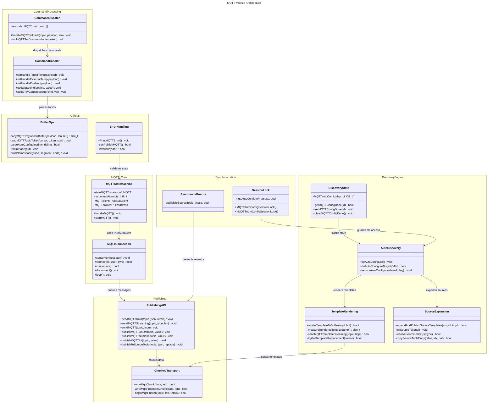

# C4 Code Level: MQTT Module

## Overview

- **Name**: MQTT Client Module (MQTTstuff.ino)
- **Description**: Complete MQTT client implementation for the OTGW-firmware ESP8266 gateway. Provides MQTT publish/subscribe functionality, Home Assistant auto-discovery configuration, command handling, and OpenTherm message-to-MQTT mapping.
- **Location**: `/src/OTGW-firmware/MQTTstuff.ino`
- **Language**: Arduino C/C++ (with PubSubClient library integration)
- **Purpose**: Enables MQTT-based integration with home automation systems (Home Assistant), publishes OpenTherm data to configurable topics, handles MQTT commands for controlling the OTGW gateway, and manages auto-discovery of sensors/controls in Home Assistant.

## Code Elements

### Core State Management

#### Enumerations

- `enum states_of_MQTT { MQTT_STATE_INIT, MQTT_STATE_TRY_TO_CONNECT, MQTT_STATE_IS_CONNECTED, MQTT_STATE_WAIT_CONNECTION_ATTEMPT, MQTT_STATE_WAIT_FOR_RECONNECT, MQTT_STATE_ERROR }`
  - Description: State machine states for MQTT connection lifecycle
  - Location: MQTTstuff.ino:103
  - Usage: Controls the MQTT connection state transitions in `handleMQTT()`

#### Data Structures

- `struct MQTTAutoConfigLineView`
  - Description: Parsed line view from mqttha.cfg discovery config file
  - Fields:
    - `byte id`: Message ID for Home Assistant entity
    - `char *topicTemplate`: Topic template string (pointer into parsed sLine buffer)
    - `char *msgTemplate`: Message/payload template string (pointer into parsed sLine buffer)
  - Location: MQTTstuff.ino:43-47

- `struct MQTTAutoConfigTemplateContext`
  - Description: Context for template variable substitution during discovery config rendering
  - Fields:
    - `const char *nodeId`: Unique node ID for this gateway
    - `const char *sensorId`: Sensor ID for per-sensor discovery (e.g., Dallas temp sensor address)
    - `const char *hostname`: Gateway hostname
    - `const char *version`: Firmware version string
    - `const char *mqttPubTopic`: Publication namespace prefix
    - `const char *mqttSubTopic`: Subscription namespace prefix
    - `const char *sourceSuffix`: Source suffix token replacement (_thermostat, _boiler, _gateway)
    - `const char *sourceName`: Source friendly name (Thermostat, Boiler, Gateway)
    - `const char *sourceTopicSegment`: Source key for topic (thermostat, boiler, gateway)
  - Location: MQTTstuff.ino:49-59

- `struct MQTTAutoConfigSessionLock`
  - Description: RAII guard for exclusive MQTT auto-discovery file access
  - Methods:
    - Constructor: Acquires lock if not already in progress
    - Destructor: Releases lock
    - Deleted copy/move constructors: Prevents accidental double-release
  - Location: MQTTstuff.ino:82-96
  - Pattern: RAII lock guard using `mqttAutoConfigInProgress` flag

- `struct MQTT_set_cmd_t`
  - Description: Mapping of MQTT command topics to OTGW command codes
  - Fields:
    - `PGM_P setcmd`: MQTT command name (e.g., "setpoint")
    - `PGM_P otgwcmd`: OTGW command code (e.g., "TT" for setpoint)
    - `PGM_P ottype`: Value type (temperature, on/off, level, raw, etc.)
  - Location: MQTTstuff.ino:525-530

### Initialization & Connection

- `void startMQTT()`
  - Description: Initialize MQTT client and kick off connection state machine
  - Location: MQTTstuff.ino:587-604
  - Actions:
    - Returns if MQTT not enabled
    - Sets PubSubClient buffer size to `MQTT_CLIENT_BUFFER_SIZE` (384 bytes) for inbound messages
    - Initializes state to `MQTT_STATE_INIT`
    - Clears auto-discovery completion bitmap
    - Builds publish/subscribe topic namespaces
    - Calls `handleMQTT()` to begin connection attempt
  - Dependencies: PubSubClient, settings, WiFi

- `void handleMQTT()`
  - Description: Main MQTT state machine; call regularly from main loop
  - Location: MQTTstuff.ino:973-1145
  - State transitions:
    - `MQTT_STATE_INIT`: Resolve broker hostname to IP, configure PubSubClient
    - `MQTT_STATE_TRY_TO_CONNECT`: Attempt connection with credentials (if available)
    - `MQTT_STATE_IS_CONNECTED`: Maintain connection, call PubSubClient.loop()
    - `MQTT_STATE_WAIT_CONNECTION_ATTEMPT`: 3-second delay between retry attempts (after failed connection)
    - `MQTT_STATE_WAIT_FOR_RECONNECT`: 10-minute delay before retrying (after 5 failed attempts)
    - `MQTT_STATE_ERROR`: Invalid broker URL; wait before retry
  - Socket configuration:
    - Socket timeout: 15 seconds (increased from 4 for stability)
    - Keep-alive: 60 seconds (increased from 15 to reduce reconnections)
  - Parameters: None (uses global state)
  - Key timers: `timerMQTTwaitforconnect` (42s), `timerMQTTwaitforretry` (3s)
  - Dependencies: WiFi, PubSubClient, settings

### Callback & Message Handling

- `void handleMQTTcallback(char* topic, byte* payload, unsigned int length)`
  - Description: Incoming MQTT message handler; invoked by PubSubClient for subscribed topics
  - Location: MQTTstuff.ino:609-967
  - Parameters:
    - `char* topic`: Incoming topic string
    - `byte* payload`: Raw payload bytes (not null-terminated)
    - `unsigned int length`: Payload byte count
  - Topic structure: `{topTopic}/set/{nodeId}/{command}` or special topics:
    - `homeassistant/status`: Detects Home Assistant going offline/online for discovery re-sync
  - Command families:
    - Standard MQTT commands: mapped via `findMQTTSetCommandIndex()` (setpoint, constant, outside temp, etc.)
    - SAT (Simple Auto Temp) commands: `sat/target`, `sat/indoor_temp`, `sat/outdoor_temp`, `sat/enabled`, `sat/control_mode`, etc.
    - Settings updates: forwarded to `updateSetting()`
  - Actions:
    - Validates payload fits in 128-byte msgPayload buffer
    - Parses topic hierarchically: `topTopic → set → nodeId → command`
    - Dispatches to command handler or SAT function
    - Queues OTGW command via `addOTWGcmdtoqueue()`
  - Dependencies: strcasecmp_P, satHandle* functions, updateSetting, addOTWGcmdtoqueue
  - Re-entrance: Yes (called asynchronously by PubSubClient.loop())

- `int findMQTTSetCommandIndex(const char *topicToken)`
  - Description: Look up MQTT set command in command dispatch table
  - Location: MQTTstuff.ino:567-584
  - Parameters:
    - `const char *topicToken`: Command name to look up
  - Returns: Index into `setcmds[]` array if found, -1 if not found
  - Algorithm: Linear search through PROGMEM `setcmds` table, matching against both `setcmd` and `otgwcmd` names
  - Dependencies: setcmds (global PROGMEM table), strcasecmp_P

### Publishing & Data Transmission

- `void sendMQTTData(const char* topic, const char *json, const bool retain)`
  - Description: Send JSON payload to MQTT topic (RAM-based topic/payload)
  - Location: MQTTstuff.ino:1170-1199
  - Parameters:
    - `const char* topic`: Topic suffix (will be prefixed with `MQTTPubNamespace/`)
    - `const char *json`: JSON payload string (RAM)
    - `const bool retain`: Whether to retain message on broker
  - Implementation:
    - Validates MQTT enabled, broker connected, broker IP valid
    - Checks heap health via `canPublishMQTT()`
    - Builds full topic: `{MQTTPubNamespace}/{topic}`
    - Streams payload in 128-byte chunks via `beginPublish()`, `writeMqttChunk()`, `endPublish()`
    - Confirms publish slot allocation on success
    - Calls `feedWatchDog()` after completion
  - Return: void (failures logged internally)
  - Dependencies: MQTTclient, canPublishMQTT, feedWatchDog, PrintMQTTError
  - Re-entrance guard: None (but calling code may yield via feedWatchDog)

- `void sendMQTTData(const __FlashStringHelper *topic, const char *json, const bool retain)`
  - Description: Overload for PROGMEM topic with RAM payload
  - Location: MQTTstuff.ino:1201-1207
  - Wrapper: Converts topic from PROGMEM to RAM buffer, calls main `sendMQTTData()`

- `void sendMQTTData(const __FlashStringHelper *topic, const __FlashStringHelper *json, const bool retain)`
  - Description: Overload for PROGMEM topic and PROGMEM payload
  - Location: MQTTstuff.ino:1209-1243
  - Implementation:
    - Builds full topic in RAM buffer
    - Streams PROGMEM payload in 63-byte chunks via `writeMqttProgmemChunk()`
    - Calls `feedWatchDog()` between chunks
  - Dependencies: writeMqttProgmemChunk, pgm_read_byte, strlen_P

- `void sendMQTT(const char* topic, const char *json)`
  - Description: High-level publish with automatic retention (typically true)
  - Location: MQTTstuff.ino:1364-1366
  - Wrapper: Calls `sendMQTTStreaming()` with strlen(json)

- `void sendMQTTStreaming(const char* topic, const char *json, const size_t len)`
  - Description: Stream large JSON payloads in 128-byte chunks to avoid buffer reallocation
  - Location: MQTTstuff.ino:1368-1412
  - Parameters:
    - `const char* topic`: Topic (used as-is, no namespace prefix)
    - `const char *json`: Payload data pointer
    - `const size_t len`: Exact byte count of payload
  - Algorithm:
    - Begins publish with `beginMqttPublish(topic, len, retain=true)`
    - Writes `CHUNK_SIZE` (128) byte chunks via `MQTTclient.write()`
    - Feeds watchdog between chunks
    - Ends publish with `endPublish()`
  - Dependencies: MQTTclient, feedWatchDog, PrintMQTTError
  - Note: Different from `sendMQTTData()` — this publishes to topic as-is without namespace prefix

### Helper Publish Functions

- `void publishMQTTOnOff(const char* topic, bool value)`
- `void publishMQTTOnOff(const __FlashStringHelper* topic, bool value)`
  - Description: Publish boolean as "ON"/"OFF" string
  - Location: MQTTstuff.ino:1422-1428
  - Parameters: topic, boolean value
  - Implementation: Calls `sendMQTTData()` with conditional string

- `void publishMQTTNumeric(const char* topic, float value, uint8_t decimals = 2)`
- `void publishMQTTNumeric(const __FlashStringHelper* topic, float value, uint8_t decimals = 2)`
  - Description: Publish float as formatted string with configurable decimal places
  - Location: MQTTstuff.ino:1434-1444
  - Parameters: topic, float value, decimal precision
  - Implementation: Uses static RAM buffer (16 bytes), `dtostrf()` for conversion
  - Warning: Static buffer — not re-entrant

- `void publishMQTTInt(const char* topic, int value)`
- `void publishMQTTInt(const __FlashStringHelper* topic, int value)`
  - Description: Publish integer as string
  - Location: MQTTstuff.ino:1449-1459
  - Parameters: topic, integer value
  - Implementation: Uses static RAM buffer (12 bytes), `snprintf()` for conversion
  - Warning: Static buffer — not re-entrant

- `void publishToSourceTopic(const char* topic, const char* json, byte rsptype)`
  - Description: Publish to source-separated topic (e.g., topic/thermostat, topic/boiler, topic/gateway)
  - Location: MQTTstuff.ino:1483-1499
  - Parameters:
    - `const char* topic`: Base topic path
    - `const char* json`: Payload
    - `byte rsptype`: OpenTherm response type (OTGW_THERMOSTAT, OTGW_BOILER, OTGW_ANSWER_THERMOSTAT, OTGW_REQUEST_BOILER)
  - Re-entrance guard: Static `inUse` flag prevents nested calls from corrupting `sourceTopic` buffer
  - Algorithm:
    - Resolves source type from rsptype
    - Copies source key (thermostat/boiler/gateway) from `mqttSourceKeys` table
    - Appends source key to topic: `{topic}/{sourceKey}`
    - Calls `sendMQTTData()`
  - Dependencies: resolveSourceIndex, copySourceTableEntry, sendMQTTData, mqttSourceKeys

### State Information Publishing

- `void sendMQTTuptime()`
  - Description: Publish gateway uptime in seconds
  - Location: MQTTstuff.ino:1247-1252
  - Topic: `otgw-firmware/uptime`
  - Format: Decimal string (seconds)

- `void sendMQTTversioninfo()`
  - Description: Publish firmware/hardware version info
  - Location: MQTTstuff.ino:1257-1303
  - Published topics:
    - `otgw-firmware/version`: Semantic version
    - `otgw-firmware/reboot_count`: Reboot counter
    - `otgw-firmware/reboot_reason`: Last reset reason
    - `otgw-pic/version`: PIC firmware version (if PIC enabled)
    - `otgw-pic/deviceid`: PIC device ID (if PIC enabled)
    - `otgw-pic/firmwaretype`: PIC firmware type (if PIC enabled)
    - `otgw-pic/picavailable`: "ON"/"OFF"
    - `otgw-otdirect/*`: OT-direct status topics (OTGW32 only)
    - `otgw-firmware/board`: Board name
    - `otgw-firmware/hardware_mode`: Hardware mode
    - `otgw-firmware/network_mode`: Network mode (WiFi, Ethernet, etc.)

- `void sendMQTTstateinformation()`
  - Description: Publish OpenTherm bus state information
  - Location: MQTTstuff.ino:1348-1355
  - Calls: `publishBoilerConnectedState()`, `publishThermostatConnectedState()`, `publishOTGWConnectedState()`

- `static void publishBoilerConnectedState()`
- `static void publishThermostatConnectedState()`
- `static void publishOTGWConnectedState()`
  - Description: Publish individual connection state flags
  - Location: MQTTstuff.ino:1305-1343
  - Topics published to multiple prefixes (base, otgw-pic/, otgw-otdirect/)

### Template Rendering & Discovery Configuration

- `static bool tryGetTemplateReplacement(const char *cursor, const void *ctxPtr, const char *&replacement, size_t &tokenLen)`
  - Description: Check if cursor points to a template variable token and return replacement string
  - Location: MQTTstuff.ino:158-210
  - Parameters:
    - `const char *cursor`: Pointer to potential token start
    - `const void *ctxPtr`: Context pointer (cast to MQTTAutoConfigTemplateContext)
    - `const char *&replacement`: Output: replacement string pointer
    - `size_t &tokenLen`: Output: token length for cursor advancement
  - Supported tokens:
    - `%mqtt_sub_topic%`: Subscription namespace
    - `%mqtt_pub_topic%`: Publication namespace
    - `%source_topic_segment%`: Source key (thermostat/boiler/gateway)
    - `%source_suffix%`: Source suffix (_thermostat/_boiler/_gateway)
    - `%source_name%`: Source friendly name
    - `%sensor_id%`: Sensor-specific ID (e.g., Dallas address)
    - `%hostname%`: Gateway hostname
    - `%node_id%`: Gateway unique node ID
    - `%version%`: Firmware version
  - Returns: true if token matched at cursor, false otherwise

- `static bool renderTemplateToBuffer(const char *templateStr, char *dest, size_t destSize, const void *ctxPtr)`
  - Description: Render template string with variable substitutions into destination buffer
  - Location: MQTTstuff.ino:212-239
  - Parameters:
    - `const char *templateStr`: Template with `%token%` placeholders
    - `char *dest`: Destination buffer
    - `size_t destSize`: Destination buffer size
    - `const void *ctxPtr`: Context with substitution values
  - Algorithm:
    - Iterates through template character by character
    - When token found, appends replacement string
    - Otherwise appends literal character
    - Null-terminates output
  - Returns: true if rendered successfully, false on overflow

- `static size_t measureRenderedTemplate(const char *templateStr, const void *ctxPtr)`
  - Description: Calculate final rendered size without allocating buffer
  - Location: MQTTstuff.ino:241-259
  - Parameters: template string, context
  - Returns: Total byte count after token substitution
  - Usage: Pre-compute size for `beginPublish()` before rendering

- `static bool sendMQTTTemplateStreaming(const char *topic, const char *templateStr, const void *ctxPtr)`
  - Description: Render and stream template to MQTT in one operation
  - Location: MQTTstuff.ino:307-357
  - Parameters:
    - `const char *topic`: Destination topic
    - `const char *templateStr`: Template to render
    - `const void *ctxPtr`: Context with variables
  - Algorithm:
    - Measures rendered size via `measureRenderedTemplate()`
    - Begins publish with actual size
    - Iterates template, streaming each replacement string and literal segments via `writeMqttChunk()`
    - Feeds watchdog between writes
    - Ends publish
  - Returns: true if published successfully
  - Dependencies: measureRenderedTemplate, tryGetTemplateReplacement, writeMqttChunk, feedWatchDog

### Buffer Management & Chunked Writing

- `static bool writeMqttChunk(const char *data, size_t len)`
  - Description: Write RAM data to MQTT in 128-byte chunks
  - Location: MQTTstuff.ino:261-276
  - Parameters: data pointer, byte count
  - Implementation: Loops in CHUNK_SIZE (128) increments, calls `MQTTclient.write()`, feeds watchdog
  - Returns: true if all bytes written, false on error

- `static bool writeMqttProgmemChunk(PGM_P data, size_t len)`
  - Description: Write PROGMEM data to MQTT in 63-byte chunks
  - Location: MQTTstuff.ino:278-296
  - Parameters: PROGMEM pointer, byte count
  - Implementation:
    - Stages 63-byte chunks into local `stage` buffer
    - Reads bytes from PROGMEM via `pgm_read_byte()`
    - Writes to MQTT via `MQTTclient.write()`
    - Feeds watchdog between chunks
  - Chunk size: 63 bytes (small enough to avoid oversized staging buffer)

- `static bool beginMqttPublish(const char *topic, size_t len, bool retain)`
  - Description: Start MQTT publish operation with known payload size
  - Location: MQTTstuff.ino:298-305
  - Wrapper: Calls `MQTTclient.beginPublish()`, logs error on failure

- `void resetMQTTBufferSize()`
  - Description: INTENTIONALLY A NO-OP (documented in code)
  - Location: MQTTstuff.ino:1514-1518
  - Rationale: Buffer is sized once at startup; no runtime resizing to avoid heap churn
  - Kept for API compatibility with existing discovery call sites

### Home Assistant Auto-Discovery

- `void doAutoConfigure()`
  - Description: Force-publish all Home Assistant discovery configs from mqttha.cfg file
  - Location: MQTTstuff.ino:1589-1700
  - Intended use: Explicit utility (Serial 'F' command, REST API); never called automatically
  - Acquisition: Acquires `MQTTAutoConfigSessionLock` for exclusive file access
  - Algorithm:
    - Opens `/mqttha.cfg` from LittleFS
    - Reads file line by line into `sLine` buffer (guarded by lock)
    - Parses each line into `MQTTAutoConfigLineView`
    - Skips Dallas sensor entries (handled separately via `configSensors()`)
    - Skips PIC-specific entries if PIC not enabled
    - Skips OT-direct entries if OT-direct not active
    - Detects source template lines (containing source placeholders)
    - If source template and separate sources enabled: calls `expandAndPublishSourceTemplates()`
    - Otherwise: renders and publishes single discovery entry via `sendMQTTTemplateStreaming()`
    - Marks each successfully published entry in `MQTTautoConfigMap` bitfield
  - Buffer usage:
    - `sLine`: Global config-line buffer (1200 bytes)
    - `cMsg` reused as `sTopic`: Rendered discovery topic (≤200 bytes)
  - Dependencies: MQTTAutoConfigSessionLock, parseAutoConfigLine, expandAndPublishSourceTemplates, sendMQTTTemplateStreaming, setMQTTConfigDone

- `bool doAutoConfigureMsgid(byte OTid)`
- `bool doAutoConfigureMsgid(byte OTid, const char *cfgSensorId)`
- `bool doAutoConfigureMsgid(byte OTid, const char *cfgSensorId, const char *baseMqttTopic)`
  - Description: Publish Home Assistant discovery config for a specific OpenTherm message ID
  - Location: MQTTstuff.ino:1702-1831
  - Usage: Just-In-Time (JIT) discovery on first message arrival (Path B in ADR-041)
  - Parameters:
    - `byte OTid`: OpenTherm message ID (0-127)
    - `const char *cfgSensorId`: Optional sensor ID for Dallas temp sensors
    - `const char *baseMqttTopic`: Optional base MQTT topic override
  - Algorithm:
    - Validates MQTT enabled, broker connected, broker IP valid
    - Opens `/mqttha.cfg` and reads line by line
    - Finds entry matching `OTid`
    - If found: parses and renders discovery config with provided context
    - Detects source template lines; if separate sources enabled, calls `expandAndPublishSourceTemplates()`
    - Marks entry as configured in `MQTTautoConfigMap` if successful
    - Closes file (lock released by sessionLock dtor)
  - Return: true if config was published, false otherwise
  - Dependencies: MQTTAutoConfigSessionLock, parseAutoConfigLine, renderTemplateToBuffer, expandAndPublishSourceTemplates, sendMQTTTemplateStreaming

- `static bool expandAndPublishSourceTemplates(byte msgid, const char *logLabel, const char *topicTemplate, const char *msgTemplate, const void *baseCtxPtr, char *renderedTopic)`
  - Description: Expand source-template discovery line into 3 per-source variants (thermostat/boiler/gateway)
  - Location: MQTTstuff.ino:1558-1587
  - Parameters:
    - `byte msgid`: Message ID for logging
    - `const char *logLabel`: Label for debug output ("bulk" or "jit")
    - `const char *topicTemplate`: Discovery topic template (from mqttha.cfg)
    - `const char *msgTemplate`: Discovery payload template (from mqttha.cfg)
    - `const void *baseCtxPtr`: Base template context (source tokens will be set per iteration)
    - `char *renderedTopic`: Buffer for rendered topics (cMsg global, reused as sTopic)
  - Algorithm:
    - Iterates over 3 source types (0=thermostat, 1=boiler, 2=gateway)
    - For each source: copies source suffix, key, and name from PROGMEM tables
    - Creates variant context with source tokens set
    - Renders topic template into `renderedTopic`
    - Streams message template with variant context via `sendMQTTTemplateStreaming()`
    - Feeds watchdog between per-source publishes
  - Return: true if at least one variant published, false if all failed
  - Note: `feedWatchDog()` is used (not `doBackgroundTasks()`) to keep `cMsg` buffer held as `sTopic`

- `void sensorAutoConfigure(byte dataid, bool finishflag, const char *cfgSensorId = nullptr)`
  - Description: Configure Dallas temperature sensor discovery
  - Location: MQTTstuff.ino:1833-1850
  - Parameters:
    - `byte dataid`: Fake OT data ID for sensor (not a real OT message)
    - `bool finishflag`: Whether to immediately mark config as done
    - `const char *cfgSensorId`: Sensor address string
  - Algorithm:
    - Checks if config already sent via `getMQTTConfigDone(dataid)`
    - If not done: calls `doAutoConfigureMsgid(dataid, cfgSensorId)` to send discovery
    - If finishflag true: marks dataid as configured via `setMQTTConfigDone()`

### Discovery State Management

- `bool getMQTTConfigDone(const uint8_t MSGid)`
  - Description: Check if discovery config has been published for a message ID
  - Location: MQTTstuff.ino:1520-1532
  - Implementation:
    - Splits MSGid into group (bits 7-5) and index (bits 4-0)
    - Reads bit from `MQTTautoConfigMap[group]` at index position
  - Returns: true if bit set (config published), false otherwise

- `void setMQTTConfigDone(const uint8_t MSGid)`
  - Description: Mark discovery config as published for a message ID
  - Location: MQTTstuff.ino:1534-1543
  - Implementation: Splits MSGid, sets bit in `MQTTautoConfigMap[group]`

- `void clearMQTTConfigDone()`
  - Description: Clear all discovery configuration flags
  - Location: MQTTstuff.ino:1545-1548
  - Usage: Called on MQTT connection, Home Assistant online/offline events
  - Rationale: Triggers re-publication of discovery configs on reconnect or HA restart

### Error Handling & Debugging

- `void PrintMQTTError()`
  - Description: Log human-readable MQTT error message from PubSubClient state
  - Location: MQTTstuff.ino:1147-1163
  - Translates error codes:
    - MQTT_CONNECTION_TIMEOUT
    - MQTT_CONNECTION_LOST
    - MQTT_CONNECT_FAILED
    - MQTT_DISCONNECTED
    - MQTT_CONNECTED
    - MQTT_CONNECT_BAD_PROTOCOL
    - MQTT_CONNECT_BAD_CLIENT_ID
    - MQTT_CONNECT_UNAVAILABLE
    - MQTT_CONNECT_BAD_CREDENTIALS
    - MQTT_CONNECT_UNAUTHORIZED
  - Output: Debug telnet via `MQTTDebugTln()`

### Topic & Namespace Building

- `static void buildNamespace(char *dest, size_t destSize, const char *base, const char *segment, const char *node)`
  - Description: Build hierarchical MQTT topic namespace
  - Location: MQTTstuff.ino:359-370
  - Parameters:
    - `const char *base`: Base topic (e.g., "OTGW")
    - `const char *segment`: Segment (e.g., "value" or "set")
    - `const char *node`: Node ID (unique identifier)
  - Output format: `{base}/{segment}/{node}`
  - Special handling: Removes trailing slash from base if present
  - Usage: Called in `startMQTT()` to build `MQTTPubNamespace` and `MQTTSubNamespace`

- `static void trimInPlace(char *buffer)`
  - Description: Trim whitespace from both ends of string (in-place)
  - Location: MQTTstuff.ino:112-125
  - Handles leading and trailing whitespace via `isspace()`

### Payload & Topic Parsing

- `static size_t copyMQTTPayloadToBuffer(const byte *payload, unsigned int length, char *dest, size_t destSize)`
  - Description: Copy raw MQTT payload bytes to null-terminated string buffer
  - Location: MQTTstuff.ino:372-381
  - Parameters: raw payload, length, destination buffer, buffer size
  - Returns: Number of bytes copied
  - Handling: Truncates if payload exceeds buffer capacity

- `static bool readMQTTTopicToken(const char *&cursor, char *token, size_t tokenSize)`
  - Description: Parse next topic segment from topic path
  - Location: MQTTstuff.ino:383-450
  - Parameters:
    - `const char *&cursor`: Topic cursor (advanced by function)
    - `char *token`: Output token buffer
    - `size_t tokenSize`: Token buffer size
  - Algorithm:
    - Skips leading slashes
    - Reads until next slash or end-of-string
    - Null-terminates token
  - Returns: true if token extracted, false if end-of-string or buffer overflow

- `static bool parseAutoConfigLine(char *sIn, char del, void *viewPtr)`
  - Description: Parse mqttha.cfg line format: `id;topicTemplate;msgTemplate`
  - Location: MQTTstuff.ino:127-156
  - Parameters:
    - `char *sIn`: Config file line (modified in-place; delimiters replaced with null)
    - `char del`: Delimiter character (typically `;`)
    - `void *viewPtr`: Output view pointer (cast to MQTTAutoConfigLineView)
  - Algorithm:
    - Finds and removes `//` comments
    - Trims whitespace
    - Splits by delimiter into 3 parts: id, topicTemplate, msgTemplate
    - Validates non-empty parts
    - Trims each part individually
  - Returns: true if valid line parsed, false on parse error
  - Output: Populates view with id, topicTemplate, msgTemplate pointers (into sIn buffer)

### Source Mapping

- `static void initSourceTokens()`
  - Description: Initialize source token strings from PROGMEM into module-level static buffers
  - Location: MQTTstuff.ino:456-466
  - Tokens initialized:
    - `s_sourceSuffixToken`: `%source_suffix%`
    - `s_sourceNameToken`: `%source_name%`
    - `s_sourceTopicSegmentToken`: `%source_topic_segment%`
  - Rationale: Avoid repeated PROGMEM reads in hot loops
  - Guard: Static `initialized` flag prevents re-initialization

- `static bool resolveSourceIndex(byte rsptype, uint8_t &sourceIndex)`
  - Description: Map OpenTherm response type to source index
  - Location: MQTTstuff.ino:1463-1471
  - Mapping:
    - OTGW_THERMOSTAT → 0 (thermostat)
    - OTGW_BOILER → 1 (boiler)
    - OTGW_ANSWER_THERMOSTAT → 1 (boiler side, OTGW answers as boiler)
    - OTGW_REQUEST_BOILER → 2 (gateway)
  - Returns: false for invalid/parity error types

- `static bool copySourceTableEntry(const char* const table[], uint8_t sourceIndex, char *dest, size_t destSize)`
  - Description: Copy PROGMEM source table entry to RAM buffer
  - Location: MQTTstuff.ino:1473-1481
  - Parameters:
    - `const char* const table[]`: PROGMEM pointer array (mqttSourceKeys, mqttSourceSuffixes, or mqttSourceNames)
    - `uint8_t sourceIndex`: Index into table (0-2)
    - `char *dest`: Destination RAM buffer
    - `size_t destSize`: Buffer size
  - Implementation: Reads pointer from PROGMEM table, copies string via `strncpy_P()`

### Global State Variables

- `static PubSubClient MQTTclient(wifiClient)`: PubSubClient instance for MQTT communication
- `static IPAddress MQTTbrokerIP`: Resolved broker IP address
- `static char MQTTbrokerIPchar[20]`: String representation of broker IP
- `enum states_of_MQTT stateMQTT`: Current MQTT state machine state
- `int8_t reconnectAttempts`: Connection retry counter
- `char lastMQTTtimestamp[15]`: Last MQTT timestamp string
- `static char MQTTclientId[MQTT_ID_MAX_LEN]`: Client ID (hostname + MAC)
- `static char MQTTPubNamespace[MQTT_NAMESPACE_MAX_LEN]`: Publication topic namespace
- `static char MQTTSubNamespace[MQTT_NAMESPACE_MAX_LEN]`: Subscription topic namespace
- `static char NodeId[MQTT_ID_MAX_LEN]`: Unique node ID from settings
- `static bool mqttAutoConfigInProgress`: Lock flag for auto-discovery file access
- `bool bHAcycle`: Home Assistant online/offline cycle flag
- `const char* const mqttSourceKeys[] PROGMEM`: Source key strings (thermostat/boiler/gateway)
- `const char* const mqttSourceSuffixes[] PROGMEM`: Source suffix strings (_thermostat/_boiler/_gateway)
- `const char* const mqttSourceNames[] PROGMEM`: Source friendly names (Thermostat/Boiler/Gateway)
- `const MQTT_set_cmd_t setcmds[] PROGMEM`: MQTT command dispatch table

### Constants

- `MQTT_ID_MAX_LEN`: 96 bytes
- `MQTT_NAMESPACE_MAX_LEN`: 192 bytes
- `MQTT_TOPIC_MAX_LEN`: 200 bytes
- `MQTT_CLIENT_BUFFER_SIZE`: 384 bytes (PubSubClient inbound buffer)
- `MQTT_PROGMEM_STAGE_LEN`: 63 bytes (staging buffer for PROGMEM reads)
- `MQTT_MSG_MAX_LEN`: 1200 bytes (max discovery config message size)
- `MQTT_CFG_LINE_MAX_LEN`: 1200 bytes (max mqttha.cfg line length)

## Dependencies

### Internal Dependencies

- **OTGW-Core.h**: Core data structures (OTGWSettings, OTGWState), OpenTherm message types
- **safeTimers.h**: Timer macros (DECLARE_TIMER_SEC, DUE, RESTART_TIMER)
- **WiFi (ESP8266WiFiClient)**: `wifiClient` global for MQTT socket
- **LittleFS**: File system access for `/mqttha.cfg` configuration
- **Debug functions**: DebugTln, DebugTf, DebugT, Debug, DebugFlush (telnet debug output)
- **Utility functions**:
  - `feedWatchDog()`: Keep watchdog alive during long operations
  - `addOTWGcmdtoqueue()`: Queue commands to OTGW PIC processor
  - `updateSetting()`: Update runtime settings
  - `canPublishMQTT()`: Check heap health before publish
  - `confirmMQTTPublishSlot()`: Confirm throttle slot on successful publish
  - `isPICEnabled()`, `isOTDirectEnabled()`: Feature availability checks
  - `CSTR()`, `CBOOLEAN()`, `CCONOFF()`, `CONLINEOFFLINE()`: Macro conversions
  - `isValidIP()`: Validate IP address
  - `replaceAll()`: String replacement in buffer
  - `requestMQTTRepublishAll()`: Request republish of all cached values
  - `publishAllPICsettings()`: Republish PIC settings on reconnect

### External Dependencies

- **PubSubClient** (Nick O'Leary): MQTT client library
  - Usage: `MQTTclient.connect()`, `MQTTclient.publish()`, `MQTTclient.subscribe()`, `MQTTclient.loop()`, `MQTTclient.state()`, `MQTTclient.setServer()`, `MQTTclient.setCallback()`, `MQTTclient.setBufferSize()`, `MQTTclient.setSocketTimeout()`, `MQTTclient.setKeepAlive()`
  - Version: Compatible with ESP8266 (library handles socket operations)

- **Arduino/ESP8266 Core**:
  - `<ctype.h>`: `isspace()`, `isalnum()`
  - `<pgmspace.h>`: PROGMEM macros, `pgm_read_byte()`, `strlen_P()`, `strcpy_P()`, `strncpy_P()`, `strcasecmp_P()`, `strstr_P()`, `memcmp_P()`
  - `string.h`: `strlen()`, `memcpy()`, `memmove()`, `strlcpy()`, `strlcat()`, `strcpy()`, `strncpy()`, `strncat()`, `strcasecmp()`, `strstr()`
  - `stdio.h`: `snprintf()`, `snprintf_P()`
  - `stdlib.h`: `dtostrf()`, `strtoul()`
  - WiFi: `WiFi.hostByName()`, `WiFi.macAddress()`

## Key Behaviors & Patterns

### MQTT State Machine

The module implements a 6-state state machine for MQTT connection management:

1. **MQTT_STATE_INIT**: Resolve broker hostname to IP, validate configuration
2. **MQTT_STATE_TRY_TO_CONNECT**: Attempt connection with credentials
3. **MQTT_STATE_IS_CONNECTED**: Maintain connection via `MQTTclient.loop()`
4. **MQTT_STATE_WAIT_CONNECTION_ATTEMPT**: 3-second backoff between attempts
5. **MQTT_STATE_WAIT_FOR_RECONNECT**: 10-minute backoff after 5 failed attempts
6. **MQTT_STATE_ERROR**: Invalid broker configuration (waits 10 minutes before retry)

States are managed by `handleMQTT()` which should be called regularly from the main loop.

### Chunked MQTT Publishing

All MQTT publishes use chunked transmission to prevent heap fragmentation:

- **RAM data**: 128-byte chunks via `writeMqttChunk()`
- **PROGMEM data**: 63-byte chunks via `writeMqttProgmemChunk()`
- **Streaming templates**: Rendered and sent in chunks via `sendMQTTTemplateStreaming()`

PubSubClient's `beginPublish()` → `write()` → `endPublish()` API allows efficient buffering without heap reallocation.

### Home Assistant Auto-Discovery

The module supports two auto-discovery paths (ADR-041):

**Path A (Bulk)**: `doAutoConfigure()` publishes all discovery configs from `/mqttha.cfg` at once.
- Used for initial setup or explicit refresh via Serial 'F' command
- Publishes all non-Dallas sensor entries
- Publishes Dallas sensor discovery via separate `configSensors()` call

**Path B (JIT)**: `doAutoConfigureMsgid()` publishes discovery config when first OpenTherm message arrives.
- Called from `processOT()` when new message type detected
- Only publishes if not already in `MQTTautoConfigMap` bitfield
- Avoids flooding broker with configs for message IDs never seen in real deployments

**Path B is preferred** in production to minimize startup MQTT traffic.

### Source-Separated Topics

OpenTherm messages can originate from three "sources":
- **Thermostat**: Master (initiates communication)
- **Boiler**: Slave (responds to master)
- **Gateway**: OTGW itself (when modifying commands)

When `settings.mqtt.bSeparateSources` is enabled:
- Each data value is published to separate subtopics: `topic/thermostat`, `topic/boiler`, `topic/gateway`
- Home Assistant discovery configs expand 1 template into 3 entity variants
- Allows Home Assistant to attribute values to the correct device

Detection: Template lines in `mqttha.cfg` containing `%source_suffix%`, `%source_name%`, or `%source_topic_segment%` are treated as source templates.

### Home Assistant Status Monitoring

The module subscribes to `homeassistant/status` topic to detect Home Assistant lifecycle events:

- **Offline** → **Online**: If HA restart detected, clears `MQTTautoConfigMap` to trigger re-discovery on next message (ADR-041)
- **Online** (without prior offline): If `bHaRebootDetect` disabled, always re-discover
- Prevents stale discovery configs if HA broker connection is lost

### Buffer Management (ADR-053)

The module uses two global buffers for auto-discovery:

- **cMsg (global)**: 512-byte general-purpose scratch, reused as `sTopic` (rendered topic ≤200 bytes) during discovery
  - Safe because template pointers (topicTemplate/msgTemplate) point into `sLine`, not `cMsg`
  - Guard: `feedWatchDog()` is the only yield during discovery → no HTTP/MQTT callback overwrites cMsg mid-use

- **sLine (global)**: 1200-byte dedicated config-line buffer, exclusively for `mqttAutoConfigInProgress`
  - Holds raw `/mqttha.cfg` lines (≤900 bytes typical)
  - Guarded by `MQTTAutoConfigSessionLock` (sets `mqttAutoConfigInProgress` flag)

Both buffers persist across function calls; no cleanup needed. Lock is RAII — released by sessionLock destructor.

### Command Processing

Incoming MQTT commands follow the topic structure:
```
{topTopic}/set/{nodeId}/{command}[/{subcommand}]
```

**Standard OTGW commands** (e.g., `setpoint`, `outside_temp`) are mapped via the `setcmds[]` dispatch table to OTGW command codes (e.g., `TT`, `OT`), then queued to the PIC via `addOTWGcmdtoqueue()`.

**SAT (Simple Auto Temp) commands** are a special family handled directly:
- `sat/target`: Set target temperature
- `sat/enabled`: Enable/disable SAT
- `sat/control_mode`: Set control mode
- Plus many others for tuning and calibration

All commands are validated, payload length checked, and invalid payloads rejected.

### Heap Health Check

Before publishing, `canPublishMQTT()` checks available heap:
- Refuses publishes if heap below threshold
- Logs warning and drops message
- Prevents heap exhaustion from blocking the MQTT broker connection

### Watchdog Feeding

Most publish operations call `feedWatchDog()` to keep the ESP8266 watchdog alive:
- Between 128-byte chunks during chunked transmission
- Between per-source template publishes
- Between config file line reads during discovery

Prevents watchdog timeouts during large auto-discovery operations.

## Relationships & Data Flows

### OpenTherm Message → MQTT Publication

```
processOT() in OTGW-Core.ino
  ↓
  publishToSourceTopic(topic, json, rsptype)
  OR
  sendMQTTData(topic, json, retain)
  ↓
  Check: MQTT enabled, broker connected, heap OK
  ↓
  Chunk data into 128-byte segments
  ↓
  MQTTclient.beginPublish() → write() × N chunks → endPublish()
  ↓
  Confirm throttle slot allocation
  ↓
  feedWatchDog()
```

### MQTT Command → OTGW Queue

```
MQTTclient.loop() (async)
  ↓
  PubSubClient → handleMQTTcallback()
  ↓
  Parse topic: {topTopic}/set/{nodeId}/{command}
  ↓
  Find command in setcmds[] dispatch table
  ↓
  Validate payload (e.g., range for temperature)
  ↓
  addOTWGcmdtoqueue(otgwcmd, value)
  ↓
  OTGW PIC processes command on next cycle
```

### Home Assistant Discovery Publication

```
doAutoConfigure() [manual trigger via Serial 'F']
  OR
  doAutoConfigureMsgid() [JIT on first message arrival]
  ↓
  Acquire MQTTAutoConfigSessionLock
  ↓
  Open /mqttha.cfg from LittleFS
  ↓
  For each line [or specific line by ID]:
    ├─ Parse: id;topicTemplate;msgTemplate
    ├─ Render: templates with substitutions (nodeId, hostname, version, etc.)
    ├─ If source template: expandAndPublishSourceTemplates() → 3 per-source variants
    └─ Otherwise: sendMQTTTemplateStreaming() → single entry
  ↓
  Mark as configured: setMQTTConfigDone(id)
  ↓
  Close file
  ↓
  Release sessionLock (mqttAutoConfigInProgress = false)
  ↓
  Home Assistant ingests discovery configs, auto-creates entities
```

### Home Assistant Status → Discovery Refresh

```
HA goes offline
  ↓
  MQTTclient.loop() receives homeassistant/status = "offline"
  ↓
  Set bHAcycle = true (flag for re-sync)

HA goes back online
  ↓
  handleMQTTcallback() receives homeassistant/status = "online"
  ↓
  IF bHAcycle true: clearMQTTConfigDone() → resets MQTTautoConfigMap
  ↓
  Next OT message triggers JIT doAutoConfigureMsgid() for that ID
  ↓
  Discovery configs re-published, HA gets fresh entity definitions
```

## Notes & Important Patterns

### Re-entrance Guards

The module implements re-entrance guards in critical sections:

1. **mqttAutoConfigInProgress** (global flag):
   - Set by `MQTTAutoConfigSessionLock` constructor
   - Prevents simultaneous file reads into shared `sLine` buffer
   - Released by destructor (RAII pattern)

2. **inUse** (static in `publishToSourceTopic()`):
   - Prevents nested calls from corrupting `sourceTopic` static buffer
   - Simple bool flag; adequate because ESP8266 is single-threaded (cooperative multitasking)

### PROGMEM Strategy

All string literals are in PROGMEM to save RAM:
- Strings prefixed with `PSTR()` macro in format strings
- Table lookups via `pgm_read_ptr()` then `strncpy_P()`
- PROGMEM data staged through small buffers (63 bytes) to avoid oversized stack buffers

### Stack Efficiency

The module avoids large stack allocations by:
- Using global buffers (cMsg, sLine) for temporary data during discovery
- Staging PROGMEM data in small (63-byte) buffers
- Streaming large payloads instead of buffering in RAM

### Configuration File Format (mqttha.cfg)

```
id;topicTemplate;msgTemplate
// Comments start with //
39;homeassistant/sensor/%homeassistant%/otgw_%node_id%_%sensor_id%/config;{"name":"OTGW Boiler Temp", "unit_of_measurement":"C", ...}
```

- Delimiter: `;` (three fields per line)
- Comments: `//` (automatically stripped by parser)
- Tokens: `%token%` syntax for variable substitution
- One discovery entry per OpenTherm message ID

---

## Mermaid Class Diagram



---

## File Statistics

- **Lines of Code**: ~1,850 (including comments and blank lines)
- **Key Functions**: 40+ public/static functions
- **Global Variables**: 25+ module-level globals
- **PROGMEM Data**: Extensive use of PROGMEM strings and tables
- **Buffer Allocations**: 2 global buffers (cMsg: 512B, sLine: 1200B) + local staging buffers
