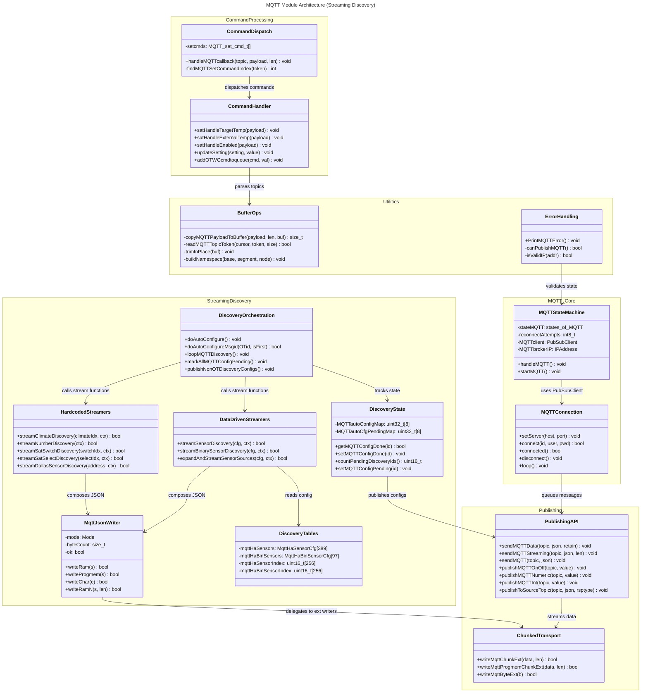

# C4 Code Level: MQTT Module

## Overview

- **Name**: MQTT Client and Home Assistant Auto-Discovery Module
- **Description**: Complete MQTT client implementation for the OTGW-firmware ESP8266/ESP32 gateway. Provides MQTT publish/subscribe functionality, streaming Home Assistant auto-discovery configuration, command handling, and OpenTherm message-to-MQTT mapping. Discovery architecture is data-driven streaming with two-pass JSON writing; OT-ID discovery is queued Just-In-Time when a valid frame of an unpublished ID arrives, and the drip publisher sends it (ADR-100). Default value topics use flat per-value scalars (ADR-101) under self-describing names (ADR-106), with a legacy compatibility toggle.
- **Location**: `/src/OTGW-firmware/MQTTstuff.ino`, `/src/OTGW-firmware/MQTTstuff.h`, `/src/OTGW-firmware/MQTTHaDiscovery.cpp`, `/src/OTGW-firmware/mqtt_discovery_verify.cpp`
- **Language**: Arduino C/C++ (with PubSubClient library integration)
- **Purpose**: Enables MQTT-based integration with home automation systems (Home Assistant), publishes OpenTherm data to configurable topics, handles MQTT commands for controlling the OTGW gateway, and manages streaming auto-discovery of sensors, binary sensors, climate entities, and SAT controls in Home Assistant.

## Code Elements

### Core State Management

#### Enumerations

- `enum states_of_MQTT { MQTT_STATE_INIT, MQTT_STATE_TRY_TO_CONNECT, MQTT_STATE_IS_CONNECTED, MQTT_STATE_WAIT_CONNECTION_ATTEMPT, MQTT_STATE_WAIT_FOR_RECONNECT, MQTT_STATE_ERROR }`
  - Description: State machine states for MQTT connection lifecycle
  - Location: MQTTstuff.ino:108
  - Usage: Controls the MQTT connection state transitions in `handleMQTT()`

#### Data Structures

- `struct MqttHaSensorCfg` (MQTTstuff.h)
  - Description: Sensor discovery config for a single OpenTherm message ID
  - Fields:
    - `uint8_t id`: OT message ID (0-255), or 244/245/246 pseudo-IDs (244=PIC controls, 245/246=S0/Dallas)
    - `uint8_t flags`: MQTT_HA_FLAG_* bit flags (source expansion, PIC entry, ADR-106 alias / legacy-replaced markers)
    - `PGM_P label`: Sensor label for MQTT topic (e.g., "TSet")
    - `PGM_P friendlyName`: Display name for Home Assistant
    - `HaDeviceClass deviceClass`: HA device class enum
    - `HaUnit unit`: HA unit of measurement enum
    - `HaStateClass stateClass`: HA state class enum
    - `HaIcon icon`: MDI icon enum
    - `HaEntityCat entityCat`: HA entity category enum (diagnostic, config)
    - `bool enabledByDefault`: Whether entity is enabled in HA by default
  - Location: MQTTstuff.h
  - Source: hand-written table in `MQTTHaDiscovery.cpp` (see ADR-077; `docs/archive/mqttha.cfg` is historical reference only)
  - Array: `mqttHaSensors[]` — covers OT messages plus the ADR-106 self-describing alias tail (non-contiguous; alias rows live outside the indexed range and are walked separately)

- `struct MqttHaBinSensorCfg` (MQTTstuff.h)
  - Description: Binary sensor discovery config
  - Fields: Similar to MqttHaSensorCfg, but without unit and stateClass
  - Location: MQTTstuff.h
  - Array: `mqttHaBinSensors[]` (binary OT status bits plus ADR-106 alias tail)

#### Discovery Flag Constants (MQTTstuff.h)

- `MQTT_HA_FLAG_SOURCE_SUFFIX` (0x01), `MQTT_HA_FLAG_SOURCE_NAME` (0x02), `MQTT_HA_FLAG_SOURCE_TOPIC_SEGMENT` (0x04): Source-expansion bits for `bSeparateSources`. `MQTT_HA_FLAG_ANY_SOURCE` (0x07) is the mask.
- `MQTT_HA_FLAG_IS_PIC_ENTRY` (0x08): Pseudo-ID 244 entries (resetgateway button + GPIO/LED selects). Self-skip when `isPICEnabled()` is false.
- `MQTT_HA_FLAG_IS_HA_CORE_ALIAS` (0x10): ADR-106 self-describing alias row. Published in new mode (default), skipped in legacy mode.
- `MQTT_HA_FLAG_LEGACY_REPLACED_BY_ALIAS` (0x20): ADR-106 legacy OT-spec name that has an alias replacement. Skipped in new mode, published in legacy mode.

- `struct HaDiscoveryContext` (MQTTstuff.h)
  - Description: Runtime context passed to streaming discovery functions
  - Fields:
    - `const char *nodeId`: Unique gateway ID
    - `const char *hostname`: Gateway hostname
    - `const char *version`: Firmware version
    - `const char *mqttPubTopic`: Publication namespace
    - `const char *mqttSubTopic`: Subscription namespace
    - `const char *haPrefix`: Home Assistant prefix (default "homeassistant")
    - `const char *manufacturer`: Hardware manufacturer
    - `const char *model`: Hardware model
    - `bool isFirstEntity`: First entity flag (for JSON array handling)
    - `const char *sourceSuffix`: Source suffix for per-source expansion (_thermostat, _boiler, _gateway)
    - `const char *sourceName`: Source friendly name (Thermostat, Boiler, Gateway)
    - `const char *sourceTopicSegment`: Source key (thermostat, boiler, gateway)
  - Location: MQTTstuff.h:244-258

- `struct MqttJsonWriter` (MQTTstuff.h)
  - Description: Two-mode JSON writer for streaming discovery payloads
  - Modes: MEASURE (size calculation only), WRITE (actual chunk output)
  - Methods:
    - `writeRam(const char *s)`: Write RAM data
    - `writeProgmem(PGM_P s)`: Write PROGMEM data via pgm_read_byte helpers
    - `writeChar(char c)`: Write single byte
    - `writeRamN(const char *s, size_t len)`: Write N bytes from RAM
  - Purpose: Avoid buffer reallocation; measure first, then write exactly that many bytes in chunks
  - Location: MQTTstuff.h:280-323

- `struct MQTT_set_cmd_t`
  - Description: Mapping of MQTT command topics to OTGW command codes
  - Fields:
    - `PGM_P setcmd`: MQTT command name (e.g., "setpoint")
    - `PGM_P otgwcmd`: OTGW command code (e.g., "TT" for setpoint)
    - `PGM_P ottype`: Value type (temperature, on/off, level, raw, etc.)
  - Location: MQTTstuff.ino
  - Array: `setcmds[]` PROGMEM dispatch table for standard OTGW commands

### Initialization & Connection

- `void startMQTT()`
  - Description: Initialize MQTT client and kick off connection state machine
  - Location: MQTTstuff.ino:571-593
  - Actions:
    - Returns if MQTT not enabled
    - Sets PubSubClient buffer size to `MQTT_CLIENT_BUFFER_SIZE` (384 bytes) for inbound messages
    - Initializes state to `MQTT_STATE_INIT`
    - Clears the discovery done and pending bitmaps and queues only the non-OT set via `publishNonOTDiscoveryConfigs()` (IDs 0, 27 and 241 to 255); `processOT()` queues other OT IDs JIT
    - Builds publish/subscribe topic namespaces
    - Calls `handleMQTT()` to begin connection attempt
  - Dependencies: PubSubClient, settings, WiFi

- `void handleMQTT()`
  - Description: Main MQTT state machine; call regularly from main loop
  - Location: MQTTstuff.ino:973-1145
  - State transitions:
    - `MQTT_STATE_INIT`: Resolve broker hostname to IP, configure PubSubClient
    - `MQTT_STATE_TRY_TO_CONNECT`: Attempt connection with credentials (if available)
    - `MQTT_STATE_IS_CONNECTED`: Maintain connection, call PubSubClient.loop()
    - `MQTT_STATE_WAIT_CONNECTION_ATTEMPT`: 3-second delay between retry attempts (after failed connection)
    - `MQTT_STATE_WAIT_FOR_RECONNECT`: 10-minute delay before retrying (after 5 failed attempts)
    - `MQTT_STATE_ERROR`: Invalid broker URL; wait before retry
  - Socket configuration:
    - Socket timeout: 15 seconds (increased from 4 for stability)
    - Keep-alive: 60 seconds (increased from 15 to reduce reconnections)
  - Parameters: None (uses global state)
  - Key timers: `timerMQTTwaitforconnect` (42s), `timerMQTTwaitforretry` (3s)
  - Dependencies: WiFi, PubSubClient, settings

### Callback & Message Handling

- `void handleMQTTcallback(char* topic, byte* payload, unsigned int length)`
  - Description: Incoming MQTT message handler; invoked by PubSubClient for subscribed topics
  - Location: MQTTstuff.ino:766-1014
  - Parameters:
    - `char* topic`: Incoming topic string
    - `byte* payload`: Raw payload bytes (not null-terminated)
    - `unsigned int length`: Payload byte count
  - Topic structure: `{topTopic}/set/{nodeId}/{command}` or special topics:
    - `homeassistant/status`: an `offline` sets `bHAcycle`; the next `online` clears it and calls `requestMQTTRepublishAll()`, so OT values re-publish as their frames arrive (ADR-174). Discovery is not touched.
  - Command families:
    - Standard MQTT commands: mapped via `findMQTTSetCommandIndex()` (setpoint, constant, outside temp, etc.)
    - SAT (Simple Auto Temp) commands: `sat/target`, `sat/indoor_temp`, `sat/outdoor_temp`, `sat/enabled`, `sat/control_mode`, etc.
    - Gateway commands: `otgw/reset_water_total` (any payload) calls `queueDHWWaterMeterReset()`, the MQTT half of `POST /api/v2/otgw/reset_water_total` (ADR-176, TASK-1123). The branch sits with `sat/` and `otgw32/` before the `hasOTCommandInterface()` gate, so every board accepts it. The callback runs on the loop task (`MQTTclient.loop()` in `handleMQTT()`, inside `doBackgroundTasks()`, which re-enters through `delayms()`), so it only raises the flag; `loop()` applies the reset in `handlePendingDHWWaterMeterReset()`
    - Settings updates: forwarded to `updateSetting()`
  - Actions:
    - Validates payload fits in 128-byte msgPayload buffer
    - Parses topic hierarchically: `topTopic → set → nodeId → command`
    - Dispatches to command handler or SAT function
    - Queues OTGW command via `addOTWGcmdtoqueue()`
  - Dependencies: strcasecmp_P, satHandle* functions, updateSetting, addOTWGcmdtoqueue
  - Re-entrance: Yes (called asynchronously by PubSubClient.loop())

- `int findMQTTSetCommandIndex(const char *topicToken)`
  - Description: Look up MQTT set command in command dispatch table
  - Location: MQTTstuff.ino:567-584
  - Parameters:
    - `const char *topicToken`: Command name to look up
  - Returns: Index into `setcmds[]` array if found, -1 if not found
  - Algorithm: Linear search through PROGMEM `setcmds` table, matching against both `setcmd` and `otgwcmd` names
  - Dependencies: setcmds (global PROGMEM table), strcasecmp_P

### Publishing & Data Transmission

- `void sendMQTTData(const char* topic, const char *json, const bool retain)`
  - Description: Send JSON payload to MQTT topic (RAM-based topic/payload)
  - Location: MQTTstuff.ino:1170-1199
  - Parameters:
    - `const char* topic`: Topic suffix (will be prefixed with `MQTTPubNamespace/`)
    - `const char *json`: JSON payload string (RAM)
    - `const bool retain`: Whether to retain message on broker
  - Implementation:
    - Validates MQTT enabled, broker connected, broker IP valid
    - Checks heap health via `canPublishMQTT()`
    - Builds full topic: `{MQTTPubNamespace}/{topic}`
    - Streams payload in 128-byte chunks via `beginPublish()`, `writeMqttChunk()`, `endPublish()`
    - Confirms publish slot allocation on success
    - Calls `feedWatchDog()` after completion
  - Return: void (failures logged internally)
  - Dependencies: MQTTclient, canPublishMQTT, feedWatchDog, PrintMQTTError
  - Re-entrance guard: None (but calling code may yield via feedWatchDog)

- `void sendMQTTData(const __FlashStringHelper *topic, const char *json, const bool retain)`
  - Description: Overload for PROGMEM topic with RAM payload
  - Location: MQTTstuff.ino:1201-1207
  - Wrapper: Converts topic from PROGMEM to RAM buffer, calls main `sendMQTTData()`

- `void sendMQTTData(const __FlashStringHelper *topic, const __FlashStringHelper *json, const bool retain)`
  - Description: Overload for PROGMEM topic and PROGMEM payload
  - Location: MQTTstuff.ino:1209-1243
  - Implementation:
    - Builds full topic in RAM buffer
    - Streams PROGMEM payload in 63-byte chunks via `writeMqttProgmemChunk()`
    - Calls `feedWatchDog()` between chunks
  - Dependencies: writeMqttProgmemChunk, pgm_read_byte, strlen_P

- `void sendMQTT(const char* topic, const char *json)`
  - Description: High-level publish with automatic retention (typically true)
  - Location: MQTTstuff.ino:1364-1366
  - Wrapper: Calls `sendMQTTStreaming()` with strlen(json)

- `void sendMQTTStreaming(const char* topic, const char *json, const size_t len)`
  - Description: Stream large JSON payloads in 128-byte chunks to avoid buffer reallocation
  - Location: MQTTstuff.ino:1368-1412
  - Parameters:
    - `const char* topic`: Topic (used as-is, no namespace prefix)
    - `const char *json`: Payload data pointer
    - `const size_t len`: Exact byte count of payload
  - Algorithm:
    - Begins publish with `beginMqttPublish(topic, len, retain=true)`
    - Writes `CHUNK_SIZE` (128) byte chunks via `MQTTclient.write()`
    - Feeds watchdog between chunks
    - Ends publish with `endPublish()`
  - Dependencies: MQTTclient, feedWatchDog, PrintMQTTError
  - Note: Different from `sendMQTTData()` — this publishes to topic as-is without namespace prefix

### Helper Publish Functions

- `void publishMQTTOnOff(const char* topic, bool value)`
- `void publishMQTTOnOff(const __FlashStringHelper* topic, bool value)`
  - Description: Publish boolean as "ON"/"OFF" string
  - Location: MQTTstuff.ino:1422-1428
  - Parameters: topic, boolean value
  - Implementation: Calls `sendMQTTData()` with conditional string

- `void publishMQTTNumeric(const char* topic, float value, uint8_t decimals = 2)`
- `void publishMQTTNumeric(const __FlashStringHelper* topic, float value, uint8_t decimals = 2)`
  - Description: Publish float as formatted string with configurable decimal places
  - Location: MQTTstuff.ino:1434-1444
  - Parameters: topic, float value, decimal precision
  - Implementation: Uses static RAM buffer (16 bytes), `dtostrf()` for conversion
  - Warning: Static buffer — not re-entrant

- `void publishMQTTInt(const char* topic, int value)`
- `void publishMQTTInt(const __FlashStringHelper* topic, int value)`
  - Description: Publish integer as string
  - Location: MQTTstuff.ino:1449-1459
  - Parameters: topic, integer value
  - Implementation: Uses static RAM buffer (12 bytes), `snprintf()` for conversion
  - Warning: Static buffer — not re-entrant

- `void publishToSourceTopic(const char* topic, const char* json, byte rsptype)`
  - Description: Publish to source-separated topic (e.g., topic/thermostat, topic/boiler, topic/gateway)
  - Location: MQTTstuff.ino:1483-1499
  - Parameters:
    - `const char* topic`: Base topic path
    - `const char* json`: Payload
    - `byte rsptype`: OpenTherm response type (OTGW_THERMOSTAT, OTGW_BOILER, OTGW_ANSWER_THERMOSTAT, OTGW_REQUEST_BOILER)
  - Re-entrance guard: Static `inUse` flag prevents nested calls from corrupting `sourceTopic` buffer
  - Algorithm:
    - Resolves source type from rsptype
    - Copies source key (thermostat/boiler/gateway) from `mqttSourceKeys` table
    - Appends source key to topic: `{topic}/{sourceKey}`
    - Calls `sendMQTTData()`
  - Dependencies: resolveSourceIndex, copySourceTableEntry, sendMQTTData, mqttSourceKeys

### State Information Publishing

- `void sendMQTTuptime()`
  - Description: Publish gateway uptime in seconds
  - Location: MQTTstuff.ino:1247-1252
  - Topic: `otgw-firmware/uptime`
  - Format: Decimal string (seconds)

- `void sendMQTTversioninfo()`
  - Description: Publish firmware/hardware version info
  - Location: MQTTstuff.ino:1257-1303
  - Published topics:
    - `otgw-firmware/version`: Semantic version
    - `otgw-firmware/reboot_count`: Reboot counter
    - `otgw-firmware/reboot_reason`: Last reset reason
    - `otgw-pic/version`: PIC firmware version (if PIC enabled)
    - `otgw-pic/deviceid`: PIC device ID (if PIC enabled)
    - `otgw-pic/firmwaretype`: PIC firmware type (if PIC enabled)
    - `otgw-pic/picavailable`: "ON"/"OFF"
    - `otgw-otdirect/*`: OT-direct status topics (OTGW32 only)
    - `otgw-firmware/board`: Board name
    - `otgw-firmware/hardware_mode`: Hardware mode
    - `otgw-firmware/network_mode`: Network mode (WiFi, Ethernet, etc.)

- `void sendDHWWaterTotal()`
  - Description: Publish the cumulative DHW water total (ADR-176, TASK-1123) that `dhwWaterMeter.ino` integrates from MsgID 19, now
  - Topic: `dhw_water_total`, litres with one decimal, not retained (the 1.x line's contract). Formatted with `snprintf_P` into a 24-byte buffer, so no total can write past it. Returns at once while MQTT is disabled
  - Called from: `publishDHWWaterMeter()` and `handlePendingDHWWaterMeterReset()` (dhwWaterMeter.ino), which publishes 0 after a reset even before the first MsgID 19 sample. The result of `sendMQTTData()` is not checked: while MQTT is disconnected or `canPublishMQTT()` is false the value is dropped, and for a reset nothing publishes the 0 again (the 60 s publish sends the total as it is then)

- `void publishDHWWaterMeter()`
  - Description: The 60 s publish of the DHW water total, so a restarted Home Assistant refills the entity within a minute
  - Called from: `doTaskEvery60s()` (OTGW-firmware.ino), right before `saveDHWWaterMeterIfDue()`
  - Gate: nothing is published until `dhwWaterMeterHasData()` is true, i.e. a MsgID 19 sample was taken on this boot (TASK-1123 AC#2); a total restored from `/dhw_water.json` alone does not count. Returns at once while MQTT is disabled. Then calls `sendDHWWaterTotal()`
  - Discovery (ADR-182): queues faux id 241 (`OTGWdhwmeterid`) while `getMQTTConfigDone(241)` is false, so the first publish after a sample announces the entity and a published config is not queued again every minute. `queueNonOTDiscoveryIds()` queues 241 only once a sample was taken, so the paths that clear the done bitmap (`startMQTT()`, the broker-restart branch of `onMqttConnect()`, `markAllMQTTConfigPending()`) announce it again only after one

- `void sendMQTTstateinformation()`
  - Description: Publish OpenTherm bus state information
  - Location: MQTTstuff.ino:1348-1355
  - Calls: `publishBoilerConnectedState()`, `publishThermostatConnectedState()`, `publishOTGWConnectedState()`

- `static void publishBoilerConnectedState()`
- `static void publishThermostatConnectedState()`
- `static void publishOTGWConnectedState()`
  - Description: Publish individual connection state flags
  - Location: MQTTstuff.ino:1305-1343
  - Topics published to multiple prefixes (base, otgw-pic/, otgw-otdirect/)

### Streaming JSON Writing (Two-Pass Architecture)

The MqttJsonWriter struct enables efficient streaming discovery payloads without buffer reallocation:

1. **MEASURE pass**: Writer accumulates byte count without MQTT I/O
2. **WRITE pass**: Writer streams exact bytes via chunk helpers

This approach allows discovery functions to compose JSON once and reuse the same code for both passes.

- `struct MqttJsonWriter` (MQTTstuff.h)
  - Description: Dual-mode JSON writer for streaming discovery payloads
  - Modes: MEASURE = 0 (size calculation), WRITE = 1 (actual output)
  - Public methods:
    - `writeRam(const char *s)`: Write null-terminated RAM string
    - `writeProgmem(PGM_P s)`: Write null-terminated PROGMEM string via pgm_read_byte
    - `writeChar(char c)`: Write single character
    - `writeRamN(const char *s, size_t len)`: Write N bytes from RAM
  - Workflow:
    1. Create writer in MEASURE mode: `MqttJsonWriter measure(MqttJsonWriter::MEASURE)`
    2. Compose JSON: `measure.writeRam(...), measure.writeChar(...), measure.writeProgmem(...)`
    3. Get size: `size_t sz = measure.byteCount`
    4. Begin MQTT publish: `client.beginPublish(topic, sz)`
    5. Create writer in WRITE mode: `MqttJsonWriter writer(MqttJsonWriter::WRITE)`
    6. Compose identical JSON (same code path): produces chunked output
    7. End publish: `client.endPublish()`
  - Location: MQTTstuff.h:280-323

- `bool writeMqttChunkExt(const char *data, size_t len)` (MQTTHaDiscovery.cpp)
  - Description: Write RAM data chunk to MQTT during WRITE pass
  - Location: MQTTHaDiscovery.cpp
  - Called by MqttJsonWriter.writeRam and writeRamN in WRITE mode
  - Chunking handled by underlying MQTT layer

- `bool writeMqttProgmemChunkExt(PGM_P data, size_t len)` (MQTTHaDiscovery.cpp)
  - Description: Write PROGMEM data chunk to MQTT during WRITE pass
  - Location: MQTTHaDiscovery.cpp
  - Uses pgm_read_byte for safe byte-by-byte PROGMEM access (no word-aligned reads)

- `bool writeMqttByteExt(uint8_t b)` (MQTTHaDiscovery.cpp)
  - Description: Write single byte to MQTT
  - Location: MQTTHaDiscovery.cpp
  - Called by MqttJsonWriter.writeChar in WRITE mode

### Buffer Management & Chunked Writing

The module avoids large heap allocations by streaming discovery payloads in small chunks. All writes go through two-mode MqttJsonWriter, which delegates to external chunk helpers in WRITE mode.

- `bool writeMqttChunkExt(const char *data, size_t len)` (MQTTHaDiscovery.cpp)
  - Description: Write RAM data to MQTT in chunks
  - Called by MqttJsonWriter.writeRam during WRITE pass
  - Handles chunking to PubSubClient.write()

- `bool writeMqttProgmemChunkExt(PGM_P data, size_t len)` (MQTTHaDiscovery.cpp)
  - Description: Write PROGMEM data to MQTT in chunks
  - Called by MqttJsonWriter.writeProgmem during WRITE pass
  - Uses pgm_read_byte for safe byte access (no unaligned 32-bit reads from flash)

- `bool writeMqttByteExt(uint8_t b)` (MQTTHaDiscovery.cpp)
  - Description: Write single byte to MQTT
  - Called by MqttJsonWriter.writeChar during WRITE pass

- `void resetMQTTBufferSize()`
  - Description: INTENTIONALLY A NO-OP (documented in code)
  - Location: MQTTstuff.ino
  - Rationale: Buffer is sized once at startup; no runtime resizing to avoid heap churn
  - Kept for API compatibility with existing discovery call sites

### Home Assistant Auto-Discovery (Streaming Architecture)

Discovery configs are generated on-the-fly by streaming functions in `MQTTHaDiscovery.cpp`. The previous file-based PROGMEM generation (mqttha.cfg parsed by tools/generate_mqttha_progmem.py into pools) has been replaced by data-driven tables (`mqttHaSensors[]`, `mqttHaBinSensors[]`) with corresponding streaming functions. Discovery includes hardcoded stream functions for climate (Thermostat + DHW Control pseudo-ID 0), number (Toutside Override pseudo-ID 27), SAT switches (13 boolean controls via switchIdx 0-12), SAT select (sat_heating_system pseudo-ID), Dallas sensors (runtime address-based), and PIC pseudo-ID 244 (button + GPIO/LED selects).

ADR-106 (self-describing topic names) splits sensor/binary-sensor rows into two parallel sets:
- Legacy OT-spec-derived names (e.g. `slave_member_id_code`) carry `MQTT_HA_FLAG_LEGACY_REPLACED_BY_ALIAS` when superseded.
- Self-describing alias rows (e.g. `manufacturer_code`) carry `MQTT_HA_FLAG_IS_HA_CORE_ALIAS` and live in a non-contiguous tail past the indexed range.

`settings.mqtt.bUseLegacyOtTopics` (default `false`) selects which set is published. Toggling the flag arms an idempotent cleanup pass (`armAdr106Cleanup()` / drain loop in MQTTstuff.ino) that retains-cleans the 37 retained discovery topics of the *other* set on the broker. The two sets are mutually exclusive — never both at the same time.

Discovery paths (ADR-100 JIT-by-default):

**Path B (JIT, default)**: `processOT()` (OTGW-Core.ino) sets the pending bit of an OT ID when a valid frame arrives and the ID is not yet marked published. It publishes nothing itself; the drip (Path C) publishes the configs on a later tick. `ensurePSSummaryDiscovery()` (PS=1 summary fields, OTGW-Core.ino) and `pollSensors()` (Dallas pseudo-ID 246, sensors_ext.ino:238-240) queue their IDs the same way. JIT keeps the bulk publish off the boot path, unless a topology migration is pending. It does not keep configs of never-seen IDs off the broker: every call to `markAllMQTTConfigPending()` queues all table IDs, and the daily re-announce (ADR-170, Proposed) makes that call once a day by default.

**Path C (Drip)**: `loopMQTTDiscovery()` publishes the configs of one pending ID per timer tick (2 s normal, 10 s under heap pressure). It is the only caller of `doAutoConfigureMsgid()` (MQTTstuff.ino:2200). It drains whatever sits in the pending bitmap: the JIT IDs of Path B; the non-OT set (IDs 0, 27 and 241 to 255) that `publishNonOTDiscoveryConfigs()` queues at MQTT start and on a reconnect after more than 5 minutes offline; and the full set from `markAllMQTTConfigPending()`, which is every ID with a discovery table entry, seen on the bus or not, plus the non-OT set. Its callers are listed under `markAllMQTTConfigPending()` below.

**Path A (Force)**: `doAutoConfigure()` no longer streams the tables inline. It calls `markAllMQTTConfigPending()` and leaves the publishing to the drip (Path C). Callers: telnet `F` and `POST /api/v2/otgw/discovery`.

`mqtt_discovery_verify.cpp` runs the on-demand retained-discovery verify (ADR-062): a subscribe window of up to 15 seconds that counts retained configs. When a run that was not aborted finds some missing, it calls `markAllMQTTConfigPending()`. Since ADR-170 it has no automatic caller; only `POST /api/v2/discovery/verify` and telnet `V` start it.

- `bool streamSensorDiscovery(PubSubClient &client, const MqttHaSensorCfg &cfg, HaDiscoveryContext &ctx)`
  - Description: Stream a single sensor discovery config to MQTT
  - Location: MQTTHaDiscovery.cpp:1979+
  - Parameters:
    - `PubSubClient &client`: MQTT client instance
    - `const MqttHaSensorCfg &cfg`: Sensor config from mqttHaSensors[] table
    - `HaDiscoveryContext &ctx`: Runtime values (nodeId, hostname, version, etc.)
  - Algorithm:
    - Builds discovery topic from haPrefix, sensor label, nodeId
    - Uses MqttJsonWriter in MEASURE mode to calculate payload size
    - Begins MQTT publish with calculated size
    - Uses MqttJsonWriter in WRITE mode to emit JSON (name, unit_of_measurement, device_class, state_class, icon, value_template, stat_t, unique_id, device)
    - Handles source-separated variants via expandAndStreamSensorSources if flag set
  - Return: true if published successfully
  - Dependencies: MqttJsonWriter, writeMqttChunkExt, expandAndStreamSensorSources

- `bool streamBinarySensorDiscovery(PubSubClient &client, const MqttHaBinSensorCfg &cfg, HaDiscoveryContext &ctx)`
  - Description: Stream a single binary sensor discovery config
  - Location: MQTTHaDiscovery.cpp:similar pattern
  - Similar to streamSensorDiscovery but omits unit and state_class

- `bool streamClimateDiscovery(PubSubClient &client, uint8_t climateIdx, HaDiscoveryContext &ctx)`
  - Description: Stream climate entity discovery (Thermostat or DHW Control)
  - Location: MQTTHaDiscovery.cpp:2240+
  - Parameters:
    - `uint8_t climateIdx`: 0 = Thermostat, 1 = DHW Control
  - Generates hardcoded JSON with modes, temp setpoint, current temp, etc.

- `bool streamNumberDiscovery(PubSubClient &client, HaDiscoveryContext &ctx)`
  - Description: Stream number entity discovery (Toutside Override)
  - Location: MQTTHaDiscovery.cpp:2417+
  - Single hardcoded number entity for external temperature override

- `bool streamSatSwitchDiscovery(PubSubClient &client, uint8_t switchIdx, HaDiscoveryContext &ctx)`
  - Description: Stream SAT boolean switch discovery (13 switches)
  - Location: MQTTHaDiscovery.cpp:2596+
  - Parameters:
    - `uint8_t switchIdx`: 0-12 for each SAT boolean control
  - Uses helper streamSatBoolSwitch() with parameterised PROGMEM strings (uniqSuffix, nameSuffix, cmdSub, statSub, icon)
  - Topic object-ids derived from uniqSuffix at runtime (strip leading '-', swap '-' to '_')

- `bool streamSatSelectDiscovery(PubSubClient &client, uint8_t selectIdx, HaDiscoveryContext &ctx)`
  - Description: Stream SAT select entity discovery
  - Location: MQTTHaDiscovery.cpp
  - Currently: selectIdx = 0 for sat_heating_system dropdown

- `bool streamButtonDiscovery(PubSubClient &client, HaDiscoveryContext &ctx)`
  - Description: Stream HA button discovery for the PIC `resetgateway` action (pseudo-ID 244).
  - Location: MQTTHaDiscovery.cpp
  - Notes: TASK-668 hardens the `resetgateway` MQTT handler — only payload `"1"` triggers, and a rate-limit cooldown prevents accidental rapid PIC resets.

- `bool streamSelectDiscovery(PubSubClient &client, uint8_t selectIdx, HaDiscoveryContext &ctx)`
  - Description: Stream HA select discovery for PIC GPIO and LED function choosers (pseudo-ID 244). `selectIdx`: 0=gpioa, 1=gpiob, 2..7=leda..ledf.
  - Location: MQTTHaDiscovery.cpp

- `bool streamDallasSensorDiscovery(PubSubClient &client, const char *sensorAddress, HaDiscoveryContext &ctx)`
  - Description: Stream Dallas temperature sensor discovery
  - Location: MQTTHaDiscovery.cpp:similar pattern
  - Parameters:
    - `const char *sensorAddress`: Runtime sensor address string
  - Generated on first sensor discovery call; topic includes address in uniq_id

- `bool expandAndStreamSensorSources(PubSubClient &client, const MqttHaSensorCfg &cfg, HaDiscoveryContext &ctx)`
  - Description: Expand sensor config into 3 per-source variants (thermostat/boiler/gateway)
  - Location: MQTTHaDiscovery.cpp:2180+
  - Iterates 3 sources, sets source tokens in ctx, calls streamSensorDiscovery for each

- `void doAutoConfigure()`
  - Description: Force a re-announce of all Home Assistant discovery configs through the drip
  - Location: MQTTstuff.ino:2511-2520
  - Intended use: Explicit utility (telnet `F`, `POST /api/v2/otgw/discovery`)
  - Algorithm:
    - Returns at once when MQTT is disabled
    - Calls `markAllMQTTConfigPending()`; `loopMQTTDiscovery()` then publishes one pending ID per tick
  - Dependencies: markAllMQTTConfigPending, loopMQTTDiscovery

- `bool doAutoConfigureMsgid(byte OTid, bool isFirst)`
  - Description: Publish every Home Assistant discovery config that belongs to one ID
  - Location: MQTTstuff.ino:2579-2743
  - Caller: only `loopMQTTDiscovery()` (MQTTstuff.ino:2200), for one pending ID per drip tick (Path C). JIT (Path B) only queues the ID.
  - Parameters:
    - `byte OTid`: OpenTherm message ID, or a pseudo-ID from 241 to 255
    - `bool isFirst`: the drip passes `dripDeviceInfoPending`, so the first entity published after a queue fill carries the full device block (ADR-140)
  - Algorithm:
    - OTid = 246 (Dallas): calls `configSensors()` and returns true
    - Returns false when the discovery session lock is taken, MQTT is disabled or disconnected, the broker IP is invalid, or free heap is below `MQTT_DISCOVERY_HEAP_MIN` (2048 bytes on ESP32, from `boards.h`)
    - Streams the sensor and binary-sensor table rows of the ID via `streamSensorDiscovery()` / `streamBinarySensorDiscovery()`, with the ADR-106 mode filter; in the modern topology real OT IDs (0 to 127) get one pass per device (Boiler, Thermostat)
    - OTid = 0: also both climate entities, the SAT switches and the SAT select
    - OTid = 27: also the outside-temperature override number
    - OTid = 1, 8, 9, 14, 16, 39, 56 or 57: also an override sensor (ADR-118)
    - OTid = 244: also the PIC button and eight selects; OTid = 255: the SAT zone discovery
  - Return: true if any config of the ID was published; the ID 244 button and selects count only when all nine were
  - Does not set the done bit. The drip sets it when this returns true (MQTTstuff.ino:2201-2203); for ID 246, `configSensors()` sets it (sensors_ext.ino:218)
  - Dependencies: All streaming functions, configSensors

### Discovery State Management

Two bitmaps track discovery state: `MQTTautoConfigMap[8]` (published/done) and `MQTTautoCfgPendingMap[8]` (needs publishing). Both are 8 x uint32_t = 256 bits, one per OT message ID.

- `bool getMQTTConfigDone(const uint8_t MSGid)`
  - Description: Check if discovery config has been published for a message ID
  - Location: MQTTstuff.ino:1936-1939
  - Implementation:
    - Splits MSGid into group (bits 7-5) and index (bits 4-0)
    - Reads bit from `MQTTautoConfigMap[group]` at index position
  - Returns: true if bit set (config published), false otherwise

- `void setMQTTConfigDone(const uint8_t MSGid)`
  - Description: Mark discovery config as published for a message ID
  - Location: MQTTstuff.ino:1941-1944
  - Implementation: Splits MSGid, sets bit in `MQTTautoConfigMap[group]`

- `void clearMQTTConfigDone()`
  - Description: Clear all discovery configuration flags and reset `state.discovery.iPublishedTopicCount`
  - Location: MQTTstuff.ino:1946-1952
  - Usage: Called from `startMQTT()`, from the connect handler after more than 5 minutes offline, and from `markAllMQTTConfigPending()`. Not called on a Home Assistant restart (ADR-174).
  - Rationale: Lets JIT and the drip re-publish discovery configs when the broker may have lost them

- `void setMQTTConfigPending(const uint8_t MSGid)`
  - Description: Mark a message ID as needing its discovery config (re-)published
  - Location: MQTTstuff.ino:2021-2026
  - Implementation: Sets bit in `MQTTautoCfgPendingMap[group]`

- `uint16_t countPendingDiscoveryIds()`
  - Description: Count the IDs whose pending bit is set
  - Location: MQTTstuff.ino:261-268
  - Usage: `pending_ids` in `GET /api/v2/discovery`, and the "no drip pending" precondition of the verify and of the daily re-announce

- `void clearMQTTConfigPending()`
  - Description: Clear the whole pending bitmap (there is no per-ID variant)
  - Location: MQTTstuff.ino:1958-1961
  - Usage: `startMQTT()`, the connect handler after more than 5 minutes offline, and `emergencyHeapRecovery()` (helperStuff.ino:1049)

- `void markAllMQTTConfigPending()`
  - Description: Mark every ID present in the PROGMEM discovery tables as pending for async drip publish, whether or not it was seen on the bus
  - Location: MQTTstuff.ino:2029-2057
  - Algorithm:
    - Arms the TASK-648 topology cleanup when the stored topology stamp differs from the current mode
    - Clears both published and pending bitmaps
    - Walks IDs 0-255 and sets the pending bit for each ID with a sensor or binary-sensor index entry
    - Calls `queueNonOTDiscoveryIds()` for the non-OT set (0, 27 and 241 to 255), the same helper `publishNonOTDiscoveryConfigs()` uses (ADR-171, Proposed). The table walk skips 241, the DHW water total: the helper queues it only once a MsgID 19 sample was taken on this boot (ADR-182, just in time as on the 1.x line)
  - Usage: `doAutoConfigure()` (telnet `F`, `POST /api/v2/otgw/discovery`), `POST /api/v2/discovery/republish`, the daily re-announce (ADR-170), a verify run that found missing configs, an `MQTTuseLegacyOtTopics` toggle and a pending topology migration. Not called on MQTT connect or on a Home Assistant restart.

- `void loopMQTTDiscovery()`
  - Description: Async drip publisher for MQTT discovery configs; called from the main loop on every iteration
  - Location: MQTTstuff.ino:2122-2217
  - Algorithm:
    - Manages its own timer internally (no external timer registration)
    - Adaptive interval: 2 s when heap is healthy, 10 s under heap pressure. Pressure means free heap below 16384 bytes and largest free block below 8192 bytes. Restore needs two consecutive ticks with free heap of at least 18432 bytes and a largest block of at least 9216 bytes. Either switch waits at least one full interval in the current mode.
    - Returns without publishing when MQTT is disabled or disconnected, or free heap is below `MQTT_DISCOVERY_HEAP_MIN`
    - Skips the tick during a Status-frame burst or its cooldown (counted in `drip_burst_skip` / `drip_cooldown_skip`)
    - On each timer tick, scans `MQTTautoCfgPendingMap` for the next set bit
    - Skips already-published IDs (checks `getMQTTConfigDone()`)
    - Dallas sensor pseudo-ID handled via `configSensors()` call
    - Calls `doAutoConfigureMsgid()` for one pending ID per tick; it is that function's only caller
    - On success sets the done bit and clears the pending bit; on failure keeps the pending bit so the next tick retries (TASK-348)
    - One attempt per tick (spreads broker load over time)
  - Constants:
    - `DISCOVERY_INTERVAL_NORMAL`: 2 seconds
    - `DISCOVERY_INTERVAL_SLOW`: 10 seconds
    - `DRIP_RESTORE_K_TICKS`: 2 healthy ticks before restoring the normal interval
    - `MQTT_DISCOVERY_HEAP_MIN`: 2048 bytes minimum free heap (`boards.h`)
  - Dependencies: MQTTautoCfgPendingMap, doAutoConfigureMsgid, configSensors, platformFreeHeap, platformMaxFreeBlock

### Error Handling & Debugging

- `void PrintMQTTError()`
  - Description: Log human-readable MQTT error message from PubSubClient state
  - Location: MQTTstuff.ino:1147-1163
  - Translates error codes:
    - MQTT_CONNECTION_TIMEOUT
    - MQTT_CONNECTION_LOST
    - MQTT_CONNECT_FAILED
    - MQTT_DISCONNECTED
    - MQTT_CONNECTED
    - MQTT_CONNECT_BAD_PROTOCOL
    - MQTT_CONNECT_BAD_CLIENT_ID
    - MQTT_CONNECT_UNAVAILABLE
    - MQTT_CONNECT_BAD_CREDENTIALS
    - MQTT_CONNECT_UNAUTHORIZED
  - Output: Debug telnet via `MQTTDebugTln()`

### Topic & Namespace Building

- `static void buildNamespace(char *dest, size_t destSize, const char *base, const char *segment, const char *node)`
  - Description: Build hierarchical MQTT topic namespace
  - Location: MQTTstuff.ino:359-370
  - Parameters:
    - `const char *base`: Base topic (e.g., "OTGW")
    - `const char *segment`: Segment (e.g., "value" or "set")
    - `const char *node`: Node ID (unique identifier)
  - Output format: `{base}/{segment}/{node}`
  - Special handling: Removes trailing slash from base if present
  - Usage: Called in `startMQTT()` to build `MQTTPubNamespace` and `MQTTSubNamespace`

- `static void trimInPlace(char *buffer)`
  - Description: Trim whitespace from both ends of string (in-place)
  - Location: MQTTstuff.ino:112-125
  - Handles leading and trailing whitespace via `isspace()`

### Payload & Topic Parsing

- `static size_t copyMQTTPayloadToBuffer(const byte *payload, unsigned int length, char *dest, size_t destSize)`
  - Description: Copy raw MQTT payload bytes to null-terminated string buffer
  - Location: MQTTstuff.ino:372-381
  - Parameters: raw payload, length, destination buffer, buffer size
  - Returns: Number of bytes copied
  - Handling: Truncates if payload exceeds buffer capacity

- `static bool readMQTTTopicToken(const char *&cursor, char *token, size_t tokenSize)`
  - Description: Parse next topic segment from topic path
  - Location: MQTTstuff.ino:383-450
  - Parameters:
    - `const char *&cursor`: Topic cursor (advanced by function)
    - `char *token`: Output token buffer
    - `size_t tokenSize`: Token buffer size
  - Algorithm:
    - Skips leading slashes
    - Reads until next slash or end-of-string
    - Null-terminates token
  - Returns: true if token extracted, false if end-of-string or buffer overflow

- `static bool parseAutoConfigLine(char *sIn, char del, void *viewPtr)`
  - Description: Parse mqttha.cfg line format: `id;topicTemplate;msgTemplate`
  - Location: MQTTstuff.ino:127-156
  - Parameters:
    - `char *sIn`: Config file line (modified in-place; delimiters replaced with null)
    - `char del`: Delimiter character (typically `;`)
    - `void *viewPtr`: Output view pointer (cast to MQTTAutoConfigLineView)
  - Algorithm:
    - Finds and removes `//` comments
    - Trims whitespace
    - Splits by delimiter into 3 parts: id, topicTemplate, msgTemplate
    - Validates non-empty parts
    - Trims each part individually
  - Returns: true if valid line parsed, false on parse error
  - Output: Populates view with id, topicTemplate, msgTemplate pointers (into sIn buffer)

### Source Mapping

- `static void initSourceTokens()`
  - Description: Initialize source token strings from PROGMEM into module-level static buffers
  - Location: MQTTstuff.ino:456-466
  - Tokens initialized:
    - `s_sourceSuffixToken`: `%source_suffix%`
    - `s_sourceNameToken`: `%source_name%`
    - `s_sourceTopicSegmentToken`: `%source_topic_segment%`
  - Rationale: Avoid repeated PROGMEM reads in hot loops
  - Guard: Static `initialized` flag prevents re-initialization

- `static bool resolveSourceIndex(byte rsptype, uint8_t &sourceIndex)`
  - Description: Map OpenTherm response type to source index
  - Location: MQTTstuff.ino:1463-1471
  - Mapping:
    - OTGW_THERMOSTAT → 0 (thermostat)
    - OTGW_BOILER → 1 (boiler)
    - OTGW_ANSWER_THERMOSTAT → 1 (boiler side, OTGW answers as boiler)
    - OTGW_REQUEST_BOILER → 2 (gateway)
  - Returns: false for invalid/parity error types

- `static bool copySourceTableEntry(const char* const table[], uint8_t sourceIndex, char *dest, size_t destSize)`
  - Description: Copy PROGMEM source table entry to RAM buffer
  - Location: MQTTstuff.ino:1473-1481
  - Parameters:
    - `const char* const table[]`: PROGMEM pointer array (mqttSourceKeys, mqttSourceSuffixes, or mqttSourceNames)
    - `uint8_t sourceIndex`: Index into table (0-2)
    - `char *dest`: Destination RAM buffer
    - `size_t destSize`: Buffer size
  - Implementation: Reads pointer from PROGMEM table, copies string via `strncpy_P()`

### Global State Variables

- `static PubSubClient MQTTclient(wifiClient)`: PubSubClient instance for MQTT communication
- `static IPAddress MQTTbrokerIP`: Resolved broker IP address
- `static char MQTTbrokerIPchar[20]`: String representation of broker IP
- `enum states_of_MQTT stateMQTT`: Current MQTT state machine state
- `int8_t reconnectAttempts`: Connection retry counter
- `char lastMQTTtimestamp[15]`: Last MQTT timestamp string
- `static char MQTTclientId[MQTT_ID_MAX_LEN]`: Client ID (hostname + MAC)
- `static char MQTTPubNamespace[MQTT_NAMESPACE_MAX_LEN]`: Publication topic namespace
- `static char MQTTSubNamespace[MQTT_NAMESPACE_MAX_LEN]`: Subscription topic namespace
- `static char NodeId[MQTT_ID_MAX_LEN]`: Unique node ID from settings
- `static bool mqttAutoConfigInProgress`: Lock flag for auto-discovery buffer access
- `uint32_t MQTTautoCfgPendingMap[8]`: Bitmap of OT IDs pending async drip discovery publish
- `bool bHAcycle`: Home Assistant online/offline cycle flag
- `const char* const mqttSourceKeys[] PROGMEM`: Source key strings (thermostat/boiler/gateway)
- `const char* const mqttSourceSuffixes[] PROGMEM`: Source suffix strings (_thermostat/_boiler/_gateway)
- `const char* const mqttSourceNames[] PROGMEM`: Source friendly names (Thermostat/Boiler/Gateway)
- `const MQTT_set_cmd_t setcmds[] PROGMEM`: MQTT command dispatch table

### Constants

- `MQTT_ID_MAX_LEN`: 96 bytes
- `MQTT_NAMESPACE_MAX_LEN`: 192 bytes
- `MQTT_TOPIC_MAX_LEN`: 200 bytes
- `MQTT_CLIENT_BUFFER_SIZE`: 384 bytes (PubSubClient inbound buffer)
- `MQTT_HA_SENSOR_COUNT`, `MQTT_HA_BINSENSOR_COUNT`: total entries in the two discovery tables (varies with ADR-106 alias tail; see `MQTTHaDiscovery.cpp` for the authoritative size)
- `MQTT_HA_INDEX_NONE`: 0xFFFF (sentinel for no discovery entry in index table)
- `DISCOVERY_INTERVAL_NORMAL`: 2 seconds (drip publisher interval, healthy heap)
- `DISCOVERY_INTERVAL_SLOW`: 10 seconds (drip publisher interval under heap pressure)
- `MQTT_DISCOVERY_HEAP_MIN`: 2048 bytes (minimum free heap for discovery publish, from `boards.h`)
- `MQTT_REPUBLISH_OFFLINE_THRESHOLD_MS`: 300000 ms (5 minutes). A reconnect after a longer outage resets the value trackers and the discovery state. After a shorter one the connect handler does nothing more; a WiFi reconnect by `loopWifi()` (`WIFI_RECONNECTED`) still runs `startMQTT()`, which resets the discovery state.

## Dependencies

### Internal Dependencies

- **OTGW-Core.h**: Core data structures (OTGWSettings, OTGWState), OpenTherm message types
- **safeTimers.h**: Timer macros (DECLARE_TIMER_SEC, DUE, RESTART_TIMER)
- **WiFi (ESP8266WiFiClient)**: `wifiClient` global for MQTT socket
- **mqttha_progmem.cpp/h**: Auto-generated PROGMEM discovery tables (replaces LittleFS `/mqttha.cfg` file scan)
- **Debug functions**: DebugTln, DebugTf, DebugT, Debug, DebugFlush (telnet debug output)
- **Utility functions**:
  - `feedWatchDog()`: Keep watchdog alive during long operations
  - `addOTWGcmdtoqueue()`: Queue commands to OTGW PIC processor
  - `updateSetting()`: Update runtime settings
  - `canPublishMQTT()`: Check heap health before publish
  - `confirmMQTTPublishSlot()`: Confirm throttle slot on successful publish
  - `isPICEnabled()`, `isOTDirectEnabled()`: Feature availability checks
  - `CSTR()`, `CBOOLEAN()`, `CCONOFF()`, `CONLINEOFFLINE()`: Macro conversions
  - `isValidIP()`: Validate IP address
  - `replaceAll()`: String replacement in buffer
  - `requestMQTTRepublishAll()`: Reset the OT value trackers so each value re-publishes when its frame next arrives
  - `publishAllPICsettings()`: Republish PIC settings on reconnect

### External Dependencies

- **PubSubClient** (Nick O'Leary): MQTT client library
  - Usage: `MQTTclient.connect()`, `MQTTclient.publish()`, `MQTTclient.subscribe()`, `MQTTclient.loop()`, `MQTTclient.state()`, `MQTTclient.setServer()`, `MQTTclient.setCallback()`, `MQTTclient.setBufferSize()`, `MQTTclient.setSocketTimeout()`, `MQTTclient.setKeepAlive()`
  - Version: Compatible with ESP8266 (library handles socket operations)

- **Arduino/ESP8266 Core**:
  - `<ctype.h>`: `isspace()`, `isalnum()`
  - `<pgmspace.h>`: PROGMEM macros, `pgm_read_byte()`, `strlen_P()`, `strcpy_P()`, `strncpy_P()`, `strcasecmp_P()`, `strstr_P()`, `memcmp_P()`
  - `string.h`: `strlen()`, `memcpy()`, `memmove()`, `strlcpy()`, `strlcat()`, `strcpy()`, `strncpy()`, `strncat()`, `strcasecmp()`, `strstr()`
  - `stdio.h`: `snprintf()`, `snprintf_P()`
  - `stdlib.h`: `dtostrf()`, `strtoul()`
  - WiFi: `WiFi.hostByName()`, `WiFi.macAddress()`

## Key Behaviors & Patterns

### MQTT State Machine

The module implements a 6-state state machine for MQTT connection management:

1. **MQTT_STATE_INIT**: Resolve broker hostname to IP, validate configuration
2. **MQTT_STATE_TRY_TO_CONNECT**: Attempt connection with credentials
3. **MQTT_STATE_IS_CONNECTED**: Maintain connection via `MQTTclient.loop()`
4. **MQTT_STATE_WAIT_CONNECTION_ATTEMPT**: 3-second backoff between attempts
5. **MQTT_STATE_WAIT_FOR_RECONNECT**: 10-minute backoff after 5 failed attempts
6. **MQTT_STATE_ERROR**: Invalid broker configuration (waits 10 minutes before retry)

States are managed by `handleMQTT()` which should be called regularly from the main loop.

### Chunked MQTT Publishing

All MQTT publishes use chunked transmission to prevent heap fragmentation:

- **RAM data**: 128-byte chunks via `writeMqttChunk()`
- **PROGMEM data**: 63-byte chunks via `writeMqttProgmemChunk()`
- **Streaming templates**: Rendered and sent in chunks via `sendMQTTTemplateStreaming()`

PubSubClient's `beginPublish()` → `write()` → `endPublish()` API allows efficient buffering without heap reallocation.

### Home Assistant Auto-Discovery (Streaming Architecture)

Discovery configs are generated on-the-fly by streaming functions in `MQTTHaDiscovery.cpp` that use the two-pass MqttJsonWriter. Configs are driven by:

- `mqttHaSensors[]` + sensor index table — OT message sensors plus ADR-106 self-describing alias tail (non-contiguous, walked separately)
- `mqttHaBinSensors[]` + binary sensor index table — OT message binary sensors plus ADR-106 alias tail
- Hardcoded streaming functions: `streamClimateDiscovery()`, `streamNumberDiscovery()`, `streamSatSwitchDiscovery()`, `streamSatSelectDiscovery()`, `streamDallasSensorDiscovery()`, `streamButtonDiscovery()` (PIC resetgateway), `streamSelectDiscovery()` (PIC GPIO/LED selects)

ADR-100 makes JIT the default production path. The module supports three publication paths:

**Path B (JIT, default)**: `processOT()` queues an OT ID when a valid frame arrives and the ID is not yet marked published; the drip (Path C) publishes it.
- `processOT()` (OTGW-Core.ino) only sets the pending bit; it never calls `doAutoConfigureMsgid()`
- `ensurePSSummaryDiscovery()` (PS=1 summary) and `pollSensors()` (Dallas, pseudo-ID 246) queue the same way
- An ID marked published is not queued again until something clears the done bitmap
- Keeps never-seen IDs out of the boot-time queue, unless a topology migration is pending. It does not keep their configs off the broker: every `markAllMQTTConfigPending()` call, the daily re-announce included, queues all table IDs

**Path C (Drip)**: `loopMQTTDiscovery()` publishes whatever sits in the pending bitmap.
- Calls `doAutoConfigureMsgid()`, its only caller. That function looks up the ID in the sensor and binary-sensor index tables and streams the rows, with the ADR-106 mode filter (legacy or alias row, never both). ID 0 adds climate and the SAT switches and select, 27 the override number, 244 the PIC button and selects, 255 the SAT zone; ID 246 (Dallas) goes to `configSensors()`
- Called from main loop on every iteration; manages its own internal timer
- Publishes exactly one pending ID per timer tick (2 s normal, 10 s under heap pressure); one ID can carry several configs
- Uses `MQTTautoCfgPendingMap[8]` bitmap (8 x uint32_t = 256 bits) to track pending OT IDs and pseudo-IDs
- `publishNonOTDiscoveryConfigs()` fills it with the non-OT set only (IDs 0, 27 and 241 to 255): at MQTT start and on a reconnect after more than 5 minutes offline
- `markAllMQTTConfigPending()` fills it with every ID that has a discovery table entry, seen on the bus or not, plus the non-OT set; its callers are listed in its Usage line under Discovery State Management
- Spreads discovery publishes over time to avoid broker and heap pressure spikes
- Adaptive interval: slows to 10 s when free heap is below 16384 bytes and the largest free block below 8192 bytes; restores to 2 s after two consecutive ticks with at least 18432 bytes free and a 9216-byte block
- Guards against low heap via the `MQTT_DISCOVERY_HEAP_MIN` (2048 bytes) check before each publish

**Path A (Force)**: `doAutoConfigure()` calls `markAllMQTTConfigPending()` and returns; the drip (Path C) does the publishing.
- Reserved for explicit refresh via telnet `F` or `POST /api/v2/otgw/discovery`
- The ADR-106 mode filter is applied per ID inside `doAutoConfigureMsgid()`, as on the other paths

**Path B is the default** way OT IDs get queued. Path C publishes everything that is queued: JIT IDs, the non-OT set, broker-restart recovery, the manual force and the daily re-announce. Path A is an explicit utility that feeds Path C.

### Source-Separated Topics

OpenTherm messages can originate from three "sources":
- **Thermostat**: Master (initiates communication)
- **Boiler**: Slave (responds to master)
- **Gateway**: OTGW itself (when modifying commands)

When `settings.mqtt.bSeparateSources` is enabled:
- Each data value is published to separate subtopics: `topic/thermostat`, `topic/boiler`, `topic/gateway`
- Home Assistant discovery configs expand 1 template into 3 entity variants
- Allows Home Assistant to attribute values to the correct device

Detection: Template lines in `mqttha.cfg` containing `%source_suffix%`, `%source_name%`, or `%source_topic_segment%` are treated as source templates.

### Home Assistant Status Monitoring

The module subscribes to `homeassistant/status` topic to detect Home Assistant lifecycle events:

- **Offline**: sets `bHAcycle`
- **Online** while `bHAcycle` is set: clears the flag and calls `requestMQTTRepublishAll()` (ADR-174). That resets the OT value trackers and forces the next Status and StatusVH frames, so every OT value, `hvac_mode` and `hvac_action` included, re-publishes as its frame arrives. It does not touch discovery: no `clearMQTTConfigDone()`, no pending re-queue, because the broker retains the configs.
- **Online** without a preceding offline (for example a retained birth message replayed on reconnect): only a telnet debug line
- `bHaRebootDetect` (`mqttharebootdetection`) is deprecated and gates nothing; it is still parsed and written so existing settings files load
- SAT and BLE `sat/*` topics are outside this reset and wait for their own heartbeat (up to 11 minutes)

### Buffer Management (ADR-053)

The module uses a single global buffer for auto-discovery:

- **cMsg (global)**: 512-byte general-purpose scratch, reused as `sTopic` (rendered topic up to 200 bytes) during discovery
  - Safe because template pointers (topicTemplate/msgTemplate) point into PROGMEM pools, not `cMsg`
  - Guard: `feedWatchDog()` is the only yield during discovery, so no HTTP/MQTT callback overwrites cMsg mid-use

The former `sLine[1200]` global buffer has been eliminated. Discovery templates are read directly from PROGMEM pools (`mqttHaTopicPool`, `mqttHaMsgPool`) which are memory-mapped flash on ESP8266, byte-accessible via pointer dereference. No RAM staging buffer is needed for template data.

Lock is RAII (released by `MQTTAutoConfigSessionLock` destructor).

### Command Processing

Incoming MQTT commands follow the topic structure:
```
{topTopic}/set/{nodeId}/{command}[/{subcommand}]
```

**Standard OTGW commands** (e.g., `setpoint`, `outside_temp`) are mapped via the `setcmds[]` dispatch table to OTGW command codes (e.g., `TT`, `OT`), then queued to the PIC via `addOTWGcmdtoqueue()`.

**PIC reset (`resetgateway`)** — hardened in TASK-668. The handler ignores any payload other than literal `"1"` and enforces a cooldown rate-limit; both reasons are surfaced in the MQTT debug stream so silently-dropped attempts are visible during integration. Exposed as an HA button via `streamButtonDiscovery()` (pseudo-ID 244).

**SAT (Smart Adaptive Thermostat) commands** are a special family handled directly:
- `sat/target`: Set target temperature
- `sat/enabled`: Enable/disable SAT
- `sat/control_mode`: Set control mode
- Plus many others for tuning and calibration

All commands are validated, payload length checked, and invalid payloads rejected. Silently-dropped set commands surface in the default debug stream (no flag required) so MQTT-side integration issues are observable without enabling per-module debug flags.

### Value Topic Shape (ADR-101)

Value topics carry plain scalars, never JSON objects. Each decoded OT field is published to its own topic with the value as a bare string (`Tboiler` → `"65.50"`, `flame_on` → `"ON"`). ADR-101 forbids aggregated JSON payloads on value topics, which would force HA value_templates and slow consumer parsing. Discovery payloads on `homeassistant/.../config` topics remain JSON — ADR-101 governs only the value topic shape.

### Heap Health Check

Before publishing, `canPublishMQTT()` checks available heap:
- Refuses publishes if heap below threshold
- Logs warning and drops message
- Prevents heap exhaustion from blocking the MQTT broker connection

### Watchdog Feeding

Most publish operations call `feedWatchDog()` to keep the ESP8266 watchdog alive:
- Between 128-byte chunks during chunked transmission
- Between per-source template publishes
- Between config file line reads during discovery

Prevents watchdog timeouts during large auto-discovery operations.

## Relationships & Data Flows

### OpenTherm Message → MQTT Publication

```
processOT() in OTGW-Core.ino
  ↓
  publishToSourceTopic(topic, json, rsptype)
  OR
  sendMQTTData(topic, json, retain)
  ↓
  Check: MQTT enabled, broker connected, heap OK
  ↓
  Chunk data into 128-byte segments
  ↓
  MQTTclient.beginPublish() → write() × N chunks → endPublish()
  ↓
  Confirm throttle slot allocation
  ↓
  feedWatchDog()
```

### MQTT Command → OTGW Queue

```
MQTTclient.loop() (async)
  ↓
  PubSubClient → handleMQTTcallback()
  ↓
  Parse topic: {topTopic}/set/{nodeId}/{command}
  ↓
  Find command in setcmds[] dispatch table
  ↓
  Validate payload (e.g., range for temperature)
  ↓
  addOTWGcmdtoqueue(otgwcmd, value)
  ↓
  OTGW PIC processes command on next cycle
```

### Home Assistant Discovery Publication (Streaming)

```
OT frame arrives: processOT() (JIT, Path B) [also: PS=1 summary field, Dallas poll]
  ↓
  valid value, MQTT enabled, ID not yet marked published → setMQTTConfigPending(id)
  (nothing is published here; the drip below publishes on a later tick)

MQTT start (startMQTT) or reconnect after > 5 min offline
  ↓
  clearMQTTConfigDone() + clearMQTTConfigPending()
  ↓
  publishNonOTDiscoveryConfigs() → queueNonOTDiscoveryIds(): IDs 0, 27, 241..255
  (a pending TASK-648 topology migration calls markAllMQTTConfigPending() instead)

Full re-queue: doAutoConfigure() [telnet 'F', POST /api/v2/otgw/discovery],
POST /api/v2/discovery/republish, daily re-announce (ADR-170), verify found missing,
MQTTuseLegacyOtTopics toggle
  ↓
  markAllMQTTConfigPending()
    ├─ Clears MQTTautoConfigMap (published) and pending bitmaps
    ├─ Sets the pending bit for every ID 0..255 with a sensor or binary-sensor table entry,
    │  seen on the bus or not
    └─ queueNonOTDiscoveryIds(): IDs 0, 27, 241..255
  ↓
  loopMQTTDiscovery() [called from main loop, every iteration]
    ├─ Timer check (2 s normal / 10 s under heap pressure)
    ├─ Skip the tick during a Status-frame burst or its cooldown
    ├─ Scan MQTTautoCfgPendingMap for the lowest set bit
    ├─ Skip if already published (getMQTTConfigDone)
    ├─ ID 246 (Dallas): configSensors(), clear the pending bit
    ├─ Otherwise call doAutoConfigureMsgid(OTid, isFirst) to publish ONE pending ID
    ├─ Success: set done bit, clear pending bit. Failure: keep pending bit, retry next tick
    └─ Adaptive interval: 10 s when free heap < 16384 and largest block < 8192;
       back to 2 s after 2 ticks with >= 18432 free and a >= 9216 block
  ↓
  doAutoConfigureMsgid(OTid, isFirst) [only caller: loopMQTTDiscovery()]
    ├─ Check session lock, MQTT connected, heap guard: MQTT_DISCOVERY_HEAP_MIN
    ├─ Sensor rows: lookup mqttHaSensorIndex[OTid], call streamSensorDiscovery()
    ├─ Binary-sensor rows: lookup mqttHaBinSensorIndex[OTid], call streamBinarySensorDiscovery()
    │  (ADR-106 mode filter; modern topology: one pass per device for OT IDs 0..127)
    ├─ OTid = 0: also streamClimateDiscovery(0) and (1), streamSatSwitchDiscovery(),
    │  streamSatSelectDiscovery(0)
    ├─ OTid = 27: also streamNumberDiscovery()
    ├─ OTid = 1, 8, 9, 14, 16, 39, 56, 57: also streamOverrideSensorDiscovery()
    ├─ OTid = 244: also streamButtonDiscovery() + streamSelectDiscovery(0..7)
    ├─ OTid = 255: streamSatZoneDiscovery()
    ├─ The stream*Discovery() functions in MQTTHaDiscovery.cpp use measureMallocPublish():
    │   ├─ MEASURE pass: MqttJsonWriter counts the payload bytes
    │   ├─ malloc a buffer of exactly that size
    │   ├─ WRITE pass: MqttJsonWriter composes the JSON into it
    │   └─ mqttPublishRaw(topic, buf, len, retain=true), then free the buffer
    ├─ If source-separated: call expandAndStreamSensorSources() → 3 per-source variants
    └─ Return true if a config went out; the drip then calls setMQTTConfigDone(OTid)
  ↓
  Home Assistant ingests discovery configs as they arrive, auto-creates entities
```

### Home Assistant Status → Value Republish (ADR-174)

```
HA goes offline
  ↓
  handleMQTTcallback() receives homeassistant/status = "offline"
  ↓
  Set bHAcycle = true

HA goes back online
  ↓
  handleMQTTcallback() receives homeassistant/status = "online"
  ↓
  IF bHAcycle true: bHAcycle = false; requestMQTTRepublishAll()
    ├─ resetMqttTrackedState(): every OT slot tracker, Status/StatusVH bits and bytes,
    │  ASF/RBP/Remote Override trackers back to unseen
    └─ requestMQTTStatusRepublish(): force the next master/slave Status and StatusVH publish
  ↓
  Each OT MsgID publishes its value as first-seen on its next frame;
  the next MsgID 0 frame re-sends the status bits, hvac_mode and hvac_action
  ↓
  Discovery untouched: the broker still holds the retained configs

"online" without a preceding "offline" (retained birth replay): telnet debug line only
```

## Notes & Important Patterns

### Re-entrance Guards

The module implements re-entrance guards in critical sections:

1. **publishToSourceTopic_inUse** (static in `publishToSourceTopic()`):
   - Prevents nested calls from corrupting `sourceTopic` static buffer
   - Simple bool flag; adequate because ESP8266/ESP32 is single-threaded (cooperative multitasking)

### PROGMEM Strategy

All string literals are in PROGMEM to save RAM:
- Sensor/binary sensor labels and friendly names in PROGMEM arrays
- Streaming functions use PGM_P pointers and pgm_read_byte for safe byte access
- Avoids unaligned 32-bit flash reads that cause Exception (3) on ESP8266
- PROGMEM data streamed directly via MqttJsonWriter without RAM staging

### Stack Efficiency

The module avoids large stack allocations by:
- Using MqttJsonWriter for composed JSON (no intermediate buffer)
- Streaming data in chunks during WRITE pass
- No global discovery buffers (cMsg is for other uses)
- HaDiscoveryContext passed by reference, not copied

### Discovery Data Source (mqttha.cfg)

The source file `data/mqttha.cfg` defines sensor and binary sensor entries using the format:
```
id;label;friendlyName;deviceClass;unit;stateClass;icon;entityCat;enabledByDefault;flags
// Comments start with //
0;status_master;Status Master;none;none;none;none;none;true;0x00
39;TSet;Control setpoint;temperature;degC;measurement;thermometer;none;true;0x00
```

At build time, `tools/generate_mqttha_data.py` compiles this into:
- `MQTTHaDiscovery.cpp`: PROGMEM label/name strings, sensor/binary sensor config arrays, index lookup tables, streaming function definitions
- `MQTTHaDiscovery.h` (generated): Array declarations and lookup functions

The firmware calls streaming functions with config structs from the arrays. Hardcoded streaming functions for climate, number, SAT controls, and Dallas sensors complement the data-driven sensor/binary sensor tables.

---

## Mermaid Class Diagram


```mermaid
---
title: MQTT Module Architecture (Streaming Discovery)
---
classDiagram
    namespace MQTT_Core {
        class MQTTStateMachine {
            -stateMQTT: states_of_MQTT
            -reconnectAttempts: int8_t
            -MQTTclient: PubSubClient
            -MQTTbrokerIP: IPAddress
            +handleMQTT() void
            +startMQTT() void
        }
        
        class MQTTConnection {
            +setServer(host, port) void
            +connect(id, user, pwd) bool
            +connected() bool
            +disconnect() void
            +loop() void
        }
    }
    
    namespace Publishing {
        class PublishingAPI {
            +sendMQTTData(topic, json, retain) void
            +sendMQTTStreaming(topic, json, len) void
            +sendMQTT(topic, json) void
            +publishMQTTOnOff(topic, value) void
            +publishMQTTNumeric(topic, value) void
            +publishMQTTInt(topic, value) void
            +publishToSourceTopic(topic, json, rsptype) void
        }
        
        class ChunkedTransport {
            +writeMqttChunkExt(data, len) bool
            +writeMqttProgmemChunkExt(data, len) bool
            +writeMqttByteExt(b) bool
        }
    }
    
    namespace StreamingDiscovery {
        class MqttJsonWriter {
            -mode: Mode
            -byteCount: size_t
            -ok: bool
            +writeRam(s) bool
            +writeProgmem(s) bool
            +writeChar(c) bool
            +writeRamN(s, len) bool
        }
        
        class DataDrivenStreamers {
            +streamSensorDiscovery(cfg, ctx) bool
            +streamBinarySensorDiscovery(cfg, ctx) bool
            +expandAndStreamSensorSources(cfg, ctx) bool
        }
        
        class HardcodedStreamers {
            +streamClimateDiscovery(climateIdx, ctx) bool
            +streamNumberDiscovery(ctx) bool
            +streamSatSwitchDiscovery(switchIdx, ctx) bool
            +streamSatSelectDiscovery(selectIdx, ctx) bool
            +streamDallasSensorDiscovery(address, ctx) bool
        }
        
        class DiscoveryTables {
            -mqttHaSensors: MqttHaSensorCfg[389]
            -mqttHaBinSensors: MqttHaBinSensorCfg[97]
            -mqttHaSensorIndex: uint16_t[256]
            -mqttHaBinSensorIndex: uint16_t[256]
        }
        
        class DiscoveryOrchestration {
            +doAutoConfigure() void
            +doAutoConfigureMsgid(OTid, isFirst) bool
            +loopMQTTDiscovery() void
            +markAllMQTTConfigPending() void
            +publishNonOTDiscoveryConfigs() void
        }
        
        class DiscoveryState {
            -MQTTautoConfigMap: uint32_t[8]
            -MQTTautoCfgPendingMap: uint32_t[8]
            +getMQTTConfigDone(id) bool
            +setMQTTConfigDone(id) void
            +countPendingDiscoveryIds() uint16_t
            +setMQTTConfigPending(id) void
        }
    }
    
    namespace CommandProcessing {
        class CommandDispatch {
            -setcmds: MQTT_set_cmd_t[]
            +handleMQTTcallback(topic, payload, len) void
            -findMQTTSetCommandIndex(token) int
        }
        
        class CommandHandler {
            +satHandleTargetTemp(payload) void
            +satHandleExternalTemp(payload) void
            +satHandleEnabled(payload) void
            +updateSetting(setting, value) void
            +addOTWGcmdtoqueue(cmd, val) void
        }
    }
    
    namespace Utilities {
        class BufferOps {
            -copyMQTTPayloadToBuffer(payload, len, buf) size_t
            -readMQTTTopicToken(cursor, token, size) bool
            -trimInPlace(buf) void
            -buildNamespace(base, segment, node) void
        }
        
        class ErrorHandling {
            +PrintMQTTError() void
            -canPublishMQTT() bool
            -isValidIP(addr) bool
        }
    }
    
    MQTTStateMachine --> MQTTConnection : uses PubSubClient
    MQTTConnection --> PublishingAPI : queues messages
    PublishingAPI --> ChunkedTransport : streams data
    
    MqttJsonWriter --> ChunkedTransport : delegates to ext writers
    DataDrivenStreamers --> MqttJsonWriter : composes JSON
    HardcodedStreamers --> MqttJsonWriter : composes JSON
    DataDrivenStreamers --> DiscoveryTables : reads config
    DiscoveryOrchestration --> DataDrivenStreamers : calls stream functions
    DiscoveryOrchestration --> HardcodedStreamers : calls stream functions
    DiscoveryOrchestration --> DiscoveryState : tracks state
    DiscoveryState --> PublishingAPI : publishes configs
    
    CommandDispatch --> CommandHandler : dispatches commands
    CommandHandler --> BufferOps : parses topics
    ErrorHandling --> MQTTStateMachine : validates state
```

---

## File Statistics

- **MQTTstuff.ino**: ~2,800 lines (MQTT state machine, publishing, command dispatch, ADR-106 cleanup orchestration)
- **MQTTstuff.h**: ~475 lines (header with enums, structs, flag constants, streaming function declarations)
- **MQTTHaDiscovery.cpp**: ~3,500 lines (data tables, streaming discovery functions; previously `mqtt_configuratie.cpp`)
- **mqtt_discovery_verify.cpp**: the on-demand retained-discovery verify window (ADR-062; started only by REST and telnet `V` since ADR-170)
- **Key Functions**: 50+ public/static functions
- **Global Variables**: 25+ module-level globals
- **PROGMEM Data**: Sensor/binary sensor label and name strings, discovery context strings
- **Buffer Allocations**: No global discovery buffers. Streaming functions use stack-local MqttJsonWriter + chunked output. Former sLine[1200] and cMsg reuse eliminated.
