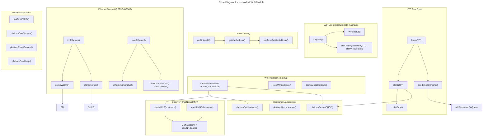

# C4 Code Level: Network & WiFi Module

## Overview

- **Name**: Network & WiFi Management Module (OTGW-firmware)
- **Description**: Unified network connectivity layer (v1.3.5+) providing WiFi with non-blocking reconnection (ADR-047), NTP time synchronization with timezone support, mDNS/LLMNR hostname resolution, SimpleTelnet 1.0.0 debug server, and optional Ethernet failover (ESP32 + W5500). Updated for Arduino Core 3.1.2 (ESP8266) with lwIP2 Low Memory variant (TCP_MSS=536). WiFiClient sync mode enabled to reduce TCP buffer copy overhead.
- **Location**: `/src/OTGW-firmware/` (primary files: `networkStuff.ino`, `networkStuff.h`, `Ethernet.ino`, `platform.h`, `platform_esp8266.h`, `platform_esp32.h`); `src/libraries/SimpleTelnet/src/SimpleTelnet.h`
- **Language**: Arduino C/C++ (ESP8266/ESP32), templated C++ (SimpleTelnet library)
- **Purpose**: Abstracts WiFi/Ethernet connectivity, NTP time sync, hostname management, platform-specific features, and debug telnet interface behind a unified API. Ensures reliable network connectivity with automatic failover, proper DHCP hostname negotiation, and responsive debug terminal.

## Code Elements

### WiFi Management

#### `void startWiFi(const char* hostname, int timeOut, bool forcePortal = false)` 
- **Location**: `networkStuff.ino:50-190`
- **Parameters**:
  - `hostname`: Target hostname for device (e.g., "otgw")
  - `timeOut`: Timeout in seconds for WiFi connection attempts (e.g., 240 for 4 minutes)
  - `forcePortal`: Force WiFi configuration portal (triple-reset detection)
- **Return Type**: `void`
- **Description**: 
  Main WiFi initialization function called from `setup()`. Attempts to connect to previously saved WiFi credentials. If connection fails, starts captive portal. Configures WiFiManager with custom SSID (`<hostname>-<MAC>`), disables Info/Erase buttons for security, and enables auto-reconnect. Handles hostname synchronization across multiple connection paths (SDK auto-connect, direct connect, portal, catch-all DHCP re-announce). Sets up HTTP updater with Basic Auth if password is configured.
  
  **Key behaviors**:
  - Sets WiFi to STA mode explicitly
  - Attempts direct connection if credentials saved (30-second timeout)
  - Falls back to config portal if direct connect fails
  - Performs DHCP re-announce if hostname mismatches after connect
  - Blocks until WiFi is connected (with watchdog feeding)
  - Sets `WiFi.setAutoReconnect(true)` and `WiFi.persistent(true)` for SDK auto-recovery

#### `void resetWiFiSettings(void)`
- **Location**: `networkStuff.ino:42-47`
- **Parameters**: None
- **Return Type**: `void`
- **Description**: Resets all saved WiFi credentials using WiFiManager, forcing the next boot to show config portal.

#### `void loopWifi(void)`
- **Location**: `networkStuff.ino:203-260`
- **Parameters**: None
- **Return Type**: `void`
- **Description**: 
  Non-blocking WiFi reconnection state machine called from `doBackgroundTasks()` on every loop iteration. Implements ADR-047 fallback for WiFi outages longer than the SDK auto-reconnect timeout (typically ~30 seconds). Uses cooperative state transitions (IDLE → DISCONNECTED → CONNECTING → RECONNECTED → IDLE, or FAILED on 10 retry limit).

  **States**:
  - `WIFI_IDLE`: Connected, monitoring for disconnection
  - `WIFI_DISCONNECTED`: Just detected disconnection, starting async reconnect
  - `WIFI_CONNECTING`: Waiting non-blocking for connection (30-second retry window)
  - `WIFI_RECONNECTED`: Connection restored, restarting services (Telnet, MQTT, WebSocket)
  - `WIFI_FAILED`: Too many retries (>= 10), triggers reboot
  
  **Service restart on reconnection**: Calls `startTelnet()`, `startMQTT()`, and `startWebSocket()` to resume data streams after temporary WiFi loss.

#### `void configModeCallback(WiFiManager *myWiFiManager)` (static)
- **Location**: `networkStuff.ino:32-40`
- **Parameters**: 
  - `myWiFiManager`: WiFiManager instance that triggered callback
- **Return Type**: `void`
- **Description**: Callback invoked when WiFiManager enters configuration (captive portal) mode. Logs portal SSID and soft AP IP address to debug output.

### DNS & mDNS

#### `void startMDNS(const char *hostname)`
- **Location**: `networkStuff.ino:274-286`
- **Parameters**:
  - `hostname`: Hostname for mDNS responder (e.g., "otgw")
- **Return Type**: `void`
- **Description**: Initializes mDNS (Bonjour) responder, advertising the device as `<hostname>.local` and registering HTTP service on port 80. Enables discovery by `.local` hostname on macOS, Windows (with Bonjour), and Linux.

#### `void startLLMNR(const char *hostname)`
- **Location**: `networkStuff.ino:288-303`
- **Parameters**:
  - `hostname`: Hostname for LLMNR responder
- **Return Type**: `void`
- **Description**: Initializes LLMNR (Windows name resolution) for the device. Only available on ESP8266 (guarded by `HAS_LLMNR` flag, which is 0 on ESP32). Responds to `<hostname>` broadcasts on the local network.

### NTP & Time Synchronization

#### `void startNTP(void)`
- **Location**: `networkStuff.ino:307-338`
- **Parameters**: None
- **Return Type**: `void`
- **Description**: 
  Initializes NTP (SNTP) time synchronization if enabled in settings. Configures `configTime()` with timezone and NTP server. On ESP8266, works around SDK bug where `configTime()` resets the WiFi hostname to "ESP-XXXXXX" by saving/restoring the hostname before/after the call. Performs DHCP re-announce on first NTP sync if hostname was reset by SDK (guards against repeated re-announces with `sDhcpHostnameFixed` flag).

  **Guards**: Exits early if NTP is disabled (`settings.ntp.bEnable == false`).

#### `void loopNTP(void)`
- **Location**: `networkStuff.ino:341-389`
- **Parameters**: None
- **Return Type**: `void`
- **Description**: 
  NTP synchronization state machine called periodically from main loop. Manages NTP_STATUS transitions through three states:
  - `TIME_NOTSET` / `TIME_NEEDSYNC`: Calls `startNTP()`, guards against ESP8266 SDK bogus initial value (0xFFFFFFFF = year 2106) by checking time is in range [EPOCH_2000_01_01, EPOCH_2038_01_19] before storing as baseline
  - `TIME_WAITFORSYNC`: Polls `time()` until it exceeds baseline, validates timezone, transitions to TIME_SYNC on success
  - `TIME_SYNC`: Monitors for time drift (resync if > NTP_RESYNC_TIME), transitions to TIME_NEEDSYNC when needed
  
  **Safety**: Uses dual-check guards to prevent SDK bogus initial timestamp from poisoning `NtpLastSync`. On first sync, converts Unix time to localized time and displays local date/time to debug output.

#### `bool isNTPtimeSet(void)`
- **Location**: `networkStuff.ino:391-394`
- **Parameters**: None
- **Return Type**: `bool`
- **Description**: Returns true if NTP has successfully synchronized (`NtpStatus == TIME_SYNC`).

#### `void sendtimecommand(void)`
- **Location**: `networkStuff.ino:396-428`
- **Parameters**: None
- **Return Type**: `void`
- **Description**: 
  Sends OpenTherm Gateway time and date commands to the PIC via command queue. Only executes if:
  - NTP is enabled and synced
  - PIC is available
  - Gateway firmware is active (not diagnostic/interface mode)
  - Not in Print Summary mode (PS=1)
  
  Sends three command types:
  - `SC=<hour>:<minute>/<day_of_week>` — Time command (daily)
  - `SR=21:<month>,<day>` — Date command (on day change, via `dayChanged()`)
  - `SR=22:<year_hi>,<year_lo>` — Year command (on year change, via `yearChanged()`)
  
  Uses UTC time converted to configured timezone. Day-of-week calculation: `(ZonedDateTime.dayOfWeek() + 6) % 7 + 1` to match OpenTherm convention.

### Hostname Management

#### `void platformSetHostname(const char *hostname)` (inline)
- **Location**: `platform_esp8266.h:54-56` / `platform_esp32.h:54-56`
- **Parameters**:
  - `hostname`: Desired hostname
- **Return Type**: `void`
- **Description**: Platform-specific hostname setter. On ESP8266: `WiFi.hostname(hostname)`. On ESP32: `WiFi.setHostname(hostname)`.

#### `const char* platformGetHostname(void)` (inline)
- **Location**: `platform_esp8266.h:58-62` / `platform_esp32.h:58-60`
- **Parameters**: None
- **Return Type**: `const char*` (pointer to static buffer on ESP8266, direct on ESP32)
- **Description**: Platform-specific hostname getter. On ESP8266: copies WiFi hostname to static buffer (to handle String return). On ESP32: returns directly.

#### `void platformRestartDHCP(void)` (inline)
- **Location**: `platform_esp8266.h:199-202`
- **Parameters**: None
- **Return Type**: `void`
- **Description**: (ESP8266 only) Forces DHCP client to re-announce lease. Calls `wifi_station_dhcpc_stop()` then `wifi_station_dhcpc_start()`. Not defined on ESP32 (DHCP renewal is automatic).

### MAC Address & Device Identity

#### `const char* getMacAddress(void)`
- **Location**: `networkStuff.ino:432-440`
- **Parameters**: None
- **Return Type**: `const char*` (pointer to static buffer)
- **Description**: Returns MAC address as hex string (e.g., "00112233AABB"). Calls `platformGetMacAddress()` to fetch raw bytes, then formats via `snprintf_P()` into static buffer.

#### `const char* getUniqueId(void)`
- **Location**: `networkStuff.ino:442-447`
- **Parameters**: None
- **Return Type**: `const char*` (pointer to static buffer)
- **Description**: Returns unique device ID in format `otgw-<MAC_HEX>` (e.g., "otgw-00112233AABB"). Used for MQTT device identification and Home Assistant discovery.

#### `void platformGetMacAddress(uint8_t *mac)` (inline)
- **Location**: `platform_esp8266.h:77-79` / `platform_esp32.h:89-91`
- **Parameters**:
  - `mac`: Output buffer (6 bytes)
- **Return Type**: `void`
- **Description**: Platform-specific MAC address retrieval. On ESP8266: `WiFi.macAddress(mac)`. On ESP32: `esp_efuse_mac_get_default(mac)`.

### Ethernet Support (ESP32 + W5500 only)

#### `void initEthernet(void)`
- **Location**: `Ethernet.ino:151-167` (guarded by `HAS_ETH_CAPABLE`)
- **Parameters**: None
- **Return Type**: `void`
- **Description**: 
  Called once from `setup()` on ESP32 boards with W5500 hardware. Probes W5500 via SPI VERSION register, derives a locally-administered MAC from ESP32 eFuse, attempts DHCP (1-second timeout for fast boot). If successful, switches WiFi off and initializes Ethernet as primary network interface. If W5500 present but no link, remains on WiFi.

#### `void loopEthernet(void)`
- **Location**: `Ethernet.ino:174-199` (guarded by `HAS_ETH_CAPABLE`)
- **Parameters**: None
- **Return Type**: `void`
- **Description**: 
  Automatic WiFi ↔ Ethernet failover monitor called from `doBackgroundTasks()` every 5 seconds (if W5500 present). Monitors cable plug/unplug via `Ethernet.linkStatus()`. On cable insertion, attempts DHCP (2-second timeout) and switches to Ethernet. On cable removal, falls back to WiFi. Calls `Ethernet.maintain()` to keep DHCP lease alive when on Ethernet.

#### `bool probeW5500(void)` (static)
- **Location**: `Ethernet.ino:50-78`
- **Parameters**: None
- **Return Type**: `bool`
- **Description**: 
  Hardware detection via raw SPI. Resets W5500 (pin LOW/HIGH), initializes SPI bus, reads VERSION register (address 0x0039) from Common Register block. Returns true if version register reads 0x04 (W5500 silicon). Non-invasive: works without cable present.

#### `bool startEthernet(uint16_t dhcpTimeoutMs)` (static)
- **Location**: `Ethernet.ino:85-119`
- **Parameters**:
  - `dhcpTimeoutMs`: DHCP timeout in milliseconds
- **Return Type**: `bool`
- **Description**: 
  Initializes Ethernet library and attempts DHCP (or uses static IP if configured in settings). Returns true if DHCP succeeds and link is present (`Ethernet.linkStatus() == LinkON`). Falls back to static IP configuration if `settings.eth.bStaticIP` is set.

#### `void switchToEthernet(void)` / `void switchToWiFi(void)` (static)
- **Location**: `Ethernet.ino:124-143`
- **Parameters**: None
- **Return Type**: `void`
- **Description**: 
  Transitions between network modes. `switchToEthernet()` disconnects WiFi, updates `state.net.eMode` to `NET_ETHERNET`, re-registers mDNS on new interface. `switchToWiFi()` re-enables WiFi, updates state. Both preserve transient state (`ethInitialized`, link flags).

#### `String getEthernetIPString(void)` / `String getEthernetMACString(void)` (static)
- **Location**: `Ethernet.ino:205-214`
- **Parameters**: None
- **Return Type**: `String`
- **Description**: 
  Helper functions called by REST API to display correct IP/MAC address when on Ethernet. `getEthernetIPString()` returns `Ethernet.localIP().toString()`. `getEthernetMACString()` formats locally-administered MAC to colon-separated hex string.

#### `void deriveEthMAC(void)` (static)
- **Location**: `Ethernet.ino:37-43`
- **Parameters**: None
- **Return Type**: `void`
- **Description**: 
  Derives a unique locally-administered MAC address from ESP32 eFuse MAC. Extracts 6 bytes from `ESP.getEfuseMac()`, sets bit 1 of first octet to mark as locally-administered (0x02), ensuring Ethernet MAC differs from WiFi MAC while remaining unique per device.

### Telnet Debug Server (SimpleTelnet 1.0.0)

#### `void startTelnet(void)`
- **Location**: `networkStuff.ino:405-414`
- **Parameters**: None
- **Return Type**: `void`
- **Description**: Initializes SimpleTelnet 1.0.0 debug server on port 23 (single-client instance `debugTelnet`). Registers `sendTelnetBanner()` as onConnect callback and `onTelnetInput()` as onInputReceived callback. Uses char-by-char input mode (no line buffering) for responsive debug menu. Replaces ESPTelnet/TelnetStream with callback-based architecture and no heap fragmentation (callbacks receive const char*, never String).

#### `void sendTelnetBanner(const char* ip)` (SimpleTelnet onConnect callback)
- **Location**: `networkStuff.ino:369-393`
- **Parameters**: `ip` (const char*) - Client IP address (passed by SimpleTelnet)
- **Return Type**: `void`
- **Description**: Sends welcome banner with firmware version, IP, WiFi SSID, OTGW online status, MQTT connection state, free heap bytes, and debug flag status. Lists debug flag toggle keys (1-6 for OT messages, REST API, MQTT, MQTT gating, sensors, NTP; 'h' for full menu). Sent once per client connection.

#### `void onTelnetInput(const char* s)` (SimpleTelnet onInputReceived callback)
- **Location**: `networkStuff.ino:399-402`
- **Parameters**: `s` (const char*) - Single character input (char-by-char mode)
- **Return Type**: `void`
- **Description**: Routes telnet input to `handleDebugChar()` in handleDebug.ino. SimpleTelnet passes one character at a time in char-by-char mode; onTelnetInput extracts the character and forwards to the debug handler.

### Platform Abstraction (Unified API)

#### Platform Functions (Core)

All inline functions defined in `platform_esp8266.h` and `platform_esp32.h`, providing unified API:

| Function | Signature | Purpose |
|----------|-----------|---------|
| `platformSetHostname` | `void (const char*)` | Set WiFi hostname (propagates to DHCP) |
| `platformGetHostname` | `const char* (void)` | Get current WiFi hostname |
| `platformRestartDHCP` | `void (void)` | Force DHCP lease re-announce (ESP8266 only) |
| `platformFSInfo` | `bool (FSInfo&)` | Get LittleFS statistics |
| `platformCoreVersion` | `const char* (void)` | Return Arduino core version string |
| `platformSdkVersion` | `const char* (void)` | Return SDK version string |
| `platformCpuFreqMHz` | `uint32_t (void)` | Return CPU frequency in MHz |
| `platformChipId` | `uint32_t (void)` | Return unique chip identifier |
| `platformGetMacAddress` | `void (uint8_t*)` | Get MAC address (6-byte buffer) |
| `platformResetReason` | `void (char*, size_t)` | Get human-readable reset reason |
| `platformFreeHeap` | `uint32_t (void)` | Return free heap in bytes |
| `platformMaxFreeBlock` | `uint32_t (void)` | Return largest contiguous free block |
| `platformFlashChipRealSize` | `uint32_t (void)` | Return actual flash size |
| `platformFlashChipSize` | `uint32_t (void)` | Return configured flash size |
| `platformFlashChipSpeed` | `uint32_t (void)` | Return flash speed in Hz |
| `platformFlashChipId` | `uint32_t (void)` | Return flash chip ID |
| `platformFlashChipMode` | `uint8_t (void)` | Return flash SPI mode (QIO/DIO/etc) |
| `platformSketchSize` | `uint32_t (void)` | Return compiled sketch size |
| `platformFreeSketchSpace` | `uint32_t (void)` | Return available OTA space |
| `platformRestart` | `void (void)` | Reboot the device |
| `platformHardwareRandom` | `uint32_t (void)` | Get hardware RNG value |
| `platformRtcRead` / `platformRtcWrite` | `bool (uint32_t, uint32_t*, size_t)` | RTC user memory access |
| `platformIsExternalReset` | `bool (void)` | Check if reset was external (not internal WDT) |
| `platformResetCode` | `uint32_t (void)` | Get numeric reset code |
| `platformResetRegisterDump` | `void (char*, size_t)` | Get register dump on crash |
| `platformResetExceptionInfo` | `void (char*, size_t)` | Get exception cause description |
| `platformSerialHasOverrun` / `platformSerialHasRxError` | `bool (HardwareSerial&)` | Check serial error flags (ESP8266 only) |

#### Platform Abstraction Class

**`class PlatformDir`** (wraps directory iteration)
- **Location**: `platform.h:36-106`
- **Methods**:
  - `PlatformDir(const char* path)` — Constructor, opens directory
  - `~PlatformDir()` — Destructor, closes handles (ESP32 only)
  - `bool valid()` — Returns true if directory opened successfully
  - `bool next()` — Advance to next file (returns false at end)
  - `String fileName()` — Get current filename (basename on ESP32)
  - `size_t fileSize()` — Get current file size
  - `bool isDirectory()` — Check if current entry is a subdirectory
- **Description**: Unified directory iteration hiding differences between ESP8266 `Dir` and ESP32 `File` APIs. Used by firmware update and configuration code.

#### Type Aliases

- **Location**: `platform_esp8266.h:49` / `platform_esp32.h:38`
- **`using OTGWWebServer = ESP8266WebServer;`** (ESP8266) or `WebServer` (ESP32)
  - Unified web server type for application code

## Global Variables & State

### Declared in `networkStuff.ino`

| Variable | Type | Purpose |
|----------|------|---------|
| `NtpStatus` | `NtpStatus_t` | Current NTP synchronization state (TIME_NOTSET, TIME_WAITFORSYNC, TIME_SYNC, TIME_NEEDSYNC) |
| `NtpLastSync` | `time_t` | Timestamp of last successful NTP sync (used to detect SDK bogus initial value) |
| `sDhcpHostnameFixed` | `static bool` | Tracks whether DHCP re-announce has been done (prevents repeated re-announces) |
| `httpServer` | `OTGWWebServer` | HTTP server instance on port 80 |
| `httpUpdater` | `OTGWUpdateServer` | OTA firmware update server |
| `LittleFSinfo` | `FSInfo` | File system statistics (size, used bytes) |
| `LittleFSmounted` | `bool` | Whether LittleFS initialized successfully |
| `wifiState` | `static WifiState_t` | Current WiFi reconnection state (IDLE, DISCONNECTED, CONNECTING, RECONNECTED, FAILED) |
| `wifiRetryCount` | `static int` | Number of failed reconnection attempts (resets on success, triggers reboot at 10) |

### Declared in `Ethernet.ino` (ESP32 + W5500 only)

| Variable | Type | Purpose |
|----------|------|---------|
| `ethSPI` | `static SPIClass` | SPI bus instance for W5500 (FSPI on ESP32-S3) |
| `w5500Driver` | `static W5500Driver` | W5500 Ethernet controller driver |
| `ethMac` | `static uint8_t[6]` | Derived Ethernet MAC address (locally-administered) |
| `ethInitialized` | `static bool` | Whether Ethernet has been successfully initialized |

## Dependencies

### Internal Dependencies

- **`safeTimers.h`**: Timer management macros (`DECLARE_TIMER_SEC`, `DUE`, `RESTART_TIMER`, `CATCH_UP_MISSED_TICKS`)
- **`OTGW-firmware.h`**: Settings structures (`settings.sHostname`, `settings.ntp.*`, `settings.eth.*`, `settings.sHTTPpasswd`), state structs (`state.net.*`, `state.pic.*`, `state.hw.*`, `state.otBus.*`)
- **`OTGW-ModUpdateServer.h`**: OTA update server implementation
- **`updateServerHtml.h`**: Web UI HTML/CSS for OTA updates
- **`Telnet.h` (implied)**: `TelnetStream` for debug output (via `WM_DEBUG_PORT` define)
- **`OTGW-Core.ino`**: `feedWatchDog()` function (for watchdog feeding during blocking operations)
- **`MQTTstuff.ino`**: `startMQTT()` function (called on WiFi reconnect)
- **`WebSocketserver integration (implied)**: `startWebSocket()` function (called on WiFi reconnect)
- **Timezone/time functions**: `dayChanged()`, `yearChanged()` (determine date transitions for NTP commands)
- **`addCommandToQueue()`**: Sends OpenTherm commands to PIC

### External Dependencies

#### ESP8266 (networkStuff.h, platform_esp8266.h)
- **`WiFiManager.h`** v2.0.4-beta: Captive portal for WiFi configuration
- **`ESP8266WiFi.h`**: WiFi client/AP mode, SSID/hostname management
- **`ESP8266WebServer.h`**: HTTP server on port 80
- **`ESP8266mDNS.h`**: mDNS (Bonjour) responder
- **`ESP8266LLMNR.h`**: LLMNR responder
- **`ESP8266HTTPClient.h`**: HTTP client (for firmware checks, external APIs)
- **`LittleFS.h`**: File system for configuration, HTML assets
- **`WebSocketsServer.h`**: WebSocket server for live OT log streaming (reduced to 256-byte buffer per client)
- **`user_interface.h`** (from Arduino core): `wifi_station_dhcpc_stop/start`, `system_get_rst_info`
- **SimpleTelnet** (v1.0.0, custom library in src/libraries/): Multi-client telnet server with streaming and CLI modes, per-client line buffering
- **AZ Timelib** (external): `timezoneManager`, `ZonedDateTime` for timezone-aware time conversion
- **Arduino Core ESP8266** (v3.1.2): lwIP2 Low Memory variant (TCP_MSS=536 via platformio.ini build_flags); SNTP client via `configTime()`

#### ESP32 (Ethernet.ino, platform_esp32.h)
- **`WiFi.h`**: WiFi management (similar to ESP8266 but different API)
- **`WebServer.h`**: HTTP server implementation
- **`ESPmDNS.h`**: mDNS support
- **`HTTPClient.h`**: HTTP client
- **`LittleFS.h`**: File system
- **`Preferences.h`**: RTC memory emulation (not used in network module)
- **`Update.h`**: OTA update support
- **`SPI.h`**: SPI bus communication for W5500
- **`EthernetESP32.h`**: Ethernet library for ESP32
- **`esp_system.h`, `esp_mac.h`, `esp_netif.h`**: ESP32 HAL for MAC, reset info, networking

## Key Behaviors & Patterns

### WiFi Auto-Reconnect Architecture (ADR-047 Non-Blocking Reconnection)

The firmware implements two-tier WiFi recovery (v1.3.5+ update: SDK DHCP calls removed while connected to fix issue #525 router unreachability after reboot):

1. **SDK Auto-Reconnect** (fast, transparent):
   - ESP8266/32 firmware automatically retries connection on SSID if disconnected
   - Typical recovery time: < 1 second
   - No application visibility — transparent radio-level reconnect
   - Note: SDK DHCP renew/check calls removed (was causing timeouts and unreachability after router reboot per issue #525)

2. **loopWifi() State Machine** (fallback for extended outages):
   - Detects disconnections that exceed SDK auto-reconnect timeout (typically 30 seconds)
   - Non-blocking state machine with 30-second retry windows (max 10 attempts)
   - Performs hostname re-apply and DHCP re-announce on reconnection to ensure router sees updated name
   - Restarts services (Telnet, MQTT, WebSocket) on successful reconnection
   - Triggers reboot if >= 10 consecutive failures (indicates unrecoverable hardware issue)
   - Beta (_VERSION_PRERELEASE): After 2 failures (60s), enters AP fallback mode with 5-minute WiFi retry interval (allows OTA recovery without physical access)

**Why two-tier?** SDK handles momentary blips (channel hops, interference). Application layer catches prolonged outages or misconfiguration.

### Hostname Management: Multi-Path Synchronization

WiFi hostname must reach DHCP server to appear in router device list and enable DNS lookups (`<hostname>.local`). The firmware tries four paths:

1. **Pre-connection** (`startWiFi()`): `platformSetHostname()` before `WiFi.begin()`
2. **On already-connected WiFi**: Update hostname without reconnect (preserves existing connection)
3. **Post-SDK-auto-connect**: Hostname may reset on ESP8266 (SDK bug); detect and re-apply
4. **Post-DHCP re-announce**: Force DHCP re-announce if hostname still mismatched (catch-all)

Guard: `sDhcpHostnameFixed` prevents re-announce spam on every NTP resync (which also calls `startNTP()` on ESP8266).

### NTP Time Synchronization with SDK Bogus Value Guard

ESP8266 SDK initializes `time()` to **0xFFFFFFFF** (year 2106) before SNTP first sync. This breaks naive "time() > baseline" checks. The firmware validates with dual bounds:
- Lower: `EPOCH_2000_01_01` (946684800) = January 1, 2000
- Upper: `EPOCH_2038_01_19` (2147483647) = January 19, 2038 (INT32_MAX)

Only values in `[EPOCH_2000_01_01, EPOCH_2038_01_19]` are considered valid. This safely rejects both the 0xFFFFFFFF bogus value and pre-epoch uninitialized timestamps.

### TCP Serial Bridge (Implicit)

The `Ethernet.ino` module provides W5500 hardware detection and DHCP, but the actual TCP serial bridge on port 25238 is handled elsewhere (likely `Ethernet.ino` or a separate module). The network module sets up the transport layer; application code uses it.

### WebSocket Configuration (Buffer Optimization)

Default WebSocket per-client buffer: 512 bytes. This project reduces it to 256 bytes via `#define WEBSOCKETS_MAX_DATA_SIZE 256` (defined before `#include <WebSocketsServer.h>`). Saves ~256 bytes per client. For 3 clients: 768 bytes of RAM freed — significant on ESP8266's 40KB heap.

**WiFiClient Sync Mode** (v1.3.5+): WiFiClient sync mode enabled to reduce TCP buffer copy overhead. This trades a small amount of latency for lower RAM usage (approximately 1KB TCP buffer copy saved per client).

**Security note**: WebSocket stream intended for LOCAL NETWORK ONLY. No authentication on WebSocket endpoint. Do NOT expose to internet without reverse proxy + HTTPS.

## Relationships & Call Graph

## Related Files & Integration Points

### Called From
- **`setup()` or `OTGW-firmware.ino`**: 
  - `startWiFi(HOSTNAME, WIFI_TIMEOUT, isForcePortal)`
  - `startMDNS(HOSTNAME)`
  - `startLLMNS(HOSTNAME)`
  - `startNTP()`
  - `initEthernet()` (ESP32+W5500)
  - `startTelnet()`
  - `httpServer.begin()`

- **`loop()` / `doBackgroundTasks()` (main loop)**:
  - `loopWifi()`
  - `loopNTP()`
  - `loopEthernet()` (if W5500 present)
  - `MDNS.update()` (if `MDNS_NEEDS_UPDATE == 1`)
  - `httpServer.handleClient()`
  - `TelnetStream.handle()` (debug telnet)

### Calls Out To
- **WiFiManager API**: `setAPCallback()`, `setConfigPortalTimeout()`, `setShowInfoUpdate()`, `startConfigPortal()`, `getWiFiIsSaved()`
- **WiFi stack**: `WiFi.mode()`, `WiFi.begin()`, `WiFi.status()`, `WiFi.SSID()`, `WiFi.localIP()`, `WiFi.setAutoReconnect()`, `WiFi.persistent()`
- **mDNS/LLMNR**: `MDNS.begin()`, `MDNS.addService()`, `LLMNR.begin()`
- **NTP**: `configTime()` (SDK call), `time()` (POSIX), `timezoneManager.createForZoneName()`, `ZonedDateTime::forUnixSeconds64()`
- **Telnet**: `TelnetStream.begin()`, `TelnetStream.flush()`
- **Ethernet** (W5500): `Ethernet.init()`, `Ethernet.begin()`, `Ethernet.linkStatus()`, `Ethernet.localIP()`, `Ethernet.maintain()`
- **Debug**: `DebugTln()`, `DebugTf()` (custom debug macros)
- **Watchdog**: `feedWatchDog()` (prevent timeout during blocking operations)
- **OT commands**: `addCommandToQueue()` (send NTP time commands to PIC)
- **Settings**: Read from `settings.sHostname`, `settings.ntp.*`, `settings.eth.*`, `settings.sHTTPpasswd`
- **State**: Write to `state.net.eMode`, `state.net.bEthernetLink`, `state.hw.bEthernetPresent`, `state.pic.bAvailable`, `state.otBus.bPSmode`

### Data Contracts

**Global Variables Exported**:
- `NtpStatus`: Exported `extern` in `networkStuff.h` (used by main loop to check if time is synced before displaying)
- `NtpLastSync`: Exported, read-only (used for timestamp calculations)
- `httpServer`: Web server instance (HTTP handlers register here)
- `httpUpdater`: OTA update handler (initialized by `startWiFi()`)

**Settings Read**:
- `settings.sHostname`: Configured device hostname (max length varies)
- `settings.ntp.bEnable`: Whether NTP sync is enabled
- `settings.ntp.sTimezone`: Timezone string (e.g., "Europe/Amsterdam")
- `settings.ntp.sHostname`: NTP server hostname
- `settings.ntp.bSendtime`: Whether to send time commands to OTGW
- `settings.sHTTPpasswd`: Basic auth password for OTA updates
- `settings.eth.bStaticIP`: Whether Ethernet uses static IP (ESP32+W5500)
- `settings.eth.sIPaddress`, `settings.eth.sGateway`, `settings.eth.sSubnet`, `settings.eth.sDNS`: Ethernet static config

**State Written**:
- `state.net.eMode`: NET_WIFI or NET_ETHERNET (WiFi/Ethernet selection)
- `state.net.bEthernetLink`: Whether Ethernet cable is plugged in
- `state.hw.bEthernetPresent`: Whether W5500 chip detected
- `state.pic.bAvailable`: Whether PIC responded to initialization
- `state.otBus.bPSmode`: Whether Print Summary mode is active (checked by NTP time command sender)

## Technical Constraints & Considerations

### Memory Constraints (ESP8266 ~40KB DRAM)

- Static buffers used strategically: `baseMacChr[13]`, `uniqueId[32]`, `_hn[64]` in platform functions
- WebSocket buffer reduced from 512 to 256 bytes per client (via `WEBSOCKETS_MAX_DATA_SIZE`)
- SimpleTelnet 1.0.0 replaces ESPTelnet/TelnetStream (no String objects in callbacks, const char* only to avoid heap fragmentation)
- WiFiManager debug output disabled via `#define WM_NODEBUG` (before the WiFiManager include in `networkStuff.h`): on ESP8266 Core 3.x, the `handleWifiSave()` debug block builds `String` objects from raw string literals stored in flash at potentially misaligned addresses; `strlen()` then generates an unaligned word-load resulting in Exception 3 (LoadStoreAlignmentCause). `WM_NODEBUG` undefines `WM_DEBUG_LEVEL` so those `#ifdef WM_DEBUG_LEVEL` blocks are excluded at compile time.
- HTTP server streams large files (e.g., `index.html` ~11KB) rather than loading into RAM
- WiFiClient sync mode enabled to reduce TCP buffer copy overhead (~1KB per connection saved)

### Platform Differences

| Feature | ESP8266 | ESP32 | Handling |
|---------|---------|-------|----------|
| mDNS | Native | Native | Both use MDNS library, but ESP8266 needs `MDNS.update()` in loop |
| LLMNR | Yes (HAS_LLMNR=1) | No (HAS_LLMNR=0) | Guard with compile-time flag |
| Hostname setter | `WiFi.hostname()` | `WiFi.setHostname()` | Unified in `platformSetHostname()` |
| SDK hostname reset bug | Yes (configTime resets it) | No | Guard in `startNTP()` with `#if defined(ESP8266)` |
| RTC memory | Yes (native) | No (use Preferences) | Separate inline implementations |
| Reset info | `system_get_rst_info()` | `esp_reset_reason()` | Different APIs, unified output format |
| Ethernet | Not available | Yes (W5500 via SPI) | Guard with `HAS_ETH_CAPABLE` |

### WiFi Credentials Persistence

- `WiFi.persistent(true)`: Credentials saved to EEPROM/NVS by SDK
- Next boot: `WiFi.begin()` without args uses stored credentials
- Reset: `resetWiFiSettings()` wipes credentials, forces portal on next boot
- Security: Portal SSID includes MAC address to prevent confusion with other APs

### NTP & Time Management

- Time is maintained by SDK via SNTP (Simple NTP, part of `lwip`)
- Firmware initializes `configTime(timezone, dst_offset, ntp_server, ...)`
- `time()` returns Unix timestamp; application code converts to local time via `timezoneManager` + `ZonedDateTime`
- Timezone database loaded at runtime (requires flash space, managed by AZ Timelib library)
- NTP resync interval: `NTP_RESYNC_TIME` (typically 12 or 24 hours)

### Ethernet Failover (ESP32 + W5500 only)

- Hot-plug detection: Monitors cable insertion/removal every 5 seconds
- On cable insert: Attempts DHCP with 2-second timeout (longer than boot, allows for slow switches)
- On cable remove: Immediately falls back to WiFi
- Re-registers mDNS on transition to avoid stale entries
- Derived MAC address is locally-administered (0x02 bit set) to distinguish from WiFi MAC

## Notes on v1.3.5+ Changes

- **Arduino Core 3.1.2 (ESP8266)**: Upgraded from 2.7.4; lwIP2 Low Memory variant enables TCP_MSS=536 via platformio.ini build_flags
- **SimpleTelnet 1.0.0**: Custom library replacing ESPTelnet/TelnetStream; per-client line buffering; printf/printf_P PROGMEM helpers; separate debug and CLI instances if needed
- **Non-blocking WiFi reconnect (ADR-047)**: Fully implemented; SDK DHCP calls removed while connected (fixes issue #525 unreachability after router reboot)
- **WiFiClient sync mode**: Enabled to save ~1KB TCP buffer copy per connection
- **AP Fallback (beta, _VERSION_PRERELEASE)**: After 2 reconnect failures (60s), enters SoftAP mode with 5-minute WiFi retry interval for OTA recovery
- **NTP Telemetry**: Optional debug flag (key '6') for periodic NTP sync diagnostics (every 60s unsynced, every 300s synced)

## References & ADRs

- **ADR-047**: WiFi non-blocking auto-reconnect (loopWifi state machine for extended outages)
- **ADR-051**: Settings & state architecture (ntp.*, eth.* settings structures)
- **Issue #525**: SDK DHCP calls removed while connected (was causing timeouts and unreachability after router reboot)
- **OTGW-firmware.h**: Settings definitions and state structures
- **safeTimers.h**: Timer macro definitions
- **SimpleTelnet.h**: Multi-client telnet library (1.0.0)
- **Timezone/time includes**: AZ Timelib for timezone support
