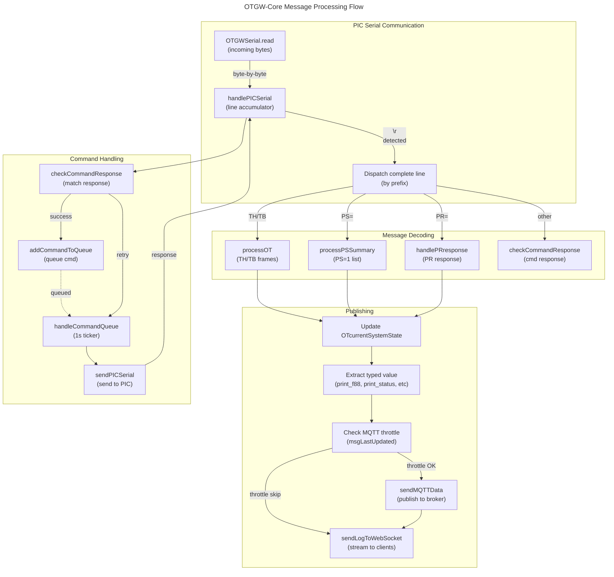

# C4 Code Level: OTGW-Core Module

## Overview

- **Name**: OTGW-Core Module
- **Description**: Core OpenTherm Gateway message processing, PIC (Programmable Intelligent Controller) communication, and OpenTherm data decoding for the OTGW firmware. Handles all OpenTherm protocol parsing, PIC serial communication, MQTT throttling, command queuing, and real-time message publishing.
- **Location**: `src/OTGW-firmware/` (OTGW-Core.ino, OTGW-Core.h, OTGW-firmware.h, OTGW-firmware.ino)
- **Language**: Arduino C/C++ (ESP8266)
- **Purpose**: Bridges communication between the ESP8266 host and the OTGW PIC (gateway firmware), decodes OpenTherm messages, maintains message state, publishes to MQTT and WebSocket, handles command queuing, and manages PIC firmware upgrades.

## Core Responsibilities

1. **OpenTherm Message Processing**: Decode/encode OpenTherm protocol messages, extract data fields, publish to MQTT with throttling
2. **PIC Serial Communication**: Send/receive data over serial to PIC, handle responses, detect device presence
3. **Command Queuing**: Queue commands to PIC, retry on failure, maintain order
4. **MQTT Publishing**: Throttle high-frequency messages, manage discovery, publish state changes
5. **WebSocket Event Streaming**: Stream OT messages and system events to WebSocket clients in real-time
6. **PIC Firmware Management**: Query firmware version, manage upgrades, detect gateway mode
7. **Settings Discovery**: Cycle through PIC settings (CR command) and publish to MQTT

## Code Elements

### Core Data Structures

#### `OTdataStruct` (OTGW-Core.h)
- **Purpose**: Central repository for all OpenTherm state from the boiler/thermostat
- **Members**: 
  - Status flags (master/slave) and configuration
  - Temperature readings: TSet, Tboiler, Tdhw, Tr, Toutside, Tret, etc.
  - Modulation and pressure: RelModLevel, CHPressure
  - Flow rates: DHWFlowRate
  - Counters: BurnerOperationHours, CHPumpStarts, etc.
  - Extended features: Solar storage, ventilation/heat recovery, RF sensors, vendor-specific, brand identification
  - Error tracking: error01-04, errorBufferOverflow
  - **Routing discriminators (ADR-103)**:
    - `bAnswerOverride` — true when the current `A`-prefix frame is a gateway answer that *substitutes* a real boiler `B` frame (genuine answer-override). False on the more common case of an `A`-prefix proxy frame (no preceding `B`).
    - `bGatewaySubstituted` — true when the gateway injected the substitution itself.
- **Scope**: Global singleton `OTdataStruct OTcurrentSystemState`
- **Note**: Flame status is in SlaveStatus bit 3 (NOT MasterStatus); MasterStatus bit 3 is OTC (Outside Temperature Compensation) enabled (bug fix: commit d85e668c)

#### `OpenthermData_t` (OTGW-Core.h, embedded)
- **Purpose**: Typed wrapper for 16-bit OpenTherm data values
- **Methods**:
  - `f88()`: Read as f8.8 float (OTGW-Core.ino:1015)
  - `f88(float value)`: Write as f8.8 float (OTGW-Core.ino:1020)
  - `u16()`: Read as unsigned 16-bit (OTGW-Core.ino:1027)
  - `u16(uint16_t value)`: Write as unsigned 16-bit (OTGW-Core.ino:1032)
  - `s16()`: Read as signed 16-bit (OTGW-Core.ino:1037)
  - `s16(int16_t value)`: Write as signed 16-bit (OTGW-Core.ino:1042)

#### `OTLibMessageID` (OTGW-Core.h:209-326)
- **Purpose**: Enum mapping OpenTherm message IDs (0-255) to semantic names
- **Range**: OT_Statusflags (0), OT_TSet (1), OT_TrSet (16), OT_Tr (24), OT_Tboiler (25), OT_Tdhw (26), etc. (up to OT_RemehaDetectionConnectedSCU: 133)
- **Extended**: Solar storage (OT_Tsolarstorage, OT_SolarStorageStatus), ventilation/heat recovery (OT_StatusVH, OT_ControlSetpointVH), RF sensors (OT_RFstrengthbatterylevel), brand identification (OT_Brand, OT_BrandVersion, OT_BrandSerialNumber)
- **Reserved ranges** (v4.x): IDs 40-47, 64-69 (gaps in OpenTherm v4.2 spec; v3.x treats as undefined)

#### `OTLibMessageType` (OTGW-Core.h:191-202)
- **Purpose**: OpenTherm frame type classification
- **Values**:
  - Master→Slave: OT_READ_DATA (0b000), OT_WRITE_DATA (0b001), OT_INVALID_DATA (0b010)
  - Slave→Master: OT_READ_ACK (0b100), OT_WRITE_ACK (0b101), OT_DATA_INVALID (0b110), OT_UNKNOWN_DATA_ID (0b111)

#### `OTValueType` (OTGW-Core.h:177-189)
- **Purpose**: Data type classifier for formatting OpenTherm values
- **Values**: OT_VALTYPE_F88, OT_VALTYPE_S16, OT_VALTYPE_U16, OT_VALTYPE_U8U8, OT_VALTYPE_FLAG8, OT_VALTYPE_STATUS, OT_VALTYPE_DATETIME, etc.

#### Global MQTT Throttle State (OTGW-Core.ino:234-243)
- `uint32_t mqttlastsent[]`: Per-msgid throttle tracking for all 256 OpenTherm messages
- `uint16_t mqttlastsentstatusbit[]`: Per-bit throttle for status flags (master slots 0-7, slave 8-15)
- `uint16_t mqttlastsentstatusbyte[]`: Combined status_master/status_slave throttle timers
- `bool mqttPublishAllowed`: Global gate for MQTT publishing (managed by OTPublishGate)

#### Static OT Log Buffer (OTGW-Core.ino:98-105)
- `char ot_log_buffer[OT_LOG_BUFFER_SIZE]` (512 bytes)
- **Purpose**: Safe, reentrant logging for WebSocket streaming (no dynamic allocation)
- **Macros**: ClrLog(), AddLogf(), AddLogf_P(), AddLog(), AddLogln()

### Primary Functions

#### Message Processing

##### `void processOT(const char *buf, int len)` (OTGW-Core.ino:3689)
- **Purpose**: Parse incoming OpenTherm message from PIC serial, decode fields, publish to MQTT/WebSocket
- **Parameters**:
  - `buf`: Character buffer containing raw OT message (format: "THxxddhh\r" or similar)
  - `len`: Length of buffer
- **Flow**:
  1. Validate message format
  2. Extract message type (READ/WRITE/ACK/etc.)
  3. Extract message ID and data value
  4. Decode data according to message type (temperature, status flags, counters)
  5. Publish to MQTT with throttling
  6. Log to WebSocket event stream
  7. Update global `OTcurrentSystemState`
- **Dependencies**: decodeAndPublishOTValue(), OTPublishGate, handleOTGW()
- **Location**: OTGW-Core.ino:3689-4038

##### `void processPSSummary(const char *buf, int len)` (OTGW-Core.ino:3428)
- **Purpose**: Parse PS=1 diagnostic summary line from PIC (lists all message IDs seen in last minute)
- **Parameters**:
  - `buf`: PS=1 summary output line
  - `len`: Buffer length
- **Flow**:
  1. Enter PS mode (suppress individual message throttling during summary parse)
  2. Extract hex msgid pairs from PS output
  3. Decode & publish each as if it were received individually
  4. Update msgLastUpdated[] timestamps
  5. Leave PS mode, re-enable throttling
- **Related**: PSSUMMARY_MSGIDS_OLD[], PSSUMMARY_MSGIDS_NEW[], enterPSMode(), leavePSMode()
- **Location**: OTGW-Core.ino:3428-3481

#### PIC Communication

##### `void handlePICSerial()` (OTGW-Core.ino:4039)
- **Purpose**: Non-blocking serial handler for PIC communication, dispatches incoming lines to processors
- **Flow**:
  1. Read available bytes from OTGWSerial
  2. Accumulate into line buffer (newline-terminated)
  3. Dispatch complete lines:
     - PR responses → handlePRresponse()
     - OT messages (TH, TB, etc.) → processOT()
     - PS=1 summary → processPSSummary()
     - Generic responses → checkCommandResponse()
  4. Manage simulation mode (if `/otgw.replay` file exists, replay logged messages)
- **Static Locals**: sRead[256], sWrite[256] (guarded by `inUse` flag; protected against re-entrancy from doBackgroundTasks)
- **Location**: OTGW-Core.ino:4039-4314

##### `void sendPICSerial(const char* buf, int len)` (OTGW-Core.ino:2845)
- **Purpose**: Send bytes to PIC serial port (bypasses queue; used for immediate probes)
- **Parameters**:
  - `buf`: Data to send
  - `len`: Byte count
- **Safety**: Guarded by `!isPICEnabled()` check; no-op if PIC unavailable
- **Location**: OTGW-Core.ino:2845-2880

##### `void startPICStream()` (OTGW-Core.ino:4315)
- **Purpose**: Start OTGW PIC stream on port 25238 (OTmonitor compatibility)
- **Uses**: TelnetStreamClass OTGWstream (OTGW-Core.h:20)
- **Location**: OTGW-Core.ino:4315-4321

#### Command Queue

##### `void addCommandToQueue(const char* buf, int len, bool forceQueue, int16_t delay)` (OTGW-Core.ino:2687)
- **Purpose**: Queue command for delivery to PIC (e.g., "CS=1", "GW=1", "TT=20.0"; renamed from `addOTWGcmdtoqueue` in v1.3.5)
- **Parameters**:
  - `buf`: Command string (null-terminated)
  - `len`: Command length
  - `forceQueue`: If true, queue even if already queued; used by PR/CR queries to bypass deduplication
  - `delay`: Retry delay in ms (default 1000ms: OTGW_DELAY_SEND_MS)
- **Queue Size**: `int cmdQueueSize` (OTGW-Core.ino:404) tracks fill-pointer (0..CMDQUEUE_MAX-1, default 20 entries)
- **Retry Logic**: Failed commands re-queued with exponential backoff (timeout tracking via `due` field in OT_cmd_t)
- **Related**: handleCommandQueue(), checkCommandResponse(), OT_cmd_t struct (OTGW-Core.h:510-515)
- **Location**: OTGW-Core.ino:2687-2762

##### `void handleCommandQueue()` (OTGW-Core.ino:2763)
- **Purpose**: Drain command queue, retry failed commands (called every 1 second from doTaskEvery1s)
- **Flow**:
  1. Check throttle window (SER2NET_QUIET_MS)
  2. Send first command in queue
  3. Wait for response (checked in handlePICSerial → checkCommandResponse)
  4. On success, remove from queue
  5. On timeout, re-queue with incremented retry count
- **Location**: OTGW-Core.ino:2763-2795

##### `void checkCommandResponse(const char *buf, unsigned int len)` (OTGW-Core.ino:2796)
- **Purpose**: Match incoming PIC response to queued command, mark success or log error
- **Location**: OTGW-Core.ino:2796-2844

#### PIC Settings Discovery

##### `void triggerPICsettingsReadout()` (OTGW-Core.ino:552)
- **Purpose**: Initiate cycle through PIC configuration settings (CR command)
- **Flow**: Sets `picSettingsCycleActive = true`, resets `picSettingsQueryIdx = 0`
- **Effect**: Calls queryNextPICsetting() every 3 seconds from doTaskEvery3s()
- **Location**: OTGW-Core.ino:552-590

##### `void queryNextPICsetting()` (OTGW-Core.ino:591)
- **Purpose**: Issue CR=[index] query to PIC, collect all 15 setting lines
- **Queries**: Configuration (CR), LED blink, DHW (de)prioritize, max modulation, max CHWSetpoint, GW mode, boiler inactivity timeout, dT for CH, min burner duty, etc.
- **Completion**: After all queries collected, publishes to MQTT via publishAllPICsettings()
- **Location**: OTGW-Core.ino:591-635

##### `void publishAllPICsettings()` (OTGW-Core.ino:755)
- **Purpose**: Publish cached PIC settings to MQTT (called at boot and every 5 minutes)
- **Topics**: otgw/gatewaymode, otgw/settings/* (for each setting)
- **Location**: OTGW-Core.ino:755-776

#### Gateway Mode Detection

##### `void queryOTGWgatewaymode()` (OTGW-Core.ino:515)
- **Purpose**: Query PIC for gateway mode (PR=M command, only gateway firmware)
- **Parameter Encoding**: Bit 0=CH enable, Bit 1=DHW enable, Bit 2=cooling enable, Bit 3=OTC enabled
- **Response Handler**: handlePRresponse() at OTGW-Core.ino:636-754
- **Location**: OTGW-Core.ino:515-547

##### `void getpicfwversion()` (OTGW-Core.ino:503)
- **Purpose**: Query PIC firmware version (PR=A command)
- **Uses**: OTGWSerial.write() directly (bypasses queue)
- **Response**: Banner string parsed in processOT() to set `state.pic.sDeviceid`
- **Location**: OTGW-Core.ino:503-514

#### Watchdog Management

##### `void feedWatchDog()` (OTGW-Core.ino:955)
- **Purpose**: Feed external I2C watchdog to prevent PIC reset
- **Macro**: FEEDWATCHDOGNOW (wire I2C write to address 0x26)
- **Called From**: doBackgroundTasks() at every loop iteration
- **Note**: No `yield()` call (commented out in source)
- **Location**: OTGW-Core.ino:955-981

##### `void initWatchDog(char* reasonBuf, size_t reasonSize)` (OTGW-Core.ino:915)
- **Purpose**: Initialize external watchdog, query reset reason
- **Output**: Reset reason string written to reasonBuf
- **Location**: OTGW-Core.ino:915-946

##### `void WatchDogEnabled(byte stateWatchdog)` (OTGW-Core.ino:947)
- **Purpose**: Enable/disable watchdog
- **Parameter**: stateWatchdog (1=enable, 0=disable)
- **Location**: OTGW-Core.ino:947-954

#### PIC Reset & Detection

##### `void resetOTGW()` (OTGW-Core.ino:469)
- **Purpose**: Reset OTGW PIC via GPIO pin (HAS_PIC platforms only)
- **Flow**:
  1. Pull PIC reset pin low
  2. Hold for ~100ms
  3. Release, wait for PIC to boot (~1.5s)
  4. Clear command queue
  5. Schedule startup quiet period (suppress event logging for 15s)
- **Called From**: setup() at OTGW-firmware.ino:180
- **Location**: OTGW-Core.ino:469-502

##### `void detectPIC()` (OTGW-Core.ino:479)
- **Purpose**: Probe for PIC presence at startup, extract device ID
- **Flow**:
  1. Issue PR=A command (firmware version query)
  2. Read response from serial
  3. Parse banner to extract device ID (e.g., "OpenTherm Gateway 6.13" or "OpenTherm v2.2")
  4. Set `state.pic.bAvailable = true/false`
- **Timeout**: 500ms wait
- **Called From**: setup() at OTGW-firmware.ino:130
- **Location**: OTGW-Core.ino:479-502 (HAS_PIC) or no-op (OTGW32 direct OT)

#### MQTT Publishing Throttle

##### `uint16_t getMsgLastUpdated(uint8_t msgId)` (OTGW-Core.ino:341)
- **Purpose**: Get tracked seconds since message was last published to MQTT
- **Return**: Seconds since last publish (wraps at 65535), or TRACKED_TIME_UNSEEN if never published
- **Location**: OTGW-Core.ino:341-348

##### `static uint16_t currentTrackedSeconds()` (OTGW-Core.ino:299)
- **Purpose**: Get current time in tracked seconds (modulo 65535)
- **Used By**: MQTT throttle logic to minimize per-message state
- **Location**: OTGW-Core.ino:299-310

##### `bool canPublishMQTT()` (helperStuff.ino, forward decl at OTGW-firmware.h:119)
- **Purpose**: Global gate for MQTT publishing (heap health check)
- **Returns**: true if heap is healthy and MQTT buffer available

#### Status Bit Publishing

##### `static void publishMasterStatusState(uint8_t valueHB, const char *statusText)` (OTGW-Core.ino:1565)
- **Purpose**: Publish individual status flag bits for master (e.g., CH enabled, DHW enabled, flame on)
- **Topics**: otgw/status_master_CH_enable, otgw/status_master_DHW_enable, etc.
- **Throttle**: Per-bit timer (mqttlastsentstatusbit[0-7])
- **Location**: OTGW-Core.ino:1565-1595

##### `static void publishSlaveStatusState(uint8_t valueLB, const char *statusText)` (OTGW-Core.ino:1596)
- **Purpose**: Publish individual status flag bits for slave
- **Topics**: otgw/status_slave_fault_indication, otgw/status_slave_CH_mode, etc.
- **Throttle**: Per-bit timer (mqttlastsentstatusbit[8-15])
- **Location**: OTGW-Core.ino:1596-1627

##### `static uint16_t publishCombinedStatusState(uint8_t valueHB, uint8_t valueLB)` (OTGW-Core.ino:1628)
- **Purpose**: Publish combined status_master and status_slave values as colon-separated string
- **Topic**: otgw/status (e.g., "1:255")
- **Throttle**: Per-byte timer (mqttlastsentstatusbyte[])
- **Location**: OTGW-Core.ino:1628-1638

#### Data Type Formatters (Print Functions)

These functions decode OpenTherm data and emit to MQTT/WebSocket:

- `void print_f88(float& value)` (OTGW-Core.ino:1755): f8.8 float with ±2 decimal places
- `void print_s16(int16_t& value)` (OTGW-Core.ino:1775): Signed 16-bit integer
- `void print_s8s8(uint16_t& value)` (OTGW-Core.ino:1793): Two signed 8-bit values
- `void print_u16(uint16_t& value)` (OTGW-Core.ino:1821): Unsigned 16-bit integer
- `void print_status(uint16_t& value)` (OTGW-Core.ino:1839): Master/slave status flags
- `void print_statusVH(uint16_t& value)` (OTGW-Core.ino:1946): Ventilation/heat recovery status
- `void print_ASFflags(uint16_t& value)` (OTGW-Core.ino:2013): Application-specific fault flags
- `void print_RBPflags(uint16_t& value)` (OTGW-Core.ino:2045): Remote boiler parameter flags
- `void print_daytime(uint16_t& value)` (OTGW-Core.ino:2584): Day of week + time HH:MM:SS
- `void print_date(uint16_t& value)` (OTGW-Core.ino:2560): Month-Day format
- `void print_command(uint16_t& value)` (OTGW-Core.ino:2261): Remote command decode
- `void print_rf_sensor_status_information(uint16_t& value)` (OTGW-Core.ino:2474): RF sensor type, battery, signal strength
- `void print_remote_override_operating_mode(uint16_t& value)` (OTGW-Core.ino:2516): Heating/DHW override modes
- `void print_u8_hb(uint16_t& value)` (OTGW-Core.ino:2370): High byte only
- `void print_u8_lb(uint16_t& value)` (OTGW-Core.ino:2375): Low byte only

#### Validation Helpers

##### `bool isvalidotmsg(const char *buf, int len)` (OTGW-Core.ino:3483)
- **Purpose**: Check if buffer contains valid OpenTherm message format
- **Format**: "THxxddhh\r" (T/B prefix, type byte, msgid, high byte, low byte)
- **Returns**: true if valid, false if malformed
- **Location**: OTGW-Core.ino:3483-3490

#### PIC Firmware Upgrade

##### `void fwupgradestart(const char *hexfile)` (OTGW-Core.ino:4472)
- **Purpose**: Start PIC firmware upgrade via hex file
- **Parameters**: hexfile path (e.g., "/gateway.hex")
- **Flow**:
  1. Validate Intel HEX format
  2. Read hex file from LittleFS
  3. Transfer to PIC in chunks
  4. Poll for completion
  5. Report result to MQTT/WebSocket
- **Callbacks**: fwupgradestep(), fwupgradedone(), fwreportinfo()
- **Location**: OTGW-Core.ino:4472-4517

##### `void handlePendingUpgrade()` (OTGW-firmware.ino:409)
- **Purpose**: Check for pending PIC firmware upgrade, initiate if needed
- **Called From**: main loop() when not flashing
- **Location**: OTGW-firmware.ino:409, defined in OTGW-Core.ino:4655-4668

##### `void upgradepic()` (OTGW-Core.ino:4670)
- **Purpose**: Initiate PIC firmware upgrade using OTmonitor-compatible flow
- **Location**: OTGW-Core.ino:4670-4684

##### `bool validateIntelHex(const char *filepath)` (OTGW-Core.ino:4518)
- **Purpose**: Validate Intel HEX file format before upgrade
- **Checks**: Line format, checksum, address continuity
- **Returns**: true if valid, false if corrupted
- **Location**: OTGW-Core.ino:4518-4606

### Initialization & Boot Commands

##### `void sendPICBootCommands()` (OTGW-Core.ino:778)
- **Purpose**: Send initial configuration to PIC after reset
- **Commands**:
  - CS=1 (Comfortmode Schedule support)
  - GW=1 (Gateway mode, if applicable)
  - PS=1 (Periodic summary mode)
  - SB=<boiler address> (Solar boiler inactivity)
  - SR=<heating override> (Solar return enable)
  - SE=<solar temp> (Solar excitation on/off)
- **Location**: OTGW-Core.ino:778-806

##### `void resetOTGW()` (continuation, OTGW-firmware.ino)
- **Purpose**: Call resetOTGW(), then start serial stream (called from setup)
- **Location**: OTGW-firmware.ino:180-181

### Logging & Event Streaming

##### `static void sendEventToWebSocket(char prefix, const char *msg, int len)` (OTGW-Core.ino:119)
- **Purpose**: Stream single-line event to WebSocket with prefix (>, <, !, *)
- **Prefixes**:
  - '>' = command sent
  - '<' = response received
  - '!' = error/warning
  - '*' = system event
- **Uses**: ot_log_buffer (512 bytes, OTGW-Core.ino:99) for safe reentrant logging
- **Macros**: ClrLog(), AddLogf(), AddLogf_P(), AddLog(), AddLogln() for safe buffer management
- **Location**: OTGW-Core.ino:119-134

##### `static void sendEventToWebSocket_P(char prefix, PGM_P msg_P)` (OTGW-Core.ino:136)
- **Purpose**: Stream event with PROGMEM message
- **Location**: OTGW-Core.ino:136-148

##### `static void reportOTGWEvent(const char *eventMsg, char prefix, bool suppressDuringStartup)` (OTGW-Core.ino:171)
- **Purpose**: Fan-out event to MQTT (via sendMQTTData) and WebSocket (via sendEventToWebSocket)
- **Suppression**: Can suppress during 15s startup quiet period
- **Location**: OTGW-Core.ino:171-183

#### Startup Quiet Period

##### `static void scheduleOTGWStartupQuietPeriod()` (OTGW-Core.ino:150)
- **Purpose**: Start 15-second window where event logging is suppressed after PIC reset to allow stabilization
- **Called From**: resetOTGW() after GPIO reset pulse
- **Location**: OTGW-Core.ino:150-154

##### `static bool isOTGWStartupQuietPeriodActive()` (OTGW-Core.ino:156)
- **Purpose**: Check if startup quiet period (15s after PIC reset) is still active
- **Used By**: reportOTGWEvent() to gate event publishing during PIC bootup
- **Location**: OTGW-Core.ino:156-164

#### Connected State Publishers (v1.3.5+)

##### `void publishBoilerConnectedState()` (defined in MQTTstuff.ino, called from OTGW-Core.ino:3768)
- **Purpose**: Publish MQTT message when boiler connection state changes (seen for 30s vs timeout)
- **Topic**: otgw/boiler_connected (true/false)
- **Called From**: processOT() main loop, after checking message timeout
- **Related**: state.otBus.bBoilerState, epochBoilerlastseen, bOTGWboilerpreviousstate

##### `void publishThermostatConnectedState()` (defined in MQTTstuff.ino, called from OTGW-Core.ino:3775)
- **Purpose**: Publish MQTT message when thermostat connection state changes
- **Topic**: otgw/thermostat_connected (true/false)
- **Called From**: processOT() main loop, after checking message timeout
- **Related**: state.otBus.bThermostatState, epochThermostatlastseen, bOTGWthermostatpreviousstate

##### `void publishOTGWConnectedState()` (defined in MQTTstuff.ino, called from OTGW-Core.ino:3782)
- **Purpose**: Publish MQTT message when overall OpenTherm bus state changes (boiler OR thermostat online)
- **Topic**: otgw/otgw_online (true/false)
- **Called From**: processOT() main loop after boiler/thermostat state changes
- **Related**: state.otBus.bOnline (computed from boilerState OR thermostatState)

### OpenTherm Status Helpers

##### `bool isCentralHeatingEnabled()` (OTGW-Core.ino:1108)
- **Purpose**: Extract CH enabled bit from master status flags
- **Returns**: true if bit 0 of master Statusflags is set
- **Location**: OTGW-Core.ino:1108-1111

##### `bool isDomesticHotWaterEnabled()` (OTGW-Core.ino:1112)
- **Purpose**: Extract DHW enabled bit from master status
- **Returns**: true if bit 1 of master Statusflags is set
- **Location**: OTGW-Core.ino:1112-1115

##### `bool isCoolingEnabled()` (OTGW-Core.ino:1116)
- **Purpose**: Extract cooling enabled bit from master status
- **Returns**: true if bit 2 of master Statusflags is set
- **Location**: OTGW-Core.ino:1116-1119

##### `bool isOutsideTemperatureCompensationActive()` (OTGW-Core.ino:1120)
- **Purpose**: Extract OTC bit from master status (MasterStatus bit 3; commit d85e668c fixed flame detection bug)
- **Returns**: true if outside temp compensation is active (NOT flame status)
- **Location**: OTGW-Core.ino:1120-1123

##### `bool isFlameStatus()` (OTGW-Core.ino:1151)
- **Purpose**: Extract flame on/off status from slave status flags (bug fix: v1.3.5 corrected source from MasterStatus)
- **Returns**: true if bit 3 of slave Statusflags is set
- **Location**: OTGW-Core.ino:1151-1153

### OT Spec Profile Helpers

##### `static OTSpecCompatMode gOTSpecCompatMode` (OTGW-Core.ino:406)
- **Purpose**: Global OpenTherm spec version tracker (v3.x, v4.x, auto-detect)
- **Values**: OT_SPEC_COMPAT_AUTO (auto-detect), OT_SPEC_COMPAT_V3, OT_SPEC_COMPAT_V4

##### `static bool useV4xReservedIdRules()` (OTGW-Core.ino:418)
- **Purpose**: Check if v4.x-reserved message IDs should be respected
- **Used By**: Message filtering, reserved ID detection

##### `static PGM_P activeOTSpecProfileName_P()` (OTGW-Core.ino:437)
- **Purpose**: Get human-readable name of active OT spec version
- **Returns**: PROGMEM pointer to "OpenTherm 3.x" or "OpenTherm 4.x"
- **Location**: OTGW-Core.ino:437-442

## Dependencies

### Internal Dependencies (OTGW-firmware)

- **OTGW-firmware.ino**: Arduino sketch setup/loop, task scheduling, background task orchestration
- **OTGW-firmware.h**: Master header, settings/state structs, global declarations
- **MQTTstuff.ino**: MQTT client integration, `sendMQTTData()`, auto-discovery
- **webserverStuff.ino**: REST API handlers, JSON response formatting
- **TelnetStream.ino**: Debug telnet server (DebugTln, DebugTf macros)
- **helperStuff.ino**: `canPublishMQTT()`, heap monitoring, emergency recovery
- **settingStuff.ino**: Settings load/save, configuration retrieval
- **PICfirmware.ino**: PIC firmware upgrade orchestration
- **weatherStuff.ino**: Weather data fetch (triggered by processOT for outside temp)

### External Libraries

- **Arduino Core (ESP8266)**: Serial, Wire (I2C), GPIO, timing
- **OTGWSerial.h**: Custom serial class with PIC reset support, baud rate mgt (HAS_PIC platforms)
- **TelnetStream.h**: Telnet debug server (port 23)
- **Wire.h** (I2C): External watchdog at 0x26 (FEEDWATCHDOGNOW macro)
- **LittleFS**: Settings, hex files, replay simulation files
- **ArduinoOTA**: Over-the-air ESP firmware updates (NOT used for PIC)

### Message IDs & OT Spec

- OTGW-Core.h defines complete OpenTherm message ID enum (OT_Statusflags → 0, OT_Tboiler → 25, etc.)
- Supports v3.x and v4.x specs with compatibility layer
- Message type classification: 3-bit type in OpenTherm frame

## Key Architectural Patterns

### Throttled MQTT Publishing

All OpenTherm messages (256 IDs) track last-published timestamp in `mqttlastsent[]` array. Throttle delay configured per message via MQTT auto-discovery metadata. Prevents overload of home automation systems while retaining real-time updates for critical values (temperatures, status flags).

### Reentrant Serial Buffer Management

`handlePICSerial()` uses static local buffers (`sRead[256]`, `sWrite[256]`) with `inUse` flag. Since `doBackgroundTasks()` can be re-entered via `feedWatchDog()` → `yield()`, these static buffers are protected against concurrent writes. All complete lines are dispatched synchronously before returning.

### Command Queue with Retry

Commands queued via `addCommandToQueue()` are sent to PIC one-at-a-time. On timeout, command is re-queued with incremented retry count. Prevents command loss due to serial corruption or PIC overload.

### Message Spec Compatibility

OpenTherm v3.x and v4.x have different reserved message ID ranges. The module auto-detects via PIC banner and applies version-specific filtering to avoid publishing invalid message combinations.

### PIC Settings Discovery Cycle

Instead of querying all PIC settings at once (risks overwhelming serial), settings are queried one per 3 seconds (CR=0 through CR=14). Responses collected and published as a batch every 5 minutes.

### Startup Quiet Period

After PIC reset, event logging is suppressed for 15 seconds to allow PIC to stabilize and collect initial messages. Prevents burst of "command response" noise in WebSocket logs.

### Connection State Tracking (v1.3.5+)

Three independent state publishers track OpenTherm bus connectivity: boiler (30s inactivity timeout), thermostat (30s), and combined bus (OR logic). Published separately to MQTT topics otgw/boiler_connected, otgw/thermostat_connected, otgw/otgw_online to enable Home Assistant automations when devices disconnect.

### Answer-Override vs Proxy-Answer Routing (ADR-103)

The gateway emits two flavours of `A`-prefix (gateway-answer) frames on the OT bus:

1. **Proxy answer (default)**: An `A` frame issued without any preceding `B` (boiler response). The boiler has nothing canonical to say about this MsgID — the gateway speaks for itself. Routes to MQTT and discovery exactly like a normal frame.
2. **Answer-override (substitution)**: An `A` frame issued *because* a `B` frame for that MsgID was intercepted and the gateway is replacing the canonical value. Carries `bAnswerOverride=true`.

The canonical-publish gate (ADR-096/ADR-103) blocks only answer-overrides — proxy answers are forwarded normally to preserve gateway-originated values that have no boiler-side equivalent. The pairing is tracked across the delayed-frame buffer: when an `A` arrives, the previous `B` (if any) is examined; if the `A` replaces it, `delayedOTdata.bAnswerOverride` is set during routing. TASK-665 (ported from dev) added a one-shot first-OT-message handling note in `processOT()` to document the intentional drift during the first frame after boot.

### Flame Detection Bug Fix (v1.3.5, commit d85e668c)

MasterStatus bit 3 is Outside Temperature Compensation enabled, NOT flame status. Flame status is correctly in SlaveStatus bit 3. Helper function `isFlameStatus()` now reads from SlaveStatus. All flame-dependent logic (e.g., burner active, safety interlocks) must read SlaveStatus, not MasterStatus.

### PS=1 Summary Mode

Periodic summary mode (enabled at boot via PS=1) lists all message IDs seen by PIC in the last minute. This allows the gateway to publish stale message data without waiting for boiler re-transmission, improving MQTT message coverage.

## Data Flow Diagram

## State Management

### Global State Variables

| Variable | Type | Purpose | Thread-Safe |
|----------|------|---------|-------------|
| `OTcurrentSystemState` | OTdataStruct | All OT message values from boiler/thermostat | Yes (updates serialized by processOT) |
| `picSettingsCycleActive` | bool | Indicates PIC settings discovery in progress | Yes (atomic bool) |
| `cmdQueueSize` | int | Count of queued commands pending delivery | Mostly safe (incremented/decremented in handleCommandQueue) |
| `mqttPublishAllowed` | bool | Global gate for MQTT (heap health check) | Yes (checked before every publish) |
| `gOTGWStartupQuietActive` | bool | Startup quiet period active flag | Yes (set once at boot) |
| `ot_log_buffer[512]` | static char[] | WebSocket log buffer | Yes (reentrant: ClrLog() before use) |

## Error Handling

- **Serial Corruption**: Command queue retries failed commands up to N times (configurable backoff)
- **PIC Disconnect**: `isPICEnabled()` checks availability; sends heartbeat (PR=A) every 60s
- **Watchdog Timeout**: External I2C watchdog resets PIC if no feedWatchDog() within ~1.5s
- **Heap Pressure**: `canPublishMQTT()` gates publishing when heap < threshold; `emergencyHeapRecovery()` clears buffers
- **Malformed Messages**: `isvalidotmsg()` validates format; invalid messages logged but not processed

## File Locations & Line References

| Component | File | Lines |
|-----------|------|-------|
| Core data structures | OTGW-Core.h | 25-172 (OTdataStruct), 191-202 (OTLibMessageType), 204-240+ (OTLibMessageID) |
| Message processing | OTGW-Core.ino | 3689-4038 (processOT) |
| PIC serial handling | OTGW-Core.ino | 4039-4314 (handlePICSerial) |
| Command queue | OTGW-Core.ino | 2652-2795 (addCommandToQueue, handleCommandQueue) |
| Throttle tracking | OTGW-Core.ino | 234-239 (global arrays), 299-348 (helpers) |
| Watchdog | OTGW-Core.ino | 915-981 (watchdog functions) |
| Firmware upgrade | OTGW-Core.ino | 4472-4684 (upgrade functions), 4518-4606 (validation) |
| Settings discovery | OTGW-Core.ino | 552-776 (trigger, query, publish) |
| Gateway mode | OTGW-Core.ino | 515-754 (query, handle response) |
| Print functions | OTGW-Core.ino | 1755-2516+ (data formatters) |
| Bootstrap | OTGW-firmware.ino | 119-202 (setup), 385-413 (loop) |
| Timers & tasks | OTGW-firmware.ino | 247-315 (scheduled tasks) |

## PROGMEM & Memory Notes

- All format strings use PROGMEM via `PSTR()` and `snprintf_P()`
- OT log buffer (512 bytes) allocated statically, reused across all WebSocket logging
- MQTT scratch buffers in `mqttAutoCfgScratch` for auto-discovery (~1200 bytes)
- Command queue array size configurable; default ~20 entries
- Status flag tracking uses bit-level throttle to avoid redundant publishes
- Binary data comparisons use `memcmp_P()` (NOT `strncmp_P()` to avoid exception crashes)

## Notes

- **No ArduinoJson**: JSON is built manually via `snprintf_P()` for efficiency on ESP8266
- **Serial Reserved**: After OTGW reset, Serial port is exclusively for PIC; all debug goes to Telnet (port 23)
- **No HTTPS/WSS**: HTTP/WS only; target environment is trusted LAN
- **Cooperative Scheduling**: `feedWatchDog()` is cooperative (commented out `yield()` in v1.3.5); loops must yield regularly
- **Throttle Driven by MQTT**: Publish rate is throttle-driven, not event-driven, to reduce upstream load on MQTT brokers
- **OpenTherm v3.x vs v4.x**: Reserved ID ranges differ; code auto-detects via PIC banner and applies version-specific filtering (e.g., IDs 40-47, 64-69 reserved in v4.x)
- **MaxTSet/TdhwSet in v4.x Mode**: Fixed in v1.3.5 (commit 818d1181) to correctly suppress/publish based on OT spec version; HA previously showed 0°C in v4.x mode
- **Command Queue Renamed**: `addOTWGcmdtoqueue()` renamed to `addCommandToQueue()` in v1.3.5 for clarity
- **Flame Detection**: CRITICAL: flame status is SlaveStatus bit 3, NOT MasterStatus bit 3 (which is OTC enabled); bug fixed in commit d85e668c
