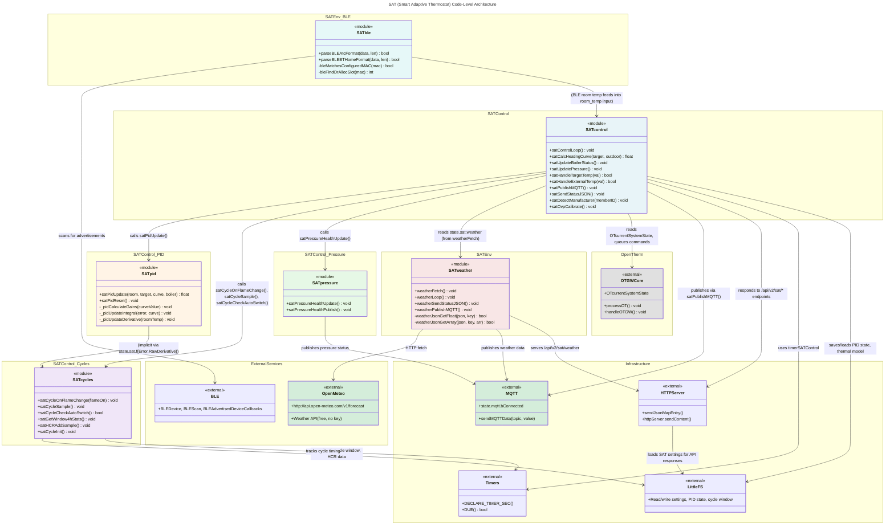

# C4 Code Level: SAT (Smart Adaptive Thermostat) Module

## Overview

- **Name**: SAT (Smart Adaptive Thermostat) Module
- **Description**: Embedded intelligent heating controller for ESP8266/ESP32 that provides autonomous room temperature regulation, PID-based setpoint control, weather compensation, duty cycle management, and boiler performance monitoring via OpenTherm.
- **Location**: `/src/OTGW-firmware/SAT*.ino` (SATcontrol.ino, SATcycles.ino, SATpid.ino, SATpressure.ino, SATweather.ino, SATble.ino)
- **Language**: Arduino C/C++ (ESP8266/ESP32 with OpenTherm integration)
- **Purpose**: Autonomous room temperature control with adaptive heating curve, PID controller, cycle analysis, weather compensation, and multi-sensor support (OpenTherm, BLE, MQTT, external weather API).

## Code Elements

### SATcontrol.ino — Main Control Loop & Heating Curve

#### Core Functions

- `void satControlLoop()` (line 3328)
  - **Purpose**: Main SAT control cycle; executes every `settings.sat.iControlInterval` seconds (default 60s)
  - **Flow**: Read room temp → validate input → calculate heating curve → apply PID → determine setpoint → send to boiler → publish MQTT
  - **Dependencies**: PID controller, cycle tracker, weather data, boiler status evaluator, MQTT publisher
  - **Called from**: Main firmware loop (doBackgroundTasks)

- `float satCalcHeatingCurve(float targetTemp, float outsideTemp)` (line 366)
  - **Purpose**: Calculate boiler flow temperature setpoint using SAT heating curve formula
  - **Formula**: `baseOffset + (coeff / 4) * [4*(target - 20) + 0.03*(outside - 20)² - 0.4*(outside - 20)]`
  - **Params**: targetTemp (room target °C), outsideTemp (outdoor temp °C)
  - **Returns**: Boiler flow setpoint (°C)
  - **State update**: `state.sat.fHeatingCurveValue`

- `void satUpdateBoilerStatus()` (line 398)
  - **Purpose**: State machine tracking boiler status across 9 states (OFF, IDLE, WAITING_FLAME, ANTI_CYCLING, STALLED_IGNITION, PUMP_STARTING, IGNITION_SURGE, PREHEATING, HEATING, MODULATING_UP, AT_SETPOINT, COOLING, OVERSHOOT_COOLING)
  - **State transitions**: Based on flame on/off, boiler temp, setpoint, modulation, and timing thresholds
  - **Key timing**: Post-cycle settle (60s), anti-cycle min OFF (180s), stalled ignition adaptive threshold
  - **Updates**: `state.sat.eBoilerStatus`

- `void satUpdatePressure()` (SATcontrol.ino, pressure health monitoring)
  - **Purpose**: Monitor CH water pressure (OT MsgID 18), EMA smoothing, linear regression drop rate, alarm confirmation
  - **Inputs**: OT pressure reading, min/max pressure thresholds from settings
  - **Outputs**: `state.sat.fSmoothedPressure`, `state.sat.bPressureAlarm`, `state.sat.bPressureHealthy`

- `void satPublishMQTT()` (line 1666)
  - **Purpose**: Publish SAT state to MQTT topics (sat/*, sat/energy/*, sat/pressure/*, etc.)
  - **Topics**: 
    - `sat/enabled`, `sat/control_mode`, `sat/target`, `sat/room_temp`, `sat/outdoor_temp`, `sat/boiler_temp`
    - `sat/heating_curve_value`, `sat/heating_system`, `sat/final_setpoint`, `sat/boiler_status`
    - `sat/pid_output`, `sat/pid_p`, `sat/pid_i`, `sat/pid_d`, `sat/pid_error`, `sat/pid_derivative`
    - `sat/ch_pressure`, `sat/ch_pressure_status`
    - Energy metrics: `sat/energy/flame_on_sec`, `sat/energy/cycles_hour`, `sat/energy/ema_duty_ratio`

- `void satSendStatusJSON()` (line 1466)
  - **Purpose**: Send SAT status as JSON via REST API (`/api/v2/sat/status`)
  - **Fields**: enabled, mode, room_temp, outdoor_temp, boiler_temp, heating_curve, final_setpoint, boiler_status, PID gains/output, cycle metrics

#### Input Handlers (MQTT/REST)

- `bool satHandleTargetTemp(const char* value)` (line 1210)
  - **Purpose**: Parse and validate room target temperature from MQTT/REST
  - **Returns**: true if valid (within 5–30°C)
  - **Updates**: `settings.sat.fTargetRoomTemp`

- `bool satHandleExternalTemp(const char* value)` (line 970)
  - **Purpose**: Accept external room temperature sensor (override/supplement MQTT)
  - **Updates**: `state.sat.fRoomTemp`, `state.sat.iLastExtTempMs`

- `bool satHandleExternalOutdoor(const char* value)` (line 986)
  - **Purpose**: Accept external outdoor temperature (for weather-less integration)
  - **Updates**: `state.sat.fOutdoorTemp`, `state.sat.iLastExtOutdoorMs`

- `bool satHandleHumidity(const char* value)` (line 1003)
  - **Purpose**: Parse and store indoor humidity (for diagnostics/future use)
  - **Updates**: `state.sat.fHumidity`

- `bool satHandleAreaTemp(uint8_t area, const char* value)` (line 1033)
  - **Purpose**: Store multi-area temperature (Task #25) for future zone control
  - **Params**: area 0–3, temperature string
  - **Updates**: `state.sat.areaTemps[area]`, staleness tracking

- `bool satHandleSunElevation(const char* value)` (line 1018)
  - **Purpose**: Parse solar elevation angle for passive solar gain compensation
  - **Updates**: `state.sat.fSunElevation`

#### Preset & Setpoint Management

- `void satHandlePreset(const char* value)` (line 736)
  - **Purpose**: Apply comfort presets (comfort, away, sleep, frost)
  - **Presets**:
    - comfort: 21°C
    - away: 15°C (reduced load, anti-freeze)
    - sleep: 18°C (lower comfort)
    - frost: 5°C (anti-freeze only)
  - **Updates**: `settings.sat.fTargetRoomTemp`

- `void satHandleWindow(bool isOpen)` (line 791)
  - **Purpose**: Respond to open window detection (pause heating, reduce target)
  - **Behavior**: Set target to frost preset + timer to re-enable after SAT_WINDOW_TIMEOUT_SEC
  - **Updates**: `state.sat.bWindowOpen`

#### Initialization & State Management

- `void initSAT()` (setup phase)
  - **Purpose**: Initialize SAT subsystem, load settings, calibrate PID gains, start timers
  - **Called**: Once during firmware setup

- `void satDisable()` (line 1400)
  - **Purpose**: Gracefully disable SAT (keep boiler at off setpoint, clear state)
  - **Behavior**: Send CS=0 command, reset internal state

- `void satFlushShortLivedData()` (line 1422)
  - **Purpose**: Clear transient runtime state (room temps, outdoor temps, solar gain flags) on disable
  - **Keeps**: Settings, cycle history, PID coefficients

- `void satSavePidState()` (line 1279)
  - **Purpose**: Persist PID state to LittleFS (for recovery after restart)
  - **Saves**: Last error, integral, derivative values

- `void satLoadPidState()` (line 1292)
  - **Purpose**: Restore PID state from LittleFS

#### Boiler & Manufacturer Support

- `void satDetectManufacturer(uint8_t slaveMemberID)` (line 124)
  - **Purpose**: Auto-detect boiler manufacturer from OT MsgID 3 slave MemberID
  - **Table**: 18 manufacturers (Atag, Baxi, Bosch, Ferroli, Geminox, Ideal, Immergas, Intergas, Nefit, etc.) + Unknown
  - **Quirks**: Per-manufacturer workarounds (e.g., SAT_QUIRK_NO_REL_MOD for Ideal/Nefit/Intergas)
  - **Updates**: `state.sat.iDetectedManufacturer`

- `void satGetBoilerStatusName(char* buf, size_t bufLen)` (line 547)
  - **Purpose**: Convert SATBoilerStatus enum to human-readable name
  - **Returns**: Status string in provided buffer (e.g., "HEATING", "AT_SETPOINT")

- `uint8_t satGetMaxCyclesPerHour()` (line 183)
  - **Purpose**: Determine max cycles/hour for current heating system (user-configurable or system default)
  - **Defaults**: Heat pump 2, underfloor 3, radiators 4
  - **Returns**: Max cycles per hour

- `static float satGetMaxSetpoint()` (line 161)
  - **Purpose**: Return max boiler setpoint based on heating system type (safety ceiling)
  - **Returns**: Heat pump 40°C, underfloor 45°C, radiators 62°C

- `static float satGetBaseOffset()` (line 172)
  - **Purpose**: Return heating curve base offset for system type
  - **Returns**: Underfloor 20°C, radiators 27.2°C

#### OPV (Overshoot Protection) Calibration

- `static void satOvpCalibrate()` (line 249)
  - **Purpose**: State machine for automatic overshoot protection calibration
  - **Phases**: STARTING → WARMING (3 min wait for flame) → MEASURING (20 min at MM=0) → DONE/FAILED → recovery (CS=0, MM=100)
  - **Acceptance**: Minimum 40 samples, ≥5°C temperature rise
  - **Updates**: `settings.sat.fOvpValue`, `settings.sat.bOvpEnabled`

- `static void satOvpStartCalibration()` (line 331)
  - **Purpose**: User-triggered OPV calibration start

- `static void satOvpStopCalibration()` (line 340)
  - **Purpose**: User-triggered OPV calibration cancel

---

### SATpid.ino — PID Controller (Version 3)

#### PID State & Initialization

- `void satPidReset()` (line 51)
  - **Purpose**: Reset all PID internal state and gains to zero
  - **Clears**: Error, integral, derivative, gains, output
  - **Updates**: `state.sat.fPid*` and `_pid_*` statics

- `void satResetIntegral()` (line 43)
  - **Purpose**: Debug tool; reset integral only (does not affect P and D)
  - **Updates**: `_pid_integral`, `state.sat.fPidI`

#### PID Gains & Auto-Tuning

- `static void _pidCalculateGains(float curveValue)` (line 77)
  - **Purpose**: Auto-calculate Kp, Ki, Kd from heating curve value (Version 3)
  - **Formula**:
    - `Kp = (coeff * curveValue) / divisor` (divisor: 4 for underfloor, 3 for radiators)
    - `Ki = Kp / AGGRESSION_V3` (aggression = 8400)
    - `Kd = 0.07 * AGGRESSION_V3 * Kp`
  - **Manual mode**: If `settings.sat.bAutoGains == false`, pass through `fKpManual`, `fKiManual`, `fKdManual`
  - **Updates**: `state.sat.fKp`, `state.sat.fKi`, `state.sat.fKd`

#### Integral Update (Deadband Mode)

- `static void _pidUpdateIntegral(float error, float curveValue, bool force)` (line 104)
  - **Purpose**: Update integral term (only active within deadband as solar gain compensator)
  - **Deadband**: Inside ±deadband (default 0.1°C), integral accumulates; outside, reset to 0
  - **Solar freeze**: Skip accumulation if `state.sat.bSolarGainActive` (Task #23)
  - **Clamping**: Integral clamped to [0, curveValue] — positive only
  - **Absolute cap**: 20°C hard limit (defense against windup)
  - **Formula**: `integral += Ki * error * 60s` (fixed 60s per SAT Python)

#### Derivative Update (Temperature-Based, Frozen in Deadband)

- `static void _pidUpdateDerivative(float roomTemp)` (line 138)
  - **Purpose**: Update derivative from room temperature rate of change (negative sign: rising temp = damping)
  - **Deadband freeze**: Inside deadband, derivative holds last value (acts as offset); outside, actively updates
  - **Low-pass filter**: Adaptive alpha = dt / (UPDATE_INTERVAL + dt)
  - **Magnitude cap**: ±5°C/s hard limit before and after filter
  - **Temperature-based**: Uses `-(roomTemp - lastTemp) / dt` (negative sign per SAT Python)
  - **Sample gate**: Skip if dt < UPDATE_INTERVAL or |tempDelta| < 0.001°C

#### Main PID Loop

- `float satPidUpdate(float roomTemp, float targetTemp, float heatingCurveValue, float boilerTemp)` (line 190)
  - **Purpose**: Main PID update; returns setpoint = heatingCurveValue + P + I + D
  - **Sample gate**: Min 10s between updates, skip if error hasn't changed meaningfully (<0.001°C)
  - **Initialization**: First call initializes all tracking variables
  - **Gain calculation**: Auto-calculate gains from heating curve (or use manual if disabled)
  - **P term**: `Kp * error`
  - **I term**: Integral accumulator (clamped to [0, curveValue])
  - **D term**: `Kd * filtered_derivative` (temperature-based, frozen in deadband)
  - **Output**: `heatingCurveValue + P + I + D`
  - **Returns**: Final PID output (boiler setpoint)
  - **Updates**: `state.sat.fPid{P,I,D,Output}`, `state.sat.f{Error,RawDerivative}`

---

### SATcycles.ino — Cycle Tracking & PWM Auto-Switch

#### Cycle Initialization & Tracking

- `void satCycleInit()` (line 161)
  - **Purpose**: Initialize all cycle tracking buffers and state
  - **Clears**: Flame state, flow sample buffer, cycle history, per-hour counter, 4-hour window, HCR daily medians
  - **Called**: Once during SAT initialization

#### Per-Cycle Monitoring

- `void satCycleOnFlameChange(bool flameOn)` (line 490)
  - **Purpose**: Detect flame ON/OFF transitions, finalize cycle metrics, apply PWM auto-switch logic
  - **On flame OFF**: Classify cycle (OVERCYCLE, NORMAL, UNDERCYCLE, etc.), compute duty metrics
  - **On flame ON**: Start new cycle, sample opening setpoint
  - **PWM auto-switch**: Detect sustained overshoot/undershoot/saturation → switch continuous ↔ PWM mode

- `void satCycleSample()` (line 560)
  - **Purpose**: Per-update sampling of flow temperature during active cycle
  - **Buffers**: Store flow temp in ring buffer (64 slots for ESP8266, 256 for ESP32)
  - **Metrics**: Track max/min flow temp, overshoot duration

#### Cycle Classification & History

- `bool satCycleCheckAutoSwitch()` (line 617)
  - **Purpose**: Evaluate sustained overshoot/undershoot/saturation over recent cycles
  - **Thresholds**:
    - **Overshoot**: 2 min of boiler > setpoint + margin → PWM mode
    - **Underheat**: 3 min of room < target - 2°C → continuous mode
    - **Saturation**: 5 min of FF ≈ max setpoint → continuous mode
  - **Guard**: Skip overshoot→PWM during/after DHW (300s guard)
  - **Returns**: true if mode switch occurred

- `uint8_t satCycleCountClass(SATCycleClass cls)` (line 682)
  - **Purpose**: Count recent cycles of a given class (last ~16 cycles)
  - **Returns**: Count of cycles matching class

- `uint32_t satCycleGetFlameOnStartMs()` (line 692)
  - **Purpose**: Get timestamp of current/last flame ON event
  - **Returns**: millis() at flame ignition

- `uint32_t satCycleGetFlameOffStartMs()` (line 693)
  - **Purpose**: Get timestamp of current/last flame OFF event
  - **Returns**: millis() at flame extinction

- `uint32_t satCycleGetPhaseDurationSec()` (line 706)
  - **Purpose**: Get duration of current cycle phase in seconds
  - **Returns**: Elapsed time since phase start

#### Hour-based Cycle Limiting (Task #203)

- `bool satCycleIsHourLimitReached()` (line 232)
  - **Purpose**: Check if max cycles/hour threshold has been reached
  - **Window**: Rolling 60-minute window (ring buffer of 6 timestamps)
  - **Returns**: true if cycles exceeded limit

- `uint8_t satCycleGetCyclesThisHour()` (line 241)
  - **Purpose**: Get count of flame-on events in current rolling hour
  - **Returns**: Number of cycles (0–6)

#### 4-Hour Window Statistics (Task #227)

- `void satGetWindow4hStats()` (line 254)
  - **Purpose**: Compute aggregated 4-hour rolling window metrics
  - **Metrics computed**:
    - `i4hCycles`: Total flame-on events in 4 hours
    - `f4hAvgOnSec`, `f4hAvgOffSec`: Average cycle on/off durations
    - `f4hAvgFlow`: Mean flow temperature
    - `f4hDutyRatio`: Fraction of time flame is on
    - `f4hOvershootFraction`, `f4hUnderheatFraction`: EMA cycle class fractions
    - `f4hFlowRetDeltaP50`, `f4hFlowRetDeltaP90`: Flow-return delta percentiles (for DHW detection)
  - **Updates**: `state.sat.f4h*` fields

- `void satSaveCycleWindow()` (line 938)
  - **Purpose**: Persist 4-hour window to LittleFS (recovery after restart)

- `void satLoadCycleWindow()` (line 968)
  - **Purpose**: Restore 4-hour window from LittleFS

#### Heating Curve Recommendation (Task #228)

- `void satHCRAddSample()` (line 850)
  - **Purpose**: Accumulate daily (room - target) error samples for HCR analysis
  - **Sampling**: 15-min intervals (96 samples/day on ESP8266, 1-min on ESP32 = 1440 samples)
  - **Daily median**: At midnight (day rollover), compute median of day's samples

- `void satHCRSaveState()` (line 750)
  - **Purpose**: Persist HCR ring buffer (daily medians) to `/sat/sat_hcr.json`

- `void satHCRLoadState()` (line 784)
  - **Purpose**: Restore HCR ring buffer from `/sat/sat_hcr.json`

- `void satHCRReset()` (line 838)
  - **Purpose**: Clear all HCR data and start fresh learning period

---

### SATpressure.ino — CH Pressure Monitoring (Task #226)

#### Pressure Health Update & Publishing

- `void satPressureHealthUpdate()` (line 33)
  - **Purpose**: Mirror raw OT pressure reading and derive status string
  - **Inputs**: OT MsgID 18 → `OTcurrentSystemState.CHPressure`
  - **Status**: "ok" (normal), "low" (smoothed < min), "high" (smoothed > max)
  - **Alarm**: Confirmed after 120s (`bPressureAlarm && !bPressureHealthy`)
  - **Updates**: `state.sat.fBoilerPressure`, `state.sat.sPressureStatus`

- `void satPressureHealthPublish()` (line 62)
  - **Purpose**: Publish pressure state to MQTT topics
  - **Topics**: `sat/ch_pressure` (bar, raw OT reading), `sat/ch_pressure_status` (ok/low/high)

---

### SATweather.ino — Weather Integration & Heat Curve Compensation

#### Weather Data Fetch

- `void weatherFetch()` (line 109)
  - **Purpose**: Fetch current weather and 24-hour forecast from Open-Meteo API (free, no key)
  - **URL**: `http://api.open-meteo.com/v1/forecast?latitude=...&longitude=...&current=temperature_2m,relative_humidity_2m,wind_speed_10m&hourly=temperature_2m`
  - **Coordinates**: User-configured latitude/longitude (checked if non-zero)
  - **Timeout**: 5s (ESP8266 HW WDT fires at ~8s)
  - **Updates**: `state.sat.weather.{fTemperature, fHumidity, fWindSpeed, bValid}`
  - **Forecast**: Array of 24-hour temperature predictions stored in `_weather_forecastTemp[]`

- `void weatherLoop()` (line 191)
  - **Purpose**: Timer-guarded loop; calls `weatherFetch()` every 15 min (configurable 5–60 min)
  - **Called**: From main loop

#### Weather Helpers

- `static bool weatherJsonGetFloat(const char* json, PGM_P key, float* out)` (line 38)
  - **Purpose**: Parse JSON numeric value by key (lightweight, no ArduinoJson)
  - **Returns**: true if key found and parsed successfully

- `static bool weatherJsonGetArray(const char* json, PGM_P key, float* arr, uint8_t maxLen, uint8_t* count)` (line 64)
  - **Purpose**: Extract JSON array (e.g., hourly forecast) from "hourly" section
  - **Returns**: true if array parsed; populates `count` with element count

#### REST API & MQTT

- `void weatherSendStatusJSON()` (line 201)
  - **Purpose**: Send weather status via REST API (`/api/v2/sat/weather`)
  - **Fields**: enabled, valid, temperature, humidity, wind_speed, latitude, longitude, fetch_errors, age_seconds, forecast[24]

- `void weatherPublishMQTT()` (line 259)
  - **Purpose**: Publish current weather to MQTT
  - **Topics**: `sat/weather/{temperature, humidity, wind_speed}`

---

### SATble.ino — BLE Room Sensor Integration (ESP32 Only)

#### BLE Sensor Structures & Constants

- `struct BLESensorData` (line 40)
  - **Fields**: sMacAddress[18], fTemperature, fHumidity, iBattery, iRssi, bValid, iLastSeenMs
  - **Sensor array**: 4 max (ESP32 only)

#### BLE Parsing Formats

- `static bool parseBLEAtcFormat(const uint8_t* data, size_t len, float* temp, float* hum, uint8_t* batt)` (line 66)
  - **Purpose**: Parse ATC/pvvx custom firmware format (service UUID 0x181A)
  - **Format**: MAC(6) + temp_s16(2) + hum_u16(2) + batt%(1) + batt_mv(2) + counter(1) = 14 bytes
  - **Conversion**: temp/100, hum/100
  - **Sanity**: temp [-40, 60°C], humidity [0, 100%]

- `static bool parseBLEBTHomeFormat(const uint8_t* data, size_t len, float* temp, float* hum, uint8_t* batt)` (line 93)
  - **Purpose**: Parse BTHome v2 format (service UUID 0xFCD2)
  - **Format**: flags(1) + [obj_id(1) + value(variable)]*
  - **Object IDs**: 0x02=temp_s16 (÷100), 0x03=humidity_u16 (÷100), 0x01=battery_u8

#### BLE Slot Management

- `static int bleFindOrAllocSlot(const char* mac)` (line 154)
  - **Purpose**: Find existing sensor slot or allocate new one for MAC address
  - **Returns**: Slot index [0, 3] or -1 if full

- `static bool bleMatchesConfiguredMAC(const char* mac)` (line 144)
  - **Purpose**: Check if MAC matches filter (empty filter = accept all)
  - **Returns**: true if match or no filter configured

#### BLE Scan Callback

- `class SATBLEScanCallbacks : public BLEAdvertisedDeviceCallbacks` (line 171)
  - **Purpose**: BLE advertisement scan handler
  - **Method**: `onResult(BLEAdvertisedDevice)` (line 172)
    - Parses ATC/pvvx and BTHome v2 formats
    - Updates sensor slots with temp, humidity, battery, RSSI
    - Skips if MAC doesn't match filter

---

## Dependencies

### Internal Dependencies

- **OTGW-Core.ino**: `processOT()`, `handleOTGW()` — OpenTherm frame processing
- **OTGWconstants.h**: OT MsgID definitions, boiler response parsing
- **settingStuff.ino**: Settings loading/saving (SAT settings persist to LittleFS)
- **MQTTstuff.ino**: `sendMQTTData()`, `sendStartJsonMap()`, `sendJsonMapEntry()` — MQTT publish
- **restAPI.ino**: REST API dispatch for SAT endpoints (`/api/v1/sat/*`, `/api/v2/sat/*`)
- **timerStuff.ino**: `DECLARE_TIMER_SEC()`, `DUE()` macro-based timer management
- **safeTimers.h**: Safe timer macros (cooperative scheduling)
- **HTTPServer**: `httpServer.sendContent()`, `sendEndJsonMap()` — HTTP response streaming
- **OTGW-firmware.h**: State structures (`OTGWState.sat`, `OTGWSettings.sat`), typedefs (SATCycleClass, SATBoilerStatus, etc.), PROGMEM string constants

### External Dependencies

- **Arduino Core (ESP8266/ESP32)**:
  - WiFiClient, HTTPClient — HTTP requests (ESP8266: `<ESP8266HTTPClient.h>`, ESP32: `<HTTPClient.h>`)
  - BLEDevice, BLEUtils, BLEScan — BLE scanning (ESP32 only)
  - Time functions: `millis()`, `time()`, `gmtime()`
  - Memory: PROGMEM, `pgm_read_byte()`, `strncpy_P()`, `snprintf_P()`

- **Open-Meteo API**: Free weather API (no key, HTTP only, free tier ~10k requests/day)
  - Endpoint: `http://api.open-meteo.com/v1/forecast`
  - Data: Current temp/humidity/wind + 24-hour forecast

- **MQTT Broker**: Any MQTT v3.1.1 broker (Home Assistant, Mosquitto, etc.)
  - Topics: `sat/*`, `sat/energy/*`, `sat/weather/*`

### Design Notes

- **No ArduinoJson**: SAT uses lightweight custom JSON parsers (`weatherJsonGetFloat()`, `weatherJsonGetArray()`) to reduce flash/RAM footprint
- **PROGMEM-heavy**: All string literals in PROGMEM to preserve ~40KB ESP8266 DRAM
- **Re-entrancy-safe**: `satControlLoop()` can be called during yield() without state corruption (uses static buffers with documented ownership)
- **BLE ESP32-only**: SATble.ino wrapped in `#if defined(ESP32)` conditional
- **Manufacturer table**: 18 boilers + quirks system for model-specific workarounds

---

## Key Algorithms

### 1. Heating Curve Calculation

**Formula** (per SAT Python):
```
heatingCurveValue = baseOffset + (coeff / 4) × [4(T_target - 20) + 0.03(T_out - 20)² - 0.4(T_out - 20)]
```

- **Base Offset**: 20°C (underfloor), 27.2°C (radiators)
- **Coefficient**: User-configured (typical 0.8–1.5), affects slope responsiveness
- **Temperature reference**: 20°C (indoor comfort standard)
- **Purpose**: Automatically reduce boiler setpoint as outdoor temp rises (weather compensation)

### 2. PID Controller (Version 3)

**Structure**:
- **P (Proportional)**: `Kp × error` — immediate response to temperature deviation
- **I (Integral)**: Only active inside deadband (±0.1°C); compensates for external heat (sun, activity)
- **D (Derivative)**: Temperature-based (not error-based); frozen inside deadband to act as offset

**Auto-Gain Formula**:
```
Kp = (coeff × curve_value) / divisor  [divisor: 4 for underfloor, 3 for radiators]
Ki = Kp / 8400  [AGGRESSION_V3 = 8400]
Kd = 0.07 × 8400 × Kp = 588 × Kp
```

**Integral Bounds**: [0, heatingCurveValue] — positive only; clamped at 20°C absolute cap

**Derivative Low-Pass**: Adaptive alpha = dt / (60s + dt); magnitude cap ±5°C/s

**Output**: `heatingCurveValue + P + I + D`

### 3. Cycle Classification & PWM Auto-Switch

**Cycle Kinds**:
- **SHORT_CYCLING**: Flame on <60s
- **OVERCYCLE**: Boiler overshoots setpoint
- **UNDERCYCLE**: Room undershoots target by 2°C
- **NORMAL**: Well-balanced cycle
- **SATURATED**: Boiler maxes out

**Auto-Switch Logic**:
- **Overshoot sustained 2 min** → Switch to PWM mode (reduce cycling frequency)
- **Underheat sustained 3 min** → Switch to continuous mode (steady heating)
- **Saturation sustained 5 min** → Switch to continuous mode (demand exceeds capacity)

**DHW Guard**: Skip overshoot→PWM switch for 300s after DHW activity (to avoid false triggers)

### 4. Boiler Status State Machine

**9 States**:
1. **OFF**: No flame, no demand
2. **IDLE**: No flame, no demand, normal temp
3. **WAITING_FLAME**: Demand present, flame ignition expected
4. **ANTI_CYCLING**: Demand present but min OFF time (180s) not yet elapsed
5. **STALLED_IGNITION**: Demand present, OFF time > adaptive threshold (1.5× last cycle, min 120s, max 900s)
6. **PUMP_STARTING**: Flame just lit, temp dropping >6°C (pump warming phase)
7. **IGNITION_SURGE**: Flame just lit, temp rising >0.5°C/s (ignition transient)
8. **PREHEATING**: Flame on, modulation increasing, temp < setpoint
9. **HEATING**: Flame on, steady heating
10. **MODULATING_UP**: Flame on, modulation rising, temp < setpoint
11. **AT_SETPOINT**: Flame on, temp within ±1.5°C of setpoint
12. **COOLING**: Flame off, temp above setpoint (natural cooling)
13. **OVERSHOOT_COOLING**: Flame off, temp > setpoint + overshoot margin

**Transitions**: Based on flame edges, temp rate of change, modulation deltas, and timing thresholds

### 5. Thermal Drop Learning (Task #21)

**Purpose**: Auto-calibrate room thermal mass model (for 2-hour safe-mode fallback during DHW)

**Sampling Window**: 5 min between samples, 24h of data required

**Algorithm**:
- Measure room temp decay during flame-off (outdoor temp stable, Δ_in_out ≥ 2°C)
- Estimate thermal coefficient: `d(T_room)/dt ≈ -coeff × (T_room - T_out)`
- Apply EMA smoothing: `coeff = 0.1 × measured + 0.9 × prior`
- Bounds: [0.005, 0.3] °C/min (sanity check)

**Use Case**: If room sensor fails or goes stale during DHW, fall back to constant 45°C setpoint for 2 hours (safe estimate)

### 6. 4-Hour Rolling Window Stats (Task #227)

**Buffers**:
- Ring buffer of cycle summaries: on_sec, off_sec, max_flow_temp, overshoot_sec (ESP8266: 16 slots ~5h, ESP32: 90 slots ~24h)

**Computed Metrics**:
- **Duty Ratio**: Fraction of time flame on (EMA 0.15 decay per cycle)
- **Overshoot Fraction**: Cycles with boiler > setpoint (EMA)
- **Underheat Fraction**: Cycles with room < target - 2°C (EMA)
- **Flow-Return Delta**: Percentiles (P50, P90) for DHW detection
- **Average On/Off Duration**: Per-cycle statistics

**Purpose**: Detect sustained conditions (overshoot, underheat, saturation) → PWM auto-switch

### 7. Heating Curve Recommendation (HCR, Task #228)

**Goal**: Suggest coefficient adjustment if consistent error over days

**Sampling**: Per-minute (ESP32) or 15-min (ESP8266) errors: `room_temp - target_temp`

**Daily Median**: At midnight, compute median of day's errors

**Detection**:
- 3 consecutive days with median error > ±0.5°C (threshold)
- Recommend increase coeff if consistently cold, decrease if consistently hot

**Persistence**: Save daily ring to `/sat/sat_hcr.json` (LittleFS)

### 8. Boiler Pressure Monitoring (Task #226)

**Input**: OT MsgID 18 (CH water pressure bar)

**Processing**:
- EMA smoothing (to filter oscillations)
- Linear regression: detect drop rate (liters/hour estimate)
- Alarm confirmation: 120s sustained out-of-bounds before reporting

**Status Bands**:
- Low: smoothed < settings.sat.fMinPressure (typical 1.0 bar)
- High: smoothed > settings.sat.fMaxPressure (typical 2.5 bar)
- OK: within band OR out-of-band but not yet confirmed

**Publish**: MQTT `sat/ch_pressure` (raw bar), `sat/ch_pressure_status` (ok/low/high)

---

## State Structures

### OTGWState.sat (Runtime)

```cpp
// Temperature inputs
float   fRoomTemp, fTargetRoomTemp, fOutdoorTemp
float   fHumidity, fSunElevation
bool    bWindowOpen
uint32_t iLastExtTempMs, iLastExtOutdoorMs

// Heating curve & setpoint
float   fHeatingCurveValue    // Output of satCalcHeatingCurve()
float   fFinalSetpoint        // After PID, clamping, OPV check

// PID state
float   fKp, fKi, fKd         // Current gains
float   fPidP, fPidI, fPidD   // P, I, D terms
float   fPidOutput            // Heating curve + P + I + D
float   fError, fRawDerivative

// Boiler status
SATBoilerStatus eBoilerStatus
float   fLastCycleDuration
uint32_t iLastCycleDurationMs

// Pressure
float   fSmoothedPressure
float   fBoilerPressure       // Raw OT reading
char    sPressureStatus[8]    // "ok", "low", "high"
bool    bPressureAlarm, bPressureHealthy

// Cycle metrics
uint8_t iCyclesThisHour
uint32_t i4hCycles
float   f4hAvgOnSec, f4hAvgOffSec, f4hAvgFlow, f4hDutyRatio
float   f4hOvershootFraction, f4hUnderheatFraction
float   f4hFlowRetDeltaP50, f4hFlowRetDeltaP90
bool    bSolarGainActive      // Task #23

// OPV calibration
SATCalibPhase eCalibPhase
uint32_t iCalibStartMs
float   fCalibStartTemp, fCalibMaxTemp
uint16_t iCalibSamples

// Weather
struct {
  bool    bValid
  float   fTemperature, fHumidity, fWindSpeed
  uint32_t iLastUpdateMs
  uint32_t iFetchErrors
} weather;

// BLE sensors (ESP32 only)
// ... BLESensorData array

// Manufacturer
uint8_t iDetectedManufacturer, iSlaveMemberID
uint8_t iDetectedHeatingSystem
```

### OTGWSettings.sat (Persistent)

```cpp
// Enable/mode
bool    bEnabled, bAutoMode
uint8_t iControlInterval     // Seconds between PID updates (default 60)

// Room sensors
float   fTargetRoomTemp      // Room target (5–30°C)
bool    bUseExternalTemp     // External sensor override
float   fExternalTemp
// Area temps (Task #25)
uint8_t iMultiAreaMode       // 0=off, 1–4=area count
float   fAreaTemp[4]

// Heating system
uint8_t iHeatingSystem       // SAT_HSYS_AUTO, RADIATORS, UNDERFLOOR, HEAT_PUMP
uint8_t iManufacturer        // SAT_MFR_AUTO, ATAG, BAXI, ... WORCESTER, OTHER

// Heating curve
float   fHeatingCurveCoeff   // Typical 0.8–1.5
bool    bAutoGains           // Enable auto-gain calculation (default true)
float   fKpManual, fKiManual, fKdManual  // Manual gains if bAutoGains=false

// Control parameters
float   fDeadband            // Integral deadband (default 0.1°C)
float   fOvershootMargin     // Overshoot threshold (default 2.0°C)
uint8_t iCyclesPerHour       // Max cycles/hour (2–6, or 0=auto)

// Safety limits
float   fMinSetpoint, fMaxSetpoint
float   fMinPressure, fMaxPressure

// OPV
bool    bOvpEnabled          // Overshoot protection active
float   fOvpValue            // Max safe boiler temp

// PWM mode
uint8_t iPwmMinOnMinutes     // Minimum ON time in PWM (default 3 min)

// Weather
bool    bWeatherEnable       // Enable weather API
float   fWeatherLat, fWeatherLon

// BLE
bool    bBleEnable           // Enable BLE scanning (ESP32 only)
char    sBleMAC[18]          // Filter MAC or empty (accept all)

// Advanced
bool    bThermalLearningEnable  // Auto-learn thermal model (Task #21)
uint32_t iThermalCoeffMs      // Last good thermal coefficient timestamp
```

---

## Relationships & Data Flows

### Control Loop Flow

```
satControlLoop()
  ├─ satHandleRoomTemperature() → state.fRoomTemp
  ├─ satCalcHeatingCurve(fTargetRoomTemp, fOutdoorTemp) → fHeatingCurveValue
  ├─ satPidUpdate(fRoomTemp, fTargetRoomTemp, fHeatingCurveValue, fBoilerTemp)
  │   ├─ _pidCalculateGains(fHeatingCurveValue) → fKp, fKi, fKd
  │   ├─ _pidUpdateIntegral(error, fHeatingCurveValue) → integral
  │   ├─ _pidUpdateDerivative(fRoomTemp) → rawDerivative
  │   └─ return heatingCurveValue + P + I + D
  ├─ satUpdateBoilerStatus() → eBoilerStatus
  ├─ satUpdatePressure() → fSmoothedPressure, bPressureAlarm
  ├─ satCycleSample() → update flow temp buffer
  ├─ satCycleCheckAutoSwitch() → toggle PWM/continuous
  ├─ Apply safety constraints (clamp setpoint, OPV check)
  ├─ Send CS=X command to OTGW
  └─ satPublishMQTT() + satSendStatusJSON()
```

### Inputs

- **OpenTherm MsgID**: 0 (room setpoint), 3 (boiler params), 17 (room temp EXTERNAL), 18 (CH pressure), 19 (DHW pressure)
- **MQTT**: `sat/{target, room_temp, outdoor_temp, humidity, sun_elevation, area_temp_*, enable, control_mode}`
- **REST API**: `/api/v2/sat/*` (all SAT settings/state)
- **BLE Advertisements** (ESP32): ATC/pvvx or BTHome v2 format room sensors
- **Open-Meteo API**: Current + 24-hour forecast weather

### Outputs

- **OpenTherm Command Queue**: `CS=X` (control setpoint), `MM=X` (modulation), `TW=X` (domestic hot water setpoint)
- **MQTT**: `sat/{enabled, control_mode, room_temp, boiler_temp, final_setpoint, pid_*, heating_curve_value, ...}` + energy/weather/pressure topics
- **REST API JSON**: `/api/v2/sat/status`, `/api/v2/sat/weather`, `/api/v2/sat/pressure`
- **LittleFS**: PID state, cycle window, HCR data, settings

---

## Mermaid Diagram: SAT Sub-Module Relationships



---

## Notes

### Performance Characteristics

- **Control loop**: 60s interval (configurable 10–300s), ~100–200ms execution time
- **PID update**: Every 60s (gated by sample time limit, skips if error unchanged <0.001°C)
- **Cycle sampling**: 5s intervals during flame-on phase
- **4-hour stats**: Updated once per minute (Task #227)
- **Weather fetch**: Every 15 min (configurable, 5–60 min, non-blocking)
- **BLE scan**: Every 30s for 3s duration (ESP32 only)
- **HCR daily median**: Computed at midnight (15-min or 1-min samples depending on platform)

### Memory Footprint

- **ESP8266**: SAT module ~8–10KB flash, ~2–3KB DRAM (cycle buffers, state)
- **ESP32**: SAT module ~10–12KB flash, ~4–5KB DRAM (larger buffers, BLE support)
- **No ArduinoJson**: Saves ~5KB flash vs. full library
- **PROGMEM strings**: All UI/API strings in flash

### Critical Sections

- PID gains calculated every control cycle (low cost, ~1ms)
- Integral clamping protects against windup (20°C hard cap)
- Derivative frozen in deadband prevents oscillation near setpoint
- Boiler status state machine: 13 states, anti-cycling guard (180s min OFF), adaptive stall threshold
- Cycle auto-switch: 300s DHW guard prevents false overshoot→PWM during domestic hot water

### Known Constraints

- **Single room sensor input**: SAT uses one primary room temp (MQTT, OpenTherm MsgID 17, or external)
- **No radiant floor valve control**: SAT drives boiler setpoint only (valve mixing not supported)
- **Weather API**: Open-Meteo free tier ~10k requests/day (not production-grade, but suitable for local IoT)
- **BLE ESP32-only**: ESP8266 lacks BLE hardware
- **Linear regression pressure drop**: Simple model; does not detect slow leaks (<0.1 bar/hour)

### Future Extensions (Not Implemented)

- Task #25: Multi-zone temperature sensing (code prepared, features not yet active)
- Task #30: Predictive heating (weather forecast integration for 24-hour curve adjustment)
- Task #21: Full thermal model (learning operational; 2-hour DHW fallback not yet active)
- Adaptive PID gains per room (current: global, curve-based)

