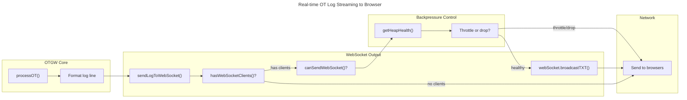
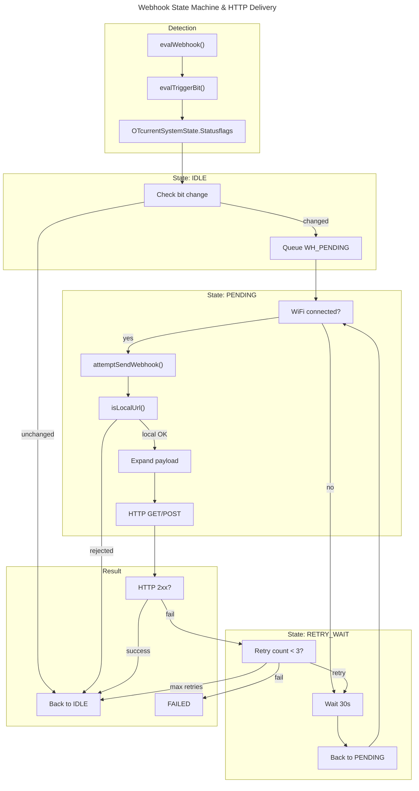

# C4 Code Level: Utilities & WebSocket Module

## Overview

- **Name**: Utilities & WebSocket Module
- **Description**: Foundational utilities, telnet debug server, and real-time WebSocket streaming for the OTGW firmware. Provides helper functions for timestamp formatting, file management, system diagnostics, heap monitoring with backpressure, and WebSocket broadcasting for the live OT log viewer.
- **Location**: `src/OTGW-firmware/` — multiple files
- **Language**: Arduino C++ (.ino/.h)
- **Purpose**: 
  - Unified debug output via telnet (port 23)
  - Cooperative scheduling with safe timer macros handling millis() rollover
  - Real-time WebSocket streaming of OpenTherm messages to Web UI (port 81)
  - HTTP webhook triggering on OT status bit changes with local-network security
  - System monitoring, version reporting, heap health tracking
  - PROGMEM-safe string and data handling for ESP8266's 40KB RAM constraint

## Code Elements

### Core Utilities (helperStuff.ino / helperStuff.h)

#### PROGMEM_readAnything — Flash Memory Safe Copy
- **Signature**: `#define PROGMEM_readAnything(src, dest) memcpy_P(&(dest), (src), sizeof(dest))`
- **Location**: `helperStuff.h:23`
- **Purpose**: Macro for safe copying of PROGMEM structures into RAM. Essential for ESP8266 where string/data literals must reside in flash. sizeof(dest) ensures bounds safety.
- **Usage**: Copies PROGMEM-resident structs without exposing pointer domains (flash vs. RAM).

#### Timestamp Helpers

##### getOTLogTimestamp()
- **Signature**: `const char* getOTLogTimestamp()`
- **Location**: `helperStuff.ino:19-41`
- **Returns**: Pointer to static char[16] "HH:MM:SS.mmmmmm" (6-digit microsecond resolution)
- **Purpose**: High-resolution log timestamps with timezone awareness using ACE TimeZone library.
- **Details**: 
  - Microsecond precision from `gettimeofday()`
  - Uses cached timezone to avoid repeated object creation
  - Falls back to UTC on timezone error
  - Static buffer pattern (ADR-004: no heap allocation)

##### yearChanged() / dayChanged() / minuteChanged()
- **Signature**: `bool yearChanged()`, `bool dayChanged()`, `bool minuteChanged()`
- **Location**: `helperStuff.ino:399-436`
- **Purpose**: Detect calendar rollover events using static state tracking (cache pattern).
- **Returns**: true on first call after transition, false otherwise.
- **Usage**: Drive time-based events (log rotation, daily summaries, etc.)

#### Reboot Tracking

##### updateRebootCount()
- **Signature**: `uint32_t updateRebootCount()`
- **Location**: `helperStuff.ino:137-169`
- **Returns**: Incremented reboot count
- **Purpose**: Persist reboot counter to LittleFS file `/reboot_count.txt` (one number per line).
- **Details**: Atomic read-modify-write; uses static char[12] buffer (ADR-004).

##### readLatestCrashLog() / updateRebootLog()
- **Signature**: 
  - `bool readLatestCrashLog(char* summary, size_t summarySize, char* details, size_t detailsSize)`
  - `bool updateRebootLog(String text)`
- **Location**: `helperStuff.ino:244-375`
- **Purpose**: Crash/reboot log persistence. Updates maintain most recent 20 entries (circular buffer in file).
- **Details**: 
  - `updateRebootLog()` logs reboot timestamp, cause code, register dump, exception info
  - Rotates logs via temp file rename pattern (atomic on most filesystems)
  - Uses static buffers for log line formatting (ADR-004)

#### Filesystem Monitoring

##### updateLittleFSStatus() / checklittlefshash()
- **Signature**: 
  - `bool updateLittleFSStatus(const char *probePath)`
  - `bool updateLittleFSStatus(const __FlashStringHelper *probePath)` — PROGMEM overload
  - `bool checklittlefshash()`
- **Location**: `helperStuff.ino:174-220, 445-474`
- **Purpose**: 
  - `updateLittleFSStatus()`: Write health probe file and track mount status; overloaded for PROGMEM paths
  - `checklittlefshash()`: Verify firmware/filesystem version hash match; sets `state.statusMessage` on mismatch
- **Details**:
  - Filesystem hash stored in `/version.hash`
  - Detects stale LittleFS (common after WiFi OTA)
  - Uses static buffer for path (max 32 bytes, FS_PROBE_PATH_MAX)

#### String / IP / Signal Utilities

##### trimwhitespace()
- **Signature**: `char* trimwhitespace(char *str)`
- **Location**: `helperStuff.ino:49-67`
- **Purpose**: In-place trim of leading/trailing whitespace. Returns pointer to trimmed string (not safe to free if heap-allocated).

##### isValidIP()
- **Signature**: `boolean isValidIP(IPAddress ip)`
- **Location**: `helperStuff.ino:72-134`
- **Purpose**: Validate IPv4 address (rejects 0.0.0.0, 255.255.255.255, loopback, multicast/reserved ranges).
- **Logic**: Bitwise validation of quad octets per RFC3986/RFC1123.

##### signal_quality_perc_quad() / dBmtoQuality()
- **Signature**: `int signal_quality_perc_quad(int rssi)`, `String dBmtoQuality(int dBm)`
- **Location**: `helperStuff.ino:546-577`
- **Purpose**: WiFi signal strength conversion (dBm → percentage quad function, or quality string).

##### upTime()
- **Signature**: `String upTime()`
- **Location**: `helperStuff.ino:386-397`
- **Returns**: Formatted string "(d)-(H:m)" from `state.uptime.iSeconds`
- **Note**: Returns String (acceptable in setup/display, not hot paths per ADR-004).

#### HTTP & String Utilities

##### strHTTPmethod()
- **Signature**: `String strHTTPmethod(HTTPMethod method)`
- **Location**: `helperStuff.ino:517-538`
- **Purpose**: Convert HTTPMethod enum to human-readable string ("GET", "POST", etc.).

##### replaceAll()
- **Signature**: `bool replaceAll(char *buffer, const size_t bufSize, const char *token, const char *replacement)`
- **Location**: `helperStuff.ino:580-596`
- **Purpose**: In-place substring replacement with bounds checking.
- **Returns**: false if replacement would overflow buffer.

##### getFilesystemHash()
- **Signature**: `const char* getFilesystemHash()`
- **Location**: `helperStuff.ino:493-514`
- **Returns**: Pointer to cached static char[16] git hash from `/version.hash`
- **Caching**: One-time read on first call; returns cache on subsequent calls.

#### Reboot Management

##### doRestart()
- **Signature**: `void doRestart(const char* str)`
- **Location**: `helperStuff.ino:378-384`
- **Purpose**: Graceful firmware restart with settings flush. Logs reason, waits 2 seconds, calls platform-specific restart.

##### getStatusMessageText()
- **Signature**: `const __FlashStringHelper* getStatusMessageText()`
- **Location**: `helperStuff.ino:476-487`
- **Purpose**: Return PROGMEM string describing current status message (LittleFS mismatch, PS mode, etc.).

---

### Heap Health & Backpressure Management (helperStuff.ino)

**Rationale**: ESP8266 has ~40KB usable RAM. WebSocket server baseline ~4KB; heap pressure common during high-frequency MQTT/OT logging. Backpressure prevents runaway message queues.

#### Heap Health Tracking

##### getHeapHealth()
- **Signature**: `HeapHealthLevel getHeapHealth()`
- **Location**: `helperStuff.ino:635-646`
- **Returns**: `HeapHealthLevel` enum: HEAP_HEALTHY (>8KB), HEAP_LOW (3-8KB), HEAP_WARNING (3-5KB), HEAP_CRITICAL (<3KB)
- **Thresholds** (defined in helperStuff.ino:608-610):
  - HEALTHY: >8KB
  - LOW: 3-8KB (throttle message frequency)
  - WARNING: 3-5KB (aggressive throttling)
  - CRITICAL: <3KB (block all non-essential traffic)

##### canSendWebSocket()
- **Signature**: `bool canSendWebSocket()`
- **Location**: `helperStuff.ino:651-697`
- **Logic**:
  - CRITICAL: return false (no WebSocket)
  - WARNING: throttle to 200ms intervals (5 msg/sec max)
  - LOW: throttle to 50ms intervals (20 msg/sec max)
  - HEALTHY: allow immediately
- **Logging**: Warns every 10 seconds (WARNING_LOG_INTERVAL_MS = 10000) when dropping messages

##### canPublishMQTT()
- **Signature**: `bool canPublishMQTT()`
- **Location**: `helperStuff.ino:702-748`
- **Logic**: Mirror of WebSocket backpressure, uses separate throttle intervals:
  - CRITICAL: block
  - WARNING: 500ms (2 msg/sec max)
  - LOW: 100ms (10 msg/sec max)

##### logHeapStats()
- **Signature**: `void logHeapStats()`
- **Location**: `helperStuff.ino:753-768`
- **Purpose**: Debug output of heap state, max block, health level, and drop counts.

##### emergencyHeapRecovery()
- **Signature**: `void emergencyHeapRecovery()`
- **Location**: `helperStuff.ino:774-801`
- **Purpose**: Called on CRITICAL heap; resets MQTT buffer size and yields to let OS reclaim memory.
- **Throttle**: Max once per 30 seconds (EMERGENCY_RECOVERY_INTERVAL_MS) to avoid thrashing.

---

### Debug Output (Debug.h)

**Design**: Telnet server (port 23) receives all debug output. Serial is reserved for PIC communication (OpenTherm protocol).

#### Debug Macros

##### Basic Output
- **Macros**: `Debug()`, `Debugln()`, `Debugf()`, `DebugFlush()`
- **Location**: `Debug.h:21-25`
- **Transport**: All output to TelnetStream (library: jandrassy/TelnetStream v0.0.1)

##### Timestamped Output (Prefix with BOL — "Beginning Of Line")
- **Macros**: `DebugT()`, `DebugTln()`, `DebugTf()`
- **Location**: `Debug.h:28-36`
- **Pattern**: Call `_debugBOL(__FUNCTION__, __LINE__)` then print args
- **Prefix Format**: "HH:MM:SS.uuuuuu (freeHeap|maxBlock) function(line): "

##### _debugBOL() Implementation
- **Signature**: `void _debugBOL(const char *fn, int line)`
- **Location**: `Debug.h:58-107`
- **Details**:
  - Formats timestamp with microseconds
  - Includes heap stats (free heap, max free block) for each line
  - Caches timezone object (recreate every 5 minutes to handle DST transitions)
  - Static buffer[160] pattern (ADR-004)
  - Timezone error handling: falls back to cached TZ or marks uninitialized

##### Module-Specific Conditional Debug (ADR-051)
- **Pattern**: Each .ino file defines module-specific conditional macros
  - Example: `OTDebugTln()` (gated by `state.debug.bOTmsg`)
  - Documented in Debug.h:40-49
- **Modules**: OTDebug*, MQTTDebug*, RESTDebug*, SensorDebug* — each with corresponding `state.debug.b*` flag

---

### Telnet Debug Console (handleDebug.ino)

**Purpose**: Interactive debug menu on TelnetStream. Triggered by character input.

#### handleDebug()
- **Signature**: `void handleDebug()`
- **Location**: `handleDebug.ino:1-177`
- **Transport**: Reads one byte from TelnetStream, dispatches to 20+ commands:

| Key | Action |
|-----|--------|
| h | Help + system status (network, MQTT, OTGW, temps) |
| 1-4 | Toggle debug flags (OT msg, REST API, MQTT, Sensors) |
| d | Toggle Dallas sensor simulation |
| s/S | Toggle OTGW serial simulation replay |
| p | Manual PIC reset |
| a | Query PIC firmware version/type (PR=A command) |
| r | Reconnect WiFi, telnet, OTGW, MQTT |
| b | Blink LED 1 (5x) |
| i/u/o | GPIO output control (init, ON, OFF) |
| j | Read GPIO output state |
| q/k | Force reload settings from LittleFS |
| F | Force MQTT auto-discovery for all message IDs |
| l/f | Set/check MyDEBUG flag |

**Design**: Cooperative — no blocking waits; single char dispatches. Called from main loop.

---

### Version & System Info (versionStuff.ino)

#### GetVersion()
- **Signature**: `void GetVersion(const char* hexfile, char* version, size_t destSize)`
- **Location**: `versionStuff.ino:10-119`
- **Purpose**: Parse PIC firmware hex file and extract version string from embedded "OpenTherm Gateway " banner.
- **Process**:
  1. Parse Intel HEX file line-by-line (extract data memory regions)
  2. Scan datamem buffer for banner string (PROGMEM, using memcmp_P for binary safety)
  3. Extract trailing version string (stop at null, non-printable, or buffer end)
  4. Return version in caller's buffer
- **Safety**:
  - Bounds checking on datamem buffer access (line 48, 64)
  - Bounds checking on version extraction (lines 106-110)
  - Binary-safe comparison using memcmp_P (line 94) — never strstr_P on binary data

---

### WebSocket Server (webSocketStuff.ino)

**Security Model**: Unauthenticated WebSocket server for trusted local networks only. No authentication; relays all OpenTherm log messages to connected browsers.

#### WebSocket Configuration

- **Port**: 81 (separate from HTTP server port 80)
- **Library**: WebSocketsServer (supports simple text broadcast)
- **Max Clients**: 3 (configurable, MAX_WEBSOCKET_CLIENTS = 3)
- **Rationale**: Each client ~700 bytes overhead; 3 × 700 = 2100 bytes max
- **Heartbeat**: Ping every 15s, pong timeout 3s, 2 missed pongs = disconnect (prevents NAT timeout, works around Safari WebSocket quirks)

#### WebSocket Event Handler

##### webSocketEvent()
- **Signature**: `void webSocketEvent(uint8_t num, WStype_t type, uint8_t * payload, size_t length)`
- **Location**: `webSocketStuff.ino:60-124`
- **Events**:
  - **WStype_CONNECTED**: Accept if under client limit and heap > HEAP_WARNING_THRESHOLD; reject otherwise
  - **WStype_DISCONNECTED**: Decrement client counter (safe subtraction handles zero case)
  - **WStype_TEXT**: Logged (currently unused; available for future commands)
  - **WStype_PING/PONG**: Logged (library handles auto-response)
  - **WStype_ERROR/FRAGMENT***: Logged but ignored

##### sendWebSocketJSON()
- **Signature**: `void sendWebSocketJSON(const char *json)`
- **Location**: `webSocketStuff.ino:130-136`
- **Purpose**: Broadcast JSON to all connected clients (used for OTA progress notifications).

##### sendLogToWebSocket()
- **Signature**: `void sendLogToWebSocket(const char* logMessage)`
- **Location**: `webSocketStuff.ino:176-180`
- **Purpose**: Broadcast raw OT log line to all connected clients (called from OTGW-Core.ino processOT()).
- **Gating**: Only sends if WebSocket initialized and has clients.

#### WebSocket Lifecycle

##### startWebSocket()
- **Signature**: `void startWebSocket()`
- **Location**: `webSocketStuff.ino:141-152`
- **Actions**:
  1. Call `webSocket.begin()` (starts TCP server on port 81)
  2. Register event handler
  3. Enable heartbeat (15s ping, 3s pong timeout, 2 missed = disconnect)
  4. Set `wsInitialized = true`

##### handleWebSocket()
- **Signature**: `void handleWebSocket()`
- **Location**: `webSocketStuff.ino:157-169`
- **Called From**: Main loop
- **Actions**:
  1. `webSocket.loop()` — process events/client state
  2. Send application-level keepalive JSON every 30s: `{"type":"keepalive"}` (works around Safari WebSocket ping/pong issues; maintains watchdog)

##### hasWebSocketClients()
- **Signature**: `bool hasWebSocketClients()`
- **Location**: `webSocketStuff.ino:53-55`
- **Returns**: true if server initialized and at least one client connected.

---

### HTTP Webhook (webhook.ino)

**Purpose**: Non-blocking webhook state machine that sends HTTP GET or POST to a configured URL when OpenTherm status bit changes state.

**Security**: Local-network-only enforcement (ADR-003 / ADR-032). Prevents SSRF and outbound calls to public internet.

#### Webhook Security & URL Validation

##### isLocalUrl()
- **Signature**: `static bool isLocalUrl(const char* url)`
- **Location**: `webhook.ino:31-94`
- **Rules**:
  1. Scheme must be `http://` (never HTTPS; ADR-003)
  2. If host is dotted-decimal IPv4:
     - Must be RFC1918 (10.0.0.0/8, 172.16-31.0.0/12, 192.168.0.0/16)
     - OR link-local (169.254.0.0/16)
     - Rejects loopback (127.x), multicast (224+), public IPs
  3. If host is hostname: resolve via local DNS, validate resulting IP is RFC1918/link-local
- **DNS Rebinding Protection**: Hostname resolution prevents SSRF via DNS rebinding (attacker can't resolve attacker.com to victim IP).

#### Webhook Payload Expansion

##### expandPayload()
- **Signature**: `static bool expandPayload(const char* tmpl, char* out, size_t outLen, bool stateOn)`
- **Location**: `webhook.ino:118-162`
- **Purpose**: Replace {variable} placeholders in payload template with live OpenTherm values.
- **Supported Variables**:
  - `{state}` → "ON" or "OFF"
  - `{tboiler}` → boiler flow temp (%.1f)
  - `{tr}` → room temp (%.1f)
  - `{tset}` → CH water setpoint (%.1f)
  - `{tdhw}` → DHW temp (%.1f)
  - `{relmod}` → relative modulation level (%.0f %)
  - `{chpressure}` → CH circuit pressure (%.2f bar)
  - `{flameon}`, `{chmode}`, `{dhwmode}` → "true"/"false" (slave status bits)
- **Unknown variables**: Passed through unchanged (literal `{unknown}`)
- **Returns**: true if payload truncated to buffer limit
- **Note**: Uses static scratch buffer `cMsg` (CMSG_SIZE = 512 bytes, defined in OTGW-firmware.h)

#### Webhook HTTP Transport

##### attemptSendWebhook()
- **Signature**: `static bool attemptSendWebhook(bool stateOn)`
- **Location**: `webhook.ino:202-250`
- **Logic**:
  1. Select URL based on state (sURLon or sURLoff)
  2. Validate URL is local (isLocalUrl)
  3. Create WiFiClient + HTTPClient with 1-second timeout (local LAN <500ms expected)
  4. If `sPayload` empty → HTTP GET (compatible with Shelly devices)
  5. If `sPayload` set → HTTP POST with expanded payload
  6. Return true on HTTP 2xx, false on any error
- **Yield**: Calls `yield()` before/after HTTP to prevent watchdog starvation
- **Timeout**: Reduced from 3s to 1s (ADR-048)

##### sendWebhookPost()
- **Signature**: `static int sendWebhookPost(HTTPClient& http, const char* url, bool stateOn)`
- **Location**: `webhook.ino:169-182`
- **Actions**:
  1. Expand payload template using `cMsg` scratch buffer
  2. Add Content-Type header (from `sContentType` or default "application/json")
  3. HTTP POST with expanded payload
  4. Log truncation warning if payload exceeded 512 bytes

#### Webhook State Machine (ADR-048)

**Non-blocking retry logic**: Decouples detection from sending, prevents main loop stalling on HTTP timeouts.

##### evalTriggerBit()
- **Signature**: `static bool evalTriggerBit()`
- **Location**: `webhook.ino:264-275`
- **Purpose**: Extract current boolean state of configured trigger bit (0-15) from `OTcurrentSystemState.Statusflags`.
- **Clamping**: Clamps out-of-range bits to 0-15 (logs warning on clamp).

##### evalWebhook()
- **Signature**: `void evalWebhook()`
- **Location**: `webhook.ino:287-338`
- **State Machine**:
  - **WH_IDLE**: Wait for bit change; on change → queue WH_PENDING
  - **WH_PENDING**: Attempt send if WiFi up
    - Success → back to WH_IDLE
    - Fail & retry_count < 3 → WH_RETRY_WAIT (30s timer)
    - Fail & retry_count >= 3 → give up, back to WH_IDLE
  - **WH_RETRY_WAIT**: Wait for 30s timer, then retry WH_PENDING
- **Timer**: Uses DECLARE_TIMER_SEC macro (safeTimers.h) with SKIP_MISSED_TICKS
- **Always Evaluates**: Trigger bit checked even during retry wait (tracks latest state)

##### testWebhook()
- **Signature**: `void testWebhook(bool testOn)`
- **Location**: `webhook.ino:255-258`
- **Purpose**: Manually fire webhook for testing (called from REST API).

---

### Safe Timers & Cooperative Scheduling (safeTimers.h)

**Purpose**: Timer macros handling millis() rollover (32-bit, ~49 days) using signed arithmetic. Prevents timer deadlocks.

#### Timer Declaration

##### DECLARE_TIMER_MIN / DECLARE_TIMER_SEC / DECLARE_TIMER_MS
- **Signature**: `DECLARE_TIMER_SEC(timerName, interval, timerType)`
- **Location**: `safeTimers.h:108-121`
- **Creates Three Static Variables**:
  - `timerName##_interval`: interval in milliseconds
  - `timerName##_due`: next execution timestamp
  - `timerName##_type`: timer behavior flag
- **Timer Types** (safeTimers.h:96-99):
  - SKIP_MISSED_TICKS (0): Fire once, skip missed ticks
  - CATCH_UP_MISSED_TICKS (1): Fire on every missed tick
  - SKIP_MISSED_TICKS_WITH_SYNC (2): Skip missed, sync to wall clock
  - TIMER_TYPE_4 (3): Skip if >5% late; execute/schedule next aligned slot
- **Example**: `DECLARE_TIMER_SEC(myTimer, 5, SKIP_MISSED_TICKS)` → 5-second timer

#### Timer Queries & Control

##### DUE()
- **Signature**: `DUE(timerName)` → calls `__Due__(timerName##_due, timerName##_interval, timerName##_type)`
- **Location**: `safeTimers.h:158`
- **Returns**: Non-zero (timer_due) if timer fired; 0 if not due
- **Updates**: Advances `timerName##_due` by interval (behavior depends on timerType)
- **Rollover Safe**: Uses signed int32 arithmetic `(int32_t)(now - timer_due) >= 0`
- **Spiral of Death Protection** (safeTimers.h:165-171): If timer >10x behind, reset to now+interval (prevents blocking on catch-up)

##### TIME_LEFT() / TIME_LEFT_SEC() / TIME_LEFT_MIN()
- **Signature**: `TIME_LEFT_SEC(timerName)` → milliseconds until due, divided by 1000
- **Location**: `safeTimers.h:141-144`
- **Safe**: Returns 0 if timer already due (no negative values)

##### TIME_PAST() / TIME_PAST_SEC()
- **Signature**: `TIME_PAST_SEC(timerName)` → elapsed time since last DUE
- **Location**: `safeTimers.h:151-154`

##### RESTART_TIMER()
- **Signature**: `RESTART_TIMER(timerName)`
- **Location**: `safeTimers.h:156`
- **Effect**: `timerName##_due = millis() + timerName##_interval`
- **Use**: Force restart timer (useful for retry/reset patterns)

##### CHANGE_INTERVAL_SEC() / CHANGE_INTERVAL_MS()
- **Signature**: `CHANGE_INTERVAL_SEC(timerName, newInterval, timerType)`
- **Location**: `safeTimers.h:128-137`
- **Effect**: Change interval and restart timer

#### Timer Implementation (__Due__())
- **Signature**: `uint32_t __Due__(uint32_t &timer_due, uint32_t timer_interval, byte timerType)`
- **Location**: `safeTimers.h:160-209`
- **Signed Rollover Check**: `if ((int32_t)(now - timer_due) >= 0)` — handles 32-bit wrap
- **Type Handling**:
  - **SKIP_MISSED_TICKS**: `timer_due = now + timer_interval` (simple re-arm)
  - **CATCH_UP_MISSED_TICKS**: `timer_due += timer_interval` (fire for each missed tick)
  - **SKIP_MISSED_TICKS_WITH_SYNC**: O(1) calculation: `intervals_passed = (now - timer_due) / timer_interval; timer_due += (intervals_passed + 1) * timer_interval`
  - **TIMER_TYPE_4**: Skip if >5% late, execute and align to next slot
- **Spiral of Death Check**: If behind >10 intervals, reset to prevent blocking loops

---

## Dependencies

### Internal Dependencies

- `OTGW-firmware.h`: Global state, settings, OTcurrentSystemState
- `platform.h`: Platform abstraction (platformFreeHeap, platformMaxFreeBlock, platformRestart, etc.)
- `TelnetStream.h`: Telnet debug server (jandrassy/TelnetStream v0.0.1)
- `WiFi.h` / `WiFiClient.h`: WiFi and HTTP client (ESP8266 core)
- `LittleFS.h`: Filesystem for settings, hashes, logs
- `time.h` / `sys/time.h`: Unix time, gettimeofday
- `ACE (Arduino Common Environment) TimeZone`: Timezone handling (AceTime library)
- OTGW process state: `OTcurrentSystemState` (global struct with temps, flags, modulation)
- Debug state: `state.debug.*` flags (module-specific conditional logging)
- Webhook state: `state.webhook.*` settings, `settings.webhook.*` config

### External Dependencies

- **WebSocketsServer**: WebSocket library (Links2004/arduinoWebSockets)
  - Handles TCP server, frame parsing, client management
  - Provides event callbacks and broadcast methods
- **HTTPClient**: HTTP client for webhook requests (ESP8266 core)
- **WiFiClient**: Socket wrapper for WiFi transport
- **TelnetStream**: Telnet server for debug output (jandrassy/TelnetStream)
- **ESP8266 core**: millis(), yield(), delay(), platformFreeHeap(), etc.
- **LittleFS**: Filesystem (data persistence)
- **AceTime**: Timezone-aware date/time (ArduinoAceTime library)

---

## Relationships

### Module Interaction Diagram

```mermaid
---
title: Utilities & WebSocket Module Architecture
---
classDiagram
    namespace "Debug & Output" {
        class DebugMacros {
            <<interface>>
            +Debug()/Debugln()/Debugf()
            +DebugT()/DebugTln()/DebugTf()
            -_debugBOL()
        }
        class TelnetDebug {
            <<module>>
            +handleDebug() void
            -commands: h,1-4,p,r,s,q,F,b,i,u,o,j,l,f
        }
    }
    
    namespace "Timers" {
        class SafeTimers {
            <<module>>
            +DECLARE_TIMER_SEC() macro
            +DUE() macro
            +TIME_LEFT_SEC() macro
            +RESTART_TIMER() macro
            -__Due__() impl
            -__TimeLeft__() impl
        }
    }
    
    namespace "WebSocket" {
        class WebSocketServer {
            +startWebSocket() void
            +handleWebSocket() void
            +sendLogToWebSocket() string
            +sendWebSocketJSON() string
            -webSocketEvent() handler
        }
        class WebSocketBackpressure {
            +canSendWebSocket() bool
            +hasWebSocketClients() bool
        }
    }
    
    namespace "Webhook" {
        class WebhookStateMachine {
            +evalWebhook() void
            +testWebhook() bool
            -evalTriggerBit() bool
        }
        class WebhookHTTP {
            -attemptSendWebhook() bool
            -sendWebhookPost() int
            -isLocalUrl() bool
            -expandPayload() bool
        }
    }
    
    namespace "System Utilities" {
        class Timestamps {
            +getOTLogTimestamp() string
            +yearChanged() bool
            +dayChanged() bool
            +minuteChanged() bool
        }
        class RebootTracking {
            +updateRebootCount() uint32_t
            +updateRebootLog() bool
            +readLatestCrashLog() bool
        }
        class FileSystemHealth {
            +updateLittleFSStatus() bool
            +checklittlefshash() bool
            +getFilesystemHash() string
        }
        class HeapMonitoring {
            +getHeapHealth() enum
            +canSendWebSocket() bool
            +canPublishMQTT() bool
            +logHeapStats() void
            +emergencyHeapRecovery() void
        }
        class VersionInfo {
            +GetVersion() void
            +getStatusMessageText() string
        }
    }
    
    TelnetDebug --> DebugMacros
    WebSocketServer --> SafeTimers
    WebSocketServer --> WebSocketBackpressure
    WebSocketBackpressure --> HeapMonitoring
    WebhookStateMachine --> SafeTimers
    WebhookStateMachine --> WebhookHTTP
    WebhookHTTP --> Timestamps
    RebootTracking --> FileSystemHealth
    VersionInfo --> Timestamps
```

### Data Flow: WebSocket Log Streaming



### Data Flow: Webhook Trigger on Status Change



---

## Key Patterns & Design Decisions

### 1. PROGMEM String Handling
All string literals use PROGMEM to conserve RAM. Flash memory helpers:
- `F("string")` for Arduino print methods supporting __FlashStringHelper
- `PSTR("format")` for printf-style functions (snprintf_P)
- `memcmp_P(ramPtr, PROGMEM_ptr, len)` for binary data comparison (never strstr_P on binary)
- `PROGMEM_readAnything(flashStruct, ramVar)` for struct copying

**Rationale**: ESP8266 has ~40KB usable RAM after WiFi/core libraries. String overhead is significant.

### 2. Static Buffer Pattern (ADR-004)
Helper functions use static char buffers instead of heap allocations:
- Eliminates heap fragmentation risk
- Predictable memory footprint
- Safe in re-entrant contexts (doBackgroundTasks can interrupt file I/O)
- Example: `static char _githash[16]` in getFilesystemHash()

### 3. Cooperative Scheduling with Safe Timers
safeTimers.h macros handle millis() rollover without blocking:
- Signed integer arithmetic `(int32_t)(now - timer_due) >= 0` handles wrap
- Spiral of Death protection prevents blocking on >10× missed ticks
- DUE() macro updates timer_due atomically, no separate if statements needed
- Used for webhook retry (30s), WebSocket keepalive (30s), recovery intervals

### 4. Heap Health Backpressure
Two-tier throttling adapts to RAM availability:
- **CRITICAL (<3KB)**: Block WebSocket/MQTT entirely
- **WARNING (3-5KB)**: Aggressive throttling (200ms/500ms min intervals)
- **LOW (5-8KB)**: Moderate throttling (50ms/100ms min intervals)
- **HEALTHY (>8KB)**: No backpressure

This prevents queue overflow when the main loop can't keep up.

### 5. Non-Blocking Webhook State Machine (ADR-048)
Webhook sending decoupled from status bit change detection:
- Detection runs every loop (evalTriggerBit checks latest state)
- Sending happens in WH_PENDING state (non-blocking HTTP with 1s timeout)
- Failed sends trigger WH_RETRY_WAIT with 30s timer
- Max 3 retries, then back to IDLE

Prevents main loop stalling on HTTP timeouts or slow networks.

### 6. Local-Network-Only Security (ADR-032)
Webhook enforces local IP validation:
- Rejects HTTPS (ADR-003: no TLS on ESP8266)
- Rejects public IPs (checks octets against RFC1918 ranges)
- Validates hostname resolution to local IP (DNS rebinding protection)
- Enables use of local Home Assistant, Node-RED, or custom automation

### 7. Timezone Caching in Debug Output
_debugBOL() caches timezone object with 5-minute refresh:
- Avoids recreating timezone object on every log line
- Handles DST transitions by refreshing periodically
- Falls back to cached TZ if creation fails

### 8. Signed Arithmetic for Timer Rollover
All timer comparisons use signed int32:
```c
if ((int32_t)(now - timer_due) >= 0) {  // Safe across rollover
```
Handles 49-day millis() wrap correctly without branches.

### 9. Binary-Safe String Comparison
Critical for PIC firmware version parsing:
```c
if (memcmp_P((char *)datamem + ptr, banner, bannerLen) == 0) {  // Binary safe
```
Never use strstr_P() or strncmp_P() on binary data (Exception(2) crash risk).

---

## Module Responsibilities Matrix

| Module | Input | Process | Output | Owned State |
|--------|-------|---------|--------|------------|
| Debug/Telnet | TelnetStream, state.debug.* | Format timestamps, dispatch commands | TelnetStream | wsClientCount |
| WebSocket | OT log lines, settings | Broadcast to clients, manage connections | TCP port 81 | wsClientCount, lastKeepaliveMs |
| Webhook | OTcurrentSystemState, settings | Detect trigger bit change, expand payload, send HTTP | HTTP GET/POST | webhookState, webhookRetryCount |
| Heap Monitor | platformFreeHeap(), settings | Classify health level, throttle if needed | canSendWebSocket(), canPublishMQTT() | lastWebSocketSendMs, mqttDropCount |
| Timers | millis() | Track interval, detect DUE, handle rollover | DUE() return value | *_due, *_interval (per-timer) |
| Timestamps | system time, settings.ntp.sTimezone | Format HH:MM:SS.uuuuuu | Telnet/logs | static caches |
| Filesystem | LittleFS | Read/write hash, count, logs | LittleFSmounted, state.statusMessage | LittleFSmounted |

---

## Critical Dependencies & Constraints

1. **Serial Reserved**: Serial is exclusively for PIC communication (OpenTherm protocol). All debug goes to TelnetStream.
2. **RAM Budget**: ~40KB usable; WebSocket server ~4KB baseline. Heap backpressure critical.
3. **Stack Depth**: ESP8266 CONT stack = 4KB. Large buffers (>512 bytes) must be static or heap, never stack.
4. **Millis() Rollover**: Happens every 49 days. All timer comparisons must use signed int32 arithmetic.
5. **No HTTPS**: ADR-003 forbids TLS on this platform. Webhook limited to http:// and local IPs.
6. **Cooperative Scheduling**: yield() called in long loops. WebSocket/MQTT/OT processing is non-preemptive.
7. **Timezone Handoff**: Firmware uses AceTime library (ACE) for timezone-aware timestamps; must be initialized before debug output.

---

## Configuration & Tuning

### Heap Thresholds (helperStuff.ino:608-624)
- `HEAP_CRITICAL_THRESHOLD`: 3072 bytes
- `HEAP_WARNING_THRESHOLD`: 5120 bytes
- `HEAP_LOW_THRESHOLD`: 8192 bytes

### WebSocket Settings (webSocketStuff.ino:44, 51, 148)
- `MAX_WEBSOCKET_CLIENTS`: 3
- `KEEPALIVE_INTERVAL_MS`: 30000 (30 seconds)
- Heartbeat: 15s ping, 3s pong timeout, 2 missed = disconnect

### Webhook Retry (webhook.ino:291, 322)
- `DECLARE_TIMER_SEC(timerWebhookRetry, 30, SKIP_MISSED_TICKS)`: 30-second retry interval
- Max retries: 3

### HTTP Timeout (webhook.ino:222)
- Webhook timeout: 1000 ms (reduced from 3s; ADR-048)

### Debug Logging Intervals (helperStuff.ino:627-628)
- `WARNING_LOG_INTERVAL_MS`: 10000 (warn every 10s on throttle)
- `EMERGENCY_RECOVERY_INTERVAL_MS`: 30000 (max once per 30s)

### Throttle Intervals (helperStuff.ino:621-624)
- WebSocket WARNING: 200ms (5 msg/sec max)
- WebSocket LOW: 50ms (20 msg/sec max)
- MQTT WARNING: 500ms (2 msg/sec max)
- MQTT LOW: 100ms (10 msg/sec max)

---

## Testing & Debugging

### Debug Commands (TelnetStream on port 23)

```
Telnet <device> 23
> h                    # Help menu + system status
> 1                    # Toggle OT message debug
> 2                    # Toggle REST API debug
> 3                    # Toggle MQTT debug
> 4                    # Toggle Sensor debug
> d                    # Toggle Dallas sensor simulation
> s                    # Toggle OTGW serial replay
> r                    # Reconnect WiFi/MQTT
> F                    # Force MQTT discovery
> l                    # Enable MyDEBUG flag
> p                    # Manual PIC reset
> q                    # Force reload settings
```

### WebSocket Connection Test

```bash
# Browser console on Web UI
ws://device/ws          # Port 81
# Watch OT log streaming in real-time
```

### Heap Monitoring

```
TelnetStream debug output includes:
"HH:MM:SS.uuuuuu (freeHeap|maxBlock) function(line): message"
Example: "14:32:01.123456 (  6145|  2340) doBackgroundTasks( 352): Processing..."
```

### Webhook Testing (REST API)

```
GET /api/v2/webhook/test?state=on
GET /api/v2/webhook/test?state=off
```

Sends configured webhook URL for manual verification.

---

## Files & Locations

| File | Purpose | Key Elements |
|------|---------|--------------|
| helperStuff.ino | Core utilities, heap monitoring | getHeapHealth(), canSendWebSocket(), timestamps, reboot tracking |
| helperStuff.h | Template macro | PROGMEM_readAnything |
| Debug.h | Debug output macros | DebugT(), DebugTln(), DebugTf(), _debugBOL() |
| handleDebug.ino | Telnet debug console | Interactive command dispatch, system status |
| versionStuff.ino | PIC hex version parsing | GetVersion() |
| webSocketStuff.ino | WebSocket server (port 81) | startWebSocket(), handleWebSocket(), sendLogToWebSocket() |
| webhook.ino | Webhook state machine | evalWebhook(), expandPayload(), isLocalUrl() |
| safeTimers.h | Timer macros with rollover safety | DECLARE_TIMER_SEC(), DUE(), RESTART_TIMER() |
| version.h | Semantic versioning | _VERSION_MAJOR, _VERSION_MINOR, _VERSION_PATCH, _VERSION_GITHASH |

---

## Notes

- **ADR References**: ADR-003 (no HTTPS), ADR-004 (no String in hot paths), ADR-032 (local network only), ADR-048 (webhook state machine), ADR-051 (module debug flags)
- **Performance**: Debug output via Telnet is non-blocking (TelnetStream buffers); WebSocket is interrupt-safe on ESP8266
- **Memory**: Every debug line includes heap stats for rapid diagnostic; static buffers prevent heap thrashing
- **Reliability**: Timer macro handles millis() rollover, Spiral of Death protection prevents infinite loops, heap backpressure prevents queue overflow
- **Security**: Webhook enforces local-network-only delivery; WebSocket unauthenticated but assumes trusted LAN; all PROGMEM strings prevent string-based buffer overflows
