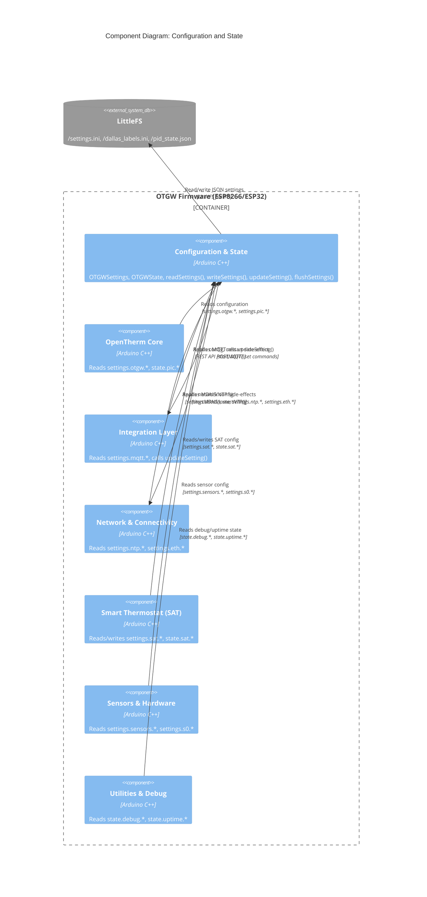

# C4 Component: Configuration and State

## Overview

- **Name**: Configuration and State
- **Description**: The firmware's single source of truth for both persistent configuration and transient runtime state. Manages reading, writing, and validating all device settings in LittleFS JSON, coordinates deferred flash writes to reduce wear, and applies validated side-effects (service restarts) in a controlled batch pattern.
- **Type**: Application Component
- **Technology**: Arduino C/C++, LittleFS, custom lightweight JSON parser (no ArduinoJson)

## Purpose

Every configurable aspect of the firmware — network credentials, MQTT broker, NTP timezone, GPIO pin assignments, SAT thermostat parameters (80+ fields), OTDirect mode, Ethernet static IP — lives in a single `OTGWSettings settings` global struct. The Settings module is responsible for loading that struct from `/settings.ini` on boot, persisting it back to flash on change, and validating every incoming field update (range checks, GPIO conflict detection, placeholder password detection, type conversion).

The companion `OTGWState state` global struct tracks transient runtime information that is never persisted: network mode, boiler connection status, SAT PID outputs, debug flags, uptime counters. Together, `settings` and `state` decouple the rest of the firmware from storage and validation concerns: any component can read `settings.mqtt.sBroker` or write to `state.sat.fRoomTemp` without needing to know about JSON parsing or flash wear.

The deferred-write pattern (`settingsDirty` + `timerFlushSettings`) coalesces rapid REST API updates (a settings form submission sends multiple fields) into a single flash write and one restart per affected service, protecting both flash lifespan and MQTT connection stability.

## Software Features

- **JSON settings file**: Reads and writes `/settings.ini` as hand-formatted JSON without ArduinoJson; custom `parseJsonKVLine()` handles quoted strings, unquoted numbers, and JSON escape sequences
- **Deferred write with 2-second debounce**: `settingsDirty` flag + `timerFlushSettings` coalesces multiple `updateSetting()` calls into one `writeSettings()` + side-effect application pass
- **Server-side validation**: `updateSetting()` validates every field: range clamps, GPIO conflict checks, placeholder password detection, hostname auto-generation, type conversion for booleans/integers/floats
- **GPIO conflict detection**: `checkGPIOConflict()` prevents two features from claiming the same pin (Dallas sensor pin vs S0 counter pin vs relay output pin)
- **Side-effect coordination**: Sets `pendingSideEffects` bitmask (SIDE_EFFECT_MQTT, SIDE_EFFECT_NTP, SIDE_EFFECT_MDNS) instead of immediate service restart; `flushSettings()` applies each effect exactly once per batch
- **Settings sub-sections** (ADR-051): Two-level named sub-sections with Hungarian prefixes; `settings.mqtt.sBroker`, `settings.ntp.sTimezone`, `settings.sat.fTargetRoomTemp`, etc.
- **Per-component types headers** (ADR-079 / ADR-081): each sub-section's struct definition lives in its own `*types.h` header next to the firmware sources (`Devicetypes.h`, `Networktypes.h`, `MQTTstuff.h`, `NTPtypes.h`, `Sensorstypes.h`, `S0types.h`, `Outputstypes.h`, `Webhooktypes.h`, `UItypes.h`, `PICtypes.h`, `OTBustypes.h`, `OTDirecttypes.h`, `Flashtypes.h`, `Uptimetypes.h`, `SATtypes.h`, `Hardwaretypes.h`). `OTGW-firmware.h` includes them in dependency order; ADR-081 folded the legacy `Componenttypes.h` into these headers.
- **Per-field no-op detection** (TASK-564): `updateSetting()` skips dirty-flagging and debounce-timer restart when the new value equals the current value. Cosmetic UI saves no longer cost a flash write or service restart.
- **9 settings sub-sections**: device, mqtt (13 fields), ntp, sensors, s0counter, gpiooutput, webhook, ui, sat (80+ fields), otdirect (20 fields), ethernet (4 IP fields)
- **Runtime state struct**: `OTGWState state` tracks `state.net.*`, `state.pic.*`, `state.sat.*`, `state.otBus.*`, `state.debug.*`, `state.uptime.*` — never persisted, reset to defaults on each boot
- **SAT PID state persistence**: SAT module's last error, integral, and derivative persisted separately to LittleFS for recovery after restart without losing integral wind-up history

## Code Modules

| Module | File | Description |
|--------|------|-------------|
| Settings Module | [c4-code-settings.md](./c4-code-settings.md) | readSettings(), writeSettings(), updateSetting(), flushSettings(), OTGWSettings struct, OTGWState struct |

## Interfaces

### Settings Read/Write API

- **Protocol**: In-process C++ API
- **Description**: Load and persist the full settings struct.
- **Operations**:
  - `readSettings(show)` — load `/settings.ini` into `settings` struct; creates file with defaults if missing; clears dirty flag on completion
  - `writeSettings(show)` — serialize entire `settings` struct to `/settings.ini` as JSON
  - `flushSettings()` — deferred-write endpoint: calls `writeSettings()` if dirty, then applies pending side-effects
  - `settingsMarkClean()` — clear dirty flag without writing (used during OTA reboot window)

### Settings Update API

- **Protocol**: In-process C++ API (called by REST API and MQTT command handler)
- **Description**: Validate and apply a single field update. Entry point for all external configuration changes.
- **Operations**:
  - `updateSetting(field, newValue)` — case-insensitive field dispatch, validation, type conversion, GPIO conflict check, sets `settingsDirty=true`, queues side-effects
  - `checkGPIOConflict(pin, caller)` — returns true if pin already claimed by another enabled feature

### Settings Global State

- **Protocol**: C global variables (read-only from all components)
- **Description**: Canonical configuration and runtime state accessed directly by all firmware components.
- **Key settings fields**:
  - `settings.sHostname[41]` — device hostname
  - `settings.sHTTPpasswd[41]` — HTTP Basic Auth password
  - `settings.mqtt.bEnable`, `.sBroker[65]`, `.iPort`, `.sUser[41]`, `.sPasswd[41]`, `.sTopTopic[13]`
  - `settings.mqtt.sHAprefix[17]`, `.sUniqueId[26]`
  - `settings.ntp.bEnable`, `.sTimezone[41]`, `.sHostname[41]`, `.bSendtime`
  - `settings.sensors.bEnabled`, `.iPin`, `.bLegacyFormat`, `.iInterval`
  - `settings.s0.bEnabled`, `.iPin`, `.iDebounce`, `.iPulseskWh`, `.iInterval`
  - `settings.gpioout.bEnabled`, `.iPin`, `.iTriggerBit`
  - `settings.sat.*` — 80+ fields: `bEnabled`, `iHeatingSystem`, `fTargetRoomTemp`, `fCoeff`, `fBaseOffset`, `bAutoGains`, `fKpManual`, etc.
  - `settings.otd.*` — 20 fields: `iMode`, `bAutoDetect`, `bBypass`, `fSetback`, `bRoomCompensation`, etc.
  - `settings.eth.*` — `bStaticIP`, `sIPaddress[16]`, `sGateway[16]`, `sSubnet[16]`, `sDNS[16]`
- **Key state fields**:
  - `state.net.eMode` — NET_WIFI or NET_ETHERNET
  - `state.pic.bAvailable`, `.sDeviceid[20]`, `.sFirmwareType[10]`
  - `state.otBus.bOnline`, `.bPSmode`
  - `state.sat.fRoomTemp`, `.fOutdoorTemp`, `.fFinalSetpoint`, `.eBoilerStatus`, `.fPidOutput`
  - `state.debug.bOTmsg`, `.bSensorSim`, `.bOTGWSimulation`
  - `state.uptime.iSeconds`, `.iRebootCount`

### JSON Serialization API

- **Protocol**: File I/O (LittleFS)
- **Description**: Low-level JSON helpers used internally by writeSettings().
- **Operations**:
  - `writeJsonStringKV(file, key_P, value, comma)` — write quoted string KV pair
  - `writeJsonBoolKV(file, key_P, value, comma)` — write boolean KV pair
  - `writeJsonIntKV(file, key_P, value, comma)` — write integer KV pair
  - `writeJsonFloatKV(file, key_P, value, comma)` — write float KV pair (2 decimal places)
  - `parseJsonKVLine(line, keyOut, keyOutSize, valueOut, valueOutSize)` — parse single JSON line into key+value

## Dependencies

### Components Used

- **Network and Connectivity**: calls `startMDNS()`, `startLLMNR()` as side-effects of hostname change; calls `startNTP()` as side-effect of NTP settings change
- **Integration Layer (MQTT)**: calls `startMQTT()` as side-effect of MQTT settings change

### External Systems

- **LittleFS**: `/settings.ini` (primary settings file), `/dallas_labels.ini` (sensor labels), `/reboot_count.txt`, `/pid_state.json` (SAT PID persistence)

## Component Diagram

