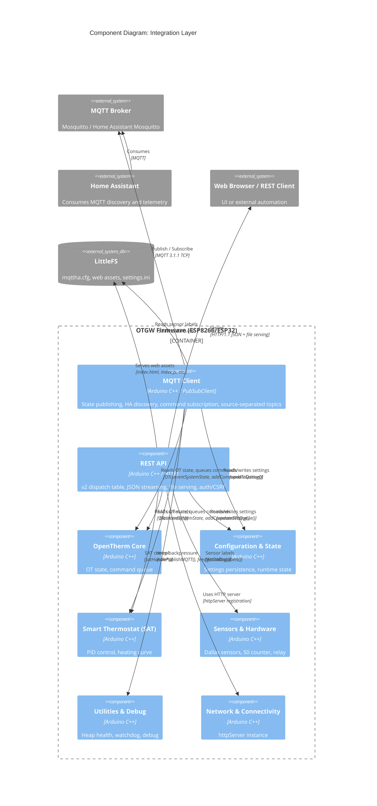

# C4 Component: Integration Layer

## Overview

- **Name**: Integration Layer
- **Description**: The firmware's outward-facing integration surface. Combines two tightly coupled sub-systems: the MQTT client (including Home Assistant auto-discovery) and the REST API (v2 dispatch table with JSON response helpers and file serving). Together they provide all external access to OpenTherm state, device configuration, and control functions.
- **Type**: Application Component
- **Technology**: Arduino C/C++, PubSubClient library, ESP8266WebServer / ESP32 WebServer, chunked HTTP/JSON

## Purpose

The Integration Layer translates internal firmware state into the protocols that home automation systems understand. The MQTT sub-system publishes OpenTherm telemetry to a broker and processes commands arriving on subscribed topics, including full Home Assistant MQTT Discovery (200+ sensor/binary_sensor/climate entities defined in `mqttha.cfg`). The REST API sub-system exposes a versioned HTTP API consumed by the Web Interface component and by external clients such as Telegraf, Node-RED, and Home Assistant REST integrations.

Both sub-systems share the same JSON formatting infrastructure (`jsonStuff.ino`): chunked streaming helpers that avoid large heap allocations on a device with ~40 KB of usable RAM.

## Software Features

- **MQTT state machine**: Six-state connection lifecycle (INIT, TRY_CONNECT, CONNECTED, WAIT_ATTEMPT, WAIT_RECONNECT, ERROR) with configurable retry intervals (3s between attempts, 10 minutes after 5 failures)
- **Chunked MQTT publishing**: Streams payloads in 128-byte RAM chunks or 63-byte PROGMEM chunks via `beginPublish()`/`endPublish()`; never copies full payload into a single buffer
- **Home Assistant auto-discovery (streaming)**: Data-driven tables in `MQTTHaDiscovery.cpp` plus hardcoded stream functions for climate (pseudo-ID 0), number (pseudo-ID 27), SAT switches / selects, Dallas sensors, and PIC pseudo-ID 244 controls (`streamButtonDiscovery` for `resetgateway`, `streamSelectDiscovery` for GPIO/LED selects). Two-pass `MqttJsonWriter` (MEASURE then WRITE) avoids large discovery buffers. Publishes to `homeassistant/<domain>/<node_id>/<entity>/config`.
- **Just-In-Time (JIT) MQTT discovery — default** (ADR-100): `doAutoConfigureMsgid()` publishes discovery config for an OT message ID on first arrival via `processOT()`. No discovery is published for OT IDs never seen on the bus — eliminates the 200+ ghost entities of the previous bulk approach.
- **Drip discovery on broker restart only**: `loopMQTTDiscovery()` is seeded by `markAllMQTTConfigPending()` over OT IDs already observed this session (not the full 256-ID range) when a broker restart is detected; publishes one config per timer tick (3s normal, 30s under heap pressure).
- **Flat per-value MQTT topics** (ADR-101): Value topics carry plain scalars, never aggregated JSON. Discovery payloads on `homeassistant/.../config` remain JSON — ADR-101 governs the value topic shape only.
- **Self-describing topic names by default** (ADR-106): `settings.mqtt.bUseLegacyOtTopics=false` (default) publishes self-describing names (e.g. `manufacturer_code`); `=true` reverts to legacy OT-spec-derived names (e.g. `slave_member_id_code`). Mutually exclusive. Toggling arms a cleanup pass that retains-cleans the other set's 37 discovery topics on the broker.
- **`resetgateway` hardening** (TASK-668): MQTT command only fires on payload `"1"`; cooldown rate-limit prevents accidental rapid PIC resets; both rejection reasons surface in the default debug stream.
- **Silently-dropped MQTT set commands surface in default debug**: Integration issues are observable without enabling per-module debug flags.
- **Source-separated MQTT topics**: Optionally publishes each OT message to three sub-topics (`/thermostat`, `/boiler`, `/gateway`) for fine-grained Home Assistant entity mapping
- **MQTT command dispatch**: Routes incoming `{topTopic}/set/{nodeId}/{command}` payloads to PIC command queue or SAT functions via PROGMEM lookup table
- **Home Assistant reboot detection**: Subscribes to `homeassistant/status`; re-publishes discovery on HA restart
- **REST API v2 dispatch table**: Single `processAPI()` entry point; URI tokenized and matched against `kV2Routes[]` array; adding an endpoint requires one handler function and one table entry
- **CSRF protection and HTTP Basic Auth** (ADR-054): `checkHttpAuth()` validates credentials and origin/referer header for all POST/PUT mutations
- **ETag-based file caching**: `index.html` served with filesystem-hash ETag; 304 Not Modified on unchanged content; versioned asset URLs (`index.js?v=<hash>`) for long-term cache headers
- **Chunked JSON streaming**: `sendStartJsonMap()`, `sendJsonMapEntry()`, `sendJsonOTmonMapEntry()`, `sendJsonSettingObj()` build JSON responses in HTTP send-content chunks with no intermediate buffer
- **LittleFS file explorer**: Upload, download, delete, rename via `FSexplorer.ino` endpoints
- **OTA firmware update orchestration**: Trigger PIC hex file transfer, validate Intel HEX, stream to PIC

## Code Modules

| Module | File | Description |
|--------|------|-------------|
| MQTT Client | [c4-code-mqtt.md](./c4-code-mqtt.md) | PubSubClient integration, HA auto-discovery, command routing, topic publishing |
| REST API | [c4-code-rest-api.md](./c4-code-rest-api.md) | Versioned HTTP REST API (v2), route dispatch, JSON helpers, file serving, CSRF/auth |

## Interfaces

### MQTT Publish Interface

- **Protocol**: MQTT 3.1.1 (PubSubClient over TCP)
- **Description**: Publishes decoded OpenTherm values, gateway status, SAT state, and sensor readings to configurable topic namespace.
- **Key topics published** (prefix = `settings.mqtt.sTopTopic`, default `OTGW`):
  - `OTGW/<msgname>` — decoded OT values (Tboiler, Tr, TSet, etc.)
  - `OTGW/<msgname>/thermostat`, `/boiler`, `/gateway` — source-separated variants
  - `otgw-firmware/uptime`, `otgw-firmware/version`, `otgw-firmware/reboot_count`
  - `otgw-pic/version`, `otgw-pic/deviceid`, `otgw-pic/picavailable`
  - `sat/enabled`, `sat/control_mode`, `sat/target`, `sat/room_temp`, `sat/final_setpoint`, `sat/pid_output`
  - `sat/energy/flame_on_sec`, `sat/energy/cycles_hour`, `sat/energy/ema_duty_ratio`
  - `<HA_prefix>/sensor|binary_sensor|climate/<node_id>/<entity>/config` — HA discovery payloads
- **Operations**:
  - `sendMQTTData(topic, json, retain)` — publish RAM topic + RAM payload
  - `sendMQTTData(topic_P, json, retain)` — publish PROGMEM topic + RAM payload
  - `sendMQTTData(topic_P, json_P, retain)` — publish PROGMEM topic + PROGMEM payload
  - `publishMQTTOnOff(topic, bool)` — publish "ON"/"OFF"
  - `publishMQTTNumeric(topic, float, decimals)` — publish formatted float
  - `publishToSourceTopic(topic, json, rsptype)` — publish to source-keyed sub-topic

### MQTT Subscribe / Command Interface

- **Protocol**: MQTT 3.1.1 subscription
- **Description**: Receives commands and settings updates from home automation systems.
- **Subscribed topics**:
  - `{topTopic}/set/{nodeId}/setpoint` — boiler setpoint override (TT= command)
  - `{topTopic}/set/{nodeId}/constant` — boiler constant setpoint (TC= command)
  - `{topTopic}/set/{nodeId}/outside_temp` — outside temperature override (OT= command)
  - `{topTopic}/set/{nodeId}/hot_water` — DHW enable override (HW= command)
  - `{topTopic}/set/{nodeId}/gatewaymode` — gateway mode change (GW= command)
  - `{topTopic}/set/{nodeId}/maxchsetpoint` — max CH setpoint (SH= command)
  - `{topTopic}/set/{nodeId}/sat/*` — SAT control commands (target, indoor_temp, outdoor_temp, enabled, preset, etc.)
  - `{topTopic}/set/{nodeId}/<setting>` — any `updateSetting()` field name (settings updates)
  - `homeassistant/status` — HA online/offline detection

### Home Assistant Discovery Interface

- **Protocol**: MQTT Discovery (HA convention)
- **Description**: Publishes JSON discovery payloads to `homeassistant/<domain>/<node_id>/<entity>/config` for all 200+ OT entities.
- **Operations**:
  - `doAutoConfigure()` — bulk publish all discovery configs from `mqttha.cfg`
  - `doAutoConfigureMsgid(OTid)` — JIT publish discovery for a single message ID
  - `doAutoConfigureMsgid(OTid, sensorId)` — JIT publish for Dallas sensor entity

### REST API v2

- **Protocol**: HTTP/1.1 (plain, no HTTPS per design constraint)
- **Description**: Versioned JSON API on port 80. All routes under `/api/v2/`.
- **Endpoint groups**:
  - `GET /api/v2/health` — system health metrics (heap, uptime, WiFi RSSI)
  - `GET|POST|PUT /api/v2/settings` — read/update all device settings (auth required)
  - `GET|POST|PUT /api/v2/sensors/labels` — Dallas sensor label management
  - `GET /api/v2/device/info|time|crashlog` — device metadata
  - `GET /api/v2/flash/status` — flash memory metrics
  - `GET /api/v2/pic/flash-status|update-check|settings` — PIC firmware status
  - `GET|POST|PUT /api/v2/otgw/otmonitor|messages/{id}|commands|discovery` — OT state and command injection
  - `GET|POST|PUT /api/v2/sat/*` — SAT status, control, diagnostics; plus `markers`, `sensor-areas`, `weather/needs-setup`, `ble/{discovery,select,label,forget}` (ESP32) sub-resources
  - `GET|POST|PUT /api/v2/otdirect/*` — OTDirect mode/settings/overrides (ESP32 only)
  - `GET /api/v2/firmware/files` — OTA firmware file inventory
  - `GET /api/v2/filesystem/files|hash-check` — LittleFS file listing and hash validation
  - `GET|POST|PUT /api/v2/simulate` — OTGW message simulation control
  - `POST|PUT /api/v2/webhook/test` — webhook test trigger
  - `GET /api/v2/debug` — snapshot of all debug-related flags + local IP (support / bug reports)
  - `GET /api/v2/network/scan` — WiFi scan for Settings page (TASK-585)
- **Error format**: `{"error":{"status":N,"message":"..."}}`

### File Serving Interface

- **Protocol**: HTTP/1.1
- **Description**: Serves web UI assets from LittleFS with ETag caching and chunked streaming.
- **Routes**:
  - `GET /` → `index.html` (with ETag, version-stamped JS links injected)
  - `GET /index.js?v=<hash>` → cached JavaScript (1-day `max-age`)
  - `GET /FSexplorer.html` → LittleFS file explorer
  - `GET|POST /FSexplorer` → file upload/download/delete/rename

## Dependencies

### Components Used

- **OpenTherm Core**: reads `OTcurrentSystemState` for OT values; calls `addCommandToQueue()` to deliver MQTT-sourced commands to PIC; calls `doAutoConfigureMsgid()` triggered by new OT message arrivals
- **Configuration and State**: reads all `settings.*` fields; calls `updateSetting()` for MQTT and REST settings updates; reads `state.*` for health, status, and version reporting
- **Smart Thermostat (SAT)**: calls `satHandle*()` functions from MQTT and REST command handlers; reads `state.sat.*` for status responses
- **Sensors and Hardware**: calls `configSensors()` for Dallas sensor discovery; reads Dallas device list and labels for REST API
- **Utilities and Debug**: calls `canPublishMQTT()` and `feedWatchDog()` during publish loops; calls `getHeapHealth()` for health endpoint; uses `emergencyHeapRecovery()` on heap critical

### External Systems

- **PubSubClient** (Nick O'Leary): MQTT 3.1.1 client library
- **LittleFS**: `dallas_labels.ini`, `/sat_markers.json` (TASK-586), `/pid_state.json`, `index.html`, `index.js`, `sat.js`, `graph.js`, `components.css`, `ds-tokens.css`, PIC hex files. The runtime `mqttha.cfg` template file has been retired — discovery is published from PROGMEM tables in `MQTTHaDiscovery.cpp`.
- **MQTT Broker**: External broker (Mosquitto, Home Assistant Mosquitto add-on, etc.)
- **Home Assistant**: Consumes MQTT discovery payloads and published OT telemetry

## Component Diagram

