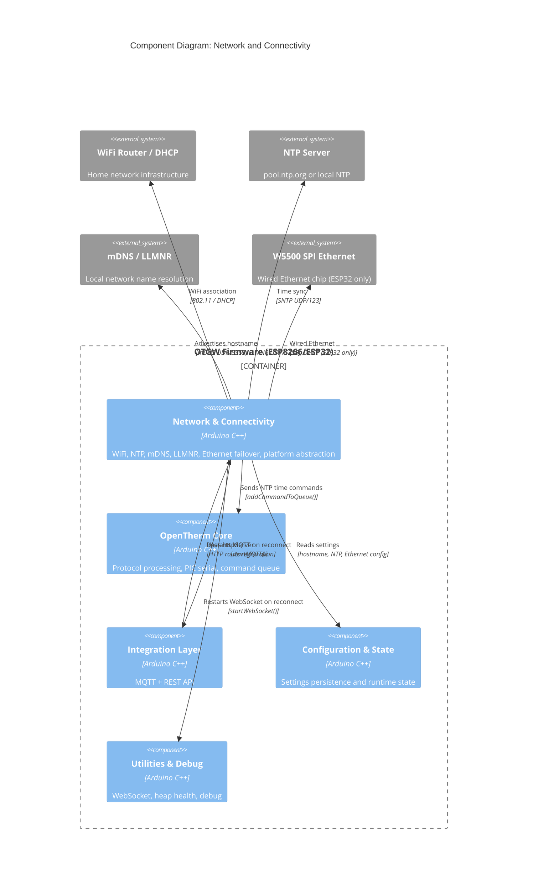

# C4 Component: Network and Connectivity

## Overview

- **Name**: Network and Connectivity
- **Description**: Unified network transport layer providing WiFi connectivity with auto-reconnect, NTP time synchronization, mDNS/LLMNR hostname resolution, telnet debug server, and optional Ethernet failover (ESP32 + W5500). Abstracts all platform differences between ESP8266 and ESP32 behind a unified inline API.
- **Type**: Application Component
- **Technology**: Arduino C/C++, ESP8266WiFi / ESP32 WiFi, WiFiManager, AZ Timelib, EthernetESP32 (W5500)

## Purpose

This component owns the firmware's relationship with the network. It handles the full lifecycle from initial WiFi association (via captive portal if credentials are not saved) through DHCP hostname negotiation, NTP synchronization, mDNS/LLMNR advertisement, and graceful recovery from connectivity loss. On ESP32 boards fitted with a W5500 SPI Ethernet controller, it also provides automatic cable-detect failover between WiFi and wired Ethernet.

A critical secondary responsibility is platform abstraction. The `platform_esp8266.h` and `platform_esp32.h` headers expose a comprehensive set of inline functions covering hostname management, MAC address retrieval, filesystem info, CPU metrics, reset reason decoding, and hardware RNG, allowing the rest of the firmware to compile cleanly on both targets without `#ifdef` scattered through business logic.

## Software Features

- **WiFi initialization with captive portal**: Attempts saved credentials; falls back to WiFiManager captive portal with MAC-suffixed SSID; configures HTTP updater with Basic Auth
- **Two-tier WiFi recovery** (ADR-047): SDK auto-reconnect handles momentary blips; application-level `loopWifi()` state machine catches extended outages (up to 10 retries, then reboot)
- **NTP synchronization**: Configures SNTP via `configTime()`; guards against ESP8266 SDK bogus 0xFFFFFFFF initial timestamp; validates time in [2000-01-01, 2038-01-19] range
- **OpenTherm time commands**: Sends `SC=`, `SR=21:`, `SR=22:` to PIC on NTP sync to keep boiler clock accurate
- **mDNS/LLMNR hostname resolution**: Registers `<hostname>.local` via mDNS (both platforms); LLMNR for Windows name resolution (ESP8266 only)
- **Multi-path hostname synchronization**: Corrects ESP8266 SDK bug that resets hostname during `configTime()` call; guards with `sDhcpHostnameFixed` flag against repeated re-announces
- **Runtime WiFi↔Ethernet failover** (ESP32 + W5500, TASK-581): Probes W5500 via SPI VERSION register at boot; DHCP with 1-second timeout; hot-plug cable detection every 5 seconds; transitions disconnect WiFi (`switchToEthernet()`) or restart it (`switchToWiFi()`) on the fly without reboot. The mode-transition MQTT publish is deferred until the MQTT client reconnects.
- **Per-component types header** (`Networktypes.h`, ADR-079 / ADR-081): Bundles `OTGWNetworkMode`, `NetworkSection`, `EthernetSection` for the network transport. Prerelease-only `NET_AP_FALLBACK` is compile-time-guarded by `_VERSION_PRERELEASE` so production builds cannot enter AP fallback.
- **Platform abstraction**: 25+ inline platform functions covering hostname, MAC, filesystem, CPU, reset info, RTC memory, serial error flags
- **Telnet debug server**: `TelnetStream` on port 23 for real-time firmware log output
- **WebSocket buffer optimization**: Reduces per-client buffer from 512 to 256 bytes via `WEBSOCKETS_MAX_DATA_SIZE 256`, freeing ~768 bytes per 3-client scenario on ESP8266

## Code Modules

| Module | File | Description |
|--------|------|-------------|
| Network & WiFi | [c4-code-network.md](./c4-code-network.md) | WiFi management, NTP, mDNS/LLMNR, Ethernet failover, platform abstraction |

## Interfaces

### WiFi Management API

- **Protocol**: In-process C++ API / WiFiManager
- **Description**: Initialization and runtime management of WiFi connectivity.
- **Operations**:
  - `startWiFi(hostname, timeOut, forcePortal)` — full WiFi init, captive portal fallback
  - `resetWiFiSettings()` — wipe saved credentials, force portal on next boot
  - `loopWifi()` — non-blocking reconnection state machine (call from main loop)
  - `getMacAddress()` — MAC as hex string e.g. "00112233AABB"
  - `getUniqueId()` — unique device ID e.g. "otgw-00112233AABB"

### NTP & Time API

- **Protocol**: SNTP (UDP port 123), in-process C++ API
- **Description**: Manages time synchronization state; exports `NtpStatus` and `NtpLastSync`.
- **Operations**:
  - `startNTP()` — configure SNTP, workaround ESP8266 hostname-reset SDK bug
  - `loopNTP()` — NTP state machine: NOTSET → WAITFORSYNC → SYNC → NEEDSYNC
  - `isNTPtimeSet()` — returns true when `NtpStatus == TIME_SYNC`
  - `sendtimecommand()` — sends `SC=<HH>:<MM>/<DOW>` and `SR=21:` / `SR=22:` to PIC

### mDNS / LLMNR

- **Protocol**: mDNS (UDP 5353), LLMNR (UDP 5355)
- **Description**: Network hostname advertisement so clients can reach the device by name.
- **Operations**:
  - `startMDNS(hostname)` — registers `<hostname>.local`, HTTP service on port 80
  - `startLLMNR(hostname)` — registers `<hostname>` for Windows name resolution (ESP8266 only)

### Ethernet Interface (ESP32 + W5500)

- **Protocol**: SPI (W5500 driver), DHCP
- **Description**: Optional wired Ethernet with automatic WiFi fallback.
- **Operations**:
  - `initEthernet()` — probe W5500 SPI, DHCP with 1s timeout, switch WiFi off on success
  - `loopEthernet()` — poll cable state every 5s, trigger DHCP and mDNS re-registration on plug events
  - `getEthernetIPString()` / `getEthernetMACString()` — used by REST API to report network info

### Platform Abstraction API

- **Protocol**: In-process C++ inline functions
- **Description**: Unified cross-platform functions hiding ESP8266/ESP32 API differences.
- **Key functions**:
  - `platformSetHostname(hostname)` / `platformGetHostname()` — WiFi hostname DHCP propagation
  - `platformRestartDHCP()` — force DHCP re-announce (ESP8266 only)
  - `platformFreeHeap()` / `platformMaxFreeBlock()` — heap metrics for MQTT/WebSocket backpressure
  - `platformResetReason(buf, size)` — human-readable reset cause for crash logging
  - `platformRestart()` — device reboot
  - `platformGetMacAddress(mac)` — 6-byte MAC retrieval
  - `PlatformDir` class — unified directory iteration (hides ESP8266 `Dir` vs ESP32 `File` difference)

### Exported State

- **Protocol**: C extern variables
- **Description**: Network state exported to rest of firmware.
- **Variables**:
  - `NtpStatus` (`NtpStatus_t`) — current sync state
  - `NtpLastSync` (`time_t`) — timestamp of last successful sync
  - `httpServer` (`OTGWWebServer`) — HTTP server instance on port 80 (handlers registered by REST API component)
  - `httpUpdater` (`OTGWUpdateServer`) — OTA update handler

## Dependencies

### Components Used

- **Configuration and State**: reads `settings.sHostname`, `settings.ntp.*`, `settings.eth.*`, `settings.sHTTPpasswd`; writes `state.net.eMode`, `state.net.bEthernetLink`, `state.hw.bEthernetPresent`
- **OpenTherm Core**: calls `feedWatchDog()` during blocking operations; calls `addCommandToQueue()` to send NTP time commands to PIC
- **Integration Layer (MQTT)**: calls `startMQTT()` on WiFi reconnection
- **Utilities and Debug**: calls `startWebSocket()` on WiFi reconnection; uses `DebugTln()`, `DebugTf()` for telnet debug output

### External Systems

- **WiFiManager** v2.0.4-beta: Captive portal for initial WiFi credential entry
- **ESP8266WiFi / ESP32 WiFi**: SDK WiFi stack
- **ESP8266mDNS / ESPmDNS**: mDNS responder
- **ESP8266LLMNR**: Windows name resolution (ESP8266 only)
- **AZ Timelib**: `timezoneManager`, `ZonedDateTime` for POSIX-to-local-time conversion
- **EthernetESP32 / W5500Driver**: Wired Ethernet support (ESP32 only)
- **TelnetStream** (jandrassy): Debug output server on port 23

## Component Diagram

