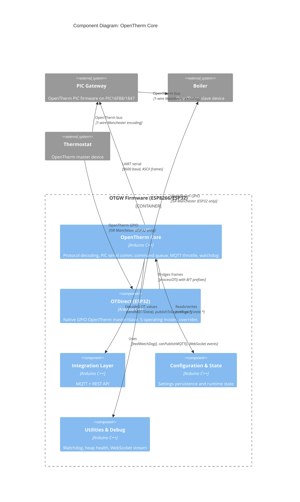

# C4 Component: OpenTherm Core

## Overview

- **Name**: OpenTherm Core
- **Description**: The central OpenTherm protocol processing engine. Decodes and encodes OpenTherm bus frames, manages PIC gateway serial communication, maintains the canonical OpenTherm state model, and drives MQTT/WebSocket publishing. On ESP32 hardware (OTGW32), also includes a direct GPIO-based OpenTherm stack that replaces the PIC gateway entirely.
- **Type**: Application Component
- **Technology**: Arduino C/C++, ESP8266/ESP32 SDK, custom OTGWSerial library, OpenTherm library (ESP32)

## Purpose

This component is the protocol heart of the firmware. Every OpenTherm message that flows between a thermostat and a boiler passes through here: received over serial from the PIC gateway (ESP8266 path) or directly over GPIO via ISR-driven Manchester encoding (ESP32/OTGW32 path), then decoded, stored in `OTcurrentSystemState`, throttle-checked, and published.

The component also owns PIC lifecycle management: detecting presence, sending boot commands, cycling through configuration settings, managing firmware upgrades, and feeding the external I2C watchdog. For OTGW32 hardware, the OTDirect sub-module provides five operating modes (gateway, monitor, bypass, master, loopback) with ring-buffer command queuing, response overrides, and a PI room compensation controller.

## Software Features

- **OpenTherm frame decoding**: Parses all 256 OT message IDs with typed value extraction (f8.8 float, s16, u16, u8/u8, flag8, status, datetime)
- **PIC serial bridge**: Non-blocking line accumulator with static buffers and re-entrancy guard for concurrent `doBackgroundTasks()` calls
- **Command queue**: FIFO queue with retry/backoff, delivers commands to PIC one at a time; prevents command loss on serial corruption
- **MQTT throttle tracking**: Per-message-ID timestamp array (256 entries) prevents flooding; per-bit status flag tracking (16 entries) for fine-grained status publish
- **PS=1 summary mode**: Processes periodic PIC diagnostic summaries, republishing stale OpenTherm values without waiting for boiler retransmission
- **PIC settings discovery**: 3-second cycle queries all 15 PIC configuration registers (CR=0..14), batches results to MQTT every 5 minutes
- **PIC firmware upgrade**: Intel HEX file validation, chunked transfer to PIC, progress reporting via MQTT and WebSocket
- **Startup quiet period**: 15-second suppression of event logging after PIC reset to prevent burst noise
- **OT spec compatibility**: Auto-detects v3.x vs v4.x PIC banner; applies version-appropriate reserved ID filtering
- **OTDirect (ESP32 only)**: Native ISR-driven OpenTherm master/slave using GPIO; five operating modes; 3-strike auto-blacklist for non-responsive message IDs; thermostat timeout fail-safe; PI room compensation; flame ratio tracking

## Code Modules

| Module | File | Description |
|--------|------|-------------|
| OTGW-Core | [c4-code-otgw-core.md](./c4-code-otgw-core.md) | Protocol frame parsing, PIC serial comm, command queue, MQTT throttle, watchdog, PIC firmware upgrade |
| OTDirect | [c4-code-otdirect.md](./c4-code-otdirect.md) | ESP32-only direct OpenTherm hardware interface: ISR handlers, 5 operating modes, schedule table, overrides |

## Interfaces

### PIC Serial Interface

- **Protocol**: UART (custom OTGWSerial, 9600 baud)
- **Description**: Exclusive serial link to PIC gateway. All OpenTherm bus frames arrive prefixed with direction (T=thermostat, B=boiler, R=gateway request, A=gateway answer). Commands sent as ASCII strings (e.g., `CS=1`, `TT=20.00`, `PR=A`).
- **Operations**:
  - `handlePICSerial()` — non-blocking read loop, dispatches complete lines
  - `addCommandToQueue(cmd, len, force, delay)` — enqueue command for delivery
  - `sendPICSerial(buf, len)` — direct send bypassing queue (probe/diagnostic only)
  - `resetOTGW()` — GPIO-driven PIC reset
  - `detectPIC()` — probe for PIC presence via PR=A query
  - Boot commands: `CS=1`, `GW=1`, `PS=1`, `SB=`, `SR=`, `SE=`

### OpenTherm State API

- **Protocol**: In-process C++ API
- **Description**: Global `OTcurrentSystemState` (type `OTdataStruct`) is the canonical source of all decoded OpenTherm values. Read by SAT, REST API, MQTT, and sensors.
- **Operations**:
  - `OTcurrentSystemState.Tboiler`, `.TSet`, `.Tr`, `.Toutside`, etc. — direct field access
  - `isCentralHeatingEnabled()`, `isDomesticHotWaterEnabled()`, `isCoolingEnabled()` — status flag helpers
  - `getMsgLastUpdated(msgId)` — seconds since last MQTT publish for a message ID

### MQTT Publishing Interface

- **Protocol**: MQTT (via MQTTstuff component)
- **Description**: Publishes decoded OpenTherm values to topic namespace `otgw/<msgname>`. Throttle delays prevent flooding the broker.
- **Key topics published**:
  - `otgw/Tboiler`, `otgw/Tr`, `otgw/TSet`, `otgw/Toutside`, `otgw/Tdhw`
  - `otgw/status`, `otgw/status_master_*`, `otgw/status_slave_*`
  - `otgw/gatewaymode`, `otgw/settings/*`
  - `otgw-firmware/version`, `otgw-pic/version`, `otgw-pic/deviceid`

### WebSocket Event Stream

- **Protocol**: WebSocket text frames (via Utilities component)
- **Description**: Real-time OT log stream to connected browser clients. Each event is a single prefixed line.
- **Operations**:
  - `sendEventToWebSocket(prefix, msg, len)` — prefix '>' sent, '<' received, '!' error, '*' system event
  - `reportOTGWEvent(msg, prefix, suppressDuringStartup)` — fan-out to MQTT + WebSocket

### OTDirect REST Interface (ESP32 only)

- **Protocol**: HTTP REST (consumed by REST API component)
- **Description**: Exposes operating mode control, override tables, and status for the direct OpenTherm stack.
- **Operations**:
  - `GET /api/v2/otdirect/status` — current mode, bus online, flame ratio
  - `POST /api/v2/otdirect/mode?mode=gateway|monitor|bypass|master|loopback` — change mode
  - `GET/POST /api/v2/otdirect/settings` — read/write OTDirect configuration
  - `GET/POST /api/v2/otdirect/overrides` — manage stored responses and response modifiers

## Dependencies

### Components Used

- **Configuration and State**: reads `settings.otgw.*`, `settings.pic.*`, `settings.otd.*`; writes `state.pic.*`, `state.otBus.*`, `state.otd.*`
- **Integration Layer (MQTT)**: calls `sendMQTTData()`, `sendMQTT()`, `publishToSourceTopic()`, `doAutoConfigureMsgid()`
- **Utilities and Debug**: calls `feedWatchDog()`, `canPublishMQTT()`, `canSendWebSocket()`, debug macros `DebugTln()`, `DebugTf()`
- **Network and Connectivity**: uses `httpServer` (registered by REST API), `addCommandToQueue()` receives NTP time commands from Network component

### External Systems

- **OTGWSerial library**: Custom UART driver with PIC reset support (ESP8266 only)
- **OpenTherm library** (ESP32): ISR-driven Manchester encoding/decoding for direct GPIO OT interface
- **Wire.h / I2C**: External watchdog at address 0x26 (`FEEDWATCHDOGNOW` macro)
- **LittleFS**: PIC hex files for firmware upgrade, replay simulation log `/otgw.replay`
- **ArduinoOTA**: Over-the-air ESP firmware updates

## Component Diagram

