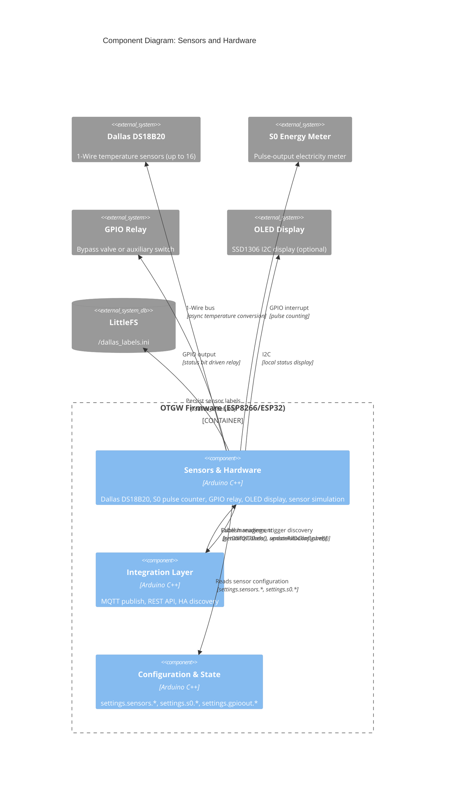

# C4 Component: Sensors and Hardware

## Overview

- **Name**: Sensors and Hardware
- **Description**: Hardware input/output abstraction layer managing all physical peripherals attached to the ESP8266/ESP32 GPIO: Dallas DS18B20 temperature sensors (1-Wire bus), S0 pulse energy meter, GPIO relay output, and optional OLED display. Publishes sensor data via MQTT with Home Assistant auto-discovery and provides a REST API for label management.
- **Type**: Application Component
- **Technology**: Arduino C/C++, OneWire library, DallasTemperature library (Miles Burton), I2C OLED (SSD1306)

## Purpose

This component bridges the physical world to the firmware's data model. Dallas DS18B20 sensors (up to 16 devices, identified by unique ROM address) measure temperatures at arbitrary points in the heating system: flow, return, DHW tank, outside. The S0 pulse counter provides kWh energy metering from any S0-compatible electricity meter. The GPIO relay output enables an external bypass valve or auxiliary switch controlled by a configurable OpenTherm status bit trigger. The optional OLED display provides a local status readout without requiring a browser.

Auto-discovery for Dallas sensors integrates with the MQTT auto-discovery system used by the Integration Layer, publishing per-sensor Home Assistant discovery payloads with unique sensor IDs derived from the 8-byte ROM address. Labels (user-friendly names like "Boiler flow" instead of raw hex addresses) are persisted in `/dallas_labels.ini` on LittleFS.

A simulation mode (`state.debug.bSensorSim`) allows testing without physical hardware by generating synthetic sensor readings at configurable intervals.

## Software Features

- **Dallas DS18B20 1-Wire bus**: Auto-discovers up to 16 sensors; async non-blocking temperature conversion (`setWaitForConversion(false)`); enforces `MAXDALLASDEVICES` limit gracefully; supports GPIO pin configured at runtime (not compile time, per ADR-020)
- **Sensor label persistence**: Two-pass algorithm reads existing `/dallas_labels.ini`, appends auto-generated defaults ("Sensor N") for newly discovered addresses, writes back only on change
- **Legacy address format**: `settings.sensors.bLegacyFormat` flag reproduces v0.10.x address formatting bug for HA automation backward compatibility
- **Disconnected sensor handling**: If `getTempC()` returns `DEVICE_DISCONNECTED_C`, last known value is preserved; no error thrown; disconnect logged
- **S0 pulse counter**: Interrupt-driven pulse counting on configurable GPIO; configurable debounce (0–1000ms); `pulseskWh` conversion factor; publishes cumulative kWh and instantaneous power to MQTT
- **GPIO relay output**: Monitors a configurable OpenTherm status bit; drives GPIO HIGH/LOW accordingly; supports active-high or active-low configuration
- **OLED display**: I2C SSD1306 display for local status readout (hostname, IP, OT bus status, temperatures); updates on each sensor poll cycle
- **Sensor simulation mode**: Generates 3 synthetic DS18B20 readings (30°C, 35°C, 40°C) with configurable update interval; enables full UI/MQTT testing without hardware
- **MQTT auto-discovery for sensors**: Calls `sensorAutoConfigure()` per detected device, publishing HA discovery payload with device address as unique sensor ID; marks complete with `setMQTTConfigDone()`

## Code Modules

| Module | File | Description |
|--------|------|-------------|
| Sensors & I/O | [c4-code-sensors.md](./c4-code-sensors.md) | Dallas DS18B20, S0 pulse counter, GPIO relay, OLED display, sensor simulation |

## Interfaces

### Dallas Sensor Read API

- **Protocol**: In-process C++ API
- **Description**: Functions called from main loop and Integration Layer.
- **Operations**:
  - `initSensors()` — probe 1-Wire bus, store ROM addresses, initialize labels file
  - `pollSensors()` — non-blocking async conversion cycle; publishes via `sendMQTTData()`; triggers auto-discovery if pending
  - `configSensors()` — trigger HA MQTT auto-discovery for all detected sensors
  - `getDallasAddress(DeviceAddress)` — convert 8-byte ROM to hex string (standard or legacy format)
  - `initSimulatedDallasSensors()` — initialize 3 synthetic sensors for simulation mode

### Sensor Label REST API

- **Protocol**: HTTP REST (via Integration Layer REST API component)
- **Description**: Manage human-readable names for detected sensors.
- **Endpoints** (handled by `handleSensors()` in REST API):
  - `GET /api/v2/sensors/labels` — returns list of `{address, label}` pairs
  - `POST|PUT /api/v2/sensors/labels` — update all sensor labels (body: JSON array)

### MQTT Sensor Data Topics

- **Protocol**: MQTT (published via Integration Layer MQTT component)
- **Description**: Publishes temperature readings per sensor identified by ROM address.
- **Topics published**:
  - `{topTopic}/<hex_address>` — temperature in °C for each DS18B20 sensor (e.g., `OTGW/28D0000000000001`)
  - HA discovery: `homeassistant/sensor/{nodeId}/{hex_address}/config` — per sensor discovery payload

### GPIO Relay Output

- **Protocol**: GPIO (direct register access)
- **Description**: Monitors a configurable OpenTherm status bit and drives a relay output GPIO.
- **Configuration**:
  - `settings.gpioout.bEnabled` — enable relay output
  - `settings.gpioout.iPin` — GPIO pin number (0–16)
  - `settings.gpioout.iTriggerBit` — OT status bit to monitor (e.g., CH mode active)

### S0 Pulse Counter

- **Protocol**: GPIO interrupt, MQTT publish
- **Description**: Counts S0 pulses from energy meter, publishes kWh and power.
- **Configuration**:
  - `settings.s0.bEnabled`, `settings.s0.iPin`, `settings.s0.iDebounce`, `settings.s0.iPulseskWh`, `settings.s0.iInterval`
- **Topics published**:
  - `{topTopic}/s0/energy` — cumulative kWh
  - `{topTopic}/s0/power` — instantaneous power (W)

## Dependencies

### Components Used

- **Configuration and State**: reads `settings.sensors.*`, `settings.s0.*`, `settings.gpioout.*`; reads `state.debug.bSensorSim` for simulation mode
- **Integration Layer (MQTT)**: calls `sendMQTTData()` to publish temperature readings; calls `sensorAutoConfigure()` and `setMQTTConfigDone()` for HA discovery

### External Systems

- **OneWire library**: 1-Wire bus protocol implementation
- **DallasTemperature library** (Miles Burton): DS18B20-specific layer over OneWire; async conversion management
- **LittleFS**: `/dallas_labels.ini` — sensor address-to-label mapping persistence
- **I2C / SSD1306**: Optional OLED display (I2C bus, address 0x3C)
- **GPIO hardware**: DS18B20 data pin, S0 counter pin, relay output pin — all configurable at runtime

## Component Diagram

