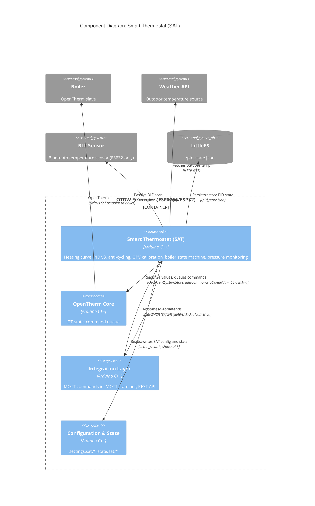

# C4 Component: Smart Thermostat (SAT)

## Overview

- **Name**: Smart Thermostat (SAT)
- **Description**: An autonomous adaptive heating controller embedded in the firmware. Regulates room temperature by computing a boiler flow temperature setpoint using a configurable heating curve, a PID controller (version 3 with deadband and solar gain compensation), duty-cycle anti-cycling logic, multi-source temperature input, weather compensation, overshoot protection calibration, and boiler pressure health monitoring.
- **Type**: Application Component
- **Technology**: Arduino C/C++, fixed-point arithmetic, LittleFS PID state persistence, optional BLE temperature sensing (ESP32)

## Purpose

SAT turns the OpenTherm Gateway from a transparent protocol bridge into an active heating controller. Instead of simply forwarding thermostat setpoints to the boiler, SAT intercepts the control loop: it reads room temperature (from OT MsgID 24, external MQTT push, or BLE sensor), computes how hot the boiler water needs to be (heating curve + PID correction), and injects that setpoint into the OpenTherm stream via `TT=` / `CS=` commands.

The design targets low-temperature heating systems (underfloor, heat pumps, and radiators) where over-shoot wastes energy and cycling frequency is a key efficiency metric. SAT tracks boiler state across a 9-state machine (OFF, IDLE, WAITING_FLAME, ANTI_CYCLING, STALLED_IGNITION, PUMP_STARTING, IGNITION_SURGE, PREHEATING, HEATING, MODULATING_UP, AT_SETPOINT, COOLING, OVERSHOOT_COOLING), enforces maximum cycles-per-hour limits, and performs automatic Overshoot Protection Value (OPV) calibration.

External inputs arrive via MQTT subscribe commands (`sat/target`, `sat/indoor_temp`, `sat/outdoor_temp`, etc.) or REST API (`POST /api/v2/sat/*`), all routed through the Integration Layer. SAT state is continuously published to MQTT and exposed via the REST API for dashboard display.

## Software Features

- **Heating curve**: `baseOffset + (coeff/4) * [4*(target-20) + 0.03*(outside-20)^2 - 0.4*(outside-20)]` — configurable coefficient and offset per heating system type
- **PID controller (v3)**: Auto-calculated Kp/Ki/Kd from heating curve value; deadband-gated integral (accumulates only within ±0.1°C of target); temperature-based derivative with adaptive low-pass filter; manual gain override mode
- **Anti-cycling**: Enforces minimum OFF time (180s) and configurable max cycles/hour (heat pump 2, underfloor 3, radiators 4)
- **Overshoot Protection Value (OPV) calibration**: Automated 3-phase calibration sequence (WARMING, MEASURING, DONE/FAILED) determines per-boiler overshoot before flame-off
- **Boiler status state machine**: 13 states tracking flame on/off transitions, ignition surges, pump starts, and modulation ramp-up
- **Multi-source temperature**: Accepts room temperature from OT MsgID 24, external MQTT push, or BLE sensor; staleness tracking with configurable timeout
- **Weather compensation**: Fetches outdoor temperature from external weather API or MQTT push; computes solar gain compensation from sun elevation angle
- **Preset management**: comfort (21°C), away (15°C), sleep (18°C), frost (5°C) — applied via MQTT or REST
- **Window detection**: Pause heating on open-window signal; auto-resume after configurable timeout
- **CH pressure monitoring**: Exponential moving average smoothing, linear regression drop-rate detection, alarm confirmation with hysteresis
- **Manufacturer detection**: Auto-identifies boiler brand from OT MsgID 3 slave MemberID (18 manufacturers); applies per-manufacturer quirks (e.g., `SAT_QUIRK_NO_REL_MOD` for Ideal/Nefit/Intergas)
- **Multi-area temperature** (TASK-25): Accepts temperature inputs for up to 4 independent zones; DS18B20-to-area mapping persisted via `/api/v2/sat/sensor-areas`
- **Heating-curve calibration markers** (TASK-586): Up to 20 (outside, flow) markers persisted to `/sat_markers.json` and rendered on the SAT dashboard for empirical curve tuning
- **PID state persistence**: Saves last error, integral, and derivative to LittleFS; restores on restart to avoid cold-start integral reset
- **BLE temperature sensing** (ESP32 only, `SATble.ino`): Continuous NimBLE-Arduino 2.x passive scanning (ADR-092, TASK-487/488/494). Settings-backed roster of up to 8 MACs; self-discovering with labels, auto-select, and HA discovery propagation (TASK-508)

## Code Modules

| Module | File | Description |
|--------|------|-------------|
| SAT Control | [c4-code-sat.md](./c4-code-sat.md) | Main control loop, heating curve, boiler status state machine, OPV calibration, MQTT publishing, input handlers, preset management, pressure monitoring, BLE |

## Interfaces

### Control Input Interface (MQTT)

- **Protocol**: MQTT (via Integration Layer MQTT component)
- **Description**: Receives SAT control commands from home automation systems.
- **Subscribed topics** (routed by Integration Layer):
  - `{topTopic}/set/{nodeId}/sat/target` — room target temperature (5–30°C)
  - `{topTopic}/set/{nodeId}/sat/indoor_temp` — external room temperature push
  - `{topTopic}/set/{nodeId}/sat/outdoor_temp` — outdoor temperature push
  - `{topTopic}/set/{nodeId}/sat/humidity` — indoor humidity (0–100%)
  - `{topTopic}/set/{nodeId}/sat/enabled` — enable/disable SAT
  - `{topTopic}/set/{nodeId}/sat/control_mode` — control mode selection
  - `{topTopic}/set/{nodeId}/sat/preset` — apply named preset
  - `{topTopic}/set/{nodeId}/sat/window` — window open/closed state
  - `{topTopic}/set/{nodeId}/sat/area/<0-3>` — multi-zone area temperature
  - `{topTopic}/set/{nodeId}/sat/sun_elevation` — solar elevation angle
- **Handler functions**: `satHandleTargetTemp()`, `satHandleExternalTemp()`, `satHandleExternalOutdoor()`, `satHandleHumidity()`, `satHandlePreset()`, `satHandleWindow()`, `satHandleAreaTemp()`, `satHandleSunElevation()`

### Control Input Interface (REST)

- **Protocol**: HTTP REST (via Integration Layer REST API)
- **Description**: REST equivalent of MQTT SAT commands plus diagnostic endpoints.
- **Endpoints** (handled by `handleSAT()` in REST API):
  - `GET /api/v2/sat/status` — full SAT state JSON
  - `GET /api/v2/sat/status?detail=full` — extended diagnostics (PID, pressure, cycle, auto-tune)
  - `POST /api/v2/sat/target` — set target temperature
  - `POST /api/v2/sat/externaltemp` — push indoor temperature
  - `POST /api/v2/sat/externaloutdoor` — push outdoor temperature
  - `POST /api/v2/sat/humidity` — push humidity
  - `POST /api/v2/sat/area/<0-3>` — push zone temperature
  - `POST /api/v2/sat/flush` — flush transient state (PID integral + cycle window)
  - `POST /api/v2/sat/window` — set window state
  - `POST /api/v2/sat/preset` — apply preset
  - `POST /api/v2/sat/reset_integral` — reset PID integral
  - `POST /api/v2/sat/settings/<name>` — update individual SAT settings field
  - `GET|POST|DELETE /api/v2/sat/markers[/<id>]` — heating-curve calibration markers (TASK-586)
  - `GET|PATCH /api/v2/sat/sensor-areas` — DS18B20 multi-area mapping (Task #25)
  - `GET /api/v2/sat/weather/needs-setup` — frontend gate for weather onboarding
  - `GET /api/v2/sat/ble/discovery`, `POST /api/v2/sat/ble/{select,label,forget}` — BLE roster management (ESP32 only)

### SAT State Output (MQTT)

- **Protocol**: MQTT (published via Integration Layer MQTT component)
- **Description**: Publishes SAT control state and diagnostics.
- **Topics published** (prefix `sat/`):
  - `sat/enabled`, `sat/control_mode`, `sat/target`, `sat/room_temp`, `sat/outdoor_temp`, `sat/boiler_temp`
  - `sat/heating_curve_value`, `sat/heating_system`, `sat/final_setpoint`, `sat/boiler_status`
  - `sat/pid_output`, `sat/pid_p`, `sat/pid_i`, `sat/pid_d`, `sat/pid_error`, `sat/pid_derivative`
  - `sat/ch_pressure`, `sat/ch_pressure_status`
  - `sat/energy/flame_on_sec`, `sat/energy/cycles_hour`, `sat/energy/ema_duty_ratio`

### Boiler Command Output

- **Protocol**: OpenTherm command queue (via OpenTherm Core component)
- **Description**: Injects computed setpoints into the OpenTherm stream.
- **Commands issued**:
  - `TT=<setpoint>` — temporary thermostat setpoint override
  - `CS=<0|1>` — comfort schedule mode control
  - `MM=<0|100>` — max modulation override (OPV calibration)

## Dependencies

### Components Used

- **OpenTherm Core**: reads `OTcurrentSystemState` for boiler temperature, modulation level, CH pressure (MsgIDs 0, 17, 18, 24, 25); calls `addCommandToQueue()` to inject TT=, CS=, MM= commands; reads `isCentralHeatingEnabled()`, `isCoolingEnabled()`
- **Configuration and State**: reads all `settings.sat.*` (80+ fields); reads `state.otBus.*` for bus availability; writes `state.sat.*` output fields; calls `updateSetting()` for SAT settings fields from REST API
- **Integration Layer (MQTT)**: calls `sendMQTTData()`, `publishMQTTNumeric()`, `publishMQTTOnOff()` to publish SAT state; receives input via `handleMQTTcallback()` dispatch

### External Systems

- **LittleFS**: `/pid_state.json` (PID state across restarts), `/sat_markers.json` (calibration markers, TASK-586)
- **Open-Meteo API** (`SATweather.ino`): Free HTTP weather service (no API key); fetched for outdoor temperature + 24-hour forecast when not provided via MQTT or OT MsgID 27. ESP8266 fetches a minimal 5-field projection; ESP32 fetches the full thermal data set.
- **NimBLE-Arduino 2.x** (ESP32 only, `SATble.ino`, ADR-092): Continuous passive BLE scanning, callback-only mode, roster-backed by settings

## Component Diagram

