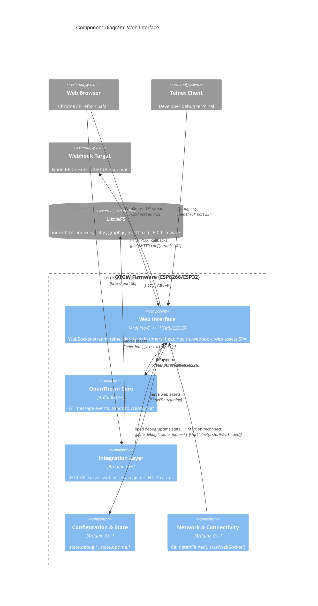

# C4 Component: Web Interface

## Overview

- **Name**: Web Interface
- **Description**: The complete user-facing layer of the firmware. Combines a browser-delivered single-page application (HTML/CSS/JavaScript served from LittleFS) with the server-side infrastructure that supports it: WebSocket streaming of real-time OpenTherm log data, webhook HTTP callbacks for external notifications, safe cooperative-scheduler timers, system monitoring, and the telnet debug server. Together these provide the operational surface for configuration, monitoring, and control without requiring a separate server.
- **Type**: Application Component
- **Technology**: HTML5/CSS3/ES5+ JavaScript, ECharts, WebSocketsServer (ESP8266/ESP32), TelnetStream, LittleFS

## Purpose

The Web Interface component has two tightly coupled halves. The server side (Utilities) provides the real-time infrastructure that the browser UI depends on: the WebSocket server that streams OT log frames to the live log viewer, the heap-aware backpressure system that prevents the ESP8266 from running out of memory under heavy WebSocket load, safe timer macros that handle `millis()` rollover correctly, and the telnet debug server on port 23 for development diagnostics.

The client side (Web Assets) is a self-contained SPA served directly from LittleFS flash. `index.js` (~3000 lines) handles page navigation, WebSocket reconnection, REST API polling for device info, settings form management, OTA firmware upload, and the OT log viewer. `sat.js` (~600 lines) renders the SAT thermostat dashboard. `graph.js` (~800 lines) drives a live multi-channel ECharts temperature graph with 5 y-axes, 24-hour buffering, and Dallas sensor auto-discovery. The webhook module delivers HTTP callbacks to external systems (e.g., Node-RED) when a configured OpenTherm status bit changes.

## Software Features

### Server-Side Infrastructure (Utilities)

- **WebSocket server on port 81**: Streams real-time OT log lines to connected browsers; heap-aware backpressure (CRITICAL: block, WARNING: throttle to 200ms, LOW: throttle to 50ms, HEALTHY: immediate)
- **Heap health tracking**: Four-level classification (HEALTHY >8KB, LOW 3–8KB, WARNING 3–5KB, CRITICAL <3KB) with separate throttle gates for WebSocket (`canSendWebSocket()`) and MQTT (`canPublishMQTT()`)
- **Emergency heap recovery**: Clears MQTT buffer and yields on CRITICAL heap; throttled to max once per 30 seconds
- **Safe timer macros** (`safeTimers.h`): `DECLARE_TIMER_SEC()`, `DECLARE_TIMER_MS()`, `DUE()`, `RESTART_TIMER()`, `CATCH_UP_MISSED_TICKS()`, `CHANGE_INTERVAL_SEC()` — all handle `millis()` 49-day rollover correctly
- **Telnet debug server** (port 23): `TelnetStream`-based debug output; all firmware debug macros (`DebugTln`, `DebugTf`, `DebugT`) write here; Serial is reserved for PIC
- **Timestamped debug output**: `_debugBOL()` prefixes every line with `HH:MM:SS.uuuuuu (freeHeap|maxBlock) function(line):`; microsecond precision from `gettimeofday()`; DST-aware timezone caching
- **Module-scoped conditional debug**: Each `.ino` file has module-specific debug macros (`OTDebugTln`, `MQTTDebugTln`, etc.) gated by `state.debug.b*` flags (ADR-051)
- **Webhook callbacks**: HTTP POST to configurable URL when OpenTherm status bit changes; supports on/off URL variants, configurable payload template, content-type header
- **Reboot tracking**: Persists reboot count and reboot log (timestamp, reset reason, register dump, exception info) to LittleFS; circular log with 20 entries
- **LittleFS health monitoring**: Writes probe file on mount; reads `/version.hash` to detect firmware/filesystem version mismatch; sets `state.statusMessage` for banner display
- **System utility functions**: `trimwhitespace()`, `isValidIP()`, `replaceAll()`, `signal_quality_perc_quad()`, `dBmtoQuality()`, `upTime()`, `getOTLogTimestamp()`, `yearChanged()` / `dayChanged()` / `minuteChanged()`

### Browser-Side SPA (Web Assets)

- **Multi-page SPA**: Tab navigation (Home, SAT, Settings, Advanced); no page reload; shares one WebSocket connection across tabs
- **Real-time OT log viewer**: WebSocket-fed circular buffer; search/filter by message ID or label; auto-scroll with user override; timestamp display toggle; export to file
- **Live temperature graph** (`graph.js`): ECharts multi-grid chart with 5 y-axes (Flame, DHW, CH, Modulation, Temperatures); 24-hour rolling buffer; Dallas sensor auto-discovery and dynamic color assignment; theme synchronization
- **SAT dashboard** (`sat.js`): Reads `/api/v2/sat/status`; renders heating curve visualization, PID gain display, current boiler state, preset buttons, simulation toggle, temperature inputs
- **Settings management**: Form-based settings update via REST API `POST /api/v2/settings`; placeholder password masking (never echoes actual credentials); SSID display with copy-to-clipboard
- **OTA firmware update**: Drag-and-drop or file-select upload to ESP8266 OTA endpoint; progress tracking; auto-reboot detection
- **PIC firmware flashing**: Uploads `.hex` file to LittleFS, triggers PIC upgrade via REST API; per-PIC-type firmware selection (PIC16F88 / PIC16F1847)
- **LittleFS file explorer**: Upload, download, delete, rename arbitrary LittleFS files via `FSexplorer.html`
- **Light/dark theme**: CSS variable-based theming; preference persisted in `localStorage`; sun/moon toggle button
- **Browser compatibility**: Chrome, Firefox, Safari (latest + 2 versions); graceful degradation on missing APIs
- **Home Assistant MQTT auto-config**: `mqttha.cfg` defines 200+ HA discovery payloads for sensors, binary_sensors, and climate entities; used by Integration Layer template renderer

## Code Modules

| Module | File | Description |
|--------|------|-------------|
| Utilities & WebSocket | [c4-code-utilities.md](./c4-code-utilities.md) | Telnet debug, WebSocket stream, heap health, safe timers, webhook, system utilities |
| Web Assets | [c4-code-web-assets.md](./c4-code-web-assets.md) | HTML/CSS/JS SPA, settings page, SAT dashboard, OT log viewer, ECharts graph, PIC firmware files |

## Interfaces

### WebSocket Stream Interface

- **Protocol**: WebSocket (ws://, port 80 path `/ws` or legacy port 81)
- **Description**: Real-time OpenTherm event stream to browser clients.
- **Operations**:
  - `startWebSocket()` — initialize WebSocket server
  - `sendLogToWebSocket(prefix, msg, len)` — broadcast single event line to all connected clients
  - `broadcastWebSocket(data, len)` — raw broadcast (called by OpenTherm Core after processOT)
  - Heap backpressure: `canSendWebSocket()` — gates all broadcast calls
- **Frame format**: Single text line, prefix character + OT message content
  - `>` = command sent to boiler, `<` = response received, `!` = error/warning, `*` = system event

### Debug Telnet Interface

- **Protocol**: Telnet (TCP port 23, TelnetStream library)
- **Description**: Real-time firmware debug log. Read-only (firmware does not process telnet input).
- **Operations**:
  - `startTelnet()` — initialize TelnetStream server
  - `Debug()`, `Debugln()`, `Debugf()` — raw output macros
  - `DebugT()`, `DebugTln()`, `DebugTf()` — timestamped output macros (prefix with heap stats)
  - Module-specific: `OTDebugTln()`, `MQTTDebugTln()`, `RESTDebugTln()`, etc.

### Safe Timer API

- **Protocol**: In-process C++ macros (`safeTimers.h`)
- **Description**: Millis()-rollover-safe countdown timers used throughout the firmware.
- **Operations**:
  - `DECLARE_TIMER_SEC(name, seconds)` — declare a named timer with interval in seconds
  - `DECLARE_TIMER_MS(name, ms)` — declare a named timer with interval in milliseconds
  - `DUE(name)` — returns true and resets timer if interval has elapsed
  - `RESTART_TIMER(name)` — reset timer without checking
  - `CHANGE_INTERVAL_SEC(name, seconds)` — change interval of existing timer
  - `CATCH_UP_MISSED_TICKS(name)` — advance timer past all missed ticks (for boot catch-up)

### Webhook Interface

- **Protocol**: HTTP POST (outbound, plain HTTP only)
- **Description**: Triggers HTTP callbacks to external systems when an OpenTherm status bit changes.
- **Configuration**:
  - `settings.webhook.bEnabled`, `.sURL_on`, `.sURL_off`, `.iTriggerBit`, `.sPayload`, `.sContentType`
- **Operations**:
  - `testWebhook(bool state)` — send test webhook via `POST /api/v2/webhook/test?state=on|off`

### Heap Health API

- **Protocol**: In-process C++ API
- **Description**: Heap monitoring with backpressure for MQTT and WebSocket.
- **Operations**:
  - `getHeapHealth()` — returns `HeapHealthLevel` (HEALTHY/LOW/WARNING/CRITICAL)
  - `canSendWebSocket()` — gate for WebSocket broadcasts (heap-aware)
  - `canPublishMQTT()` — gate for MQTT publishes (heap-aware)
  - `emergencyHeapRecovery()` — last-resort memory reclaim on CRITICAL heap

### Web UI Served Assets

- **Protocol**: HTTP/1.1 (served by REST API component from LittleFS)
- **Description**: Static assets served to browser clients.
- **Files served**:
  - `index.html` — SPA entry point (~11 KB, ETag-cached)
  - `index.js` — main UI controller (English-only since TASK-569; version-stamped URL)
  - `sat.js` — SAT dashboard (heating-curve markers, sensor-area mapping, BLE roster, WiFi scan)
  - `sat-slider.js` — shared slider widget
  - `graph.js` — ECharts temperature graph
  - `theme-toggle.js`, `echarts-theme.js` — theme switch + ECharts theme registration
  - `ds-tokens.css`, `components.css` — design-system tokens + component styles (single sheet, no per-theme files)
  - `design.html` — internal style guide / component gallery
  - `FSexplorer.html` — LittleFS file browser (styled by `components.css`)
  - `pic16f88/*.hex`, `pic16f1847/*.hex` — PIC firmware binaries
  - HA MQTT discovery is no longer served from a runtime `mqttha.cfg`; it is published from PROGMEM tables in the firmware (ADR-077)

## Dependencies

### Components Used

- **OpenTherm Core**: calls `sendEventToWebSocket()` and `reportOTGWEvent()` from `processOT()` to stream each decoded frame; Utilities provides `canSendWebSocket()` gate
- **Integration Layer (REST API)**: REST API component registers HTTP routes and serves web assets from LittleFS; Utilities provides helper functions (`getFilesystemHash()`, `updateLittleFSStatus()`) used by file server
- **Configuration and State**: reads `state.debug.b*` flags for conditional debug macros; reads `state.uptime.*` for `upTime()` display; reads `state.statusMessage` for banner
- **Network and Connectivity**: `startWebSocket()` called by Network component on WiFi reconnection; Utilities provides `startTelnet()` also called by Network on reconnect

### External Systems

- **TelnetStream** (jandrassy v0.0.1): Telnet server on port 23
- **WebSocketsServer** (ESP8266/ESP32 library): WebSocket server, buffer reduced to 256 bytes via `WEBSOCKETS_MAX_DATA_SIZE`
- **LittleFS**: All web assets, `mqttha.cfg`, `/version.hash`, `/reboot_count.txt`, `/reboot_log.txt`
- **ECharts** (Apache): Loaded from LittleFS or CDN; drives temperature graph in browser

## Component Diagram

