# C4 Component Level: OTGW-Firmware System Overview

## System Components

The OTGW-firmware synthesizes 10 code-level modules into 6 logical components. The grouping follows domain boundaries: protocol, transport, integration, configuration, thermostat control, and physical I/O plus UI infrastructure.

| Component | Type | Description | Documentation |
|-----------|------|-------------|---------------|
| OpenTherm Core | Application Component | Protocol decoding, PIC serial comm, command queue, MQTT throttle, watchdog management, OTDirect GPIO stack (ESP32) | [c4-component-opentherm-core.md](./c4-component-opentherm-core.md) |
| Network and Connectivity | Application Component | WiFi, NTP, mDNS/LLMNR, Ethernet failover (ESP32+W5500), platform abstraction | [c4-component-network.md](./c4-component-network.md) |
| Integration Layer | Application Component | MQTT client + HA auto-discovery, REST API v2, JSON streaming, file serving, auth/CSRF | [c4-component-integration-layer.md](./c4-component-integration-layer.md) |
| Configuration and State | Application Component | Persistent settings (OTGWSettings), runtime state (OTGWState), LittleFS JSON, deferred write, side-effect coordination | [c4-component-configuration-state.md](./c4-component-configuration-state.md) |
| Smart Thermostat (SAT) | Application Component | Heating curve, PID v3 with deadband, anti-cycling, OPV calibration, boiler state machine, weather compensation, BLE | [c4-component-smart-thermostat.md](./c4-component-smart-thermostat.md) |
| Sensors and Hardware | Application Component | Dallas DS18B20 (1-Wire), S0 pulse energy meter, GPIO relay, OLED display, sensor simulation | [c4-component-sensors-hardware.md](./c4-component-sensors-hardware.md) |
| Web Interface | Application Component | WebSocket OT stream, telnet debug, heap health, safe timers, webhook, browser SPA (HTML/CSS/JS + ECharts) | [c4-component-web-interface.md](./c4-component-web-interface.md) |

## Code Module to Component Mapping

| Code Module File | Component |
|-----------------|-----------|
| [c4-code-otgw-core.md](./c4-code-otgw-core.md) | OpenTherm Core |
| [c4-code-otdirect.md](./c4-code-otdirect.md) | OpenTherm Core |
| [c4-code-network.md](./c4-code-network.md) | Network and Connectivity |
| [c4-code-mqtt.md](./c4-code-mqtt.md) | Integration Layer |
| [c4-code-rest-api.md](./c4-code-rest-api.md) | Integration Layer |
| [c4-code-settings.md](./c4-code-settings.md) | Configuration and State |
| [c4-code-sat.md](./c4-code-sat.md) | Smart Thermostat (SAT) |
| [c4-code-sensors.md](./c4-code-sensors.md) | Sensors and Hardware |
| [c4-code-utilities.md](./c4-code-utilities.md) | Web Interface |
| [c4-code-web-assets.md](./c4-code-web-assets.md) | Web Interface |

## Component Architecture

### Design Rationale

**OpenTherm Core + OTDirect as one component**: OTDirect is the ESP32-native replacement for the PIC gateway. From the rest of the firmware's perspective, both paths produce identical output: decoded OT frames passed to `processOT()`. Grouping them reflects their functional equivalence — one decodes serial from a PIC, the other decodes GPIO signals directly. The Integration Layer, SAT, and REST API components are unaware of which path is active.

**Integration Layer combining MQTT + REST API**: Both sub-systems consume the same data sources (OpenTherm state, settings, SAT state), share the same JSON formatting infrastructure (`jsonStuff.ino`), and expose overlapping functionality (SAT can be controlled via either MQTT topics or REST endpoints). Separating them would require documenting the shared JSON layer twice without adding clarity.

**Web Interface combining Utilities + Web Assets**: The Utilities code (WebSocket server, heap backpressure, safe timers, telnet) exists primarily to support the browser SPA. There is no meaningful architectural boundary between "the WebSocket server" and "the JavaScript that connects to it" — they are co-designed and co-evolve. Server-side infrastructure for the UI lives in one component.

**Configuration and State as a standalone component**: `OTGWSettings` and `OTGWState` are accessed by every other component. Making Configuration and State a named, first-class component makes this central role explicit and prevents the common mistake of treating settings as a detail of whichever module first touches them.

### Component Dependency Rules

- **No circular dependencies at component level**: Configuration and State has no dependencies on other firmware components (only on LittleFS). It is the stable base.
- **OpenTherm Core does not depend on SAT**: SAT reads from Core's published state; Core does not call SAT. Data flows one way.
- **Integration Layer is the only component that reaches external systems** (broker, HA): Other components push to Integration Layer; they do not independently open TCP connections.
- **Web Interface is infrastructure**: All other components call into Web Interface (WebSocket events, timers, heap gates) but Web Interface does not depend on SAT, Sensors, or Integration Layer at the server level.

## Component Relationships Diagram

```mermaid
C4Component
    title OTGW-Firmware: All Components and Relationships

    Container_Boundary(fw, "OTGW-Firmware (ESP8266 / ESP32)") {
        Component(otcore, "OpenTherm Core", "Arduino C++", "OT protocol, PIC serial, command queue, OTDirect GPIO (ESP32)")
        Component(network, "Network & Connectivity", "Arduino C++", "WiFi, NTP, mDNS, Ethernet failover, platform abstraction")
        Component(integlayer, "Integration Layer", "Arduino C++", "MQTT client + HA discovery, REST API v2, JSON streaming, file serving")
        Component(cfgstate, "Configuration & State", "Arduino C++", "OTGWSettings, OTGWState, LittleFS JSON, deferred write")
        Component(sat, "Smart Thermostat (SAT)", "Arduino C++", "Heating curve, PID v3, anti-cycling, OPV calibration, boiler state machine")
        Component(sensors, "Sensors & Hardware", "Arduino C++", "Dallas DS18B20, S0 pulse counter, GPIO relay, OLED")
        Component(webui, "Web Interface", "Arduino C++ + HTML/CSS/JS", "WebSocket stream, telnet, heap health, safe timers, webhook, browser SPA")
    }

    System_Ext(pic, "PIC Gateway", "OpenTherm PIC on NodoShop OTGW board")
    System_Ext(boiler, "Boiler", "OpenTherm slave (CV-ketel)")
    System_Ext(thermostat, "Thermostat", "OpenTherm master device")
    System_Ext(broker, "MQTT Broker", "Mosquitto / Home Assistant MQTT")
    System_Ext(ha, "Home Assistant", "Consumes MQTT telemetry and discovery")
    System_Ext(browser, "Web Browser", "Chrome / Firefox / Safari")
    System_Ext(router, "WiFi / Network", "Home LAN, DHCP, NTP server")
    SystemDb_Ext(lfs, "LittleFS", "Settings, web assets, HA config, PIC firmware")

    Rel(otcore, pic, "UART serial 9600 baud", "TX/RX OpenTherm frames")
    Rel(pic, boiler, "OpenTherm bus", "1-wire Manchester")
    Rel(thermostat, pic, "OpenTherm bus", "1-wire Manchester")
    Rel(otcore, boiler, "OpenTherm GPIO (ESP32)", "ISR Manchester, OTDirect")
    Rel(thermostat, otcore, "OpenTherm GPIO (ESP32)", "ISR Manchester, OTDirect")

    Rel(network, router, "WiFi / DHCP / NTP", "802.11 + SNTP")

    Rel(integlayer, broker, "MQTT 3.1.1", "publish + subscribe")
    Rel(ha, broker, "MQTT", "consume telemetry and discovery")
    Rel(browser, integlayer, "HTTP REST + file serving", "port 80")
    Rel(browser, webui, "WebSocket OT stream", "ws:// port 80 /ws")

    Rel(otcore, cfgstate, "Read settings, write state", "settings.otgw.*, state.pic.*")
    Rel(network, cfgstate, "Read settings, write state", "settings.ntp.*, state.net.*")
    Rel(integlayer, cfgstate, "Read/write settings and state", "updateSetting(), settings.mqtt.*")
    Rel(sat, cfgstate, "Read/write SAT settings and state", "settings.sat.*, state.sat.*")
    Rel(sensors, cfgstate, "Read sensor settings", "settings.sensors.*, settings.s0.*")
    Rel(webui, cfgstate, "Read debug/uptime state", "state.debug.*, state.uptime.*")

    Rel(otcore, integlayer, "Decoded OT values", "sendMQTTData(), publishToSourceTopic()")
    Rel(otcore, webui, "OT frame events", "sendEventToWebSocket()")
    Rel(integlayer, sat, "SAT commands in/out", "satHandle*(), state.sat.*")
    Rel(integlayer, sensors, "Sensor label REST API", "getDallasLabels()")
    Rel(sensors, integlayer, "Sensor MQTT publish", "sendMQTTData(), sensorAutoConfigure()")
    Rel(sat, otcore, "Inject setpoints", "addCommandToQueue(TT=, CS=, MM=)")
    Rel(network, integlayer, "Restarts MQTT on reconnect", "startMQTT()")
    Rel(network, webui, "Restarts services on reconnect", "startTelnet(), startWebSocket()")
    Rel(cfgstate, network, "Side-effects: MDNS, NTP", "startMDNS(), startNTP()")
    Rel(cfgstate, integlayer, "Side-effect: MQTT restart", "startMQTT()")
    Rel(webui, otcore, "Heap backpressure gate", "canSendWebSocket()")
    Rel(integlayer, webui, "Heap backpressure gate", "canPublishMQTT()")

    Rel(cfgstate, lfs, "Read/write settings.ini", "JSON file I/O")
    Rel(integlayer, lfs, "Read mqttha.cfg, serve web assets", "HTTP streaming")
    Rel(sensors, lfs, "Persist sensor labels", "/dallas_labels.ini")
    Rel(sat, lfs, "Persist PID state", "/pid_state.json")
    Rel(webui, lfs, "Crash log, reboot count, version hash", "/reboot_log.txt, /version.hash")
```

## Key Data Flows

### OpenTherm Message to MQTT

1. Boiler sends OT frame to PIC over 1-wire bus
2. PIC forwards frame over UART to ESP8266 (e.g., `BA000001\r`)
3. **OpenTherm Core** `handlePICSerial()` accumulates line, dispatches to `processOT()`
4. `processOT()` decodes frame type and message ID, extracts typed value (f8.8, s16, etc.)
5. Updates `OTcurrentSystemState` (Configuration and State global)
6. Checks `mqttlastsent[msgId]` throttle timestamp
7. Calls **Integration Layer** `sendMQTTData("Tboiler", "65.50", true)`
8. Integration Layer streams payload to MQTT broker in 128-byte chunks
9. MQTT broker delivers to **Home Assistant** and any other subscribers

### SAT Setpoint Injection

1. **SAT** control loop fires every 60 seconds
2. Reads `OTcurrentSystemState.Tboiler`, `.Tr`, `.RelModLevel` from **OpenTherm Core**
3. Reads outdoor temperature from **Configuration and State** `state.sat.fOutdoorTemp`
4. Computes heating curve setpoint + PID correction
5. Calls `addCommandToQueue("TT=21.50")` in **OpenTherm Core**
6. OpenTherm Core sends `TT=21.50\r` over UART to PIC
7. PIC intercepts next thermostat READ_DATA MsgID 1 frame and substitutes setpoint
8. Boiler receives modified setpoint, adjusts burner modulation

### Settings Update via Web UI

1. Browser `POST /api/v2/settings` with JSON body `{"mqttbroker": "192.168.1.10"}`
2. **Integration Layer** REST API `handleSettings()` extracts field/value pairs
3. Calls `updateSetting("mqttbroker", "192.168.1.10")` in **Configuration and State**
4. `updateSetting()` validates broker string, sets `settings.mqtt.sBroker`, marks `settingsDirty=true`, sets `SIDE_EFFECT_MQTT` bit
5. `timerFlushSettings` (2-second debounce) fires in main loop
6. `flushSettings()` calls `writeSettings()` to persist `/settings.ini` to LittleFS
7. Applies side-effect: calls **Integration Layer** `startMQTT()` to reconnect with new broker
