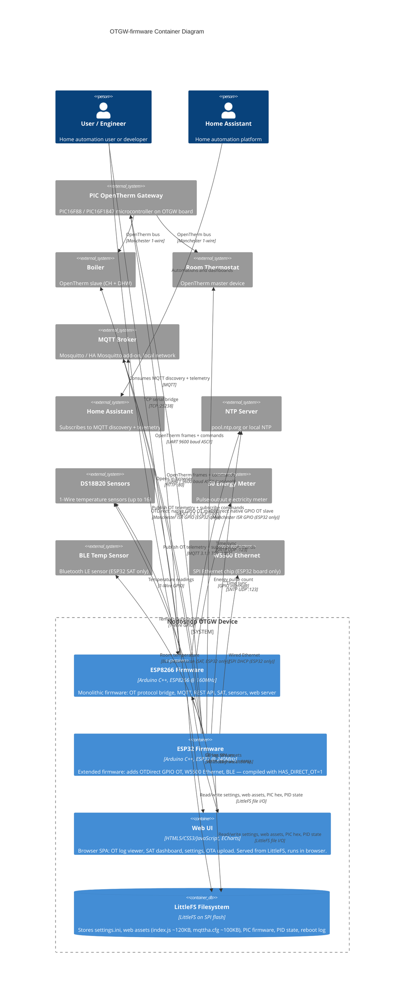

# C4 Container Diagram: OTGW-firmware

## System Overview

OTGW-firmware runs on a Nodoshop OpenTherm Gateway board fitted with either an ESP8266 (current hardware, "OTGW v1.x") or an ESP32 (next-generation hardware, "OTGW32"). The device sits on the local network between a central heating thermostat and a boiler, bridging the OpenTherm bus to WiFi-based home automation systems.

The system produces two independent firmware binaries — one per chip family — built from the same codebase with a compile-time platform flag (`BOARD_NODOSHOP_ESP8266` / `BOARD_NODOSHOP_ESP32`). Both binaries share the same LittleFS flash partition layout. The browser-side SPA (Web UI) is a separate logical deployment unit: it lives in the LittleFS filesystem image, gets flashed alongside the firmware, and executes in the user's browser after being served over HTTP.

All containers live on a single physical device. There is no Docker, no Kubernetes, no cloud. The "containers" here are deployment units in the C4 sense: things that need to be running (or present) for the system to work.

---

## Containers

### ESP8266 Firmware

- **Type**: Embedded Firmware (primary deployment target)
- **Technology**: Arduino C/C++, ESP8266 Arduino Core 3.1.2, PlatformIO (espressif8266@4.2.1)
- **Platform**: Wemos D1 Mini / NodeMCU (ESP8266 @ 160 MHz, ~80 KB DRAM, 4 MB flash)
- **Build flag**: `-DBOARD_NODOSHOP_ESP8266`
- **Description**: The primary production firmware binary. A single monolithic Arduino sketch compiled into a flash image uploaded to the ESP8266 via USB or OTA. Includes all six firmware components below. Communicates with the PIC gateway exclusively over UART at 9600 baud. Does **not** include OTDirect or Ethernet support (those are ESP32-only features).
- **Components** (all run within this binary):
  - OpenTherm Core (PIC path only): [c4-component-opentherm-core.md](./c4-component-opentherm-core.md)
  - Network and Connectivity (WiFi, NTP, mDNS, LLMNR): [c4-component-network.md](./c4-component-network.md)
  - Integration Layer (MQTT + REST API): [c4-component-integration-layer.md](./c4-component-integration-layer.md)
  - Configuration and State: [c4-component-configuration-state.md](./c4-component-configuration-state.md)
  - Smart Thermostat (SAT): [c4-component-smart-thermostat.md](./c4-component-smart-thermostat.md)
  - Sensors and Hardware (DS18B20, S0, GPIO relay, OLED): [c4-component-sensors-hardware.md](./c4-component-sensors-hardware.md)
  - Web Interface (WebSocket, telnet, heap health, webhook): [c4-component-web-interface.md](./c4-component-web-interface.md)
- **Hardware interfaces**:
  - UART TX/RX to PIC (9600 baud, D5=GPIO14 reset line)
  - 1-Wire GPIO for DS18B20 sensors (runtime-configurable pin)
  - GPIO interrupt for S0 pulse counter
  - GPIO output for relay
  - I2C (GPIO4/5) for external watchdog (address 0x26) and optional OLED
- **Network interfaces**: HTTP port 80, WebSocket port 80 (/ws), Telnet port 23, TCP serial bridge port 25238
- **OTA update**: ArduinoOTA over WiFi; OTA endpoint on HTTP `/update`

---

### ESP32 Firmware

- **Type**: Embedded Firmware (next-generation hardware)
- **Technology**: Arduino C/C++, Arduino-ESP32 v3.3.5, PlatformIO (pioarduino espressif32)
- **Platform**: Nodoshop OTGW32 (ESP32 @ 240 MHz, ~300 KB DRAM, 4 MB flash, custom partition table)
- **Build flag**: `-DBOARD_NODOSHOP_ESP32`
- **Description**: The next-generation firmware binary for the OTGW32 board. Includes everything in the ESP8266 firmware, plus two additional capabilities enabled at compile time: OTDirect (native GPIO-based OpenTherm master/slave via ISR-driven Manchester encoding, replacing or augmenting the PIC) and Ethernet failover via a W5500 SPI module. BLE temperature sensing for SAT is also ESP32-only. The partition table (`partitions_otgw_esp32.csv`) provides 2x 1.5 MB OTA app slots and 768 KB LittleFS.
- **Components** (superset of ESP8266):
  - OpenTherm Core (PIC path + OTDirect): [c4-component-opentherm-core.md](./c4-component-opentherm-core.md)
  - Network and Connectivity (WiFi + W5500 Ethernet failover): [c4-component-network.md](./c4-component-network.md)
  - Integration Layer (MQTT + REST API + OTDirect REST endpoints): [c4-component-integration-layer.md](./c4-component-integration-layer.md)
  - Configuration and State: [c4-component-configuration-state.md](./c4-component-configuration-state.md)
  - Smart Thermostat (SAT + BLE temperature sensing): [c4-component-smart-thermostat.md](./c4-component-smart-thermostat.md)
  - Sensors and Hardware: [c4-component-sensors-hardware.md](./c4-component-sensors-hardware.md)
  - Web Interface: [c4-component-web-interface.md](./c4-component-web-interface.md)
- **Additional hardware interfaces** (beyond ESP8266):
  - GPIO 32/33 (OT master in/out) and GPIO 25/26 (OT slave in/out) for OTDirect
  - GPIO 27: step-up converter enable (18 V OpenTherm bus power)
  - SPI (GPIO 18/19/23) + CS/INT/RST (GPIO 5/34/15) for W5500 Ethernet
  - BLE radio for passive advertisement scanning (NimBLE stack)
  - UART1 (GPIO 16 RX / 17 TX) for PIC communication

---

### Web UI (Browser SPA)

- **Type**: Web Application (single-page application, runs in the user's browser)
- **Technology**: HTML5, CSS3, ES5+ JavaScript, ECharts (Apache), WebSocket API
- **Platform**: Modern browser (Chrome, Firefox, Safari — latest + 2 versions back)
- **Description**: A self-contained SPA delivered to the browser by the firmware's HTTP server. The browser loads `index.html` (~11 KB) from port 80, which pulls in `index.js` (~3000 lines), `sat.js` (~600 lines), `graph.js` (~800 lines), and CSS files — all served from LittleFS. Once loaded, the SPA communicates with the firmware exclusively via REST API (JSON over HTTP) and WebSocket (real-time OT log stream). There is no server-side rendering; all UI state is client-side.
- **Components delivered**:
  - Web Assets (index.js, sat.js, graph.js, CSS): [c4-component-web-interface.md](./c4-component-web-interface.md)
- **Capabilities**:
  - Live OpenTherm log viewer (WebSocket feed, search/filter, export)
  - Real-time ECharts temperature graph (5 y-axes, 24-hour rolling buffer)
  - SAT thermostat dashboard (heating curve, PID gains, preset buttons)
  - Settings form (all 80+ device settings via REST API)
  - OTA firmware upload (drag-and-drop, ESP8266 and PIC)
  - LittleFS file explorer
  - Light/dark theme toggle (persisted in localStorage)

---

### LittleFS Filesystem

- **Type**: On-device Flash Storage
- **Technology**: LittleFS (POSIX-like filesystem in SPI flash), wear-levelling enabled
- **Platform**: ESP8266: 2 MB partition (4 MB flash, `eagle.flash.4m2m.ld`); ESP32: 768 KB partition (custom `partitions_otgw_esp32.csv`)
- **Description**: The flash filesystem partition that stores all persistent data and web assets. Flashed separately from the firmware binary via PlatformIO (`pio run -t uploadfs`) or the build script. Provides the firmware with a POSIX-like file API (open, read, write, delete) used for settings persistence, web asset serving, and PIC firmware storage.
- **Contents**:

| File / Path | Size | Purpose |
|---|---|---|
| `/settings.ini` | ~4 KB | Device configuration (all `OTGWSettings` fields as JSON) |
| `/index.html` | ~11 KB | SPA entry point |
| `/index.js` | ~120 KB | Main UI JavaScript |
| `/sat.js` | ~25 KB | SAT dashboard JavaScript |
| `/graph.js` | ~35 KB | ECharts temperature graph JavaScript |
| `/index.css`, `/index_dark.css`, `/index_common.css` | ~15 KB total | Themes |
| `/FSexplorer.html`, `/FSexplorer.css` | ~10 KB | File explorer |
| `/mqttha.cfg` | ~100 KB | 200+ Home Assistant MQTT discovery templates |
| `/dallas_labels.ini` | <1 KB | DS18B20 sensor address-to-label mappings |
| `/gateway.hex` | varies | PIC16F88 or PIC16F1847 firmware binaries |
| `/pid_state.json` | <1 KB | SAT PID integral/derivative state (persisted across restarts) |
| `/reboot_count.txt` | <1 KB | Persistent reboot counter |
| `/reboot_log.txt` | <5 KB | Circular log of last 20 reboot events |
| `/version.hash` | <0.1 KB | Firmware/filesystem version hash for mismatch detection |
| `/otgw.replay` | varies | Optional OT message replay log for simulation mode |

---

## Container Interfaces

### HTTP Web Server (port 80)

- **From**: Web Browser, REST API clients (Home Assistant, Node-RED, Telegraf)
- **To**: ESP8266 Firmware / ESP32 Firmware
- **Protocol**: HTTP/1.1 (plain only — HTTPS is explicitly out of scope)
- **Port**: 80
- **Description**: The primary inbound interface. Serves the Web UI SPA from LittleFS and handles all REST API requests. Also serves the OTA firmware update endpoint. HTTP Basic Auth required for all POST/PUT mutations (configured password in settings).
- **Key operations**: See [REST API](#rest-api) section below.

### WebSocket OT Log Stream (port 80, path /ws)

- **From**: Web Browser (index.js)
- **To**: ESP8266 Firmware / ESP32 Firmware
- **Protocol**: WebSocket (ws://, text frames)
- **Port**: 80 (path `/ws`; legacy port 81 also supported)
- **Description**: Real-time push stream of decoded OpenTherm log lines from the firmware to connected browsers. Each frame is a single text line with a one-character prefix. Heap-aware backpressure prevents OOM on the ESP8266: frames are dropped or throttled when free heap drops below 8 KB.
- **Frame format**: `<prefix><content>\n` where prefix is:
  - `>` = command sent from thermostat to gateway
  - `<` = response received from boiler
  - `!` = error or warning event
  - `*` = system event (boot, reconnect, etc.)

### MQTT Client Connection

- **From**: ESP8266 Firmware / ESP32 Firmware
- **To**: MQTT Broker (external)
- **Protocol**: MQTT 3.1.1 over TCP
- **Port**: 1883 (default, configurable)
- **Description**: Outbound persistent TCP connection to the configured MQTT broker. The firmware publishes OpenTherm telemetry (OT values, SAT state, sensor readings) and subscribes to command topics. Connection is managed by a six-state machine with 3-second retry intervals and 10-minute back-off after 5 consecutive failures.
- **Key operations**: See [MQTT API](#mqtt-api) section below.

### PIC UART Serial Link

- **From**: ESP8266 Firmware / ESP32 Firmware
- **To**: OpenTherm Gateway PIC (external hardware)
- **Protocol**: UART, 9600 baud, 8N1, ASCII line-oriented
- **Connection**: ESP8266: hardware UART0 (dedicated, Serial is reserved); ESP32: UART1 (GPIO16 RX / GPIO17 TX)
- **Description**: The exclusive serial link to the PIC16F88 or PIC16F1847 microcontroller on the OTGW board. All OpenTherm bus traffic arrives from the PIC as ASCII-framed lines. Commands are sent as ASCII strings. The firmware never writes to Serial after initialization — it belongs entirely to this link.
- **Key operations**:
  - PIC → ESP: `T<hex>` (thermostat frame), `B<hex>` (boiler frame), `R<hex>` (gateway request), `A<hex>` (gateway answer)
  - ESP → PIC: `CS=1`, `GW=1`, `PS=1`, `TT=<setpoint>`, `TC=<setpoint>`, `OT=<temp>`, `SC=<HH>:<MM>/<DOW>`, `PR=A`, `CR=<0-14>`

### OTDirect GPIO OpenTherm Interface (ESP32 only)

- **From**: ESP32 Firmware (OTDirect component)
- **To**: OpenTherm Bus (boiler and/or thermostat directly)
- **Protocol**: OpenTherm (Manchester-encoded 1-wire, ISR-driven, 3.3 V logic via step-up to 18 V bus)
- **Connection**: GPIO 32/33 (master), GPIO 25/26 (slave), GPIO 27 (step-up enable)
- **Description**: Native OpenTherm master/slave interface bypassing the PIC entirely. Available only on ESP32 hardware with `HAS_DIRECT_OT=1`. Operates in one of five modes: gateway, monitor, bypass, master, or loopback.

### TCP Serial Bridge (port 25238)

- **From**: OTmonitor software, custom TCP clients
- **To**: ESP8266 Firmware / ESP32 Firmware
- **Protocol**: Raw TCP (ASCII line-oriented, same format as PIC UART)
- **Port**: 25238
- **Description**: Transparent TCP socket that exposes the PIC UART stream to the local network. Allows tools like OTmonitor to connect remotely as if they had a direct serial connection to the PIC. Note: PIC firmware cannot be flashed over this interface (doing so can brick the PIC).
- **Key operations**: Bidirectional pass-through of ASCII OpenTherm frames.

### Telnet Debug Server (port 23)

- **From**: Developer terminal (telnet client)
- **To**: ESP8266 Firmware / ESP32 Firmware
- **Protocol**: Telnet (raw TCP, read-only output stream)
- **Port**: 23
- **Description**: Real-time firmware debug log output. Every `DebugTln()` / `DebugTf()` call in the firmware writes a timestamped line here (format: `HH:MM:SS.uuuuuu (freeHeap|maxBlock) function(line):`). Read-only — the firmware does not process any input from this connection. Invaluable for field debugging without a USB cable attached.

### NTP Time Synchronization

- **From**: ESP8266 Firmware / ESP32 Firmware
- **To**: NTP Server (external)
- **Protocol**: SNTP (UDP)
- **Port**: 123
- **Description**: Outbound SNTP requests to `pool.ntp.org` (configurable). Re-syncs every 30 minutes. On successful sync, the firmware sends `SC=`, `SR=21:`, `SR=22:` commands to the PIC to keep the boiler clock accurate.

### mDNS / LLMNR Hostname Advertisement

- **From**: ESP8266 Firmware / ESP32 Firmware
- **To**: Local network name resolution
- **Protocol**: mDNS (UDP/5353), LLMNR (UDP/5355, ESP8266 only)
- **Description**: Registers `<hostname>.local` on the local network so browsers can reach the device by name (e.g., `http://otgw.local`). Also advertises the HTTP service on port 80. LLMNR provides Windows name resolution without needing Bonjour.

### Ethernet (ESP32 + W5500 only)

- **From**: ESP32 Firmware
- **To**: Local network switch / router
- **Protocol**: Ethernet, DHCP
- **Connection**: SPI bus (GPIO 18/19/23/5), W5500 chip
- **Description**: Optional wired Ethernet connection for the ESP32 board. Detected automatically via W5500 SPI VERSION register at boot. When Ethernet link is present, WiFi is disabled. Hot-plug cable detection polls every 5 seconds.

### Webhook HTTP Callback

- **From**: ESP8266 Firmware / ESP32 Firmware
- **To**: Webhook target (Node-RED, Home Assistant, custom HTTP endpoint)
- **Protocol**: HTTP POST (outbound, plain HTTP)
- **Port**: Configurable (target URL)
- **Description**: Outbound HTTP callback triggered when a configured OpenTherm status bit changes state. Delivers a configurable payload to a configurable URL (separate on/off URLs supported).

### Weather API (SAT, outbound)

- **From**: ESP8266 Firmware / ESP32 Firmware (SAT component)
- **To**: Open-Meteo API (`http://api.open-meteo.com/v1/forecast`)
- **Protocol**: HTTP GET (plain HTTP; Open-Meteo serves this endpoint without TLS)
- **Description**: Optional outdoor temperature and 24-hour forecast fetch for the SAT heating curve. URL is fixed to the Open-Meteo free-tier endpoint. Latitude/longitude are configurable in SAT settings. Called every 15 minutes when enabled; uses a 5-second HTTP timeout to stay within ESP8266 watchdog margin.

### BLE Sensor Scanning (ESP32 SAT only)

- **From**: ESP32 Firmware (SAT BLE component)
- **To**: BLE temperature sensor (external device)
- **Protocol**: Bluetooth LE (passive advertisement scanning, NimBLE stack)
- **Description**: ESP32-only feature. Passively scans BLE advertisements for temperature sensor beacons; feeds received temperature into the SAT PID controller as room temperature input.

---

## Container Diagram



> Note: ESP8266 Firmware and ESP32 Firmware are mutually exclusive — only one binary runs on a given device. They are shown as separate containers because they have different hardware interfaces and feature sets. The Web UI container runs in the user's browser after being served by whichever firmware is installed.

---

## External Dependencies

### OpenTherm Gateway PIC

- **Type**: Microcontroller (co-processor on the same PCB)
- **Protocol**: UART, 9600 baud, ASCII OpenTherm framing
- **Purpose**: Hardware OpenTherm bus interface. Handles the 1-wire Manchester encoding/decoding and bus power, presenting decoded frames as ASCII lines on the serial port.
- **Required**: Yes (ESP8266); Optional (ESP32 with OTDirect enabled as bypass/replacement)
- **Versions**: PIC16F88 (v3.x firmware) and PIC16F1847 (v4.x firmware)

### MQTT Broker

- **Type**: Software service (external, on local network)
- **Protocol**: MQTT 3.1.1, TCP
- **Default port**: 1883
- **Purpose**: Message bus for all home automation integration. Receives OT telemetry, HA discovery payloads, SAT state, and sensor readings. Forwards commands back to the firmware.
- **Required**: No (firmware operates without MQTT; core OT gateway functionality works regardless)
- **Typical implementations**: Mosquitto, Home Assistant Mosquitto add-on

### Home Assistant

- **Type**: Home automation platform (external)
- **Protocol**: MQTT (subscribes to broker)
- **Purpose**: Primary home automation integration target. Consumes MQTT discovery payloads to auto-create 200+ entities. Can also poll the REST API directly.
- **Required**: No

### NTP Server

- **Type**: Time service (external, internet or LAN)
- **Protocol**: SNTP, UDP
- **Default**: `pool.ntp.org`
- **Port**: 123
- **Purpose**: Provides accurate wall-clock time for boiler clock synchronization (`SC=` command), debug log timestamps, and SAT sun elevation calculations.
- **Required**: No (firmware operates without NTP; timestamps degrade to relative uptime)

### DS18B20 Temperature Sensors

- **Type**: Hardware (1-Wire sensors, attached to GPIO)
- **Protocol**: 1-Wire (Dallas/Maxim protocol)
- **Purpose**: Measure heating system temperatures (flow, return, DHW, outside) at points not covered by OpenTherm. Up to 16 sensors supported, runtime-configurable GPIO pin.
- **Required**: No

### S0 Pulse Energy Meter

- **Type**: Hardware (pulse-output electricity meter)
- **Protocol**: GPIO interrupt (S0 standard pulse interface)
- **Purpose**: Energy metering — counts pulses from an S0-compatible meter, publishes cumulative kWh and instantaneous power to MQTT.
- **Required**: No

### BLE Temperature Sensor

- **Type**: Hardware (Bluetooth LE device)
- **Protocol**: Bluetooth LE (passive advertisement)
- **Purpose**: Provides room temperature input to the SAT PID controller when no OT MsgID 24 or MQTT push is available. ESP32 only.
- **Required**: No (ESP32 only, optional SAT input source)

### W5500 SPI Ethernet Module

- **Type**: Hardware (SPI peripheral on ESP32 board)
- **Protocol**: SPI, DHCP
- **Purpose**: Wired Ethernet connectivity. When cable is present, WiFi is disabled. Provides network failover or a wire-only installation option.
- **Required**: No (ESP32 only, auto-detected at boot)

### Open-Meteo Weather API

- **Type**: Web service (internet, `api.open-meteo.com`)
- **Protocol**: HTTP GET (plain HTTP only; no API key required)
- **Purpose**: Outdoor temperature and 24-hour forecast source for the SAT heating curve. Fetches current temperature, relative humidity, and wind speed. Polled every 15 minutes (configurable, minimum 5 minutes).
- **Required**: No (SAT falls back to MQTT-pushed outdoor temp or OT MsgID 27 if this API is disabled or unreachable)
- **Privacy note**: Requires configuring latitude and longitude coordinates in SAT settings. No user account or key is needed.

---

## API Documentation

### REST API

The firmware exposes a versioned HTTP REST API on port 80. All responses are JSON. Mutations require HTTP Basic Auth. Plain HTTP only — HTTPS is not supported by design (local network trust model).

**Error format**: `{"error":{"status":<code>,"message":"<text>"}}`

#### v2 Endpoints (current, preferred)

**System and Device**

| Method | Path | Description |
|---|---|---|
| `GET` | `/api/v2/health` | System health: free heap, max block, uptime, WiFi RSSI, heap health level |
| `GET` | `/api/v2/device/info` | Device metadata: hostname, firmware version, chip ID, MAC, IP |
| `GET` | `/api/v2/device/time` | Current device time and NTP sync status |
| `GET` | `/api/v2/device/crashlog` | Last crash/exception log (reboot_log.txt) |
| `GET` | `/api/v2/flash/status` | Flash filesystem metrics (total, used, free bytes) |

**Settings**

| Method | Path | Description |
|---|---|---|
| `GET` | `/api/v2/settings` | All device settings as JSON |
| `POST` | `/api/v2/settings` | Update one or more settings fields (auth required) |
| `PUT` | `/api/v2/settings` | Same as POST |

**OpenTherm Gateway**

| Method | Path | Description |
|---|---|---|
| `GET` | `/api/v2/otgw/otmonitor` | Full OpenTherm state: all decoded message IDs and values |
| `GET` | `/api/v2/otgw/messages/{id}` | Single OT message value by message ID (0–255) |
| `GET` | `/api/v2/otgw/commands` | Command queue status |
| `POST` | `/api/v2/otgw/commands` | Inject raw OTGW command (auth required) |
| `GET` | `/api/v2/otgw/discovery` | Trigger HA MQTT discovery re-publish |
| `GET` | `/api/v2/pic/flash-status` | PIC firmware type and update availability |
| `POST` | `/api/v2/pic/flash-status` | Trigger PIC firmware upgrade |
| `GET` | `/api/v2/pic/settings` | PIC configuration registers (CR=0..14) |
| `GET` | `/api/v2/simulate` | Simulation mode status |
| `POST` | `/api/v2/simulate` | Enable/disable OTGW message simulation |

**Smart Thermostat (SAT)**

| Method | Path | Description |
|---|---|---|
| `GET` | `/api/v2/sat/status` | SAT state: enabled, mode, target, room temp, boiler temp, setpoint |
| `GET` | `/api/v2/sat/status?detail=full` | Extended diagnostics: PID gains, pressure, cycle stats, OPV calibration |
| `POST` | `/api/v2/sat/target` | Set target room temperature (5–30°C) |
| `POST` | `/api/v2/sat/externaltemp` | Push indoor temperature reading |
| `POST` | `/api/v2/sat/externaloutdoor` | Push outdoor temperature reading |
| `POST` | `/api/v2/sat/humidity` | Push indoor humidity (0–100%) |
| `POST` | `/api/v2/sat/area/<0-3>` | Push zone temperature for multi-area control |
| `POST` | `/api/v2/sat/preset` | Apply named preset: comfort / away / sleep / frost |
| `POST` | `/api/v2/sat/window` | Set window open/closed state |
| `POST` | `/api/v2/sat/flush` | Flush PID integral and cycle window |
| `POST` | `/api/v2/sat/reset_integral` | Reset PID integral accumulator |
| `POST` | `/api/v2/sat/settings/<name>` | Update individual SAT settings field |

**Sensors**

| Method | Path | Description |
|---|---|---|
| `GET` | `/api/v2/sensors/labels` | List all DS18B20 sensors with ROM address and label |
| `POST` | `/api/v2/sensors/labels` | Update all sensor labels (JSON array of {address, label}) |
| `PUT` | `/api/v2/sensors/labels` | Same as POST |

**Filesystem**

| Method | Path | Description |
|---|---|---|
| `GET` | `/api/v2/filesystem/files` | LittleFS file listing with sizes |
| `GET` | `/api/v2/filesystem/hash-check` | Verify filesystem asset hashes |

**OTDirect (ESP32 only)**

| Method | Path | Description |
|---|---|---|
| `GET` | `/api/v2/otdirect/status` | OTDirect mode, bus online status, flame ratio |
| `POST` | `/api/v2/otdirect/mode` | Change operating mode: gateway / monitor / bypass / master / loopback |
| `GET` | `/api/v2/otdirect/settings` | OTDirect configuration |
| `POST` | `/api/v2/otdirect/settings` | Update OTDirect settings |
| `GET` | `/api/v2/otdirect/overrides` | Stored OT response overrides and modifiers |
| `POST` | `/api/v2/otdirect/overrides` | Update stored response overrides |

**Firmware and OTA**

| Method | Path | Description |
|---|---|---|
| `GET` | `/api/v2/firmware/files` | OTA firmware file inventory on LittleFS |
| `POST` | `/update` | ESP firmware OTA upload (multipart, ArduinoOTA compatible) |

**Webhook**

| Method | Path | Description |
|---|---|---|
| `POST` | `/api/v2/webhook/test` | Send test webhook (query param: `?state=on` or `?state=off`) |
| `PUT` | `/api/v2/webhook/test` | Same as POST |

#### Legacy Endpoints

| Version | Path prefix | Status |
|---|---|---|
| v0 | `/api/v0/` | Legacy, maintained for backward compatibility |
| v1 | `/api/v1/` | Intermediate version, maintained |
| v2 | `/api/v2/` | Current, preferred for all new integrations |

---

### MQTT API

All topics use a configurable top-level prefix (default: `OTGW`, setting: `settings.mqtt.sTopTopic`). The node ID is configurable (default: `otgw-<MAC>`, setting: `settings.mqtt.sUniqueId`).

#### Published Topics

**OpenTherm Values** (published on change, throttled per message ID)

| Topic pattern | Example | Description |
|---|---|---|
| `{prefix}/{msgname}` | `OTGW/Tboiler` | Decoded OT value for message ID |
| `{prefix}/{msgname}/thermostat` | `OTGW/TSet/thermostat` | Value from thermostat source |
| `{prefix}/{msgname}/boiler` | `OTGW/TSet/boiler` | Value from boiler source |
| `{prefix}/{msgname}/gateway` | `OTGW/TSet/gateway` | Value injected by gateway |

Key message names: `Tboiler`, `Tr`, `TSet`, `Toutside`, `Tdhw`, `Tchpump`, `TflowCH2`, `status`, `status_master_*`, `status_slave_*`, `Modulation`, `MaxBoilerCap`, `OEMfaultcode`, `Burnerops`, `CHpressure`

**Gateway and Firmware Status**

| Topic | Description |
|---|---|
| `otgw-firmware/version` | Firmware version string |
| `otgw-firmware/uptime` | Uptime in seconds |
| `otgw-firmware/reboot_count` | Persistent reboot counter |
| `otgw-pic/version` | PIC firmware version |
| `otgw-pic/deviceid` | PIC device ID |
| `otgw-pic/picavailable` | `online` / `offline` |
| `{prefix}/gatewaymode` | Current gateway mode |
| `{prefix}/settings/*` | PIC configuration register values |

**SAT (Smart Thermostat)**

| Topic | Description |
|---|---|
| `sat/enabled` | `ON` / `OFF` |
| `sat/control_mode` | Active control mode |
| `sat/target` | Target room temperature |
| `sat/room_temp` | Current room temperature |
| `sat/outdoor_temp` | Outdoor temperature |
| `sat/final_setpoint` | Computed boiler flow setpoint |
| `sat/boiler_status` | Boiler state machine state |
| `sat/pid_output` | PID controller output |
| `sat/pid_p`, `sat/pid_i`, `sat/pid_d` | PID term breakdown |
| `sat/heating_curve_value` | Heating curve output (before PID) |
| `sat/ch_pressure` | Central heating pressure (bar) |
| `sat/energy/flame_on_sec` | Flame-on seconds in last hour |
| `sat/energy/cycles_hour` | Boiler cycles per hour |
| `sat/energy/ema_duty_ratio` | Exponential moving average duty ratio |

**Sensors**

| Topic | Description |
|---|---|
| `{prefix}/{hex_address}` | DS18B20 temperature reading (e.g. `OTGW/28D0000000000001`) |
| `{prefix}/s0/energy` | S0 cumulative energy (kWh) |
| `{prefix}/s0/power` | S0 instantaneous power (W) |

**Home Assistant Discovery**

| Topic pattern | Description |
|---|---|
| `{ha_prefix}/sensor/{node_id}/{entity}/config` | HA sensor discovery payload |
| `{ha_prefix}/binary_sensor/{node_id}/{entity}/config` | HA binary sensor discovery |
| `{ha_prefix}/climate/{node_id}/{entity}/config` | HA climate entity discovery |

Default HA prefix: `homeassistant` (configurable via `settings.mqtt.sHAprefix`).

#### Subscribed Topics (Commands)

| Topic | Payload | OTGW command |
|---|---|---|
| `{prefix}/set/{nodeId}/setpoint` | Temperature (float) | `TT=<value>` |
| `{prefix}/set/{nodeId}/constant` | Temperature (float) | `TC=<value>` |
| `{prefix}/set/{nodeId}/outside_temp` | Temperature (float) | `OT=<value>` |
| `{prefix}/set/{nodeId}/hot_water` | `ON` / `OFF` | `HW=<1\|0>` |
| `{prefix}/set/{nodeId}/gatewaymode` | Mode string | `GW=<value>` |
| `{prefix}/set/{nodeId}/maxchsetpoint` | Temperature (float) | `SH=<value>` |
| `{prefix}/set/{nodeId}/sat/target` | Temperature (float) | SAT target |
| `{prefix}/set/{nodeId}/sat/indoor_temp` | Temperature (float) | SAT room temp push |
| `{prefix}/set/{nodeId}/sat/outdoor_temp` | Temperature (float) | SAT outdoor push |
| `{prefix}/set/{nodeId}/sat/enabled` | `ON` / `OFF` | SAT enable/disable |
| `{prefix}/set/{nodeId}/sat/preset` | `comfort` / `away` / `sleep` / `frost` | SAT preset |
| `{prefix}/set/{nodeId}/sat/window` | `ON` / `OFF` | Window detection input |
| `{prefix}/set/{nodeId}/<setting>` | Value | Settings update (any field in `settings.*`) |
| `homeassistant/status` | `online` / `offline` | HA reboot detection; triggers re-discovery |

---

### WebSocket API

**Connection**: `ws://<hostname>/ws` (port 80) or legacy `ws://<hostname>:81`

The WebSocket carries a unidirectional stream from the firmware to the browser. Each message is a single newline-terminated text line.

**Frame format**:
```
<prefix><OT-content>\n
```

| Prefix | Meaning |
|---|---|
| `>` | Frame sent from thermostat to gateway (T-message) |
| `<` | Frame received from boiler (B-message) |
| `!` | Error or warning from firmware |
| `*` | System event (boot, reconnect, PIC detected, etc.) |

**Example frames**:
```
>T41004064   (thermostat sent MsgID 0x10, data 0x4064)
<B41004064   (boiler responded with same)
*PIC detected: PIC16F1847 v4.2
!OTGW command queue full
```

**Backpressure**: The firmware silently drops frames or throttles to 50–200 ms intervals when ESP8266 free heap falls below 8 KB. The browser's `index.js` implements automatic WebSocket reconnection with exponential back-off.

---

### TCP Serial Bridge

**Connection**: `tcp://<hostname>:25238`

Transparent byte-stream bridge between TCP clients and the PIC UART. No framing or protocol negotiation — connect, read/write ASCII lines identical to direct UART access.

**Line format** (same as PIC UART):
```
T<4-hex-digits>   # Thermostat message (e.g. T41004064)
B<4-hex-digits>   # Boiler message
R<4-hex-digits>   # Gateway-generated request
A<4-hex-digits>   # Gateway-modified answer
```

**Commands to PIC** (send as ASCII lines with CRLF or LF):
```
PR=A              # Print firmware type/version
CS=1              # Enable comfort schedule
TT=20.50          # Set temporary thermostat override
OT=-5.0           # Set outside temperature override
HW=1              # Force domestic hot water on
```

**Important**: Do not attempt PIC firmware flashing via this interface. The PIC firmware upgrade is only safe via the REST API (`POST /api/v2/pic/flash-status`) which manages the upgrade sequence with proper error handling.

---

## Build and Deployment Notes

The firmware and filesystem are built as separate artifacts and flashed independently:

| Artifact | Build command | Flash tool |
|---|---|---|
| ESP8266 firmware | `pio run -e esp8266` | `pio run -e esp8266 -t upload` |
| ESP8266 filesystem | `pio run -e esp8266 -t buildfs` | `pio run -e esp8266 -t uploadfs` |
| ESP32 firmware | `pio run -e esp32` | `pio run -e esp32 -t upload` |
| ESP32 filesystem | `pio run -e esp32 -t buildfs` | `pio run -e esp32 -t uploadfs` |

The `build.py` script wraps both PlatformIO and the legacy arduino-cli backend and handles firmware + filesystem image generation for distribution.

OTA (over-the-air) firmware update is supported after initial USB flashing: upload a new `.bin` via the web UI or `POST /update`. The LittleFS filesystem must be reflashed via USB when web assets change. ESP8266 OTA-for-filesystem is not supported due to memory constraints. **ESP32-S3 OTGW32 partition layout** is single-slot (`partitions_otgw_esp32.csv`: one `app0` slot at 1.875 MB plus a 2 MB LittleFS image and a 64 KB coredump region) — there is no second app slot to roll back TO; if a flashed image fails to boot, the user must reflash via USB. The merged-image OTA path (`OTGW-ModUpdateServer-esp32.h`) extracts only the app portion and writes it back into `app0` in place. A true two-slot OTA layout requires an 8 MB-flash board (TASK-501 4B-M1).
