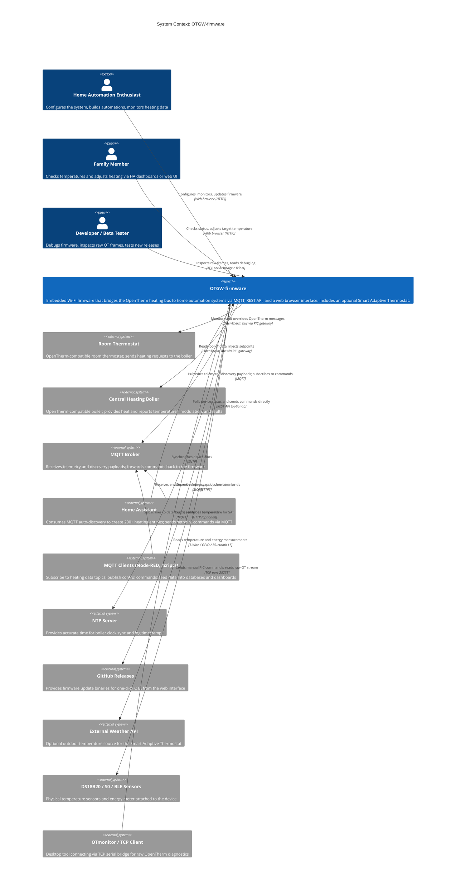

# C4 Context Level: OTGW-firmware System Context

## System Overview

### Short Description

OTGW-firmware turns the NodoShop OpenTherm Gateway into a networked smart heating controller that monitors, controls, and reports your boiler and thermostat over Wi-Fi, MQTT, and a web browser.

### Long Description

Central heating systems in homes across Europe use a protocol called OpenTherm to let room thermostats talk to boilers. The NodoShop OpenTherm Gateway (OTGW) is a small hardware device that sits on that communication wire and lets you intercept and modify those messages. On its own, the gateway is a clever piece of hardware but hard to use from a home automation perspective. OTGW-firmware is the software that makes it useful.

The firmware runs on the small ESP8266 or ESP32 Wi-Fi microcontroller that is part of the OTGW device. Once installed, it connects the gateway to your home network and gives you a complete set of integration points:

- A **web browser interface** for live monitoring, configuration, and firmware updates.
- An **MQTT integration** that publishes every boiler measurement to your home automation platform and accepts commands in return.
- **Home Assistant auto-discovery** that creates 200+ ready-to-use entities without any manual YAML configuration.
- A **REST API** for scripts, dashboards, and tools that want to query or control the system programmatically.
- A **TCP serial bridge** that lets specialist tools like OTmonitor connect over the network.
- A **Smart Adaptive Thermostat (SAT)** that can take over from the room thermostat entirely: it reads outdoor temperature, learns your boiler's characteristics over time, and controls the flow temperature automatically.
- **Sensor integration** for additional DS18B20 temperature sensors, an S0 pulse energy meter, and (on ESP32) Bluetooth room temperature sensors.

The firmware is designed for a trusted home network. It is not a cloud service and requires no internet connection beyond optional NTP time synchronization. Its target users range from technically curious homeowners to experienced home automation enthusiasts and developers building on its API.

---

## Personas

### Home Automation Enthusiast

- **Type**: Human User (primary)
- **Description**: A technically inclined homeowner who runs Home Assistant, Node-RED, or similar tools. They bought the NodoShop OTGW specifically because they want deeper control and insight into their heating system than a standard thermostat provides. They are comfortable with MQTT, IP addresses, and reading documentation.
- **Goals**: Get every OpenTherm measurement into Home Assistant as labeled entities. Set up automations that respond to flame status, modulation level, boiler faults, and outdoor temperature. Optionally enable SAT to optimise energy efficiency. Keep everything self-hosted.
- **Key features used**: MQTT integration, Home Assistant auto-discovery, SAT thermostat control, REST API, web UI configuration, OTA firmware updates.

### Family Member (everyday user)

- **Type**: Human User (secondary)
- **Description**: A non-technical member of the household who interacts with the heating system through Home Assistant dashboards or directly through the OTGW web interface. They are not interested in configuration; they just want the heating to work and occasionally check temperatures.
- **Goals**: See current room and boiler temperatures. Understand whether the boiler is currently running. Adjust the target temperature.
- **Key features used**: Web UI monitoring page (temperature display, boiler status), Home Assistant climate entity via HA dashboards.

### Developer / Beta Tester

- **Type**: Human User (technical contributor)
- **Description**: A developer or experienced community tester who builds or validates new firmware versions. They may contribute code, file bug reports, or test pre-release builds on real hardware. They understand the codebase at a level where they need raw protocol visibility.
- **Goals**: Debug firmware behaviour by watching raw OpenTherm frames. Verify MQTT topics and REST API responses match documentation. Identify crashes, memory issues, and edge cases. Flash and test new firmware images quickly.
- **Key features used**: Telnet debug log, TCP serial bridge, OTA firmware update, web UI live OT log viewer, REST API, browser debug console (`otgwDebug`).

### Home Assistant

- **Type**: Programmatic User
- **Description**: The Home Assistant home automation platform running on a server or dedicated device (e.g., Raspberry Pi, Home Assistant Green, or a VM). Home Assistant connects to the shared MQTT broker and listens for the auto-discovery payloads and telemetry that OTGW-firmware publishes. It uses the data to create entities and make them available in dashboards and automations.
- **Goals**: Receive and interpret auto-discovery messages to create heating-related entities automatically. Receive up-to-date telemetry (temperatures, setpoints, modulation, fault bits) to power automations. Send setpoint and control commands back to the boiler via MQTT topics.
- **Key features used**: MQTT auto-discovery (200+ entities), MQTT telemetry publishing, SAT climate entity, REST API (optional direct polling).

### MQTT Automation Scripts and Node-RED

- **Type**: Programmatic User
- **Description**: Automation scripts, Node-RED flows, Telegraf collectors, or any other MQTT subscriber running on the home network. These clients subscribe to specific OTGW MQTT topics to feed data into databases (e.g., InfluxDB), trigger custom automations, or display metrics in Grafana dashboards.
- **Goals**: Receive reliable, structured heating data on well-defined MQTT topics. Send commands (temperature setpoints, hot water control, outside temperature override) to the gateway. Trigger webhook callbacks when heating status changes.
- **Key features used**: MQTT topic publishing, MQTT command subscriptions, webhook integration, REST API.

### OpenTherm Gateway PIC

- **Type**: Programmatic User (on-device hardware co-processor)
- **Description**: The PIC16F88 or PIC16F1847 microcontroller on the NodoShop OTGW PCB. This chip implements the OpenTherm electrical bus interface and communicates with the ESP firmware over a serial link. From the firmware's perspective, the PIC is the source of all raw OpenTherm data and the recipient of all gateway commands. It is also updated via the firmware's built-in PIC firmware upgrade feature.
- **Goals**: Receive decoded thermostat and boiler OpenTherm frames from the bus. Forward them to the ESP firmware as ASCII lines. Execute temperature override, gateway mode, and clock synchronisation commands received from the ESP. Mediate between the thermostat and boiler using any overrides the ESP instructs.
- **Key features used**: Serial command interface (setpoint overrides, gateway mode, PS=1 summary, clock sync), PIC firmware upgrade.

### Room Thermostat

- **Type**: External Hardware System
- **Description**: The physical room thermostat installed in the home (e.g., Honeywell, Drayton, Salus, or similar OpenTherm-compatible thermostat). It sits on the same OpenTherm bus as the boiler, with the OTGW device physically in-line between them. The firmware can monitor, intercept, and override the messages the thermostat sends to the boiler.
- **Goals**: Request heat from the boiler when the room is below the target temperature. Receive and display boiler status information.
- **Key features used**: Transparent passthrough of OpenTherm messages (monitored), temperature setpoint override (SAT or MQTT-commanded), thermostat-only MQTT mode.

### Central Heating Boiler

- **Type**: External Hardware System
- **Description**: The central heating boiler in the home (e.g., Intergas, Vaillant, Remeha, Worcester Bosch, or any other OpenTherm-compatible boiler). It communicates with the room thermostat, or with the OTGW acting as a gateway, using the OpenTherm protocol over a two-wire bus. The OTGW firmware can read all boiler measurements and inject modified setpoints.
- **Goals**: Operate at the setpoint requested by the thermostat or, when SAT is active, by the firmware. Report status, temperatures, modulation level, and fault codes.
- **Key features used**: OpenTherm message monitoring and decoding (all 80+ message IDs), SAT setpoint injection, boiler fault detection.

---

## System Features

### OpenTherm Gateway Control

- **Description**: The firmware monitors the OpenTherm communication bus between the room thermostat and the boiler, decoding every message in real time. It can intercept and modify messages, for example by overriding the temperature setpoint the thermostat sends to the boiler, without the thermostat or boiler knowing. All 80+ standard OpenTherm message IDs are decoded and reported, covering heating, hot water, modulation, fault codes, solar, ventilation, and more.
- **Users**: Home Automation Enthusiast, Home Assistant, MQTT Automation Scripts, Developer.

### Web-Based Monitoring and Configuration

- **Description**: A browser-accessible control panel served by the device itself. No app installation or cloud account required. The web interface shows a live log of OpenTherm messages, real-time temperature graphs, boiler status, and all device settings. It also provides file management and firmware update capabilities. The interface adapts to both desktop and mobile browsers and supports light and dark themes.
- **Users**: Home Automation Enthusiast, Family Member, Developer.

### MQTT Integration and Home Assistant Auto-Discovery

- **Description**: The firmware publishes all OpenTherm measurements to a configurable MQTT broker using a structured topic hierarchy. It also publishes Home Assistant MQTT discovery payloads, which cause Home Assistant to create over 200 entities automatically, including sensors, binary sensors, and a climate entity, all without any manual YAML configuration. Data is published when values change and periodically as a heartbeat.
- **Users**: Home Assistant, MQTT Automation Scripts, Home Automation Enthusiast.

### REST API for Programmatic Access

- **Description**: A versioned REST API (all endpoints under `/api/v2/`) that exposes the same data and control capabilities as MQTT in a request-response model. Clients can query current OpenTherm values by message ID or label, submit gateway commands, read and update device settings, manage sensor labels, and control SAT. Responses are consistent JSON with proper HTTP status codes.
- **Users**: Home Automation Enthusiast, Developer, Home Assistant (optional direct polling), MQTT Automation Scripts.

### Smart Adaptive Thermostat (SAT)

- **Description**: An embedded heating controller that runs entirely on the device and can replace the room thermostat's role in controlling the boiler. SAT calculates an optimal boiler flow temperature using a weather-compensated heating curve combined with a PID control loop that adjusts based on room temperature error. It learns the heating system's behaviour over time through automatic gain tuning. SAT supports radiator and underfloor heating, six named comfort presets, solar gain compensation, summer suppression, and multi-zone room temperature averaging. On ESP32 hardware, it can also read room temperature from a Bluetooth LE sensor.
- **Users**: Home Automation Enthusiast, Home Assistant.

### TCP Serial Bridge

- **Description**: A network socket that exposes the raw OpenTherm serial stream from the gateway PIC to the local network, exactly as if connecting a serial cable. Tools like OTmonitor can connect to this socket and interact with the gateway as if they had direct serial access, enabling advanced diagnostics and manual command entry.
- **Users**: Developer, Home Automation Enthusiast (advanced use).

### Sensor Integration

- **Description**: The firmware supports additional temperature sensors (DS18B20 on the 1-Wire bus, up to 16 units), an S0 pulse-counting electricity meter, and on ESP32 a Bluetooth LE room temperature sensor. All sensors are published to MQTT and included in Home Assistant auto-discovery. DS18B20 sensors can be given custom labels through the web interface.
- **Users**: Home Automation Enthusiast, Home Assistant.

### OTA Firmware Updates

- **Description**: The firmware and the web assets can be updated over Wi-Fi without a USB cable. The web interface provides a one-click installer that lists available GitHub releases and compares them to the installed version. Alternatively, a firmware binary can be uploaded directly. After update, the device reboots and verifies it has come back online before declaring success. The PIC microcontroller's firmware can also be upgraded through this mechanism.
- **Users**: Home Automation Enthusiast, Developer.

---

## User Journeys

### Initial Setup: Home Automation Enthusiast Connects the Device

1. The enthusiast flashes the firmware to the ESP8266/ESP32 using the included `flash_esp.py` script or PlatformIO.
2. The device powers on and, finding no saved Wi-Fi credentials, broadcasts a temporary Wi-Fi access point named `<hostname>-<mac>`.
3. The enthusiast connects their phone or laptop to that access point. A captive portal opens automatically.
4. The enthusiast enters their home Wi-Fi network name and password.
5. The device connects to the home network and announces itself as `otgw.local` on the local network.
6. The enthusiast opens `http://otgw.local/` in a browser. The web interface loads.
7. The enthusiast navigates to **Settings**, enters the IP address of their MQTT broker, a username, and password, and checks the **HA Discovery** option.
8. After clicking **Save**, the device connects to the MQTT broker and publishes discovery payloads.
9. The enthusiast checks Home Assistant: under **Settings > Devices and Services > MQTT**, a new OTGW device appears with all entities already created.

### Daily Monitoring: Family Member Checks Heating Status

1. A family member opens the Home Assistant dashboard on their phone.
2. They see the **Heating** card showing current room temperature, boiler flow temperature, and whether the flame is on.
3. If the room is too cold, they tap the thermostat card and raise the target temperature by half a degree.
4. Home Assistant sends the new setpoint to the MQTT broker via the command topic.
5. OTGW-firmware receives the command and forwards it to the PIC gateway as a setpoint override.
6. The boiler increases its output; the status card soon shows the flame icon.

### Home Assistant Integration: Auto-Discovery Creates All Entities

1. Home Assistant starts (or OTGW-firmware reconnects to the MQTT broker).
2. OTGW-firmware publishes 200+ MQTT discovery payloads to the `homeassistant/` prefix on the broker.
3. Home Assistant processes each payload and creates the corresponding entity: sensor, binary sensor, or climate entity.
4. All entities appear under a single OTGW device in Home Assistant, ready to use in dashboards and automations.
5. OTGW-firmware begins publishing live telemetry to each entity's state topic.
6. Entity states update in Home Assistant in near-real time as the boiler reports new values.

### Remote Setpoint Change: MQTT Automation Adjusts the Thermostat

1. A Home Assistant automation triggers (e.g., occupancy sensor detects the family has arrived home).
2. Home Assistant calls the `mqtt.publish` service, publishing the payload `21.5` to the topic `OTGW/set/otgw/setpoint`.
3. OTGW-firmware's MQTT client receives the message on the subscribed command topic.
4. The firmware validates the value and forwards a `TT=21.50` command to the PIC over the serial link.
5. The PIC intercepts the next READ_DATA message on the OpenTherm bus and substitutes the setpoint.
6. The boiler receives the new target temperature and modulates accordingly.
7. OTGW-firmware publishes the updated setpoint back to MQTT so Home Assistant reflects the change.

### SAT Activation: Enthusiast Enables the Smart Thermostat

1. The enthusiast opens the web interface and navigates to **SAT**.
2. They enable SAT, select their heating system type (radiators or underfloor heating), and enter their boiler capacity in kilowatts.
3. They set an initial heating curve coefficient based on guidance in the documentation.
4. They save the settings. SAT becomes active and begins computing flow temperature setpoints.
5. OTGW-firmware publishes a `climate` entity and 40+ SAT diagnostic entities to Home Assistant via MQTT.
6. Over the next few days, the SAT auto-tune function analyses heating cycles and adjusts the PID gains automatically.
7. The enthusiast periodically checks the SAT dashboard in the web interface to review the heating curve recommendation.

### Firmware OTA Update: Enthusiast Updates to a New Release

1. The enthusiast opens the web interface and navigates to **Update**.
2. The page fetches the list of available GitHub releases and shows Installed / Update / Rollback badges next to each.
3. The enthusiast clicks **Update** next to the latest release.
4. The firmware downloads the new binary from GitHub and flashes it to the inactive OTA partition.
5. The device reboots. The web interface polls `/api/v2/health` until the device responds, then confirms success.
6. The version number displayed in the web interface changes to confirm the update.

### Debugging Boiler Issues: Developer Uses TCP Serial Bridge

1. A developer suspects the boiler is reporting fault codes that are not being decoded correctly.
2. They open a terminal and connect to the device: `nc <device-ip> 25238`.
3. They see a stream of raw ASCII OpenTherm frames from the PIC in real time, such as `T10000100` and `B4001FF04`.
4. They decode the hex values manually or with OTmonitor to identify the exact message IDs and values being exchanged.
5. They enable the telnet debug log on port 23 in a second terminal to cross-reference what the firmware is decoding.
6. They identify the issue (e.g., an unsupported message ID being silently dropped) and file a bug report with the raw frame data attached.

---

## External Systems and Dependencies

| System | Type | Protocol | Required | Purpose |
|--------|------|----------|----------|---------|
| OpenTherm Gateway PIC (PIC16F88 / PIC16F1847) | Hardware co-processor (on-device) | UART 9600 baud ASCII | Yes (ESP8266), Optional (ESP32) | Handles the OpenTherm electrical bus, delivers decoded frames to the firmware, executes override commands |
| Room Thermostat | OpenTherm hardware device | OpenTherm 1-wire bus (via PIC) | Yes | Requests heat from the boiler; firmware monitors and can override its messages |
| Central Heating Boiler | OpenTherm hardware device | OpenTherm 1-wire bus (via PIC) | Yes | Controls heating output; firmware reads all measurements and can inject setpoint overrides |
| MQTT Broker | Software service (local network) | MQTT 3.1.1, TCP port 1883 | No | Message bus for home automation integration; receives telemetry, discovery payloads, and forwards commands |
| Home Assistant | Home automation platform | MQTT (via broker) | No | Primary integration target; consumes auto-discovery to create 200+ entities; optional REST API polling |
| NTP Server (`pool.ntp.org` or local) | Internet / LAN time service | SNTP UDP port 123 | No | Provides accurate wall-clock time for boiler clock sync, log timestamps, and SAT sun calculations |
| DS18B20 Temperature Sensors | 1-Wire hardware sensors (on GPIO) | 1-Wire (Dallas protocol) | No | Supplemental temperature measurement at points not covered by OpenTherm (up to 16 sensors) |
| S0 Pulse Energy Meter | Hardware meter (GPIO input) | GPIO interrupt (S0 standard) | No | Counts electricity pulses to report cumulative kWh and instantaneous power to MQTT |
| BLE Temperature Sensor (ESP32 only) | Bluetooth LE hardware sensor | Bluetooth LE passive scan | No | Provides room temperature to the SAT PID controller when no OpenTherm or MQTT source is available |
| W5500 Ethernet Module (ESP32 only) | SPI network chip (on-device) | Ethernet, DHCP | No | Wired Ethernet fallback for ESP32; disables Wi-Fi when a cable is connected |
| GitHub Releases | Cloud software repository | HTTPS | No | Source of firmware binaries for one-click OTA update from the web interface |
| External Weather API | Internet HTTP service | HTTP GET | No | Optional outdoor temperature source for SAT heating curve when OT MsgID 27 and MQTT are not available |
| Webhook Target (Node-RED, HA, etc.) | HTTP server (local or remote) | HTTP POST | No | Receives outbound callbacks when configured OpenTherm status bits change (flame on, fault, etc.) |
| OTmonitor / TCP Serial Client | Desktop software | Raw TCP port 25238 | No | Connects to the TCP serial bridge for advanced diagnostics and manual PIC command entry |
| Web Browser | Client software | HTTP port 80, WebSocket ws:// | Yes (for web UI) | Renders the browser SPA served by the device; requires Chrome, Firefox, or Safari |

---

## System Context Diagram

---

## Related Documentation

- [Container Documentation](./c4-container.md) — deployment units, all network interfaces, and external dependency details
- [Component Documentation](./c4-component.md) — master component index with architecture rationale and relationship diagram
- [Component: OpenTherm Core](./c4-component-opentherm-core.md)
- [Component: Network and Connectivity](./c4-component-network.md)
- [Component: Integration Layer](./c4-component-integration-layer.md)
- [Component: Configuration and State](./c4-component-configuration-state.md)
- [Component: Smart Thermostat (SAT)](./c4-component-smart-thermostat.md)
- [Component: Sensors and Hardware](./c4-component-sensors-hardware.md)
- [Component: Web Interface](./c4-component-web-interface.md)
- Code-level documentation:
  - [c4-code-otgw-core.md](./c4-code-otgw-core.md)
  - [c4-code-otdirect.md](./c4-code-otdirect.md)
  - [c4-code-network.md](./c4-code-network.md)
  - [c4-code-mqtt.md](./c4-code-mqtt.md)
  - [c4-code-rest-api.md](./c4-code-rest-api.md)
  - [c4-code-settings.md](./c4-code-settings.md)
  - [c4-code-sat.md](./c4-code-sat.md)
  - [c4-code-sensors.md](./c4-code-sensors.md)
  - [c4-code-utilities.md](./c4-code-utilities.md)
  - [c4-code-web-assets.md](./c4-code-web-assets.md)
- [Architecture Decision Records](../adr/README.md)
- [REST API Reference](../api/README.md)
- [MQTT Topic Reference](../api/MQTT.md)
