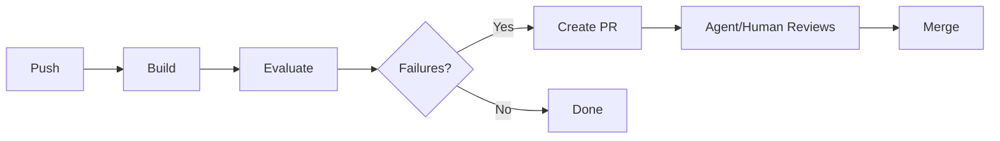
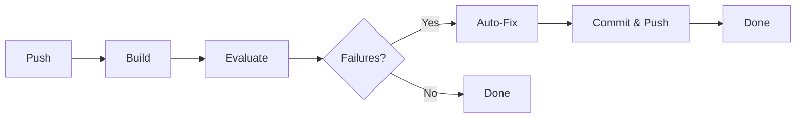
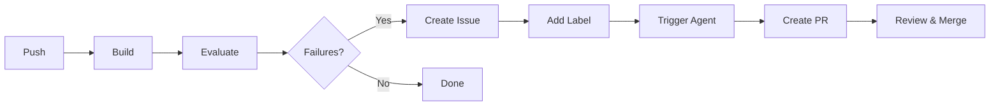

# Workflow Improvement Options - Executive Summary

## Problem Solved

After a push, the CI now:
1. ✅ Builds the firmware
2. ✅ Evaluates code quality
3. ✅ Kicks off an agent flow to fix findings

## Three Solutions Provided

### 🎯 Option 1: Multi-Job Workflow (RECOMMENDED)



**Best for**: OTGW-firmware (safety-critical code)

**Why**: 
- Human review before fixes applied
- Clear audit trail via PRs
- Team-friendly workflow

**Time**: 2-5 minutes total

---

### ⚡ Option 2: Inline Fix Workflow



**Best for**: Solo developers on dev branches

**Why**:
- Fastest option (1-2 minutes)
- No PR overhead
- Good for formatting/style fixes

**Warning**: Auto-commits to your branch

---

### 🎫 Option 3: Issue-Triggered Workflow



**Best for**: Enterprise/governed projects

**Why**:
- Complete audit trail (issues + PRs)
- Manual control via labels
- Track patterns over time

**Time**: 3-7 minutes total

---

## Quick Decision Matrix

| Your Situation | Recommended Option |
|---------------|-------------------|
| Safety-critical firmware (OTGW-firmware) | **Option 1** |
| Solo dev, fast iteration | **Option 2** |
| Team with code review requirements | **Option 1** |
| Enterprise with governance | **Option 3** |
| Open source project | **Option 1** or **3** |
| Auto-formatting only | **Option 2** |

## Installation (5 minutes)

### For Option 1 (Recommended):

```bash
# 1. Copy the workflow file
cp docs/workflow-options/option1/main.yml .github/workflows/main.yml

# 2. Commit and push
git add .github/workflows/main.yml
git commit -m "feat: Add evaluation and auto-fix to CI"
git push

# 3. Done! Next push will trigger the new workflow
```

### For Option 2:

```bash
cp docs/workflow-options/option2/main.yml .github/workflows/main.yml
git add .github/workflows/main.yml
git commit -m "feat: Add inline evaluation and auto-fix to CI"
git push
```

### For Option 3:

```bash
# Copy both workflow files
cp docs/workflow-options/option3/main.yml .github/workflows/main.yml
cp docs/workflow-options/option3/agent-fix-trigger.yml .github/workflows/agent-fix-trigger.yml

git add .github/workflows/
git commit -m "feat: Add issue-triggered evaluation and auto-fix"
git push
```

## What You Get

### All Options Include:

1. **Automated Evaluation**: Runs `python evaluate.py` on every push
2. **Failure Detection**: Identifies FAIL/WARN items from evaluation
3. **Agent Integration**: Sets up context for agent to fix issues
4. **Artifact Storage**: Saves evaluation reports for 30 days

### Option-Specific Features:

| Feature | Opt 1 | Opt 2 | Opt 3 |
|---------|:-----:|:-----:|:-----:|
| Creates PRs | ✅ | ❌ | ✅ |
| Creates Issues | ❌ | ❌ | ✅ |
| Auto-commits | ❌ | ✅ | ❌ |
| Agent Instructions | ✅ | ✅ | ✅ |
| Manual Trigger | ⚠️ | ❌ | ✅ |
| Evaluation Report | ✅ | ✅ | ✅ |

## Example Workflow Run

### Option 1 Example:

```
1. You push code to dev branch
2. Build runs (existing behavior)
3. Evaluation runs: finds 3 FAIL items
4. Auto-fix job triggers:
   - Creates branch: auto-fix/eval-20260112-153000-a1b2c3d
   - Generates agent instructions
   - Creates PR with evaluation report
5. You (or agent) review the PR
6. Fix the issues or let agent fix them
7. Merge PR
```

### Option 2 Example:

```
1. You push code to dev branch
2. Build runs
3. Evaluation runs: finds 2 FAIL items (missing F() macros)
4. Auto-fix applies mechanical fixes
5. Auto-fix commits directly to your branch
6. Re-evaluation confirms fixes work
7. Done - your branch now has the fixes
```

### Option 3 Example:

```
1. You push code to dev branch
2. Build runs
3. Evaluation runs: finds 5 FAIL items
4. Issue created: "Code Evaluation Failed: a1b2c3d (5 failures)"
5. You add label: "agent-fix-needed"
6. Agent workflow triggers:
   - Creates fix branch
   - Creates draft PR
   - Adds instructions
7. Agent (or you) applies fixes
8. PR ready for review
9. Merge PR, issue auto-closes
```

## Testing Before Production

**Critical**: Test on a feature branch first!

```bash
# Create test branch
git checkout -b test-workflow-improvements

# Install your chosen option
cp docs/workflow-options/option1/main.yml .github/workflows/main.yml

# Commit and push
git add .github/workflows/main.yml
git commit -m "test: Try workflow option 1"
git push -u origin test-workflow-improvements

# Watch the workflow run in GitHub Actions
# Verify it works as expected

# Once confirmed, merge to main
git checkout main
git merge test-workflow-improvements
git push
```

## Customization Examples

### Only Run on Specific Branches

Edit the workflow file:
```yaml
on:
  push:
    branches:
      - dev          # Only dev
      - 'dev-*'      # And dev-* branches
      # Remove 'main' to exclude production
```

### Change Failure Threshold

For Option 1, edit the condition:
```yaml
auto-fix:
  needs: evaluate
  if: needs.evaluate.outputs.failure-count > 5  # Only if >5 failures
```

### Add Slack Notifications

Add to any workflow:
```yaml
- name: Notify Slack
  if: failure()
  uses: slackapi/slack-github-action@v1
  with:
    payload: |
      {
        "text": "Evaluation failed: ${{ github.sha }}"
      }
```

## Migration Strategy

Safe path to adoption:

**Week 1**: Test
- Install on feature branch
- Test with real failures
- Verify behavior

**Week 2**: Dev Branch Only
- Enable on dev branch
- Monitor for 1 week
- Collect feedback

**Week 3**: Expand
- Enable on all branches
- Refine agent instructions
- Fine-tune thresholds

**Month 2+**: Enhance
- Add actual agent integration (Copilot)
- Auto-merge safe fixes
- Add custom fix types

## Support & Documentation

### Quick Links

- **Main Overview**: `WORKFLOW_IMPROVEMENT_OPTIONS.md`
- **Comparison Guide**: `docs/workflow-options/COMPARISON.md`
- **Installation Help**:
  - Option 1: `docs/workflow-options/option1/README.md`
  - Option 2: `docs/workflow-options/option2/README.md`
  - Option 3: `docs/workflow-options/option3/README.md`

### Common Questions

**Q: Which option should I use?**
A: For OTGW-firmware, use Option 1 (safety-critical code needs review)

**Q: Can I switch options later?**
A: Yes! Just replace the workflow file

**Q: Will this break my existing workflow?**
A: No - it extends the existing build job

**Q: What if I don't like it?**
A: Just revert the workflow file changes

**Q: Can I use multiple options?**
A: Yes! Different options for different scenarios

## Success Metrics

After installation, you'll see:

✅ Evaluation runs on every push
✅ Failures are detected automatically
✅ Agent context is generated
✅ Fix process is triggered (based on option)
✅ Evaluation reports available in artifacts

## Next Steps

1. **Choose your option** (recommend Option 1 for OTGW-firmware)
2. **Read the detailed README** for your option
3. **Test on a feature branch**
4. **Deploy to your workflow**
5. **Monitor and refine**

---

**Ready to get started? Go to `docs/workflow-options/COMPARISON.md` for detailed comparison, or jump straight to your chosen option's README!**
