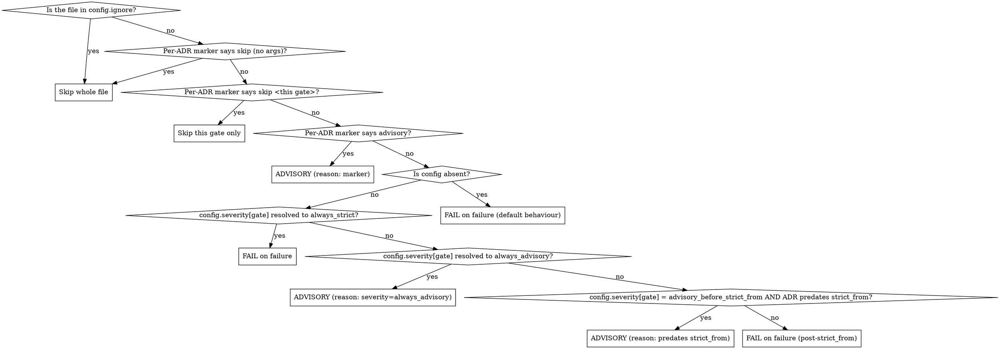

# adr-kit lint

You are running `/adr-kit:lint`. The user wants to know whether existing ADRs in their project pass the four verification gates that the main `adr` skill enforces. You read files; you do not modify them. You report.

## Inputs

- **No argument**: lint every `docs/adr/ADR-*.md` file in the project root.
- **A directory path**: lint every `ADR-*.md` file under that directory.
- **A file path**: lint that one file.

If the user passed something else (a glob, a non-existent path), explain politely and stop.

## Configuration (since v0.9.0)

Established projects often have a long history of ADRs that predate the four canonical gates. Linting them under strict rules produces noise rather than actionable feedback. Two opt-in mechanisms let a project apply the gates surgically: strict on new ADRs, advisory on legacy ones.

### Mechanism 1: project-level config file

Before linting, look for `docs/adr/.adr-kit.json` (relative to the project root, or to the directory passed as argument if the user pointed elsewhere). If it exists, read it and apply it as policy. If it does not exist, fall back to default behaviour (everything strict, exact match to v0.7.x output).

Recognised fields:

- `strict_from` (string, optional): first ADR identifier (inclusive) on which all gates are enforced strictly. ADRs with a numerically lower number are linted in *advisory* mode for the gates that opt in (see `severity`). Format: `ADR-XXX` matching the filename pattern. Example: `"ADR-082"`.
- `ignore` (array of strings, optional): list of ADR identifiers (`ADR-XXX`) or full filenames to skip entirely. Useful for archived or superseded ADRs whose status is final. Skipped ADRs appear in the aggregate as SKIPPED but produce no gate output.
- `severity` (object, optional): per-gate severity. Keys are the four gate names lower-cased (`completeness`, `evidence`, `clarity`, `consistency`). Values are one of:
  - `always_strict`: failures are FAIL regardless of `strict_from`.
  - `always_advisory`: failures are ADVISORY regardless of `strict_from`.
  - `advisory_before_strict_from`: failures are ADVISORY for ADRs that predate `strict_from`, FAIL otherwise. This is the default for `completeness`, `evidence`, `clarity` when `strict_from` is set.
  - For `consistency` the implicit default stays `always_strict` even when `strict_from` is set, because the things it catches (filename / heading mismatch, duplicate numbers, broken cross-references) are real bugs regardless of when the ADR was written. Projects can override this in their config but the default is loud-on-purpose.
- `template.required_sections` (array of strings, optional): override the canonical seven required sections with a project-specific list. Each entry is the exact heading text including the `## ` prefix. When set, the Completeness gate uses *this* list instead of the canonical one. Useful for projects whose template legitimately differs from the toolkit's default.

Example `.adr-kit.json`:

```json
{
  "strict_from": "ADR-082",
  "ignore": ["ADR-001", "ADR-007"],
  "severity": {
    "completeness": "advisory_before_strict_from",
    "evidence": "advisory_before_strict_from",
    "clarity": "always_advisory",
    "consistency": "always_strict"
  },
  "template": {
    "required_sections": ["## Status", "## Context", "## Decision", "## Consequences"]
  }
}
```

The file may contain top-level `"_comment"` keys (any name starting with `_`); ignore them silently. They are a convention to embed annotations in JSON without breaking parse.

If the file is malformed JSON, report the parse error and stop without linting. Do not silently fall back to defaults: a broken policy file is a bug the user should know about. If a field has an unrecognised value (e.g. `"severity.completeness": "lol"`), report the unrecognised value, list the legal values, and stop.

### Mechanism 2: per-ADR markers

Inside an individual ADR, an HTML comment line of one of these shapes flips the policy for that file only:

```html
<!-- adr-kit-lint: skip -->
<!-- adr-kit-lint: skip completeness, evidence -->
<!-- adr-kit-lint: advisory -->
```

Forms (case-insensitive on the directive, whitespace-tolerant):

- `skip` (no args): the ADR is skipped entirely. Counts as SKIPPED in the aggregate.
- `skip <gate>[, <gate>...]`: those gates are skipped on this file only. Other gates still run.
- `advisory`: all gates run on this file in advisory mode. Failures are ADVISORY, not FAIL.

The marker may appear anywhere in the file (top, bottom, inside or outside a section). Scan the full file for the first matching marker line and apply it. If multiple marker lines disagree (e.g. one says `skip`, another says `advisory`), the *first* matching marker wins; report the conflict in the file's output.

### Severity decision tree

When evaluating a single (file, gate) pair, apply policies in this order. The first matching rule wins.



In plain words: ignore beats markers, markers beat config, and within config the precedence is `always_strict` > `always_advisory` > `advisory_before_strict_from`. If the gate would PASS on its own checks, the severity rule does not apply: PASS stays PASS regardless of policy.

## What you check, gate by gate

For every ADR you read, evaluate each of the four gates separately. A gate either passes or fails for a given file. Cite line numbers when reporting a failure.

### Gate 1: Completeness

A passing ADR has every load-bearing section present, in the canonical order, with non-empty content.

Required sections (heading text, in this order):

- `## Status`
- `## Context`
- `## Decision`
- `## Alternatives Considered`
- `## Consequences`
- `## Related Decisions`
- `## References`

If `.adr-kit.json` defines `template.required_sections`, use *that* list instead of the canonical seven. Order matters: the headings must appear in the listed order. The toolkit's main `adr` skill still recommends the canonical seven; the override exists for projects whose template legitimately differs.

Sub-checks within sections:

- **Status** line is one of: `Proposed`, `Accepted`, `Deprecated`, `Superseded by ADR-XXX`, `Amended by ADR-XXX`. Date in `YYYY-MM-DD` format must be present.
- **Alternatives Considered** has at least 2 alternatives, each with rejection reasoning. A single bullet point of one word does not count as an alternative.
- **Consequences** has both a positive and a negative direction. Look for `Benefits`/`Trade-offs`/`Positive`/`Negative` subheadings or a clearly mixed list. A one-sided Consequences section fails this gate.
- **Risks** are named with at least one mitigation each (typically inside Consequences as `Risks and mitigations` or similar).

Failure example: `Completeness: missing ## Risks and mitigations subsection (line 47); only positive consequences listed.`

### Gate 2: Evidence

A passing ADR replaces challengeable claims with measurements or citations.

Heuristic checks:

- **Bare adjectives** in critical positions (Decision, Consequences, Alternatives) without an accompanying number or citation. Examples to flag: "fast", "slow", "faster", "slower", "better", "worse", "improves", "reduces", "more reliable", "more performant" when not followed by a measurement or citation.
- **Constraint claims** ("X has Y RAM", "Y supports up to Z connections") without an anchor (vendor doc, datasheet, measured, internal doc, RFC).
- **Code references**: when a claim is about code, look for `file:line` or `file.ext` references. A claim about an algorithm that does not cite the implementation is suspicious.
- **External claims** (specs, RFCs, vendor docs): should be linked, not paraphrased.

You will see false positives ("the new system is faster" might be acceptable in a Context paragraph if a measurement appears later in Consequences). Use judgment: if a measurement or citation backs the claim within ~5 lines, count it as supported.

Failure example: `Evidence: line 24 says "improves performance" with no measurement in the surrounding paragraphs. Suggest replacing with a measured improvement, e.g. "reduces request latency from 120 ms to 40 ms p99 (load-test on staging, see PERF-103)".`

### Gate 3: Clarity

A passing ADR is readable to a developer who has never seen the codebase.

Heuristic checks:

- **Acronyms**: any ALL-CAPS sequence of 2 to 6 letters that appears for the first time without an inline expansion. Example: "TLS" should be "TLS (Transport Layer Security)" on first use.
- **Project-specific jargon** without explanation: terms like internal service names, internal status codes, or proprietary protocols.
- **Decision summary at top**: the Decision section should open with a single declarative sentence. If the Decision opens with a multi-paragraph discussion before stating what was chosen, flag it.
- **Code examples** for technical decisions (algorithm choice, protocol selection): expected to be present in either Decision or Implementation Notes if applicable.

Failure example: `Clarity: line 12 uses "WAL" without expansion. Suggest "WAL (write-ahead log)" on first use. Line 31 opens the Decision section with "There are several considerations..." instead of a declarative sentence; suggest leading with the choice and unpacking after.`

### Gate 4: Consistency

A passing ADR fits the existing record without contradictions.

Heuristic checks:

- **Filename matches heading**: file `ADR-042-foo.md` should have a first-line heading `# ADR-042 ...`. Mismatch fails this gate.
- **Filename pattern**: `ADR-XXX-kebab-case-title.md` with uppercase prefix and 3-digit zero-padded number. Lowercase prefixes (`adr-`), unpadded numbers (`ADR-42-`), or non-kebab-case (`ADR-042-MyTitle.md`) fail.
- **Cross-references** in `## Related Decisions` follow the `ADR-XXX` format. References to non-existent files (broken links) fail.
- **Duplicate ADR numbers** in the directory: if two files share an ADR number, both fail the Consistency gate. Recommend a renumbering follow-up.
- **Status conflicts**: if this ADR's Status says "Supersedes ADR-XXX" but ADR-XXX's Status is not "Superseded by", flag the inconsistency.

Failure example: `Consistency: filename ADR-042-foo.md but heading says "# ADR-42 Foo" (missing zero-padding, line 1). Filename and heading must agree.`

## Output format

For each ADR file, produce a one-line summary plus details for any failing or advisory gate. Three result tiers exist: PASS, ADVISORY (a finding that does not block but is reported), and FAIL.

If a config file is in effect, prefix the run with a one-line config banner so the user knows which policy is being applied.

### Single-file output (no config)

```
ADR-042-foo.md
  Completeness: PASS
  Evidence:     FAIL
    line 24: "improves performance" with no measurement.
    line 38: "scales better" with no number.
  Clarity:      PASS
  Consistency:  PASS

Summary: 3 of 4 gates pass strictly. 1 FAIL. To flip Status to Accepted, fix the Evidence gate.
```

### Single-file output (config in effect, gate reduced to advisory)

```
ADR-042-foo.md
  Completeness: PASS
  Evidence:     ADVISORY
    line 24: "improves performance" with no measurement (ADVISORY: ADR predates strict_from=ADR-042)
    line 38: "scales better" with no number (ADVISORY: ADR predates strict_from=ADR-042)
  Clarity:      PASS
  Consistency:  PASS

Summary: 3 of 4 gates pass strictly. 1 advisory. No FAIL.
```

### Directory-tree output (no config)

```
Linting docs/adr/ (12 ADRs)

PASS (9):
  ADR-001-foo.md
  ADR-003-bar.md
  ...

FAIL (3):
  ADR-002-baz.md
    Evidence: line 24 ("faster"), line 38 ("scales better").
  ADR-007-qux.md
    Completeness: missing ## Related Decisions section.
  ADR-011-quux.md
    Consistency: filename has lowercase prefix "adr-011-...", expected "ADR-011-...".

Aggregate:
  Most common FAIL gate: Evidence (2 of 3 failures).
  Next steps: focus on ADR-002-baz.md, which fails the most gates.
```

### Directory-tree output (config in effect)

```
Linting docs/adr/ (50 ADRs)
Config: .adr-kit.json found (strict_from=ADR-042; severity: completeness=advisory_before_strict_from, evidence=advisory_before_strict_from, consistency=always_strict)

PASS strictly (8):
  ADR-042-...
  ADR-043-...
  ...

ADVISORY only (38):
  Most common advisory gate: Completeness (38 of 38; legacy template predates canonical seven).
  Listed by ADR id; expand on request.

FAIL (4):
  ADR-045-foo.md
    Evidence: line 24 ("faster") with no measurement.
  ADR-046-bar.md
    Consistency: filename ADR-046-bar.md but heading "# ADR-46 Bar" (line 1).
  ...

SKIPPED (0)

Aggregate:
  Most common FAIL gate: Evidence (3 of 4 failures).
  Next steps: focus on ADR-045-foo.md, which fails 2 of 4 gates.
```

The aggregate's bottom line always names the FAIL count, never the ADVISORY count. ADVISORY is informational; FAIL is what the user is asked to act on.

## When you find no ADRs

If `docs/adr/` is empty or does not exist, say so plainly:

```
No ADRs found at docs/adr/. The toolkit is installed but no decisions have been recorded yet.
Create your first ADR with /adr-kit:adr.
```

## Reporting

Always end with a single recommended next action that points at a FAIL, not an ADVISORY. ADVISORY findings are background noise the project has explicitly chosen to tolerate; FAIL findings are what the user is being asked to fix. The next-action sentence names which ADR to fix first (the one with the most FAIL gates, or the most-referenced one) and which gate to focus on. Concrete, not abstract.

If the run produced zero FAILs, say so plainly: "All linted ADRs pass at the configured severity. <N> ADVISORY findings remain, treated as informational by the project's policy." Do not invent a FAIL where there is none.

## What you do *not* do

- You do not modify ADRs. Read-only by design.
- You do not invoke the `adr-generator` agent. The lint skill is informational; the user decides whether to fix.
- You do not call out style preferences that are not in the four gates. No bikeshedding on heading capitalisation, list-marker style, or whitespace. The gates are the contract.
